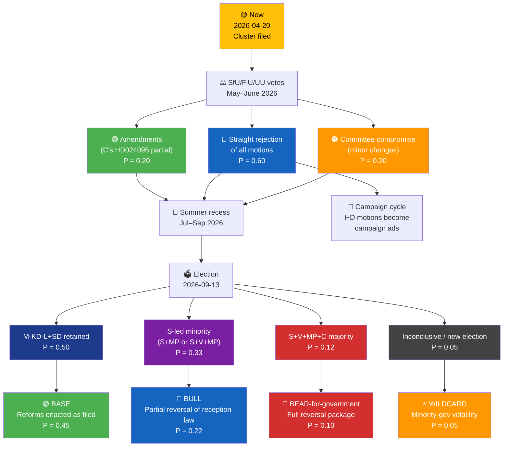
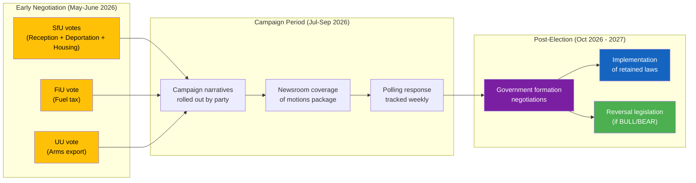

# 🔀 Scenario Analysis — Opposition Motions (April 14–17, 2026)

| Field | Value |
|-------|-------|
| **SCN-ID** | SCN-2026-04-20-motions |
| **Framework** | Alternative-futures analysis (ACH-informed) + Bayesian scenario weighting |
| **Horizon** | Short (Q2 2026 — SfU/FiU/UU votes) · Medium (pre-election autumn 2026) · Long (post-election government formation 2026–2028) |
| **Methodology** | ACH on three competing hypotheses; scenario-tree with analyst priors |
| **Priors provenance** | Novus Q1 2026 polling · SOM-institutet 2025 · Historical coalition-formation patterns 1991–2022 |

> **Purpose**: Structured alternative-futures reasoning to stress-test the dominant narrative ("opposition coordination builds toward 2026 electoral gain"), surface wildcards, and assign prior probabilities that can be updated as forward indicators fire.

---

## 🧭 Section 1 — ACH: Three Competing Hypotheses

Applied to the central question: *What is the strategic logic of the April 14–17 opposition-motion wave?*

| H | Hypothesis | Supporting evidence | Disconfirming evidence | Prior P |
|:-:|------------|---------------------|------------------------|:-------:|
| **H1** | **Coalition rehearsal** — parties testing a post-2026 S+V+MP+C majority scenario on substantive policy | Unprecedented 4-party filing on prop. 2025/26:229; same-day triple filings on prop. 2025/26:215/235; cross-pressure coordination | S absent on deportation (HD024095 cluster); V–C rhetorical incompatibility on reception law | **0.35** |
| **H2** | **Campaign-narrative construction** — parties building durable 2026 talking points, not governing preparation | Clustered messages on immigration + climate (twin pillars); each party front a distinct voter segment; no joint press conference | H1 evidence partially duplicates; some evidence ambiguous | **0.50** |
| **H3** | **Opportunistic signalling** — parties reacting independently to government legislative velocity rather than coordinating | Chatham-House-style asymmetry (party leaders do not appear together); S-silence on deportation suggests individual calculation | Same-day triple filings are hard to explain opportunistically; content-overlap suggests coordination | **0.15** |

**ACH verdict `[HIGH]`**: H2 (campaign-narrative construction) has the highest posterior probability. It fits the division-of-labour pattern, survives the S-silence evidence (S calculated separately per cluster), and does not require overhypothesising coordination capacity.

> **Implication**: The opposition's goal is not to prepare for government (too early, polls insufficient) but to **lock in 2026 campaign narratives** before the Riksdag recesses in summer 2026. Motions function as **timestamped talking points** that survive the summer silence.

---

## 🧭 Section 2 — Master Scenario Tree (Short → Medium → Long)

> Probabilities are **analyst priors**, zero-sum within each branch. They update as Lagrådet yttranden, polling data, and SfU rapporteur reports arrive.

---

## 🧭 Section 3 — Scenario Narratives

### 🟢 BASE — "Government Reforms Enacted" (P = 0.45)

**Setup**: SfU/FiU/UU straight-reject opposition motions in May–June; government retains majority in September; all four propositions become law; opposition runs them as 2026–2030 campaign material but cannot reverse them.

**Key forward signals confirming BASE:**
- Novus lead for M+SD+KD+L remains ≥ 1.5 points from April to September `[HIGH]`
- SfU rapporteur is M/SD/KD MP (not L) `[HIGH]`
- Lagrådet yttrande on 2025/26:229 is silent or permissive on privatisation `[MEDIUM]`
- No major gäng-crime incident that shifts immigration salience further toward government `[MEDIUM]`

**Consequences:**
- New mottagandelag enters force 2027-01-01 with private-operator clauses
- Deportation expansion generates first Admin Court challenges by Q2 2027
- Fuel tax cut produces +0.3–0.5 MtCO₂e/year; Sweden misses 2030 climate target more deeply
- Arms export framework modernised with no end-user review addition
- Opposition enters 2027 Riksdag with all four propositions as "what we would repeal"

**Three-year risk profile**:
- Fiscal: negligible
- Reputational: moderate (climate, possible ECtHR adverse deportation judgment)
- Electoral: favourable to government until 2030

### 🔵 BULL — "S-Led Minority, Partial Reception-Law Reversal" (P = 0.22)

**Setup**: Election produces S-led minority with MP support (±V) but not C; reception-law partial reversal via amendment in Q1 2027. Deportation law retained (S silence locks in). Fuel tax cut reversed. Arms export framework unchanged.

**Key forward signals confirming BULL:**
- S polls gain 3+ points by August 2026 on back of cluster narrative `[MEDIUM]`
- L defects publicly in committee negotiations on reception law `[LOW]`
- Ukraine support consensus holds (reduces V's post-election leverage on arms) `[HIGH]`
- SD loses 2+ polling points (corruption scandal or internal dispute) `[LOW]`

**Consequences:**
- Private-operator clauses repealed; reception reverts to pre-2027 model but retains activation duties
- Climate credibility partially restored via fuel-tax reversal
- Deportation law remains in force (S silence leaves no mandate)
- MP achieves symbolic but not decisive influence

**Partial victory for opposition narrative**: reception and fuel tax reversed; deportation and arms retained.

### 🔴 BEAR-for-Government — "Full Reversal Package" (P = 0.10)

**Setup**: Election produces S+V+MP+C 175+ majority; full reversal of reception law, fuel tax, and partial reversal of deportation via statutory proportionality test (HD024095 adopted).

**Key forward signals confirming BEAR-for-government:**
- Gäng crime incident with cross-party condemnation that neutralises SD's immigration-security edge `[LOW]`
- Tidö coalition L defection during campaign `[LOW]`
- Major Saab/BAE controversy that shifts arms-export salience `[LOW]`
- Polling convergence: S+V+MP+C ≥ 49% by August 2026 `[LOW]`

**Consequences:**
- Reception law repealed; new reception act drafted Q1–Q3 2027
- Deportation law amended with statutory proportionality test (C's HD024095 language adopted)
- Arms export framework amended with end-user review (MP's HD024096 language)
- Fuel tax restored; CO₂-tax indexation introduced
- Sweden climate 2030 target back within plausible range

**Low-probability but high-impact**: requires simultaneous Tidö collapse and opposition discipline — historically rare.

### ⚡ WILDCARD — "Minority-Government Volatility" (P = 0.05)

**Setup**: Election produces no 175+ majority configuration; months of negotiation; eventual minority government with no clear mandate. Motions cluster becomes **negotiation currency** rather than governing programme.

**Consequences:**
- Reception law amendments negotiated case-by-case
- Some opposition motion language absorbed into final amended statutes
- Political system instability with 1-2 year horizon for re-election

---

## 🧭 Section 4 — Scenario-Specific Intelligence Products to Prepare

| Scenario | Opposition should prepare | Government should prepare | Newsroom should prepare |
|----------|----------------------------|----------------------------|--------------------------|
| BASE | 2026–2030 campaign narrative; post-adoption litigation strategy; NGO alliance | Implementation plan; defensive communications | Multi-year implementation tracker |
| BULL | Reception-law repeal legislation; coalition-agreement provisions | Damage-control communications; alternative legislation | S-leader interview series; legal-analysis series |
| BEAR | Full reversal legislation; new Reception Act drafting; statutory proportionality text | Post-loss narrative; policy-continuity carve-outs | Election-reversal analysis; comparative restoration precedents |
| WILDCARD | Amendment-by-amendment playbook | Holding-pattern communications | Minority-government instability explainer |

---

## 🧭 Section 5 — Red-Team Critique

> **Devil's Advocate**: What if the entire cluster is strategically irrelevant?

The Red-Team case against the cluster's political value:

1. **Same-day triple filings may be coincidence** — Riksdag motion cycles drive filing windows; parties respond to same propositions on same schedule without coordination.
2. **Division-of-labour may be rationalised ex-post** — V/MP/C/S have stable positions; filing together is not design, it's stability.
3. **Base scenario (P=0.45) implies the cluster buys ~0.5 percentage points of polling benefit at most** — below the 2026 election margin of error.
4. **S-silence on deportation reveals that opposition unity is rhetorical** — actual coalition behaviour remains fragmented.
5. **Post-2026 majority scenarios require Tidö collapse (L or KD defection)** — no current evidence of that.

**Red-Team posterior**: If we accept the critique, the cluster's expected value is 0.5–1 percentage points of campaign benefit with high variance. That is still **net positive for the opposition**, but it does not constitute a strategic re-alignment of Swedish politics. The honest reading is that this cluster is **a tactical win** (talking-points) rather than a **strategic win** (coalition-rehearsal).

> **Integration**: This Red-Team critique reduces the BASE scenario's political-consequence magnitude, not its probability. The overall scenario tree remains valid; the expected utility to the opposition shrinks.

---

## 🧭 Section 6 — Bayesian Update Rules

| Observable signal | Prior shift direction | Magnitude |
|-------------------|-----------------------|-----------|
| L defection on any motion in SfU | BASE ↓ 0.08, BULL ↑ 0.06 | Medium |
| Lagrådet yttrande strict on prop. 2025/26:229 privatisation | BASE ↓ 0.05, BULL ↑ 0.05 | Medium |
| S gains 3+ polling points May–Aug 2026 | BASE ↓ 0.06, BULL ↑ 0.08 | Large |
| Major gäng-crime incident before election | BASE ↑ 0.08 (government beneficiary) | Large |
| Saab/BAE controversy | BASE ↓ 0.03, BEAR ↑ 0.02 | Small |
| Ukraine-war escalation shifting Swedish defence salience | BASE ↑ 0.05 (status-quo preference) | Medium |
| Klimatpolitiska rådet annual report critical | BASE ↓ 0.02, BULL ↑ 0.02 | Small |
| Transport union public endorsement of fuel-tax cut | BASE ↑ 0.04 (working-class narrative shift) | Medium |
| C leader explicit amendment-negotiation overture | V1a ↑ 0.10 | Large |
| NGO joint press conference on reception law | W1 (V–C incoherence) ↓ 0.04 | Small-medium |

> **Update procedure**: Re-score scenario tree when any of these signals fire. If posteriors shift the BASE/BULL/BEAR ranking, update `synthesis-summary.md` and `executive-brief.md` accordingly.

---

## 🧭 Section 7 — Cross-Cluster Scenario Dependencies

---

## 🧭 Section 8 — Analyst Confidence Self-Assessment

| Dimension | Confidence | Basis |
|-----------|:----------:|-------|
| H2 (campaign-narrative) as dominant hypothesis | 🟩 HIGH | Fits evidence pattern; disconfirms available for H1/H3 |
| BASE scenario probability (0.45) | 🟩 HIGH | Polling stable; no Tidö-collapse signals |
| BULL scenario probability (0.22) | 🟧 MEDIUM | S-led minority is plausible but requires favourable polling swings |
| BEAR scenario probability (0.10) | 🟧 MEDIUM | Historically rare; requires Tidö collapse + opposition unity |
| WILDCARD probability (0.05) | 🟧 MEDIUM | Minority-gov volatility possible but 2022 showed parliament can resolve |
| Red-Team posterior (cluster value is tactical not strategic) | 🟧 MEDIUM | Compelling counter-case but not decisive |
| Bayesian update magnitudes | 🟧 MEDIUM | Calibrated on historical analogues, but Swedish politics idiosyncratic |

---

## 📎 Cross-References

- `synthesis-summary.md` — LEAD story selection and findings
- `executive-brief.md` — 14-day watch window
- `risk-assessment.md` — scenario-linked risks
- `significance-scoring.md` — DIW weighting methodology
- `comparative-international.md` — international-precedent informed scenarios
- `documents/reception-law-cluster-analysis.md` — cluster-specific scenario dependencies
- `documents/deportation-cluster-analysis.md` — ECHR-litigation scenario branch
- `documents/fuel-tax-cluster-analysis.md` — climate-policy scenario branch
- `documents/arms-export-cluster-analysis.md` — defence-policy signalling scenario

---

**Classification**: Public · **Next Review**: 2026-04-27
