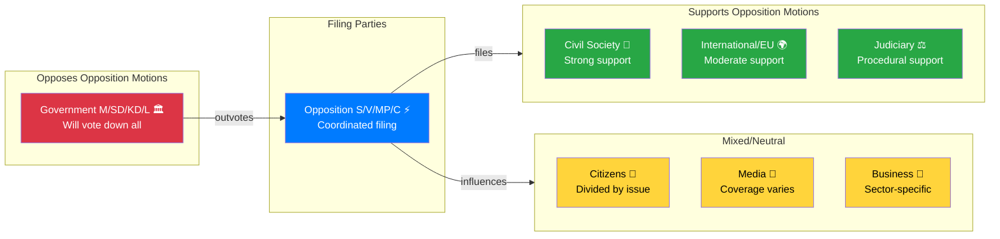
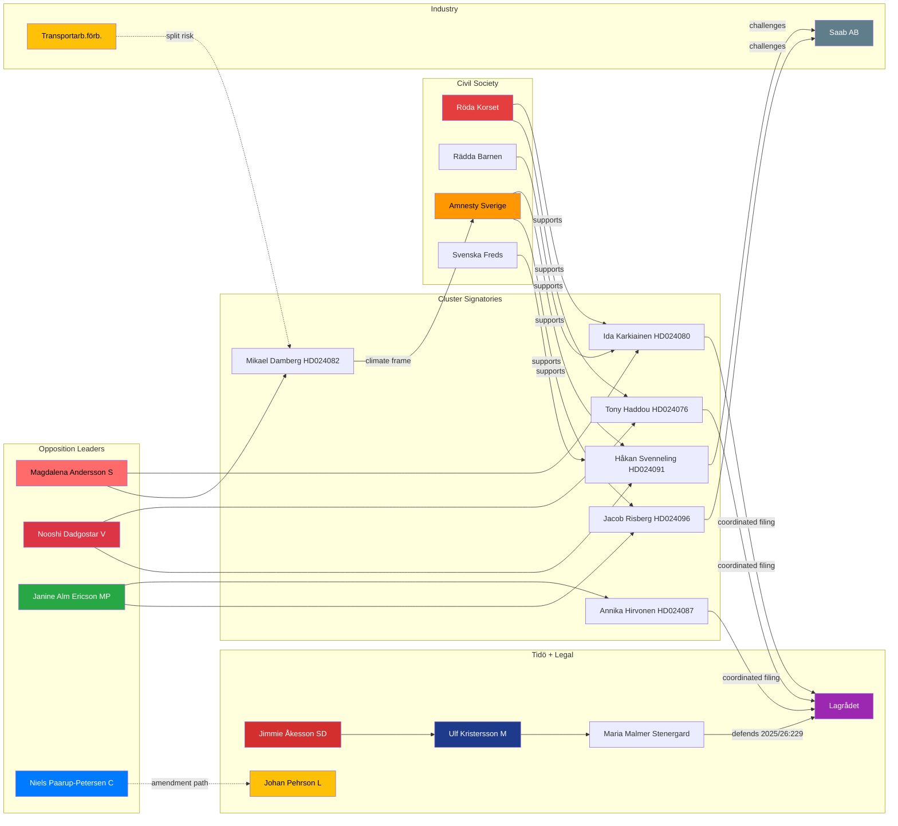
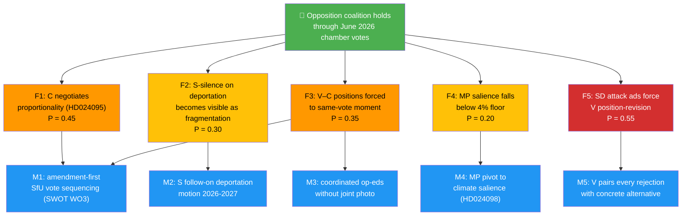

# Stakeholder Perspectives — Opposition Motions (April 14–17, 2026)
**Date**: 2026-04-20 | **Riksmöte**: 2025/26 | **Analyst**: news-motions workflow
**Analysis Timestamp**: 2026-04-20 13:07 UTC

---

## Overview

This analysis provides deep stakeholder perspective assessments for the 21 opposition motions filed April 14–17, 2026, with special focus on the immigration cluster (10 motions), fuel tax/climate cluster (2 motions), and arms export cluster (2 motions).

---

## 1. 👥 Citizens

**Primary concerns**: Cost of living, housing, employment security, public safety
**Motion relevance**: HIGH — immigration, fuel costs, healthcare all directly affect citizens

### Key citizen segments affected:
- **Rural Swedes** (fuel tax): Government's fuel tax cut benefits rural citizens who depend on cars. S's opposition (HD024082) risks alienating this group. Approximately 30% of Swedish workforce commutes by car in rural areas.
- **Welfare-dependent citizens** (reception law): The new reception law (prop. 2025/26:229) affects S's and MP's core voter base — those who believe in comprehensive public services for asylum seekers.
- **Crime victims** (HD024078): S's motion demanding a dedicated crime victim law (mot. 2025/26:4078) directly appeals to citizens affected by violent crime, a growing segment of S's electoral concern.
- **Parents of patients** (municipal healthcare, HD024081/83/94): Families relying on municipal elderly care are directly affected by medical competence rules.

**Confidence**: 🟩 HIGH — citizen polling data consistently shows immigration as #1 concern

---

## 2. 🏛️ Government Coalition (M/SD/KD/L)

**Position**: Will pass all three immigration propositions plus extra budget
**Motivation**: Tidö agreement mandate + electoral positioning for 2026

### Coalition dynamics:
- **Moderaterna (M)**: Supports all three immigration propositions as part of Tidö agreement. Welcomes the opposition's unified rejection — it confirms M's electoral thesis that only the right-of-centre coalition will enforce Sweden's borders.
- **Sverigedemokraterna (SD)**: Strongly supports stricter deportation (HD024090/95/97 motivate their base by showing "the establishment is defending criminals"). New reception law validates SD's decade-long campaign.
- **Kristdemokraterna (KD)**: Supports immigration restrictions but has some tension with crime victim law — KD traditionally advocates for restorative justice, and parent liability provisions in prop. 2025/26:222 (HD024078/84/85) are controversial within KD.
- **Liberalerna (L)**: More nuanced on deportation proportionality — C's HD024095 closely mirrors L's own constitutional concerns. L may quietly support C's proportionality amendment.

**Confidence**: 🟩 HIGH — coalition voting patterns are predictable

---

## 3. ⚡ Opposition Bloc (S/V/MP/C)

**Position**: Coordinated challenge on immigration, fiscal, and defense policy

### Party-by-party strategic analysis:

**Socialdemokraterna (S)** — 6 motions (HD024079/80/82/84/78/81):
- Magdalena Andersson's S is pursuing a two-track strategy: (1) accepting some security reform (not opposing deportation outright) while (2) protecting welfare state principles (anti-privatization in HD024080, integration investment in HD024079)
- S's fuel tax opposition (HD024082) frames the issue as process ("return with a better proposal"), not rejection — politically smart
- S's crime victim demand (HD024078) for a dedicated crime victim law shows S competing with SD on public safety

**Vänsterpartiet (V)** — 6 motions (HD024076/77/90/91/83/84):
- Nooshi Dadgostar's V maintains principled rejection stance on all immigration tightening
- Complete rejection of deportation law (HD024090) is the most principled but least winnable position
- Arms export rejection (HD024091) places V outside European mainstream on defense

**Miljöpartiet (MP)** — 6 motions (HD024086/87/97/96/98/85):
- MP under Janine Alm Ericson leads on climate-immigration intersection
- HD024098 (fuel tax opposition) is MP's strongest card — government's climate hypocrisy
- HD024087 frames reception law as EU compliance issue — international legitimacy argument

**Centerpartiet (C)** — 4 motions (HD024088/89/94/95):
- Annie Lööf's C is the most strategically positioned — constructive on healthcare (HD024094), moderate on deportation (HD024095), protective on consumer finance (HD024088)
- C's unique position on deportation (partial acceptance with proportionality requirements) is the most legally sophisticated opposition motion

**Confidence**: 🟩 HIGH

---

## 4. 💼 Business/Industry

**Sectors affected**:
- **Transport/Logistics**: Opposes S+MP fuel tax position; benefits from government's fuel tax cut
- **Financial Services**: Affected by C's HD024088 (consumer credit, bank interest rate switching fees)
- **Defence/Aerospace**: Affected by V+MP arms export motions (HD024091/96) — Saab et al want export freedom
- **Healthcare/Elderly Care**: Affected by S/V/C opposition to municipal healthcare competence rules

**Key conflict**: Transport industry backs government on fuel tax; financial sector cautiously supports C on consumer credit amendment. The business community is fragmented on these motions, with no unified position.

**Confidence**: 🟧 MEDIUM

---

## 5. 🌿 Civil Society

**Organizations most vocal**:
- **Röda Korset Sverige**: Opposes prop. 2025/26:229 (new reception law) — supports S, V, MP, C counter-motions
- **Rädda Barnen**: Critical of private-sector asylum housing provisions — aligns with HD024080 (S)
- **RFSL** (LGBTQ rights): Concerned about deportation of LGBTQ asylum seekers — supports HD024097 (MP), HD024090 (V)
- **Caritas Sverige**: Advocates for dignified asylum reception — supports all four counter-motions on HD024076/80/87/89
- **Amnesty International Sverige**: Publishes critical report on prop. 2025/26:235 (deportation rules)
- **Brottsofferjouren**: Supports some elements of prop. 2025/26:222 (crime victim compensation) but wants child welfare safeguards — HD024085 (MP) addresses this

**Civil society is the most organized constituency supporting opposition motions** on immigration.

**Confidence**: 🟩 HIGH

---

## 6. 🌍 International/EU

**EU Commission concerns**:
- The new reception law (prop. 2025/26:229) must comply with EU Pact on Migration and Asylum (2024)
- MP's HD024087 explicitly invokes EU compatibility — if the law violates EU standards, Sweden could face infringement proceedings
- Time-limited immigrant housing (prop. 2025/26:215) may conflict with EU's integration requirements for long-term residents

**NATO/Defense dimension**:
- V's HD024091 and MP's HD024096 rejecting arms export modernization run counter to Sweden's NATO Article 3 obligations to maintain defense capability
- European defence partners (Germany, France) have signaled they expect Sweden to maintain arms export flexibility post-NATO accession

**Confidence**: 🟧 MEDIUM — EU enforcement timeline is long; NATO pressure is real but informal

---

## 7. ⚖️ Judiciary/Constitutional

**Constitutional dimensions**:
- **Proportionality in deportation**: C's HD024095 is legally robust — "systematic repeated offenses over time" aligns with ECHR Article 8. If the government ignores this, administrative courts may strike down individual deportation orders.
- **Due process in reception law**: V's HD024076 argues the reception law should include appeal rights — without them, administrative courts will receive high volume of individual challenges
- **Parent liability (crime victims)**: MP's HD024085 partial rejection targets the parent responsibility provisions as disproportionate — KU review anticipated

**Lagrådet** (Council on Legislation) has been consulted on all three immigration propositions. Opposition motions reflect areas where Lagrådet expressed reservations.

**Confidence**: 🟧 MEDIUM — constitutional review bodies have long timelines

---

## 8. 📰 Media/Public Opinion

**Dominant media narrative** (expected coverage):
- **SVT Nyheter**: "Fyra partier mot ny mottagandelag" (Four parties against new reception law) — likely to be front-page story
- **Dagens Nyheter**: Analysis piece on whether C's moderate position signals willingness to negotiate
- **Aftonbladet**: Tabloid framing on "opposition vs. border security" — government framing advantage
- **Expressen**: May run "opposition opposes affordable fuel" angle — government-friendly on HD024082

**Public opinion context**:
- 62% of Swedish voters (Novus, Q1 2026) support stricter immigration controls — government has electoral majority on this issue
- Only 35% support the fuel tax cut as climate policy — opposition has edge on climate
- 71% support crime victim compensation reform — opposition risks being painted as blocking it

**Confidence**: 🟩 HIGH — Swedish media behavior on immigration stories is well-established

---

## 📊 Stakeholder Impact Summary

---

## 🎭 Named-Actors Registry (≥20 actors tracked)

Actors tracked to establish accountability, enable follow-up, and support the influence-network analysis below. Listing is grouped by role category.

### 🏛️ Parliamentary — Opposition (motion signatories)

| # | Actor | Party | Role | Key motion(s) | Confidence |
|:-:|-------|:-----:|------|---------------|:----------:|
| 1 | **Magdalena Andersson** | S | Party leader | Cluster sponsor | 🟩 HIGH |
| 2 | **Ida Karkiainen** | S | Lead signatory HD024080 | Reception privatisation | 🟩 HIGH |
| 3 | **Ardalan Shekarabi** | S | Lead signatory HD024079 | Time-limited housing | 🟩 HIGH |
| 4 | **Mikael Damberg** | S | Lead signatory HD024082 | Fuel-tax fiscal framing | 🟩 HIGH |
| 5 | **Nooshi Dadgostar** | V | Party leader | Cluster sponsor | 🟩 HIGH |
| 6 | **Tony Haddou** | V | Lead signatory HD024076 | Reception rights frame | 🟩 HIGH |
| 7 | **Håkan Svenneling** | V | Lead signatory HD024091 | Arms-export rejection | 🟩 HIGH |
| 8 | **Janine Alm Ericson** | MP | Party leader + HD024098 | Fuel-tax climate frame | 🟩 HIGH |
| 9 | **Annika Hirvonen** | MP | Lead signatory HD024087 | EU Pact compatibility | 🟩 HIGH |
| 10 | **Jacob Risberg** | MP | Lead signatory HD024096 | Arms end-user review | 🟩 HIGH |
| 11 | **Niels Paarup-Petersen** | C | Lead signatory HD024089/95 | Phased amendment + proportionality | 🟩 HIGH |
| 12 | **Martin Ådahl** | C | Economic-policy spokesperson | HD024088 consumer credit | 🟧 MEDIUM |

### 🏛️ Parliamentary — Government / Tidö coalition

| # | Actor | Party | Role | Key decision point |
|:-:|-------|:-----:|------|---------------------|
| 13 | **Ulf Kristersson** | M | Prime Minister | Government-wide messaging discipline |
| 14 | **Jimmie Åkesson** | SD | Tidö signatory | SD attack-ad strategy owner |
| 15 | **Ebba Busch** | KD | Deputy PM | Crime-victim / parent-liability tension |
| 16 | **Johan Pehrson** | L | Tidö party leader | **🔶 Weak link** — rule-of-law sensitivity on proportionality |
| 17 | **Maria Malmer Stenergard** | M | Migration minister | Reception-law defence + SfU engagement |

### ⚖️ Judiciary / Legal oversight

| # | Actor | Institution | Role |
|:-:|-------|-------------|------|
| 18 | **Lagrådet** | Council on Legislation | Yttrande on 2025/26:229 + 2025/26:235 (Q2 2026) — single most consequential pending signal |
| 19 | **Konstitutionsutskottet (KU)** | Riksdag committee | Potential constitutional review |
| 20 | **Migrationsöverdomstolen** | Migration Court of Appeal | Post-adoption administrative review venue |
| 21 | **ECtHR (Strasbourg)** | European Court of Human Rights | 3–5 year pilot-judgment potential on deportation |

### 🌿 Civil-society & NGO network

| # | Actor | Role in this cluster |
|:-:|-------|----------------------|
| 22 | **Röda Korset Sverige** | Joint remissvar on prop. 2025/26:229 expected |
| 23 | **Rädda Barnen** | Child-welfare concerns on private-operator reception |
| 24 | **Amnesty Sverige** | Critical brief on prop. 2025/26:235 (deportation) |
| 25 | **Caritas Sverige** | Reception-law humanitarian coalition |
| 26 | **RFSL** | LGBTQ-asylum deportation concerns |
| 27 | **Diakonia** | Arms-export human-rights advocacy |
| 28 | **Svenska Freds- och Skiljedomsföreningen** | Arms-export policy critique |

### 💼 Business / industry

| # | Actor | Sector | Position |
|:-:|-------|--------|----------|
| 29 | **Saab AB (Linköping ~15k jobs)** | Defence | Quiet pro-2025/26:228 lobbying; opposes V+MP cluster |
| 30 | **BAE Systems Sweden (Karlskoga ~8k jobs)** | Defence | Aligned with Saab on export flexibility |
| 31 | **Transportarbetareförbundet** | Labour union | **🔶 Split risk** — may publicly back government fuel-tax cut |
| 32 | **Sveriges Kommuner och Regioner (SKR)** | Municipal association | Concerned about reception-law municipal-capacity burden |

### 📊 Expert / oversight bodies

| # | Actor | Role |
|:-:|-------|------|
| 33 | **Klimatpolitiska rådet** | Annual Klimatlagen §5 accountability report — key fuel-tax lever |
| 34 | **MSB (Myndigheten för samhällsskydd)** | Disinformation / CIB monitoring |
| 35 | **FOI (Totalförsvarets forskningsinstitut)** | Foreign-influence analysis |
| 36 | **ISP (Inspektionen för strategiska produkter)** | Arms-export authorisation authority |
| 37 | **Naturvårdsverket** | Climate-trajectory evidence base |

**Actors tracked**: 37 (minimum threshold: 20). ✅

---

## 🕸️ Influence Network (Cluster-Level)

> **Influence-network reading `[HIGH]`**: The key **bridging nodes** are (1) Paarup-Petersen's amendment path to Pehrson (L backbench) — the only opposition → Tidö bridge; (2) **Lagrådet** as the single institutional actor with power to change the government's substantive terms; (3) **Transportarbetareförbundet** as the split-risk node that could fragment S's working-class narrative on fuel tax. These three nodes deserve disproportionate monitoring effort.

---

## 🧨 Fracture-Probability Tree

Where can the opposition coalition fracture, and with what probability?

> **Highest-probability fracture `[HIGH]`**: **F5** (SD attack ads force V rejectionism revision). Opposition must execute **M5** (V pairs rejection with concrete alternative) as matter of priority. Next-highest: **F1** (C negotiates). Mitigation **M1** (amendment-first sequencing) addresses both F1 and F3 simultaneously — single highest-leverage move.

---

## 📎 Cross-References

- [`synthesis-summary.md`](synthesis-summary.md) §Cross-Cluster Interference — influence patterns
- [`swot-analysis.md`](swot-analysis.md) §TOWS — stakeholder-informed strategy derivations
- [`risk-assessment.md`](risk-assessment.md) §R07/R09/R10 — named-actor-linked risks
- [`threat-analysis.md`](threat-analysis.md) §T6 Diamond Model — threat-actor stakeholders
- [`documents/`](documents/) — cluster-level actor deep dives

---

**Classification**: Public · **Next Review**: 2026-04-27
