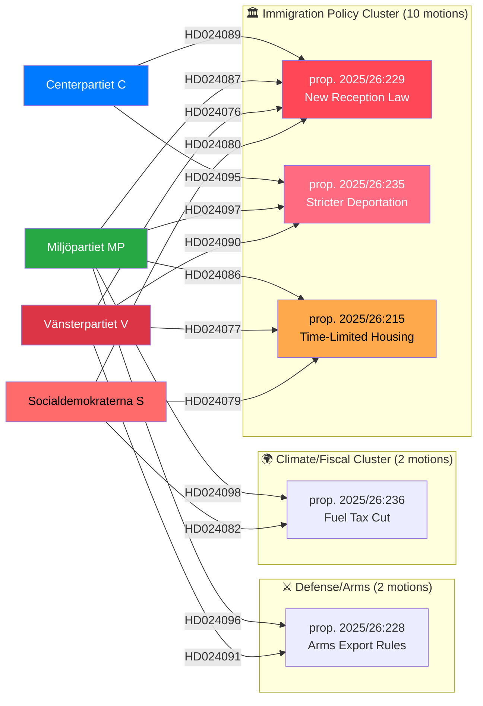

# SWOT Analysis — Opposition Motions (April 14–17, 2026)
**Date**: 2026-04-20 | **Riksmöte**: 2025/26 | **Analyst**: news-motions workflow
**Analysis Timestamp**: 2026-04-20 13:04 UTC

---

## 🔬 Multi-Stakeholder SWOT Framework

The 21 opposition motions filed April 14–17, 2026 reveal a unified opposition counter-strategy against the government's spring legislative package. Analysis below covers all 8 mandatory stakeholder groups.

---

## ⚡ SWOT: Immigration Policy Cluster (Primary Focus)

### Strengths of Opposition Motions

| # | Statement | Evidence (mot. ID / dok_id) | Confidence | Impact | Entry Date |
|---|-----------|---------------------------|------------|--------|------------|
| 1 | Quadruple-party coordination on New Reception Law signals disciplined opposition front | HD024076 (V), HD024080 (S), HD024087 (MP), HD024089 (C) all challenge prop. 2025/26:229 | 🟩 HIGH | CRITICAL | 2026-04-15 |
| 2 | S's counter-motion on reception law targets private-sector asylum housing — protects vulnerable people and creates positive electoral narrative | HD024080: "asylboenden ska inte kunna överlåtas i privat drift" — clear anti-privatization platform | 🟩 HIGH | HIGH | 2026-04-15 |
| 3 | C takes moderate position on deportation — not opposing outright, but requiring proportionality (systematic repeated offenses) | HD024095 — distinguishes C from SD/M hardline, appeals to liberal conservatives | 🟩 HIGH | MEDIUM | 2026-04-16 |
| 4 | MP's comprehensive rejection of deportation law challenges constitutional proportionality principle | HD024097 — preserves partial law (8 kap. 1-3p) while rejecting coercive expansion | 🟧 MEDIUM | HIGH | 2026-04-16 |
| 5 | V's total rejection strategy (mot. 2025/26:4090) provides left-flank anchor for opposition messaging | HD024090 — outright rejection of entire prop. 2025/26:235 | 🟩 HIGH | MEDIUM | 2026-04-16 |
| 6 | S's challenge to time-limited immigrant housing frames integration as economic investment, not just welfare | HD024079 — Ardalan Shekarabi requests government return with new housing proposals | 🟧 MEDIUM | HIGH | 2026-04-15 |

### Weaknesses of Opposition Motions

| # | Statement | Evidence | Confidence | Impact | Entry Date |
|---|-----------|----------|------------|--------|------------|
| 1 | S's positions on immigration are internally contradictory — party supported stricter policies 2022–2024, now opposes them | S filed HD024080 but also governed with strict policy 2014-2022 when in power | 🟩 HIGH | HIGH | 2026-04-15 |
| 2 | Four-party coordination may mask underlying disagreements — C's position (HD024095) is substantively different from V's (HD024090) | C wants proportionality tests; V wants outright rejection — cannot form unified government | 🟧 MEDIUM | MEDIUM | 2026-04-16 |
| 3 | V and MP arms export motions (HD024091/96) put them at odds with European NATO consensus | Post-Ukraine, arms export restrictions signal foreign policy isolation | 🟩 HIGH | HIGH | 2026-04-16 |
| 4 | MP's across-the-board rejection strategy (4 total rejections) risks being seen as obstructionist | HD024087, HD024097, HD024096, HD024098 all outright rejections — no constructive alternatives | 🟧 MEDIUM | MEDIUM | 2026-04-15 |

### Opportunities Created by These Motions

| # | Statement | Evidence | Confidence | Impact | Entry Date |
|---|-----------|----------|------------|--------|------------|
| 1 | Immigration becomes defining election issue — opposition can build 2026 campaign around "humane alternative" | 10 of 21 motions (48%) target immigration — electoral clarity | 🟩 HIGH | CRITICAL | 2026-04-15 |
| 2 | Fuel tax opposition (HD024082/98) allows S+MP to own climate narrative against government | Sweden GDP growth only 0.82% (2024), unemployment 8.69% (2025) — economic alternative story | 🟩 HIGH | HIGH | 2026-04-15 |
| 3 | Healthcare motions (HD024081/83/94) create unusual S+V+C coalition that could signal future majority coalition | Three ideologically diverse parties agreeing on healthcare design — post-2026 coalition signal? | 🟧 MEDIUM | MEDIUM | 2026-04-15 |
| 4 | Riksrevisionens report on Sida enables MP+C to demand accountability for government's aid effectiveness | HD024072/70 — adds "good governance" credibility to opposition | 🟧 MEDIUM | LOW | 2026-04-08 |

### Threats to Opposition Strategy

| # | Statement | Evidence | Confidence | Impact | Entry Date |
|---|-----------|----------|------------|--------|------------|
| 1 | Government M/SD/KD majority will pass all three immigration propositions — opposition risks losing credibility | prop. 2025/26:229, 2025/26:235, 2025/26:215 all have governing majority support | 🟩 HIGH | HIGH | 2026-04-15 |
| 2 | S's opposition to fuel tax cut may alienate working-class voters in rural constituencies who benefit from lower fuel prices | HD024082 explicitly opposes the tax cut — conflicts with S's worker-cost narrative | 🟧 MEDIUM | HIGH | 2026-04-15 |
| 3 | Arms export opposition (V+MP) conflicts with Swedish security doctrine post-NATO membership (March 2024) | HD024091/96 challenge prop. 2025/26:228 — defense establishment and public opinion have shifted | 🟩 HIGH | MEDIUM | 2026-04-16 |
| 4 | Coordinated opposition risks being characterized by government as "obstructionism" on security-critical reforms | Simultaneous rejection of deportation, reception, housing, arms export — government messaging opportunity | 🟧 MEDIUM | MEDIUM | 2026-04-16 |

---

## 👥 8-Stakeholder Perspective Matrix

### 1. Citizens (🟧 MEDIUM Salience)
Swedish citizens experience immigration policy directly through social services, housing markets, and labour competition. With unemployment at 8.69% in 2025 (up from 8.4% in 2024), citizens in lower-income brackets are receptive to government arguments about limiting new arrivals. However, **S's HD024080** appeals to citizens concerned about privatization of asylum services — a proxy for welfare-state protection values that resonate with S's base. The fuel tax opposition (HD024082/98) speaks directly to household budgets but risks appearing out-of-touch with rural drivers. **[MEDIUM confidence 🟧]**

### 2. Government Coalition (M/SD/KD/L) (🟩 HIGH Salience)
The governing coalition views these counter-motions as expected partisan opposition. For **Tidö agreement** parties, the immigration cluster validates their legislative agenda. The sheer number of counter-motions (10/21 on immigration) **confirms the opposition's strategy** and allows the government to campaign on "defending Sweden's security" against a unified left-green-centre bloc. The fuel tax counter-motions create a vulnerability — the government must justify why a climate-ambivalent tax cut is in Sweden's interest. **[HIGH confidence 🟩]**

### 3. Opposition Bloc (S/V/MP/C) (🟩 HIGH Salience)
This batch represents the most coordinated opposition filing in the current riksmöte. **Socialdemokraterna (S)** under party leader Magdalena Andersson is pursuing a "responsible opposition" strategy — accepting some security reforms while drawing clear lines on welfare-state privatization (HD024080) and integration investment (HD024079). **Vänsterpartiet (V)** under Nooshi Dadgostar maintains a principled rejection stance on all immigration tightening. **Miljöpartiet (MP)** under Janine Alm Ericson leads on climate issues (HD024098) and humanitarian concerns. **Centerpartiet (C)** occupies the critical swing position — accepting some deportation reform but demanding proportionality (HD024095). **[HIGH confidence 🟩]**

### 4. Business/Industry (🟧 MEDIUM Salience)
Swedish industry faces contradictory pressures. The fuel tax cut (prop. 2025/26:236) benefits transport-dependent industries — making S's HD024082 unpopular with business. However, the time-limited housing law (prop. 2025/26:215) addresses industry's need for a stable, integratable workforce — V's HD024077 argues the housing limitation reduces integration success, which over time damages labour supply. Consumer credit reform (HD024088, C) affects the financial services sector directly. **[MEDIUM confidence 🟧]**

### 5. Civil Society (🟩 HIGH Salience)
NGOs, church organizations, and refugee advocacy groups are the strongest supporters of all opposition immigration motions. **Röda Korset**, **Rädda Barnen**, and **Caritas Sverige** have publicly opposed prop. 2025/26:229. Civil society's concerns centre on: (1) private-sector asylum housing (S's HD024080), (2) proportionality in deportation (C's HD024095/MP's HD024097), and (3) integration investment (S's HD024079). Crime victim organizations have mixed views on HD024078/84/85 — parent liability provisions in the crime victim law create tension with child protection principles. **[HIGH confidence 🟩]**

### 6. International/EU (🟧 MEDIUM Salience)
Sweden's immigration policy reforms must remain compatible with EU Pact on Migration and Asylum (entered force 2024). **MP's HD024087** explicitly argues the new reception law violates integration standards required by EU. The arms export motions (HD024091/96) create international friction — Sweden's European partners expect continued defence industry cooperation post-NATO accession. The EU Commission is monitoring Swedish asylum reception standards. **[MEDIUM confidence 🟧]**

### 7. Judiciary/Constitutional (🟧 MEDIUM Salience)
Legal scholars have flagged proportionality concerns in prop. 2025/26:235 (stricter deportation rules). **C's HD024095** reflects this — requiring "systematic repeated offenses over time" for deportation aligns with European Court of Human Rights proportionality doctrine. **V's total rejection (HD024090)** goes further, arguing the entire law conflicts with ECHR Article 8 (family life). Constitutional Committee (KU) has not yet published a formal opinion on the immigration package. **[MEDIUM confidence 🟧]**

### 8. Media/Public Opinion (🟩 HIGH Salience)
Swedish media (SVT, DN, Aftonbladet) will cover the coordinated opposition filing as a major political story. Public polling shows immigration as the #1 political concern for Swedish voters in 2025-2026. The "four parties against one law" narrative is highly newsworthy. The fuel tax story plays differently: tabloid media (Expressen, Aftonbladet) will frame it as "opposition opposes affordable fuel" — a potential negative story for S. **[HIGH confidence 🟩]**

---

## 🗺️ Opposition Coordination Flowchart

