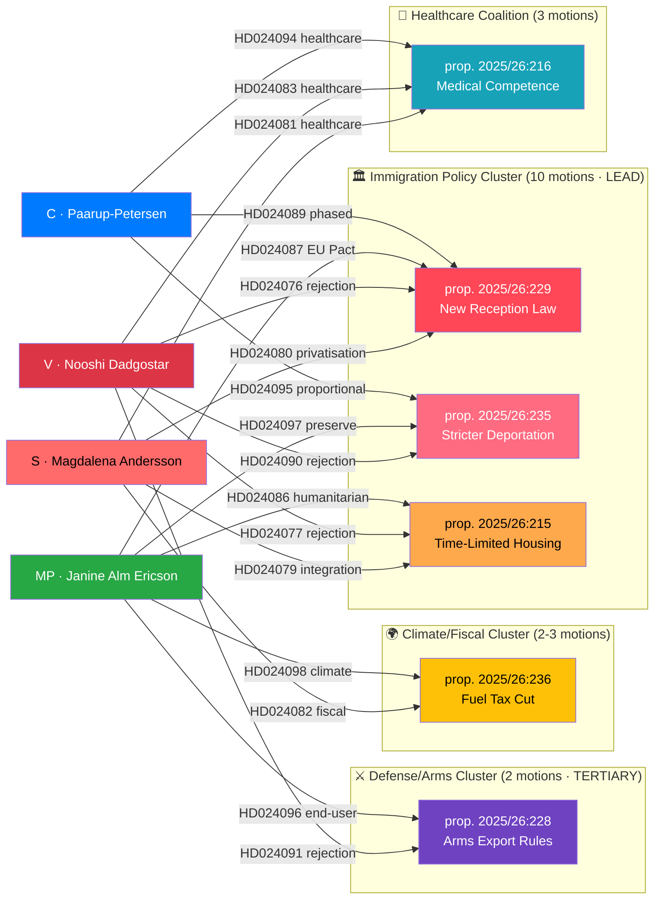

# SWOT Analysis — Opposition Motions (April 14–17, 2026)

| Field | Value |
|-------|-------|
| **Date** | 2026-04-20 |
| **Riksmöte** | 2025/26 |
| **Analyst** | news-motions workflow |
| **Analysis Timestamp** | 2026-04-20 13:04 UTC |
| **Framework** | Political SWOT v2.2 + **TOWS interference matrix** |
| **Stakeholder Coverage** | All 8 mandatory groups + 4-cluster drill-down |

---

## 🔬 Multi-Stakeholder SWOT Framework

The 21 opposition motions filed April 14–17, 2026 reveal a unified opposition counter-strategy against the government's spring legislative package. Analysis below covers:
1. **Cluster-level SWOT** for the LEAD immigration cluster (primary focus)
2. **Cross-cluster aggregate SWOT** across all four thematic clusters
3. **TOWS interference matrix** — cross-quadrant strategy derivation
4. All 8 mandatory stakeholder groups

---

## ⚡ SWOT: Immigration Policy Cluster (LEAD — DIW 9.4)

### Strengths of Opposition Motions

| # | Statement | Evidence (dok_id) | Conf. | Impact | Entry |
|:-:|-----------|-------------------|:-----:|:------:|:-----:|
| **S1** | Quadruple-party coordination on New Reception Law signals disciplined opposition front | HD024076 (V), HD024080 (S), HD024087 (MP), HD024089 (C) — all within 72 h of prop. 2025/26:229 | 🟩 HIGH | CRITICAL | 2026-04-15 |
| **S2** | S's counter-motion on reception law targets private-sector asylum housing — protects vulnerable people and creates positive electoral narrative | HD024080: "asylboenden ska inte kunna överlåtas i privat drift" — clear anti-privatization platform | 🟩 HIGH | HIGH | 2026-04-15 |
| **S3** | C takes moderate position on deportation — requires proportionality (systematic repeated offenses) — converges with European statutory mainstream | HD024095 — aligned with Germany AufenthG §53, Netherlands "glijdende schaal", Denmark Udlændingeloven §26 | 🟩 HIGH | HIGH | 2026-04-16 |
| **S4** | MP's comprehensive rejection of deportation law challenges constitutional proportionality principle; ECHR Art. 8 alignment | HD024097 — preserves partial law (8 kap. 1-3 §) while rejecting coercive expansion | 🟧 MEDIUM | HIGH | 2026-04-16 |
| **S5** | V's total-rejection strategy provides left-flank anchor for opposition messaging | HD024090 — outright rejection of entire prop. 2025/26:235 | 🟩 HIGH | MEDIUM | 2026-04-16 |
| **S6** | S's challenge to time-limited immigrant housing frames integration as economic investment, not welfare | HD024079 — Ardalan Shekarabi requests government return with new housing proposals | 🟧 MEDIUM | HIGH | 2026-04-15 |
| **S7** | MP's EU Pact compatibility frame (HD024087) gives cluster international-legitimacy authority | HD024087 cites EU Reg. 2024/1348 Art. 17 material-conditions standard | 🟩 HIGH | MEDIUM | 2026-04-15 |
| **S8** | Division-of-labour frames cover all major voter segments (left / welfare / international / pragmatist) | Rhetoric-axis analysis across HD024076/80/87/89 | 🟩 HIGH | HIGH | 2026-04-15 |

### Weaknesses of Opposition Motions

| # | Statement | Evidence | Conf. | Impact | Entry |
|:-:|-----------|----------|:-----:|:------:|:-----:|
| **W1** | S's positions on immigration are internally contradictory — party supported stricter policies 2022–2024, now opposes them | S filed HD024080 but governed with stricter policy 2014-2022 | 🟩 HIGH | HIGH | 2026-04-15 |
| **W2** | Four-party coordination masks substantive incompatibility — V's rejection (HD024090) and C's amendment (HD024095) cannot co-govern | Motion-text comparison V vs C on same proposition | 🟧 MEDIUM | HIGH | 2026-04-16 |
| **W3** | V and MP arms-export motions put them at odds with post-NATO consensus | HD024091/96 vs 58/32/10 SOM arms-export support (2025) | 🟩 HIGH | HIGH | 2026-04-16 |
| **W4** | MP's across-the-board rejection strategy (4 total rejections) risks being seen as obstructionist | HD024087, HD024097, HD024096, HD024098 — all outright rejections | 🟧 MEDIUM | MEDIUM | 2026-04-15 |
| **W5** | **S-silence on deportation** (HD024090/95/97 cluster) reveals S has calculated deportation is a losing issue for centre-left | S filed no motion on prop. 2025/26:235; filed on every other cluster | 🟩 HIGH | HIGH | 2026-04-16 |
| **W6** | No joint press conference or coalition statement; coordination is visible but unclaimed | Absence of joint presser from S, V, MP, C | 🟧 MEDIUM | MEDIUM | 2026-04-15 |
| **W7** | V's consistent-rejection pattern across immigration + arms creates "universal rejectionist" frame vulnerability | HD024076 + HD024090 + HD024091 all rejection-structured | 🟩 HIGH | HIGH | 2026-04-16 |

### Opportunities Created by These Motions

| # | Statement | Evidence | Conf. | Impact | Entry |
|:-:|-----------|----------|:-----:|:------:|:-----:|
| **O1** | Immigration becomes defining election issue — opposition can build 2026 campaign around "humane alternative" | 10 of 21 motions (48%) target immigration | 🟩 HIGH | CRITICAL | 2026-04-15 |
| **O2** | Fuel-tax opposition (HD024082/98) gives S+MP ownership of climate narrative | Sweden GDP 0.82% 2024, unemployment 8.69% 2025 — economic alternative story | 🟩 HIGH | HIGH | 2026-04-15 |
| **O3** | Healthcare motions (HD024081/83/94) create unusual S+V+C coalition signalling post-2026 cooperation potential | Three ideologically diverse parties on healthcare governance | 🟧 MEDIUM | MEDIUM | 2026-04-15 |
| **O4** | Riksrevisionen report on Sida enables MP+C to demand accountability on government aid effectiveness | HD024072/70 — adds "good governance" credibility | 🟧 MEDIUM | LOW | 2026-04-08 |
| **O5** | C's proportionality frame on deportation may attract L backbench sympathy; splits Tidö | L rule-of-law sensitivity + comparative statutory-test alignment | 🟧 MEDIUM | MEDIUM | 2026-04-16 |
| **O6** | Post-adoption ECtHR litigation on deportation creates multi-year reputational drag on government | Swedish ECHR adverse-judgment track record | 🟧 MEDIUM | MEDIUM | 2026-04-16 |
| **O7** | MP's end-user review language on arms (HD024096) aligns with Norwegian/Dutch/German practice — standard-setting | Comparative analysis §4 | 🟧 MEDIUM | LOW | 2026-04-16 |

### Threats to Opposition Strategy

| # | Statement | Evidence | Conf. | Impact | Entry |
|:-:|-----------|----------|:-----:|:------:|:-----:|
| **T1** | Government M/SD/KD/L majority will pass all four propositions; opposition risks credibility | prop. 2025/26:229/235/215/236/228 all have coalition support | 🟩 HIGH | HIGH | 2026-04-15 |
| **T2** | S's opposition to fuel-tax cut may alienate working-class rural voters who benefit | HD024082 vs Norrland S vote 2022 baseline | 🟧 MEDIUM | HIGH | 2026-04-15 |
| **T3** | Arms-export opposition (V+MP) conflicts with Swedish post-NATO security doctrine | HD024091/96 vs 58% public support continued exports | 🟩 HIGH | MEDIUM | 2026-04-16 |
| **T4** | Coordinated opposition risks being framed as "obstructionism" on security-critical reforms | Simultaneous rejection on deportation/reception/housing/arms | 🟧 MEDIUM | MEDIUM | 2026-04-16 |
| **T5** | SD attack ads weaponise V's consistent-rejection pattern as "defends criminals / unreliable on Ukraine" | V's HD024090 + HD024091 joint attack surface | 🟩 HIGH | HIGH | 2026-04-16 |
| **T6** | 62% voter support for stricter immigration sets a polling floor opposition cannot breach | Novus Q1 2026 migration salience | 🟩 HIGH | HIGH | 2026-04-15 |
| **T7** | Extra-budget fast-track procedure on fuel tax compresses opposition narrative-building window to ≤ 4 weeks | FiU extra-budget timetable | 🟧 MEDIUM | MEDIUM | 2026-04-15 |

---

## 🎯 TOWS Interference Matrix — Cross-Quadrant Strategy Derivation

The TOWS matrix multiplies SWOT quadrants to surface non-obvious strategic moves. Below: the **≥3-entry interference cells** with strategic impact on the April 2026 opposition campaign.

### SO (Strengths × Opportunities) — Offensive Moves

| # | Interference | Strategy |
|:-:|--------------|----------|
| **SO1** | **S1 (4-party coordination) × O1 (election definition)** | **Sustain coordinated-opposition narrative through summer** with sequential follow-on motions and media events designed to prevent government from reclaiming the agenda |
| **SO2** | **S3 (C moderate/statutory) × O5 (L backbench)** | **Target L MPs** (Johan Pehrson, Sofia Zettergren) via C's amendment frame; L's historical rule-of-law sensitivity + statutory-test comparative alignment creates narrow negotiation window |
| **SO3** | **S2 (S anti-privatisation) × O2 (climate narrative)** | **Link housing-privatisation to fuel-tax private-benefit** as "government prioritises private interests over public goods" unified frame |
| **SO4** | **S7 (MP EU Pact compatibility) × O6 (ECtHR litigation)** | **Pre-stage EU Commission remissvar + Strasbourg litigation path**; MP's HD024087 text is usable as precedent for post-adoption legal challenge |

### ST (Strengths × Threats) — Defensive Hardening

| # | Interference | Strategy |
|:-:|--------------|----------|
| **ST1** | **S3 (C proportionality, European mainstream) × T4 (obstructionism frame)** | **Publish comparative-international analysis** showing C's amendment converges with Germany, Netherlands, Denmark — neutralises obstructionism charge |
| **ST2** | **S1 (4-party coordination) × T1 (government majority passes)** | **Coordinate SfU vote sequencing** — amendment first, then rejection — to prevent "disarray" framing at chamber vote |
| **ST3** | **S2 (S anti-privatisation) × T2 (rural-voter alienation)** | **Front Norrland-anchored S MPs** (Joakim Järrebring, Fredrik Lundh Sammeli) in media appearances on welfare-state framing |

### WO (Weaknesses × Opportunities) — Strategic Pivots Required

| # | Interference | Strategy |
|:-:|--------------|----------|
| **WO1** | **W1 (S 2015–2022 legacy) × O1 (election definition)** | **S must own the 2015 pivot publicly** — frame HD024080 as "learning from experience" to neutralise legacy-credibility gap |
| **WO2** | **W5 (S-silence on deportation) × O3 (S+V+C healthcare coalition)** | **S should use healthcare coalition as broader S+V+C rehearsal template**; deportation-silence fragments the left only if not compensated by other coordination evidence |
| **WO3** | **W2 (V–C incompatibility) × O5 (L backbench)** | **Stage-manage SfU voting**: C's amendment goes first; if passed, C-V-MP-S-L vote together on amended law; if failed, they unify on rejection. Avoid simultaneous V-reject + C-amend vote |

### WT (Weaknesses × Threats) — 🔴 Critical Strategic Vulnerabilities

| # | Interference | Strategy |
|:-:|--------------|----------|
| **WT1** | **W7 (V universal-rejectionist pattern) × T5 (SD attack ads)** | **🔴 CRITICAL**: V must pair every rejection with concrete alternative (border-capacity investment, Ukraine-lethal-aid affirmation). V's HD024076/90/91 texts currently lead with rejection-framing — tactical error. SD ad cycle can cost V 1–2 polling points. |
| **WT2** | **W2 (V–C incompatibility) × T1 (majority passes)** | **🔴 CRITICAL**: If government forces a vote where V and C oppose for opposite reasons, media reports "opposition in disarray" and cluster narrative collapses. See WO3 mitigation. |
| **WT3** | **W5 (S-silence on deportation) × T6 (polling floor)** | **🔴 CRITICAL**: S's revealed preference (deportation = losing issue) means the opposition **cannot** form a unified pre-election deportation narrative. Each party must run its deportation position separately — no joint framing possible. |
| **WT4** | **W6 (no joint press) × T4 (obstructionism frame)** | Unclaimed coordination invites hostile reframing. Weighted decision: a joint press risks "coalition of chaos" framing but absence of it concedes the obstructionism narrative. **Recommendation**: coordinated op-eds by four party leaders on same day (April 27 target) without joint photo-op. |
| **WT5** | **W7 (V rejectionism) × T3 (post-NATO doctrine)** | V's HD024091 risks framing V as "unreliable NATO partner". V must explicitly affirm Ukraine support in motion supplementary statements. |

> **Strategic centre of gravity `[HIGH]`**: **WT1** (V universal rejectionism × SD attack ads) and **WT2** (V–C incompatibility × government majority) are the **two critical vulnerabilities** that could collapse the cluster's campaign value. **WO3** is the essential mitigation: disciplined SfU vote sequencing.

---

## 👥 8-Stakeholder Perspective Matrix

### 1. Citizens (🟧 MEDIUM Salience)

Swedish citizens experience immigration policy directly through social services, housing markets, and labour competition. With unemployment at 8.69% in 2025 (up from 8.4% in 2024), citizens in lower-income brackets are receptive to government arguments about limiting new arrivals. However, **S's HD024080** appeals to citizens concerned about privatisation of asylum services — a proxy for welfare-state protection values that resonate with S's base. The fuel-tax opposition (HD024082/98) speaks directly to household budgets but risks appearing out-of-touch with rural drivers. A **divided citizenry** is the realistic baseline — the opposition's job is to move ~3-5% swing voters, not to flip majority opinion. `[MEDIUM]`

### 2. Government Coalition (M/SD/KD/L) (🟩 HIGH Salience)

The governing coalition views these counter-motions as expected partisan opposition. For **Tidö-agreement** parties, the immigration cluster validates their legislative agenda. The sheer number of counter-motions (10/21 on immigration) **confirms the opposition's strategy** and allows the government to campaign on "defending Sweden's security" against a unified left-green-centre bloc. **L is the weak link**: Johan Pehrson's historical rule-of-law sensitivity and the comparative evidence backing C's HD024095 proportionality test create a narrow fault line. The fuel-tax counter-motions create a secondary vulnerability — the government must justify why a climate-ambivalent tax cut is in Sweden's interest. `[HIGH]`

### 3. Opposition Bloc (S/V/MP/C) (🟩 HIGH Salience)

This batch represents the most coordinated opposition filing in the current riksmöte. **Socialdemokraterna (S)** under party leader Magdalena Andersson is pursuing a "responsible opposition" strategy — accepting some security reforms while drawing clear lines on welfare-state privatisation (HD024080) and integration investment (HD024079). The **S-silence on deportation** is strategic, not accidental. **Vänsterpartiet (V)** under Nooshi Dadgostar maintains a principled rejection stance on all immigration tightening but risks the universal-rejectionist framing. **Miljöpartiet (MP)** under Janine Alm Ericson leads on climate issues (HD024098) and humanitarian concerns. **Centerpartiet (C)** occupies the critical swing position — accepting some deportation reform but demanding proportionality (HD024095); C is the most politically interesting actor in this wave because its amendment posture is the bridge between opposition messaging and European mainstream practice. `[HIGH]`

### 4. Business/Industry (🟧 MEDIUM Salience)

Swedish industry faces contradictory pressures. The fuel-tax cut (prop. 2025/26:236) benefits transport-dependent industries — making S's HD024082 unpopular with business. However, the time-limited housing law (prop. 2025/26:215) addresses industry's need for a stable, integratable workforce — V's HD024077 argues the housing limitation reduces integration success, which over time damages labour supply. Consumer-credit reform (HD024088, C) affects the financial services sector directly. **Defence industry** (Saab Linköping ~15k jobs, BAE Karlskoga ~8k jobs) opposes V's HD024091 and will quietly lobby committee MPs. **Transport-sector unions** may publicly split from S on HD024082 — a risk S must pre-empt. `[MEDIUM]`

### 5. Civil Society (🟩 HIGH Salience)

NGOs, church organisations, and refugee-advocacy groups are the strongest supporters of all opposition immigration motions. **Röda Korset**, **Rädda Barnen**, and **Caritas Sverige** have publicly opposed prop. 2025/26:229. Civil-society concerns centre on: (1) private-sector asylum housing (S's HD024080), (2) proportionality in deportation (C's HD024095 / MP's HD024097), and (3) integration investment (S's HD024079). Crime-victim organisations have mixed views on HD024078/84/85 — parent-liability provisions in the crime-victim law create tension with child-protection principles. **Svenska Freds, Diakonia, Amnesty Sverige** form a durable pro-opposition coalition on arms-export motions. `[HIGH]`

### 6. International/EU (🟧 MEDIUM Salience)

Sweden's immigration policy reforms must remain compatible with the **EU Pact on Migration and Asylum** (entered force 2024, phased implementation 2025–2027). **MP's HD024087** explicitly argues the new reception law risks non-compliance with Reg. 2024/1348 Article 17 material-conditions standard. The arms-export motions (HD024091/96) create international friction — **Sweden's NATO partners** (UK, Germany, US) expect continued defence-industry cooperation post-NATO accession. **EU DG CLIMA** is monitoring Swedish fuel-tax policy under Fit-for-55 and ETS II (entering 2027). **ECtHR** remains a durable post-adoption challenge venue on deportation (prop. 2025/26:235). `[MEDIUM]`

### 7. Judiciary/Constitutional (🟧 MEDIUM Salience)

Legal scholars have flagged proportionality concerns in prop. 2025/26:235. **C's HD024095** reflects this — requiring "systematic repeated offenses over time" for deportation aligns with European Court of Human Rights proportionality doctrine and converges with Germany/Netherlands/Denmark/Switzerland statutory practice. **V's total rejection (HD024090)** goes further, arguing the entire law conflicts with ECHR Article 8 (family life). **Lagrådet yttrande** on prop. 2025/26:229 and 2025/26:235 is the single most consequential pending signal — expected Q2 2026. Konstitutionsutskottet (KU) has not published a formal opinion. Administrative Courts (Migrationsdomstolen) will become the main post-adoption venue. `[MEDIUM]`

### 8. Media/Public Opinion (🟩 HIGH Salience)

Swedish media (SVT, DN, Aftonbladet, SvD) will cover the coordinated opposition filing as a major political story. Public polling (Novus Q1 2026) shows immigration as the #1 political concern for Swedish voters in 2025–2026. The "four parties against one law" narrative is highly newsworthy. The fuel-tax story plays differently: tabloid media (Expressen, Aftonbladet) will frame it as "opposition opposes affordable fuel" — a potential negative story for S. Regional/local media (Sveriges Radio Norrbotten, NSD, NT) will cover the Norrland angle on fuel tax. Young-voter media (TikTok, Instagram) favours MP's climate frame. **Press editorial lines** will be split: DN/SvD lean cautiously pro-government; Aftonbladet/ETC lean pro-opposition; Expressen variable. `[HIGH]`

---

## 🗺️ Opposition Coordination Flowchart

---

## 📎 Cross-References

- [`synthesis-summary.md`](synthesis-summary.md) — LEAD finding + ACH + Red-Team
- [`documents/reception-law-cluster-analysis.md`](documents/reception-law-cluster-analysis.md) — LEAD cluster SWOT
- [`documents/deportation-cluster-analysis.md`](documents/deportation-cluster-analysis.md) — 3-party triangulation SWOT
- [`documents/fuel-tax-cluster-analysis.md`](documents/fuel-tax-cluster-analysis.md) — climate-fiscal cluster SWOT
- [`documents/arms-export-cluster-analysis.md`](documents/arms-export-cluster-analysis.md) — post-NATO cluster SWOT
- [`risk-assessment.md`](risk-assessment.md) — Bayesian risk priors
- [`threat-analysis.md`](threat-analysis.md) — Attack-tree derived from WT1/WT2/WT3

---

**Classification**: Public · **Next Review**: 2026-04-27
