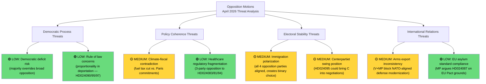

# Threat Analysis — Opposition Motions (April 14–17, 2026)
**Date**: 2026-04-20 | **Riksmöte**: 2025/26 | **Analyst**: news-motions workflow
**Analysis Timestamp**: 2026-04-20 13:06 UTC
**Overall Threat Level**: MEDIUM (democratic process functioning normally)
**Confidence**: 🟩 HIGH

---

## 🎯 Executive Summary

The April 14–17 opposition motions wave does not represent a constitutional or security threat; rather, it constitutes **healthy democratic opposition exercising accountability functions**. However, three threat dimensions merit monitoring:

1. **Democratic Legitimacy Threat** [LOW]: The government's immigration package will pass despite broad multi-party opposition, potentially creating a perceived democratic deficit
2. **Electoral Polarization Threat** [MEDIUM]: The motions represent an opposition electoral strategy that, if effective, could fragment Sweden's political centre before the 2026 election
3. **Policy Coherence Threat** [MEDIUM]: The fuel tax cut (opposed by both S and MP) reveals genuine incoherence in the government's climate strategy

---

## ⚠️ Threat Taxonomy

---

## 🔴 MEDIUM Threats (Monitor Closely)

### T1: Immigration Polarization Lock-In [MEDIUM — 🟧 MEDIUM Confidence]

The unprecedented coordination of S, V, MP, and C against three immigration propositions simultaneously risks **locking in a binary political cleavage** that dominates 2026 election discourse to the exclusion of other policy areas. When all major opposition parties align on a single policy dimension, it:
- Simplifies electoral choice in ways that may not reflect voter complexity
- Reduces space for policy nuance (C's proportionality position risks being drowned out)
- Creates adversarial rather than deliberative parliamentary dynamics

**Evidence**: 10 of 21 motions (48%) target immigration — no other policy area comes close. The concentration signals that the opposition has calculated immigration is their highest-return electoral investment.

**Confidence**: 🟧 MEDIUM — electoral dynamics are inherently uncertain; the threat materializes only if the opposition successfully executes their framing strategy.

### T2: Climate-Fiscal Government Contradiction [MEDIUM — 🟩 HIGH Confidence]

Sweden's GDP growth was only 0.82% in 2024 (recovering from -0.2% in 2023), yet the government's prop. 2025/26:236 cuts fuel taxes in a supplementary budget — a move that increases emissions at a time when Sweden is behind on Paris Agreement commitments. S (HD024082) and MP (HD024098) both challenge this with different framings but reach the same conclusion: the fuel tax cut is bad policy.

**Why this is a governance threat**: If the government passes a climate-inconsistent budget measure while claiming climate leadership, it creates a credibility gap that international partners (EU Commission, climate investors) may exploit. S's demand that the government "return with a new proposal" is procedurally responsible.

**Confidence**: 🟩 HIGH — the climate-fiscal contradiction is factual and measurable.

### T3: Arms Export Opposition Signal [MEDIUM — 🟧 MEDIUM Confidence]

V's HD024091 (complete rejection of prop. 2025/26:228) and MP's HD024096 (arms export ban including follow-up deliveries) signal that a future left-green government would reverse Sweden's post-NATO defense industrial policy. This creates **policy uncertainty risk** for defense industry investment decisions. Sweden's arms manufacturers (Saab, BAE Systems Sweden) need long-term policy certainty that their export licenses will be maintained.

**Evidence**: Both motions challenge prop. 2025/26:228 (modern arms export framework). V's motion explicitly rejects the government's proposed law, while MP's demands a ban on exports to human rights violators.

**Confidence**: 🟧 MEDIUM — V and MP are currently in opposition with no pathway to government without S.

---

## 🟢 LOW Threats (Standard Monitoring)

### T4: Proportionality in Deportation Law [LOW — 🟩 HIGH Confidence]

The government's stricter deportation rules (prop. 2025/26:235) face credible proportionality challenges. C's HD024095 argues that deportation should require "systematic repeated offenses over time" — this is aligned with ECHR case law. MP's HD024097 partially accepts the law while rejecting coercive expansion. V's HD024090 rejects the entire law.

The government is likely to have conducted legal review, but C's nuanced position may prompt a review amendment before the final chamber vote. **Threat level**: LOW because the government has legal advisors who would flag obvious ECHR incompatibilities.

### T5: Democratic Deficit Perception [LOW — 🟧 MEDIUM Confidence]

When four opposition parties all file counter-motions on the same law and all are voted down by a parliamentary majority, there is a risk that some segments of Swedish society perceive a democratic legitimacy deficit. However, this is how parliamentary democracy functions — majorities legislate; oppositions resist and propose alternatives for the next election. The threat is to public trust rather than constitutional function.

---

## 📊 Threat Level Summary

| Threat | Level | Confidence | Timeline |
|--------|-------|------------|----------|
| Immigration polarization | 🟡 MEDIUM | 🟧 MEDIUM | 2026 election |
| Climate-fiscal contradiction | 🟡 MEDIUM | 🟩 HIGH | Immediate |
| Arms export policy uncertainty | 🟡 MEDIUM | 🟧 MEDIUM | Post-2026 |
| Deportation proportionality | 🟢 LOW | 🟩 HIGH | May-June 2026 |
| Democratic deficit perception | 🟢 LOW | 🟧 MEDIUM | Ongoing |

**Overall Threat Level**: 🟡 MEDIUM — Healthy democratic process with policy tensions
