# Threat Analysis — Opposition Motions (April 14–17, 2026)

| Field | Value |
|-------|-------|
| **Date** | 2026-04-20 |
| **Riksmöte** | 2025/26 |
| **Analyst** | news-motions workflow |
| **Analysis Timestamp** | 2026-04-20 13:06 UTC |
| **Overall Threat Level** | 🟡 **MEDIUM** (democratic process functioning normally; specific strategic threats identified) |
| **Frameworks** | Threat taxonomy + **Attack-tree** (opposition) + **Kill-chain** (government counter-strategy) + **Diamond Model** (disinformation) + **STRIDE-adapted** (political-process integrity) |
| **Confidence** | 🟩 HIGH |

---

## 🎯 Executive Summary

The April 14–17 opposition-motions wave does not represent a constitutional or security threat — it constitutes **healthy democratic opposition exercising accountability functions**. The threat dimensions below are **strategic threats to narrative control** (who wins the 2026 campaign), **governance threats to policy coherence** (climate-fiscal contradiction), and **institutional-integrity threats** (disinformation, coordinated inauthentic behaviour around immigration narratives).

**Six substantive threat lines** merit monitoring, mapped across four complementary frameworks:

1. **T1 Electoral Polarisation** [MEDIUM] — opposition framing becomes effective, fragments political centre
2. **T2 Climate-Fiscal Contradiction** [MEDIUM] — government exposed on coherence
3. **T3 Arms-Export Policy Uncertainty** [MEDIUM] — defence-industrial investment risk
4. **T4 Deportation Proportionality** [LOW] — ECHR litigation risk
5. **T5 Democratic-Deficit Perception** [LOW] — public-trust erosion
6. **T6 NEW: Disinformation / Coordinated Inauthentic Behaviour** [MEDIUM] — narrative-integrity threat from domestic-foreign influence actors exploiting immigration salience

---

## ⚠️ Threat Taxonomy

```mermaid
graph TD
    A[Opposition Motions<br/>April 2026 Threat Analysis] --> B[Democratic Process]
    A --> C[Policy Coherence]
    A --> D[Electoral Stability]
    A --> E[International Relations]
    A --> F[Information Integrity]

    B --> B1["🟢 LOW T5: Democratic deficit perception<br/>(majority overrides broad opposition)"]
    B --> B2["🟢 LOW T4: Rule-of-law / proportionality<br/>(HD024090/95/97)"]

    C --> C1["🟡 MEDIUM T2: Climate-fiscal contradiction<br/>(fuel tax vs Klimatlagen/Paris)"]
    C --> C2["🟢 LOW: Healthcare regulatory fragmentation<br/>(3-party opposition HD024083/81/94)"]

    D --> D1["🟡 MEDIUM T1: Immigration polarisation<br/>(all 4 opposition parties aligned)"]
    D --> D2["🟡 MEDIUM: C swing position<br/>(HD024095 negotiation path)"]

    E --> E1["🟡 MEDIUM T3: Arms-export uncertainty<br/>(V+MP post-NATO signalling)"]
    E --> E2["🟢 LOW: EU asylum standard compliance<br/>(MP HD024087 EU Pact)"]

    F --> F1["🟡 MEDIUM T6: Disinformation / CIB<br/>(foreign & domestic amplification around immigration)"]
    F --> F2["🟢 LOW: Platform manipulation<br/>(social-media vote-influence)"]

    style B1 fill:#69db7c,color:#000
    style B2 fill:#69db7c,color:#000
    style C1 fill:#ffd43b,color:#000
    style C2 fill:#69db7c,color:#000
    style D1 fill:#ffd43b,color:#000
    style D2 fill:#ffd43b,color:#000
    style E1 fill:#ffd43b,color:#000
    style E2 fill:#69db7c,color:#000
    style F1 fill:#ffd43b,color:#000
    style F2 fill:#69db7c,color:#000
```

---

## 🔴 MEDIUM Threats (Monitor Closely)

### T1 — Immigration Polarisation Lock-In [MEDIUM — 🟧 MEDIUM Confidence]

The unprecedented coordination of S, V, MP, and C against three immigration propositions simultaneously risks **locking in a binary political cleavage** that dominates 2026 election discourse to the exclusion of other policy areas. When all major opposition parties align on a single policy dimension:

- Simplifies electoral choice in ways that may not reflect voter complexity
- Reduces space for policy nuance (C's proportionality position risks being drowned out)
- Creates adversarial rather than deliberative parliamentary dynamics

**Evidence**: 10 of 21 motions (48%) target immigration — no other policy area comes close. The concentration signals that the opposition has calculated immigration is their highest-return electoral investment.

**Confidence**: 🟧 MEDIUM — electoral dynamics are inherently uncertain; the threat materialises only if the opposition successfully executes its framing strategy.

### T2 — Climate-Fiscal Government Contradiction [MEDIUM — 🟩 HIGH Confidence]

Sweden's GDP growth was only 0.82% in 2024 (recovering from –0.2% in 2023), yet the government's prop. 2025/26:236 cuts fuel taxes in a supplementary budget — a move that adds **+0.3–0.5 MtCO₂e/year** (Naturvårdsverket elasticity modelling) at a time when Sweden is ~20% behind its 2030 trajectory under Klimatlagen 2017:720. S (HD024082) and MP (HD024098) both challenge this with different framings but reach the same conclusion: the fuel-tax cut is bad policy.

**Why this is a governance threat**: If the government passes a climate-inconsistent budget measure while claiming climate leadership, it creates a credibility gap that international partners (EU Commission DG CLIMA, climate-finance investors) may exploit. S's demand that the government "return with a new proposal" is procedurally responsible.

**Comparative evidence**: Only Germany (2022 Tankrabatt) is a direct precedent; Germany did not extend. Sweden is betting against European experience.

**Confidence**: 🟩 HIGH — the climate-fiscal contradiction is factual and measurable.

### T3 — Arms-Export Policy Uncertainty [MEDIUM — 🟧 MEDIUM Confidence]

V's HD024091 (complete rejection of prop. 2025/26:228) and MP's HD024096 (arms-export ban including follow-up deliveries) signal that a future left-green government would reverse Sweden's post-NATO defence-industrial policy. This creates **policy uncertainty risk** for defence-industry investment decisions. Swedish arms manufacturers (Saab Linköping ~15k jobs, BAE Systems Karlskoga ~8k jobs) need long-term policy certainty that their export licences will be maintained.

**Evidence**: Both motions challenge prop. 2025/26:228. V's motion explicitly rejects the proposed law; MP demands a ban on exports to human-rights violators.

**Confidence**: 🟧 MEDIUM — V and MP are currently in opposition with no pathway to government without S.

### T6 — Disinformation / Coordinated Inauthentic Behaviour [MEDIUM — 🟧 MEDIUM Confidence] 🆕

**Context**: Immigration-salience political moments in Sweden 2018, 2022, and now 2026 have correlated with **foreign state-linked amplification networks** (documented by MSB and FOI) and **domestic anonymous influence operations** on social platforms. The April 2026 opposition-motion wave provides a high-value target for:

- **Foreign influence operations** (Russian-linked and Chinese-linked networks per FOI 2024 assessment) amplifying polarising framings
- **Domestic coordinated inauthentic behaviour** on TikTok/X/Facebook around anti-immigration rhetoric
- **AI-generated disinformation** (deepfake political speech, fabricated policy documents) leveraging the high-newsworthiness of the cluster

**Threat actors (Diamond Model — adversary / capability / infrastructure / victim)**:

| Actor class | Capability | Infrastructure | Victim / target |
|------------|------------|----------------|-----------------|
| Foreign state-linked (RU, CN) | High-volume automated amplification; AI-generated content | Platform-embedded assets; VPN networks | Swedish electorate; specific candidates |
| Domestic partisan operators | Medium-volume coordinated posting | Anonymous accounts; AstroTurf pages | Swedish electorate; specific opposition candidates |
| Lone-actor deepfakers | Novel AI-generated content | Home systems; open-source models | High-profile politicians (attack ads) |
| Commercial disinfo providers | Paid disinformation services | Offshore infrastructure | Any actor willing to pay |

**Forward indicators `[HIGH]`**:
- FOI/MSB public statements on post-filing amplification activity
- Platform transparency reports (X, Meta, TikTok) showing spike in coordinated inauthentic behaviour
- Specific deepfake incidents involving opposition or government figures
- Foreign-language amplification of Swedish political debate (Russian, Arabic, English)

---

## ⚔️ Attack-Tree — Opposition Narrative Capture (Hostile Perspective)

Modelled from **government-perspective**: how might the government/SD dismantle the opposition's four-party narrative?

```mermaid
flowchart TD
    GOAL["🎯 GOAL: Break 4-party opposition narrative<br/>before 2026 election"]

    A["A. Fragment opposition publicly"]
    B["B. Change voter priority off immigration"]
    C["C. Own the narrative space"]
    D["D. Discredit individual parties"]

    A1["A1. Force V-C public split<br/>(feasibility: HIGH)"]
    A2["A2. Exploit S-silence on deportation<br/>(feasibility: HIGH)"]
    A3["A3. Isolate MP as 'unrealistic'<br/>(feasibility: MEDIUM)"]

    B1["B1. Emphasize economy/jobs<br/>(feasibility: LOW — amplifies R08)"]
    B2["B2. Trigger security crisis focus<br/>(feasibility: MEDIUM; opportunistic)"]

    C1["C1. SD attack ads weaponise<br/>V rejectionism (feasibility: HIGH)"]
    C2["C2. Mainstream-media framing<br/>'obstructionism' (feasibility: MEDIUM)"]
    C3["C3. Dominate 24h news cycle<br/>(feasibility: MEDIUM)"]

    D1["D1. S 2015–2022 legacy attacks<br/>(feasibility: HIGH)"]
    D2["D2. V 'unreliable on Ukraine'<br/>(feasibility: HIGH)"]
    D3["D3. MP 'out of touch on costs'<br/>(feasibility: HIGH)"]
    D4["D4. C 'drifting left'<br/>(feasibility: MEDIUM)"]

    GOAL --> A
    GOAL --> B
    GOAL --> C
    GOAL --> D

    A --> A1
    A --> A2
    A --> A3
    B --> B1
    B --> B2
    C --> C1
    C --> C2
    C --> C3
    D --> D1
    D --> D2
    D --> D3
    D --> D4

    style GOAL fill:#d32f2f,color:#fff
    style A1 fill:#ff7043,color:#000
    style A2 fill:#ff7043,color:#000
    style C1 fill:#ff7043,color:#000
    style D1 fill:#ff7043,color:#000
    style D2 fill:#ff7043,color:#000
    style D3 fill:#ff7043,color:#000
    style B1 fill:#FFCDD2,color:#000
    style B2 fill:#FFCDD2,color:#000
    style A3 fill:#FFCDD2,color:#000
    style C2 fill:#FFCDD2,color:#000
    style C3 fill:#FFCDD2,color:#000
    style D4 fill:#FFCDD2,color:#000
```

> **Highest-feasibility attack vectors** (dark orange): **A1** (V-C split), **A2** (S-silence exploit), **C1** (V rejectionism attack ads), **D1-D3** (party-specific discrediting). **Opposition mitigation priorities** map directly to SWOT TOWS WT1-WT3.

---

## 🎯 Kill-Chain — Government Narrative Counter-Operation (Adapted)

Seven-stage adaptation of the Lockheed-Martin Cyber Kill Chain to a political-communications counter-operation:

| Stage | Government counter-step | Opposition counter-counter |
|:-----:|--------------------------|----------------------------|
| 1 Reconnaissance | SD+M opposition-research team analyses V's HD024076/90/91 for rejectionism patterns | V pre-audits own filing texts for rejection-framing bias |
| 2 Weaponisation | SD ad agency produces attack ads: "V abandons Ukraine" (linking HD024091 to Ukraine-support narrative) | V issues pre-emptive Ukraine-support statement pairing each arms motion |
| 3 Delivery | Ads on YouTube, TikTok, Facebook + front-page placement Expressen | Opposition paid-media counter on same platforms |
| 4 Exploitation | Ads exploit cost-of-living anxiety (74% priority — Novus Q1 2026) | Opposition pivots to integration-as-economic-productivity frame |
| 5 Installation | Frame installed via repeated broadcast → "opposition = chaos" | Opposition produces positive vision: cross-party amendment on HD024095 |
| 6 Command & Control | Tidö-coalition daily message discipline enforcing frame | Opposition four-leader coordinated op-eds (without joint photo) |
| 7 Actions on Objectives | Polling moves 1–2 points toward M+SD+KD+L | Mid-campaign frame-shift to climate or healthcare (where opposition wins) |

---

## 🛡️ STRIDE-Adapted — Political-Process Integrity Threats

Adapting STRIDE (Microsoft threat-modelling) to democratic-process integrity:

| STRIDE | Translation to political context | Manifestation in April 2026 cluster | Mitigation |
|:------:|----------------------------------|-------------------------------------|------------|
| **S**poofing | Fake actors impersonating politicians / parties | Deepfake videos of S / V / MP / C leaders pro/anti positions | Platform verification; rapid-response units |
| **T**ampering | Altering policy texts or records | Fake versions of motion texts circulated on social media | Riksdagen authoritative-text portal; press fact-checking |
| **R**epudiation | Actors denying statements later | Party leaders claiming "that's not what our motion says" | Timestamped primary sources; dok_id citations |
| **I**nformation disclosure | Private-data leaks around politicians | Hacked constituency data used to target voters | Cybersecurity; MFA; GDPR enforcement |
| **D**enial of service | Suppressing legitimate speech | Spam flooding of comment sections; fake reports to deplatform opponents | Platform-policy transparency; legal recourse |
| **E**levation of privilege | Foreign actors posing as Swedish voters | Foreign-language amplification networks | MSB/FOI monitoring; platform CIB removal |

---

## 📊 Threat Level Summary

| Threat | Level | Confidence | Timeline | Framework |
|--------|:-----:|:----------:|----------|-----------|
| T1 Immigration polarisation | 🟡 MEDIUM | 🟧 MEDIUM | 2026 election | Taxonomy + kill-chain |
| T2 Climate-fiscal contradiction | 🟡 MEDIUM | 🟩 HIGH | Immediate | Taxonomy |
| T3 Arms-export policy uncertainty | 🟡 MEDIUM | 🟧 MEDIUM | Post-2026 | Taxonomy |
| T4 Deportation proportionality | 🟢 LOW | 🟩 HIGH | May–June 2026 | ECHR review |
| T5 Democratic-deficit perception | 🟢 LOW | 🟧 MEDIUM | Ongoing | Taxonomy |
| T6 Disinformation / CIB | 🟡 MEDIUM | 🟧 MEDIUM | Immediate–September | Diamond + STRIDE |

**Overall Threat Level**: 🟡 **MEDIUM** — Healthy democratic process with identifiable strategic threats, primarily in the **narrative-capture** and **information-integrity** domains rather than **constitutional / rule-of-law** domains.

---

## 🧭 Recommended Analyst Actions

| # | Action | Priority | Addressed-to |
|:-:|--------|:--------:|--------------|
| 1 | Pre-stage V Ukraine-support statement template paired with arms-export motions | HIGH | V communications |
| 2 | Coordinate SfU amendment-first vote sequencing (mitigates A1 attack) | HIGH | S+V+MP+C whips |
| 3 | Issue comparative-international evidence briefing to newsrooms (mitigates C2 obstructionism frame) | HIGH | Opposition press shops |
| 4 | Monitor MSB/FOI CIB reports; rapid-response to amplification spikes | HIGH | All opposition parties |
| 5 | Prepare rural S MP media schedule (mitigates D1 + R03) | HIGH | S Norrland delegation |
| 6 | Pre-audit motion texts for deepfake/rumour pre-emption (STRIDE S/T) | MEDIUM | All four opposition press offices |
| 7 | Document Lagrådet yttrande preparation; pre-brief journalists | MEDIUM | Opposition legal advisors |
| 8 | Establish 24h joint-response rotation for attack-ad counters | MEDIUM | Opposition communications coalition |

---

## 📎 Cross-References

- [`synthesis-summary.md`](synthesis-summary.md) — Red-Team + ACH ties directly to T1
- [`risk-assessment.md`](risk-assessment.md) — R10 (V rejectionist) ↔ T1/A1/C1
- [`swot-analysis.md`](swot-analysis.md) — TOWS WT1–WT5 align with A1/A2/C1/D1-D3
- [`scenario-analysis.md`](scenario-analysis.md) — Threat activation per scenario branch
- [`documents/arms-export-cluster-analysis.md`](documents/arms-export-cluster-analysis.md) — T3 deep-dive
- [`comparative-international.md`](comparative-international.md) — neutralises C2 "obstructionism" frame

---

**Classification**: Public · **Next Review**: 2026-04-27
