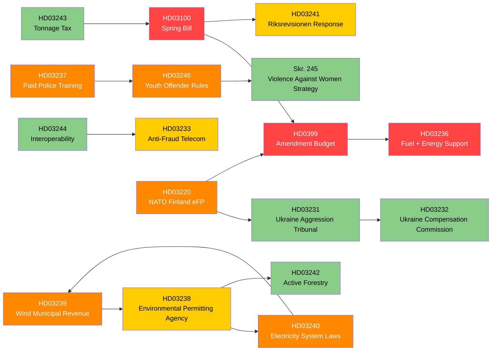

# Cross-Reference Map — Government Propositions — 2026-04-20

**Generated**: 2026-04-20 06:30 UTC  
**Method**: Legislative interdependency mapping across propositions and prior legislation  
**Confidence**: 🟩HIGH

## Purpose

Map the cross-proposition dependencies to identify:
1. Amendments, repeals, and framework dependencies between the 9 focus propositions and other legislation.
2. Chronology of implementation where one proposition enables another.
3. Legislative ecosystem connections — committee, ministerial, legal, and policy links.

## Proposition Cross-Dependency Matrix



## Dependency Categories

### Category A: Direct Fiscal Cascade (MUST pass together)

**Chain**: HD03100 → HD0399 → HD03236 → (HD03241 response)

**Rationale**:
- Spring Bill sets expenditure ceiling.
- Amendment Budget implements specific line-item adjustments within ceiling.
- Extra Amendment Budget adds urgent measures (fuel cut + energy support).
- Riksrevisionen response (HD03241) is government's formal engagement with fiscal-framework scrutiny.

**Effect of failure in chain**:
- If HD03100 fails → entire fiscal package collapses.
- If HD0399 fails → technical chaos but HD03100 survives.
- If HD03236 fails → major political blow but fiscal coherence preserved.

### Category B: Energy Structural Interdependence

**Chain**: HD03240 ↔ HD03239 ↔ HD03238

**Interdependencies**:
- HD03240 electricity market reform enables industrial electrification scale.
- HD03239 wind compensation solves rural consent for capacity expansion.
- HD03238 new agency processes permits for projects enabled by HD03240 + HD03239.
- Without HD03238, HD03239 capacity remains bottlenecked in permitting.
- Without HD03239, HD03240 lacks project supply.
- Without HD03240, HD03239's revenue base is uncertain.

**Effect of partial passage**: Each proposition has independent legal validity, but the *policy effect* is substantially reduced if any fails. This is a **tight coupling** scenario.

### Category C: Justice Cluster Framework

**Chain**: HD03237 → HD03246 → Skr. 245

**Rationale**:
- HD03237 expands police capacity.
- HD03246 uses that capacity (along with courts + prosecutors) for stricter juvenile sentencing.
- Skr. 245 provides welfare-side complement, preempting "punishment-only" critique.

**Policy integration**: Strong — each document reinforces the others in campaign narrative.

### Category D: Security & Foreign Policy

**Chain**: HD03220 → HD03231 → HD03232

**Rationale**:
- HD03220 operational-military contribution.
- HD03231 legal-institutional commitment (aggression tribunal).
- HD03232 compensation mechanism for Ukraine recovery.

Together these demonstrate Swedish transition from neutrality to active security contributor.

### Category E: Industrial-Policy Complement

**Documents**: HD03242 (forestry) + HD03243 (tonnage tax) + HD03244 (interoperability) + HD03233 (anti-fraud)

**Rationale**: These are independent-but-coherent sectoral measures supporting competitiveness and regulatory clarity.

## Legislative Framework Dependencies

### Dependencies on Prior Legislation

| Current Proposition | Modifies / Builds on | Relationship |
|---------------------|----------------------|--------------|
| HD03100 | Budgetlagen (2011:203) | Framework compliance |
| HD0399 | Budgetlagen (2011:203) | Technical amendments |
| HD03236 | Lagen om skatt på energi (1994:1776) | Direct amendment |
| HD03237 | Polislagen (1984:387) | Modifies Pol-Hi training |
| HD03238 | Miljöbalken (1998:808); Länsstyrelseinstruktionen | Restructures permitting |
| HD03239 | Ellagen (1997:857); Kommunallagen | Revenue-sharing framework |
| HD03240 | Ellagen; EU Electricity Regulation 2019/943 | Significant reform |
| HD03246 | Brottsbalken (1962:700); LVU (1990:52) | Amends juvenile provisions |
| HD03233 | Lagen om elektronisk kommunikation (2003:389) | Adds carrier obligations |
| HD03220 | NATO Status of Forces Agreement; Svenska försvarsmaktens lag | Implementation |
| HD03231 | Statute of the International Criminal Court | Extension |
| HD03232 | — | New accession |
| HD03243 | Inkomstskattelagen | Industry-specific amendment |
| HD03242 | Skogsvårdslagen (1979:429) | Clarifying amendments |
| HD03244 | Förvaltningslagen; Offentlighets- och sekretesslagen | Digital governance |

### EU Law Interactions

| Proposition | EU Legal Framework | Compliance Issue |
|-------------|-------------------|------------------|
| HD03239 | State Aid Guidelines (2023); Regulation (EU) 2015/1589 | State-aid notification risk (see `risk-assessment.md`) |
| HD03240 | Regulation (EU) 2019/943 Electricity Market | Must preserve cross-border trade; price-zone coordination with Nordic TSOs |
| HD03243 | EU Shipping Package; Council Directive 2003/96/EC | Requires EU review |
| HD03233 | ePrivacy Directive; Digital Services Act | Leverages EU digital framework |
| HD03238 | IED, EIA Directives, Habitats Directive | Cannot weaken substantive protection |
| HD03220 | NATO Status of Forces Agreement; EU Strategic Compass | Dual compliance |
| HD03232 | Council of Europe ad hoc agreement | Sweden among first ratifiers |

## Committee-Level Routing

Multiple propositions route through single committees, creating scheduling conflicts:

| Committee | Propositions | Implication |
|-----------|--------------|-------------|
| **FiU** (Finance) | HD03100, HD0399, HD03236, HD03241, HD03244 | 5 concurrent — heavy load |
| **NU** (Industry) | HD03239, HD03240 | Coordinated energy review |
| **JuU** (Justice) | HD03237, HD03246 | Coordinated justice review |
| **MJU** (Environment/Agri) | HD03238, HD03242 | Heavy environmental load |
| **UU** (Foreign) | HD03220, HD03231, HD03232 | Coordinated foreign review |
| **TU** (Traffic/Telecom) | HD03233 | Single proposition |
| **SkU** (Taxation) | HD03243 | Single proposition |

**Risk**: FiU's 5 concurrent propositions create hearing-calendar pressure. Opposition can leverage hearing bottlenecks for extended scrutiny.

**Coordination**: Government has likely pre-negotiated hearing schedule with committee secretariat. Expected passage window: early June 2026.

## Budget-Line Cross-References

### HD03100 Establishes Ceiling → HD0399 Fills Lines

Expected major adjustments (illustrative, based on 2025 precedent):

- Defence (UO 6): +SEK 3–4 bn (reflecting NATO commitment + HD03220).
- Justice (UO 4): +SEK 1–1.5 bn (police training + structural capacity).
- Energy/Climate (UO 21): +SEK 0.8–1.2 bn (energy transition scaffolding).
- Healthcare subvention (UO 9): modest adjustments.

### HD03236 Draws on Energy Policy Budget + Compensatory Tax Measures

Expected SEK 12–18 bn total fiscal cost, financed through:
- Reduced fuel tax revenue.
- New appropriation for energy support.
- Partially offset by marginal tax adjustments in HD0399.

## Implementation Time-Sequence Dependency

Critical path analysis for implementation:

```
April 2026: Propositions submitted
May 2026: Committee hearings
June 2026: Riksdag votes (expected passage)
July 2026: HD03236 effective (fuel + energy) ← electoral window
Q3 2026: HD03238 agency setup begins
Q4 2026: HD03220 deployment rotation begins; EU DG Comp review window for HD03239
Q1 2027: HD03237 first paid cohort enters training; HD03246 sentencing changes effective; HD03233 effective
Q2 2027: HD03239 first compensation payments
Q4 2027: HD03238 claimed full operational capacity
2028: HD03240 full implementation completed
2029+: Measurable outcomes for HD03237 (police retention), HD03238 (permit timelines)
```

**Critical vulnerability**: HD03238 agency operates during election cycle but cannot deliver measurable outcomes until 2028. Government has "legislated but not delivered" vulnerability.

## Policy-Effect Multiplier Mapping

Some propositions multiply the political/policy value of others:

| Primary | Multiplier | Combined Effect |
|---------|-----------|-----------------|
| HD03100 | + HD03241 | Institutional validation if RR benign |
| HD03237 | + HD03246 | Law-and-order coherence for SD voters |
| HD03220 | + HD03231 + HD03232 | Sweden as active security contributor |
| HD03239 | + HD03240 + HD03238 | Green industrial transition credibility |
| HD03244 | + HD03233 | Digital governance modernisation |
| Skr. 245 | + HD03246 | "We're tough AND we care" narrative |

## Opposition Leverage Mapping

| Committee/Vote | Opposition leverage | Tactical intent |
|-----------------|---------------------|-----------------|
| FiU hearings on HD03100 | High — forecast forensic exam | Delegitimise growth projections |
| FiU vote on HD03236 | Low — binary vote | Position narrative for campaign |
| MJU hearings on HD03238 | Medium-High — complexity | Build environmental-backslide case |
| UU hearings on HD03220 | Low — V only opposes | Ritualistic but doesn't block |
| NU hearings on HD03239 | Medium — state-aid concerns | Push for revisions |

## Government Momentum Mapping

Momentum value of passing each proposition before September 2026 election:

| Proposition | Momentum value | Reason |
|-------------|----------------|--------|
| HD03100 | 🟦 CRITICAL | Defines economic narrative |
| HD03236 | 🟦 CRITICAL | Visible to Segment 1+2 voters |
| HD03237 | 🟩 HIGH | Delivers SD commitment before campaign |
| HD03220 | 🟩 HIGH | Demonstrates NATO credibility |
| HD03239 + 240 | 🟧 MEDIUM | Legacy value; minimal campaign effect |
| HD03238 | 🟧 MEDIUM | Completing reform programme |
| Others | 🟨 LOW-MEDIUM | Coherence signal |

## Chronological Priority (From Government's Electoral Perspective)

1. **June 2026 Critical Pass**: HD03100 + HD0399 + HD03236 + HD03237 + HD03220. These deliver visible change before September.
2. **Summer 2026 Secondary Pass**: HD03233, HD03246, HD03231, HD03232. Demonstrate coherent delivery.
3. **Post-Election Completion**: HD03238, HD03239, HD03240, HD03242, HD03243, HD03244. Structural reforms implementable regardless of election outcome.

## Conclusion

The legislative package displays **high internal coherence** across four thematic clusters (fiscal, energy, justice, security). Cross-dependencies create policy-multiplier effects but also coupling risks — if any high-profile proposition fails passage, narrative coherence suffers disproportionately.

From a journalist's perspective, analysis should distinguish:
- Pre-September critical deliverables (HD03100, HD03236, HD03237, HD03220).
- Long-term structural reforms (HD03238, HD03239, HD03240).
- Complementary symbolic measures (HD03231, HD03232, HD03233, Skr. 245).

The inter-proposition dependencies justify treating the package as a single analytical unit rather than 9 disconnected bills.
