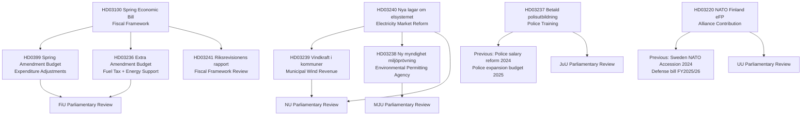
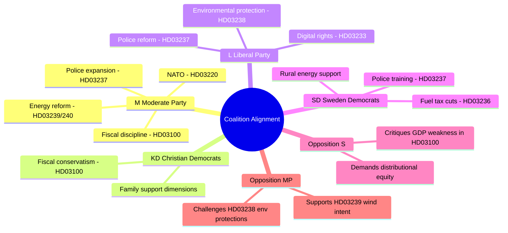

# Cross-Reference Map — Government Propositions — 2026-04-20

**Generated**: 2026-04-20 06:29 UTC  
**Purpose**: Legislative interdependencies, policy coherence, and political linkage mapping  
**Confidence**: 🟩HIGH

## Legislative Dependency Graph

## Fiscal Package Interdependencies

| Proposition | Connects To | Relationship |
|-------------|------------|--------------|
| HD03100 (Spring Bill) | HD0399 (Spring Amend. Budget) | Spring Bill sets ceilings; Amendment Budget implements adjustments |
| HD03100 | HD03236 (Extra Amend. Budget) | Extra budget supplements Spring Bill's household support measures |
| HD03100 | HD03241 (Riksrev. Report) | Government responds to audit findings alongside Spring Bill |
| HD0399 | HD03236 | Sequential budget amendments targeting different policy areas |
| HD03236 | HD0399 | HD03236 = extra measure ON TOP of HD0399 — both needed for complete fiscal picture |

## Energy Package Interdependencies

| Proposition | Connects To | Relationship |
|-------------|------------|--------------|
| HD03240 (Electricity Laws) | HD03239 (Wind Power) | Electricity market framework enables wind revenue scheme |
| HD03240 | HD03238 (Env. Agency) | Electricity expansion requires streamlined environmental permits |
| HD03238 | HD03239 | New agency handles wind power environmental reviews |

## Policy Domain Matrix

| Policy Domain | Propositions | Lead Minister | Committee |
|---------------|-------------|---------------|-----------|
| Fiscal Policy | HD03100, HD0399, HD03236 | Svantesson | FiU |
| Energy Transition | HD03239, HD03240 | Britz | NU |
| Environmental Governance | HD03238 | Britz | MJU |
| Law Enforcement | HD03237 | Strömmer | JuU |
| Digital Security | HD03233 | Strömmer (via FD) | TU |
| Defense/NATO | HD03220 | Dousa | UU |

## Political Coalition Cross-References

## Legislative Timeline Integration

| Phase | Propositions | Expected Timeline | Key Milestones |
|-------|-------------|-------------------|----------------|
| Submission | All 9 | Apr 9–16, 2026 | Riksdag received |
| Committee Review | HD03100, HD0399 | April–May 2026 | FiU hearings begin |
| Committee Review | HD03237, HD03238–240 | May–June 2026 | JuU, MJU, NU hearings |
| Chamber Debate | Budget Package | May-June 2026 | Critical vote |
| Chamber Passage | All | June–Sept 2026 | Expected passage |
| Implementation | HD03237 (police training) | Jan 2027+ | Subject to Police Authority capacity |
| Implementation | HD03238 (env. agency) | 2027 | New agency operational |
| Implementation | HD03239 (wind revenue) | 2027 | Municipal compensation begins |
