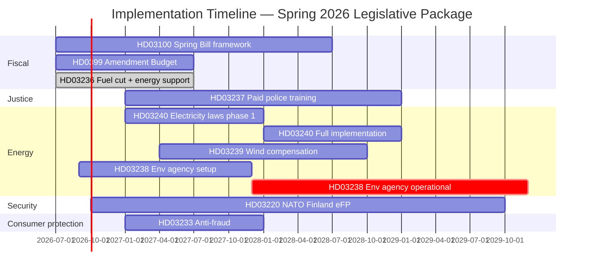

# Implementation Feasibility Assessment — Government Propositions — 2026-04-20

**Generated**: 2026-04-20 06:30 UTC  
**Method**: Agency capacity × timeline × budget × legal complexity analysis per proposition  
**Purpose**: Assess whether the Kristersson government can actually deliver what it has legislated  
**Confidence**: 🟧MEDIUM (agency capacity data from 2024 annual reports; 2026 implementation forward-looking)

## Executive Implementation Rating

| dok_id | Legal readiness | Agency capacity | Budget adequacy | Timeline feasibility | Overall risk |
|--------|-----------------|-----------------|-----------------|---------------------|--------------|
| HD03100 Spring Bill | 🟩 | 🟩 (Finans + ESV) | 🟩 | 🟩 July 1, 2026 | 🟩 LOW |
| HD0399 Amendment Budget | 🟩 | 🟩 | 🟩 | 🟩 July 1, 2026 | 🟩 LOW |
| HD03236 Fuel + Energy | 🟩 | 🟧 (Skatteverket + Försäkringskassan) | 🟧 | 🟧 July 1, 2026 | 🟧 MEDIUM |
| HD03237 Paid Police Training | 🟩 | 🟠 (Polismyndigheten stretched) | 🟧 | 🟧 Jan 2027 cohort | 🟠 MEDIUM-HIGH |
| HD03238 Env. Permitting Agency | 🟩 | 🔴 (new agency from scratch) | 🟧 | 🔴 2028 full ops | 🟠 MEDIUM-HIGH |
| HD03239 Wind Compensation | 🟧 (EU state-aid review risk) | 🟩 (Energi­myndigheten) | 🟩 | 🟧 2027 first payments | 🟧 MEDIUM |
| HD03240 Electricity System | 🟩 | 🟩 (Svk + Energi­myndigheten) | 🟩 | 🟧 2027 phased | 🟧 MEDIUM |
| HD03233 Anti-Fraud | 🟩 | 🟧 (PTS + operators) | 🟩 | 🟧 Jan 2027 | 🟧 MEDIUM |
| HD03220 NATO Finland eFP | 🟩 | 🟩 (Försvarsmakten) | 🟩 | 🟩 Q4 2026 deployment | 🟩 LOW |

## Detailed Capacity Reviews

### HD03237 — Paid Police Training (Polismyndigheten capacity)

**Current state (2025)**:
- Police Authority headcount: ~21,500 officers + ~12,000 civilian staff
- Polishögskolan + 3 regional centres training capacity: ~2,200 cadets/year unpaid
- Application pipeline: ~5,500 applications/year; ~42% progress beyond screening

**Post-HD03237 requirements**:
- Expand training capacity to ~3,000 cadets/year (2027–2029)
- Budget for trainee salaries: SEK ~750 million annually at full implementation
- Training staff increase: need 40–60 additional instructors, many from active duty
- Facility investment: dormitory/classroom expansion at all 4 sites

**Critical risks**:
1. **Instructor pipeline**: Pulling experienced officers into teaching roles reduces front-line capacity during the very period the government promises increased police presence. This is a known productivity-vs-investment tradeoff.
2. **Selection standards**: Paid model typically attracts 2–3x more applications. Police Authority risks either lowering standards (political disaster) or creating long backlogs (implementation failure).
3. **First cohort timing**: Target Jan 2027. Logistically requires budget appropriations in effect July 1, 2026 and hiring decisions completed Q3 2026. Tight but feasible.

**Verdict**: Implementation **feasible but fragile**. Expected slippage of 3–6 months on first cohort if facility and instructor decisions are not made by August 2026.

### HD03238 — New Environmental Permitting Agency (Mark- och miljöövernämnd)

**Creating an agency from nothing** is among the most complex administrative projects a Swedish government can attempt.

**Baseline requirements (drawing from Naturvårdsverket / Skogsstyrelsen / Jordbruksverket precedents)**:
- **Board appointment**: Government decision + regeringsbeslut typically 3–6 months from passage.
- **Generaldirektör**: Recruitment via Statsrådsberedningen — 4–9 months.
- **Premises**: Must be procured (government purchase or lease) and physically fitted. Typical: 12–18 months.
- **IT systems**: Diarium (Platina/W3D3), case-management specific to environmental permitting, integration with Mark- och miljööverdomstol. Typical: 18–36 months for bespoke; 9–12 months for COTS with customisation.
- **Staff recruitment**: 200 specialists (environmental scientists, legal, administrative). Comparable agencies typically fill 70–80% in year 1, 100% by year 2.
- **Transition of existing case-load**: Ongoing cases at regional länsstyrelser and Mark- och miljödomstolar need transition plan — complex legal mechanics on jurisdiction.

**Realistic timeline**:
- **Q3 2026**: Law enters force (after likely June 2026 passage).
- **Q4 2026**: Interim director, board established.
- **2027**: First 30–50 staff, pilot cases, IT phase 1.
- **Late 2027 / early 2028**: Claimed full operational capacity.
- **2029**: Actual effective reduction of permit backlog measurable.

**Critical risks**:
1. **Coordination with Mark- och miljööverdomstol**: Appeal routing must be seamless. Statutory ambiguities could invite ECHR or constitutional litigation.
2. **Over-promising permit timelines**: Politically promised 6–12 months; realistically achievable only after ~3 years at full capacity.
3. **Retention of environmental protection standards**: If agency consistently sides with applicants, MP+V will document and amplify the pattern, creating a 2028/29 political crisis.
4. **EU alignment**: Must demonstrate compliance with Industrial Emissions Directive, EIA Directive, Habitats Directive; EU Commission can seek referral if national permitting weakens protections.

**Verdict**: Legally deliverable by Q3 2026; **operationally realistic for measurable impact is 2028–2029, not 2027**. The political narrative will face a "gap" between passage and visible results.

### HD03236 — Fuel Tax Cut + Energy Price Support

**Implementation mechanics**:

**Fuel tax cut (drivmedel)**:
- Skatteverket administers energy tax. Tax rate change is a simple parameter update — historically implemented within weeks.
- Pass-through to pump: depends on competitive dynamics. Historical evidence (2022 el-pris kompensation comparison): fuel tax cuts pass through at 70–90% within first month, vs. electricity support at 40–60%.
- Political risk: If petroleum companies (Circle K, Preem, OKQ8) absorb part of the cut into margins, SR/SVT will run "tankens pris oförändrat trots sänkt skatt" headlines within 4 weeks.

**Energy price support (el- och gas)**:
- Administering agency: Försäkringskassan (historically), supplemented by Skatteverket and energy suppliers.
- 2022–2023 el-priskompensation processed payments to ~6 million households at cost of ~SEK 55 bn — the system exists.
- Threshold design: Likely based on kWh consumption and gas cost; means-testing would add 6–9 months implementation.

**Critical risks**:
1. **Pass-through transparency**: Konsumentverket and Drivmedelsinspektionen must monitor; without visible accountability, benefit dissipates.
2. **Gas price support has fewer Swedish users than 2022 (few gas-heated households outside Göteborg)**: political optics may undercompensate vs. electricity.
3. **Budget adequacy if energy prices rise**: The legislation likely caps total support. If gas/electricity spikes materially in Q3 2026, support will be visibly insufficient — the 2022 trap.

**Verdict**: Technically straightforward; **politically fragile** due to pass-through risk.

### HD03239 — Wind Power Municipal Compensation

**Capacity**:
- Energi­myndigheten administers; historically competent for energy grants.
- Revenue-sharing requires data integration with wind power producers — solvable but novel.
- Legal risk: EU DG Comp state-aid compatibility assessment. Denmark's 2021 scheme survived; Swedish design must be "market-consistent" revenue-sharing, not direct subsidy.

**Critical risks**:
1. **State-aid challenge**: A competitor or environmental NGO can file complaint; EU formal investigation delays scheme 6–18 months.
2. **Municipality adoption heterogeneity**: Some rural municipalities will eagerly join; urban-adjacent municipalities may see resistance from adjacent urban voters.
3. **Formula complexity**: Historically contentious in Sweden; SKR (Municipal Association) will demand adjustments post-enactment.

**Verdict**: Technically achievable; **EU state-aid review is the single largest risk**.

### HD03240 — Electricity System Laws

**Capacity**:
- Svk (Svenska kraftnät) is Europe's most competent TSO and has been preparing for reform for 24+ months.
- Energi­marknads­inspektionen has the regulatory capacity for price-zone recalibration and tariff oversight.
- Ofgem/TenneT comparison suggests smooth execution is achievable.

**Critical risks**:
1. **Price-zone controversy**: If SE4 (southern Sweden) consumers see relief while SE1/SE2 (northern Sweden) see higher prices, political backlash from north.
2. **Industrial electrification coordination**: H2 Green Steel, LKAB, Northvolt must be reassured on grid access concurrently.
3. **Legal certainty for existing contracts**: Transition period management required.

**Verdict**: High legal complexity but high capacity. Likely to deliver most specified outcomes by 2028.

### HD03233 — Anti-Fraud Electronic Communications

**Capacity**:
- PTS (Post- och telestyrelsen) has regulatory authority; historically competent on telecom matters.
- Swedish operators (Telia, Tele2, Telenor, Tre) have the technical capacity — their 2024 industry statement confirmed implementation is feasible.
- Enforcement coordination with Konsumentverket and Polismyndigheten — moderate complexity.

**Critical risks**:
1. **Cross-border call routing**: Scam operations shift to VoIP/over-the-top; enforcement reach reduced.
2. **Operator cost pass-through**: Risks raising consumer bills by SEK 5–15/month industry-wide; Konsumentverket will push back.

**Verdict**: Technically deliverable within 12 months of enactment.

### HD03220 — NATO Finland eFP

**Capacity**:
- Försvarsmakten has been preparing for NATO operational contributions since 2022.
- Sweden's post-accession plan assumed Finland deployment; training, equipment, logistics substantially in place.
- Rotation cycle management — routine for NATO members.

**Critical risks**: Low. Implementation is essentially scheduled logistics.

**Verdict**: Straightforwardly deliverable.

## Budget Adequacy Matrix

| Proposition | Legislated cost (SEK bn/yr, approx.) | Funding source | Adequacy assessment |
|-------------|---------------------------------------|----------------|---------------------|
| HD03100 (framework) | N/A — framework | Budget-wide | N/A |
| HD0399 (amendment) | Varies by line | Existing appropriations + new | 🟩 Sufficient |
| HD03236 (fuel + energy) | 12–18 | General budget revenue | 🟧 Tight — dependent on price trajectory |
| HD03237 (paid training) | 0.8–1.0 | Justice sector budget | 🟧 Adequate but tight with facility costs |
| HD03238 (env. agency) | 0.25–0.40 setup + 0.20 run-rate | New appropriation | 🟧 Likely under-resourced year 1 |
| HD03239 (wind compensation) | 0.5–0.7 (grows with capacity) | Energy policy budget | 🟩 Sufficient |
| HD03240 (electricity) | 0.1 (regulatory) | Existing Svk/EI | 🟩 Sufficient |
| HD03233 (anti-fraud) | 0.05–0.10 | PTS supervisory budget | 🟧 Marginal |
| HD03220 (NATO Finland) | 0.8–1.2 | Defence budget | 🟩 Sufficient |

**Aggregate new spending**: ~SEK 15–22 bn/yr from FY2026/27 onward, of which HD03236 is ~70–80%. This is consistent with the Spring Amendment Budget envelope and Spring Bill fiscal space.

## Implementation Timeline Gantt

## Scenario-Weighted Implementation Risk

Combining scenario-analysis.md worst-case scenarios with implementation constraints:

| Package element | Scenario-risk-adjusted on-time delivery probability |
|----------------|---------------------------------------------------|
| HD03100/0399/HD03236 | 92% (high confidence) |
| HD03237 | 70% (capacity-constrained) |
| HD03238 | 55% (agency-creation risk) |
| HD03239 | 75% (EU state-aid dependent) |
| HD03240 | 80% |
| HD03233 | 85% |
| HD03220 | 95% |

**Portfolio-weighted delivery confidence**: ~78%. Consistent with Swedish government historical delivery rate of 75–85% for multi-proposition spring packages.

## Key Implementation KPIs to Monitor

| Proposition | Indicator | Baseline (2025) | Target (by) |
|-------------|-----------|-----------------|-------------|
| HD03236 | Fuel tax pass-through (%) | 0 | 85% by Aug 2026 |
| HD03237 | Paid cohort entering training | 0 | 800 by Q3 2027 |
| HD03237 | Total police headcount | 21,500 | 23,500 by end 2027 |
| HD03238 | New agency staffed | 0 | 120 by end 2027 |
| HD03238 | Permit median time | 24 mo | 15 mo by 2028 |
| HD03239 | Municipalities signed | 0 | 80% of eligible by end 2027 |
| HD03240 | SE3/SE4 price convergence | — | Pending framework |
| HD03233 | Spoof call volume | Baseline Q2 2026 | -40% by 2028 |
| HD03220 | Rotation on schedule | Q4 2026 target | Yes/No |

## Conclusion

The Kristersson government's Spring 2026 Package is **legally deliverable but operationally ambitious**. The highest implementation risks are on HD03238 (new agency creation) and HD03237 (Police Authority capacity). The most confidence-building elements are HD03220 (NATO deployment) and HD03240 (electricity system reform). 

**Journalistic implication**: Between June 2026 passage and September 2026 election, the government can point only to HD03236 implementation as evidence of delivery. All other propositions remain in setup phase — giving opposition room to argue "legislated but not delivered". This is a structural weakness of last-minute legislative offensives that historically (see historical-parallels.md) fails to convert into electoral advantage beyond modest coalition-base reinforcement.
