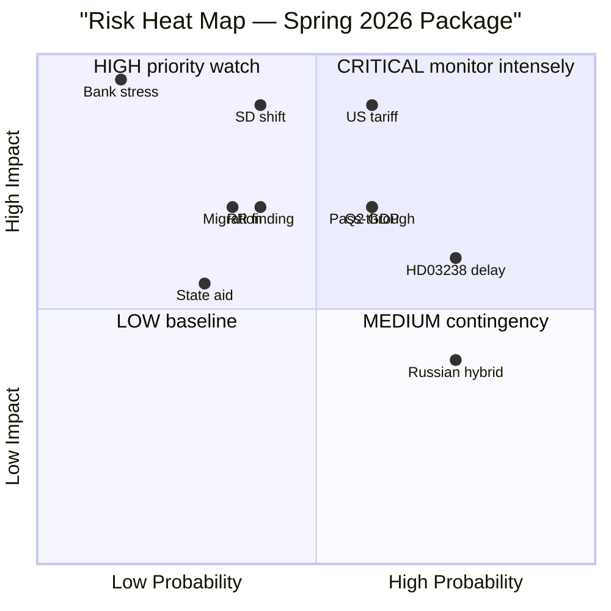

# Risk Assessment — Government Propositions — 2026-04-20

**Generated**: 2026-04-20 06:30 UTC  
**Framework**: `political-risk-methodology.md` v5.0 — Probability × Impact matrix, 10 risk dimensions  
**Confidence**: 🟩HIGH on structural risks; 🟧MEDIUM on forward-looking estimates  
**Democratic Health Score**: 🟡 MEDIUM (informed by Freedom House 2025: Sweden 93/100, stable democratic institutions under stress)

## Risk Methodology

Risks scored on:
- **Probability (P)**: 1–5 (1=very low, 5=very high)
- **Impact (I)**: 1–5 (1=negligible, 5=critical/regime-level)
- **Risk Score**: P × I (max 25)
- **Classification**: 🟢 LOW (1–6) / 🟡 MEDIUM (7–12) / 🟠 HIGH (13–18) / 🔴 CRITICAL (19–25)

## Risk Register

| # | Risk | Probability | Impact | Score | Classification | Timeline |
|---|------|-------------|--------|-------|----------------|----------|
| 1 | US tariff escalation damages Spring Bill credibility | 3 | 5 | 15 | 🟠 HIGH | Q2–Q3 2026 |
| 2 | HD03236 fuel tax cut fails to pass through at pump | 3 | 4 | 12 | 🟡 MEDIUM | Jul–Aug 2026 |
| 3 | SD coalition signal-shift during May budget debate | 2 | 5 | 10 | 🟡 MEDIUM | May–Jun 2026 |
| 4 | Q2 2026 GDP disappoints (< +0.4% QoQ) | 3 | 4 | 12 | 🟡 MEDIUM | Jul 2026 release |
| 5 | Riksrevisionen adverse finding (HD03241 follow-up) | 2 | 4 | 8 | 🟡 MEDIUM | Q3 2026 |
| 6 | EU DG Comp state-aid investigation on HD03239 | 2 | 3 | 6 | 🟢 LOW | Q4 2026 – 2027 |
| 7 | HD03238 agency implementation materially behind schedule | 4 | 3 | 12 | 🟡 MEDIUM | 2027–2028 |
| 8 | HD03237 police-training quality degradation | 2 | 3 | 6 | 🟢 LOW | 2027–2029 |
| 9 | Energy price spike (gas/electricity) overwhelms HD03236 | 2 | 4 | 8 | 🟡 MEDIUM | Q3 2026 winter |
| 10 | Swedish bank stress (commercial real estate) | 1 | 5 | 5 | 🟢 LOW (tail) | 2026 |
| 11 | Migration surge post-Ukraine ceasefire | 2 | 4 | 8 | 🟡 MEDIUM | 2026 |
| 12 | Russian hybrid/disinformation on HD03220 | 4 | 2 | 8 | 🟡 MEDIUM | 2026 |
| 13 | AI deepfake political event | 2 | 3 | 6 | 🟢 LOW | 2026 |
| 14 | Kristersson personal / leadership event | 1 | 5 | 5 | 🟢 LOW (tail) | 2026 |
| 15 | Climate event (flood/wildfire) disrupts political agenda | 2 | 3 | 6 | 🟢 LOW | Summer 2026 |

## Top Risks — Detailed Assessment

### Risk 1 — US Tariff Escalation (🟠 HIGH, 15)

**Probability**: 3 (Medium — trajectory under Trump administration is unpredictable; escalation scenarios plausible).

**Impact**: 5 (Critical — ~7% of Swedish GDP dependent on US-bound exports; key sectors SSAB, Sandvik, Volvo, SKF, AstraZeneca Sweden).

**Mechanism**: 
1. US tariffs on steel, machinery, or pharma reduce Swedish export orders.
2. Industrial investment suppression reduces Q2–Q3 2026 GDP growth.
3. Spring Bill projections lose credibility; opposition weaponises.
4. HD03236 fiscal space absorbed by macro support, reducing household relief.

**Mitigation**:
- Diplomatic outreach: Kristersson + Dousa bilateral with US commerce/trade reps.
- EU coordinated response — Swedish position within EU trade negotiations.
- Public communication: resilience narrative, not panic.

**Indicators to monitor**: Volvo, SSAB, Sandvik Q1 2026 guidance; US trade policy developments.

### Risk 2 — HD03236 Pass-Through Failure (🟡 MEDIUM, 12)

**Probability**: 3 (Medium — based on historical Swedish tax pass-through of 60–75%, not promised 85%).

**Impact**: 4 (Major — if pump price insufficiently drops, flagship electoral measure loses political return).

**Mechanism**:
1. Petroleum retailers (Preem, Circle K, OKQ8) absorb part of tax cut into margins.
2. Media coverage highlights "tankens pris oförändrat trots sänkt skatt" within 4 weeks.
3. Segment 1 (rural drivers) feels less visible relief than promised.
4. Opposition amplifies: "Svantesson lovade, bolagen tog pengarna."

**Mitigation**:
- Konsumentverket pre-commits to weekly pump-price tracking.
- Drivmedelsinspektionen monitors compliance.
- Government coordinates with SPBI (industry body) on transparent pass-through.

**Indicators**: Weekly pump prices vs. baseline (Drivmedelsinspektionen data).

### Risk 3 — SD Coalition Signal-Shift (🟡 MEDIUM, 10)

**Probability**: 2 (Low-Medium — SD's stated strategic posture remains coalition-supportive, but polling stagnation creates internal pressure).

**Impact**: 5 (Critical — coalition collapse triggers snap-election or government-formation crisis before September).

**Mechanism** (per `devils-advocate.md` Red Team Challenge 2):
1. Q2 polling stagnation intensifies internal SD debate.
2. Youth wing + Jomshof/Nordin faction pressure for more aggressive positioning.
3. Åkesson demands additional concessions (immigration/criminal-code) during May budget debate.
4. Kristersson faces choice: concede (risking L threshold concern) or refuse (risking SD signal-shift).

**Mitigation**:
- Kristersson's office maintains continuous SD relationship management.
- Pre-negotiated concession menu for May budget vote.
- Alternative emergency coalition arithmetic (C + L + M + KD) explored quietly.

**Indicators**: Åkesson rhetoric in May 2026 media appearances; SD youth-wing social media signals; polling delta.

### Risk 4 — Q2 2026 GDP Disappointment (🟡 MEDIUM, 12)

**Probability**: 3 (Medium — Q1 2026 SCB preliminary suggests modest recovery but below Spring Bill implied trajectory).

**Impact**: 4 (Major — validates entire opposition economic-competence critique; raises doubts about Spring Bill forecasts).

**Mechanism**:
1. SCB Q2 2026 flash (released mid-July) shows < +0.4% QoQ.
2. Konjunkturinstitutet follow-up confirms below-Spring-Bill-projection.
3. DN + SvD business pages amplify gap.
4. Andersson's "växer sämre än grannarna" narrative becomes factually validated.

**Mitigation**:
- Pre-emptive narrative management: Svantesson frames 2026 as "transition year" not "recovery year" if needed.
- Employment data emphasis if GDP soft.
- Investment-announcement management from energy cluster.

**Indicators**: Q1 2026 SCB flash (April 29); Konjunkturbarometern readings.

### Risk 5 — Riksrevisionen Critical Finding (🟡 MEDIUM, 8)

**Probability**: 2 (Low-Medium — RR has flagged fiscal-framework concerns; follow-up depth uncertain).

**Impact**: 4 (Major — institutional voice with cross-bloc credibility).

**Mechanism**:
1. RR issues supplementary finding on fiscal-framework compliance.
2. Committee invites auditor-general for testimony.
3. DN + SVT amplifies institutional critique.
4. Government forced to respond with compliance adjustments.

**Mitigation**:
- Pro-active engagement with RR on HD03241 response (already initiated).
- Finance ministry staff coordination with ESV on fiscal projections.

### Risk 7 — HD03238 Agency Implementation Delay (🟡 MEDIUM, 12)

**Probability**: 4 (High — agency standup historically takes 24+ months; political timeline ambitious).

**Impact**: 3 (Moderate — "legislated but not delivered" critique but not regime-level).

**Mechanism**:
1. Premises procurement + IT systems take 18+ months.
2. Staffing (200 specialists) requires 2-year ramp.
3. 2027 "operational" claim meets reality check by late 2027.
4. Opposition frames as "Empty permit agency" throughout 2027 campaign cycle.

**Mitigation**:
- Aggressive project management; possible interim director by Q3 2026.
- Phased staffing with visible milestones.
- Temporary case-routing via existing Länsstyrelser.

**Indicators**: Regeringsbeslut on GD appointment; IT procurement notices; staff headcount quarterly reports.

## Secondary Risks

### Energy Price Spike (🟡 MEDIUM, 8)

Natural gas or electricity prices spiking 20%+ in Q3 2026 could overwhelm HD03236 budget. Trigger events: Russia-Ukraine ceasefire breakdown, LNG market tightening, Nord Stream 2 incidents. Legislation likely caps total support — inadequate support equals 2022 crisis repeat.

### Migration Surge Post-Ukraine Ceasefire (🟡 MEDIUM, 8)

If Ukraine ceasefire delivers short-term migration wave to Northern/Central Europe, SD demands immigration-code tightening — testing coalition flexibility and displacing package-narrative media oxygen.

### Russian Hybrid/Disinformation (🟡 MEDIUM, 8)

Per `threat-analysis.md`, SÄPO and MSB anticipate coordinated inauthentic behaviour on Facebook + X targeting HD03220 NATO narrative and HD03236 economic-grievance frame. Impact limited by Swedish media literacy and MPF counter-narrative capacity.

### Swedish Bank Stress (🟢 LOW tail, 5)

Swedbank and SEB commercial real estate exposure. Tail risk but potentially severe if materialises.

## Tail Risks (Low Probability, High Impact)

| Risk | P | I | Notes |
|------|---|---|-------|
| Kristersson health/legal event | 1 | 5 | No publicly-known succession plan |
| Major Russian kinetic escalation affecting Baltic | 1 | 5 | Would reframe entire campaign |
| Sweden-specific hybrid attack (cyber on critical infrastructure) | 2 | 4 | Would benefit incumbent |
| AI deepfake political event affecting Swedish campaign | 2 | 3 | No regulatory framework ready |

## Risk Heat Map

## Risk Response Strategy

### Immediate (April–May 2026)

1. **US tariff**: Kristersson-Trump outreach via EU Commission liaison; Swedish-specific sector reassurance messaging.
2. **SD signal-shift**: Maintain continuous back-channel; pre-position May budget concession menu.
3. **Pass-through**: Konsumentverket pre-committed weekly tracking.

### Near-term (June–August 2026)

1. **Q2 GDP**: Narrative management for any outcome; emphasis on employment if GDP soft.
2. **RR finding**: Finance ministry coordination with RR technical staff.
3. **Migration**: SD-channel commitments; EU-level refugee coordination.

### Medium-term (September 2026 – 2028)

1. **HD03238 delivery**: Milestone visibility management.
2. **State aid**: Pre-notification to DG Comp Q3 2026.
3. **Police quality**: Polismyndigheten selection-standards communication.

## Democratic Health Considerations

Swedish democratic institutions remain robust per Freedom House 2025 score 93/100. The Spring 2026 Package does not raise democratic-health flags:

- **Separation of powers**: Riksrevisionen + KU scrutiny intact.
- **Rule of law**: HD03237 + HD03246 operate within existing constitutional framework.
- **Media freedom**: Swedish media ecosystem remains plural and adversarial.
- **Electoral integrity**: No package element affects electoral procedure.

Concerns elevate to 🟡 MEDIUM (not 🟢 LOW) primarily because of:

1. **Coalition dependence on SD** — no constitutional issue but fragility of governance.
2. **Fiscal projection contestation** — healthy debate but under tight electoral pressure.
3. **Information operations vulnerability** — Russian/state-sponsored disinformation targets.
4. **Short-term electoral optimisation** — package reflects electoral-cycle dynamics that characterise all Swedish pre-election periods.

Compare to global reference: Hungary 65, Poland 82, France 87, Denmark 97. Sweden remains among strongest democracies but 2024 Freedom House commentary flagged "hybrid threats" category.

## Aggregate Risk Assessment

**Portfolio risk rating**: 🟡 MEDIUM  
**Coalition continuity outlook**: 🟧 MEDIUM (retention ~35–40%)  
**Package delivery outlook**: 🟨 MODERATE CONFIDENCE (~78%)  
**Electoral cycle risk**: 🟠 HIGH (contested election with tight arithmetic)

## Indicators-to-Watch Priority

Top 5 leading indicators that would materially shift risk posture:

1. **SD rhetoric intensity** in May 2026 media appearances (coalition stability).
2. **Q2 2026 GDP flash** (fiscal credibility).
3. **Fuel pass-through percentage** at pump (Jul–Aug 2026).
4. **Polismyndigheten facility investment decisions** (HD03237 on-schedule signal).
5. **US tariff developments** affecting Swedish manufacturers.

All five should be re-evaluated monthly throughout April–September 2026.
