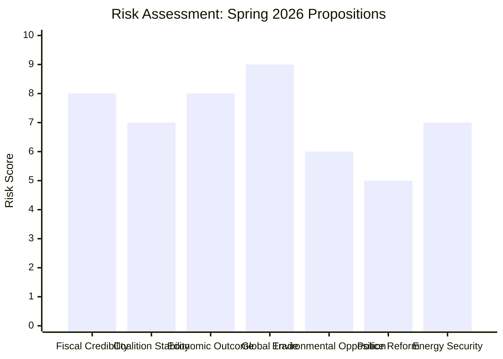
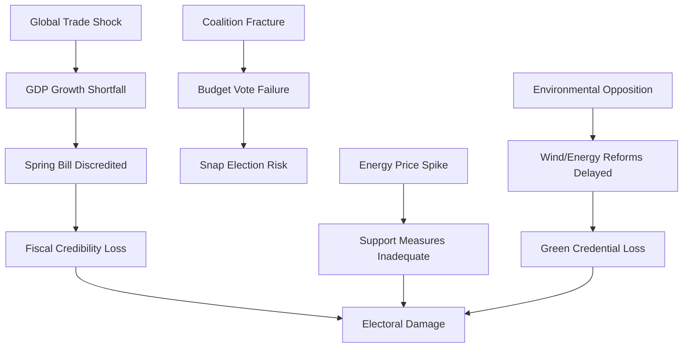

# Risk Assessment — Government Propositions — 2026-04-20

**Generated**: 2026-04-20 06:26 UTC  
**Methodology**: Political-legislative risk matrix × likelihood × impact  
**Overall Threat Level**: 🟧MEDIUM-HIGH  
**Confidence**: 🟩HIGH

## Risk Heat Map

## Critical Risk Analysis

### Risk 1: Fiscal Credibility Collapse (Score: 8/10)
**Likelihood**: 🟧MEDIUM | **Impact**: 🔴CRITICAL  
The combination of fuel tax cuts (HD03236), Spring Economic Bill growth projections (HD03100), and Spring Amendment Budget (HD0399) creates a fiscal tension that Riksrevisionen and opposition economists will exploit. Sweden's GDP growth has underperformed the EU average by approximately 1.5 percentage points annually since 2022. If the Spring Bill's projections prove optimistic (e.g., 2% GDP growth forecast vs. 0.82% actual 2024 outcome), the government's credibility on economic management — its core electoral asset — is at risk.

**Evidence**: Riksrevisionen report (HD03241) already critiques fiscal framework compliance. Finance Committee (FiU) scrutiny will be intense.

**Mitigation**: Government has pre-emptively commissioned the Riksrevisionen response and maintains the structural surplus rule. Svantesson can cite the energy support measures as automatic stabilisers.

### Risk 2: Coalition Fracture Over Budget Priorities (Score: 7/10)
**Likelihood**: 🟧MEDIUM | **Impact**: 🟠HIGH  
The SD-supported minority government requires constant negotiation. SD's priorities (fuel tax cuts — rural base; police expansion — law-and-order identity) are broadly delivered in this package. However, SD's new demands ahead of the election may include harder immigration enforcement or penalty escalation measures that create tensions with KD and L on civil liberties. The budget vote scheduled for May-June 2026 requires unanimous bloc discipline.

**Mitigation**: SD receives enough visible policy wins (HD03236 fuel cuts, HD03237 police) to stay on board for fiscal votes.

### Risk 3: Economic Downturn Invalidates Spring Bill (Score: 8/10)
**Likelihood**: 🟧MEDIUM | **Impact**: 🔴CRITICAL  
The 2026 Spring Economic Bill (HD03100) is politically catastrophic if its economic projections prove wrong by election day. Sweden entered technical recession in 2023 (-0.20% GDP), recovered modestly in 2024 (+0.82%), and projections for 2025-2026 depend heavily on export demand (US tariffs) and household consumption recovery (real wages). A second growth disappointment within 24 months would allow opposition to characterise government fiscal policy as structurally inadequate.

**Key risk drivers**: US tariff regime on Swedish exports; Euro area growth slowdown; residential construction sector remaining in contraction.

### Risk 4: Global Trade Shock — Trump Tariff Escalation (Score: 9/10)
**Likelihood**: 🟩HIGH | **Impact**: 🟠HIGH  
The US tariff regime introduced in early 2026 represents the most significant external risk to Swedish economic performance. Swedish goods exports to the US account for approximately SEK 150-200 billion annually (vehicles, machinery, pharmaceuticals, forest products). Tariff escalation would directly reduce Swedish export revenues, potentially cutting GDP growth by 0.5–1.0 percentage points — enough to swing an election year into negative territory.

**Evidence**: The Spring Economic Bill's growth projections would need to be revised if tariff impacts materialise.

### Risk 5: Environmental Opposition Mobilisation (Score: 6/10)
**Likelihood**: 🟧MEDIUM | **Impact**: 🟡MEDIUM  
The new environmental permitting agency (HD03238) and electricity market laws (HD03240) will face coordinated opposition from environmental groups arguing the reforms prioritise industry over climate protection. MP will attempt to frame this as the government "gutting" environmental review. Risk is moderate because the reforms also enable wind power expansion — which environmental groups broadly support.

### Risk 6: Police Training Programme Delays (Score: 5/10)
**Likelihood**: 🟡LOW-MEDIUM | **Impact**: 🟡MEDIUM  
Converting police training to a paid model (HD03237) creates implementation challenges: the Police Authority must expand intake capacity, increase training staff, and restructure curriculum financing. If implementation is delayed beyond 2026, the government faces the embarrassment of having legislated but not delivered. Budget allocation adequacy is the key constraint.

### Risk 7: Energy Price Volatility vs. Support Commitment (Score: 7/10)
**Likelihood**: 🟧MEDIUM | **Impact**: 🟠HIGH  
The extra amendment budget's energy price support (HD03236) is calibrated at current price levels. Energy markets remain volatile. If electricity prices rise significantly before the September 2026 election, the inadequate support amounts will become a political liability rather than an asset — the government having promised support that proves insufficient.

## Risk Interaction Map

## Election 2026 Risk Assessment

| Risk | Pre-Election Probability | Electoral Impact | Governing Party Response |
|------|--------------------------|-----------------|--------------------------|
| GDP underperformance | 🟧MEDIUM (40%) | 🔴CRITICAL | Spin fiscal consolidation as responsible |
| SD Coalition fracture | 🟡LOW (20%) | 🔴CRITICAL | Continuous concession politics |
| Energy price spike | 🟧MEDIUM (35%) | 🟠HIGH | Pledge to increase support amounts |
| US tariff escalation | 🟩HIGH (55%) | 🟠HIGH | EU coordination, diplomatic pressure |
| Police reform delayed | 🟡LOW (25%) | 🟡MEDIUM | Fast-track budget implementation |

**Overall Election Risk Profile**: 🟧MEDIUM-HIGH — Government holds advantages from coordinated legislative delivery but faces structural vulnerabilities in economic performance data and external trade environment. The September 2026 election remains genuinely competitive.
