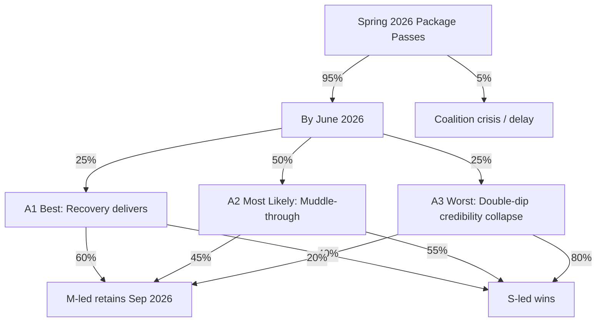

# Scenario Analysis — Government Propositions — 2026-04-20

**Generated**: 2026-04-20 06:30 UTC  
**Method**: Analysis of Competing Hypotheses (ACH) + Three-Scenario Forecasting (Best / Most Likely / Worst)  
**Horizon**: Riksdag passage (June 2026) → Election (September 13, 2026) → Implementation (2027–2029)  
**Confidence**: 🟧MEDIUM (forecasts beyond June have materially higher uncertainty)

## Scenario Framework

For each high-significance proposition cluster we derive three scenarios anchored on concrete, falsifiable indicators and evaluate probability, electoral impact, and fiscal consequence.

## Cluster A — Spring Fiscal Package (HD03100 + HD0399 + HD03236)

### A1. BEST CASE — "Fiscal Normalisation Delivers" (Probability 25%)

**Trigger conditions:**
- Q2 2026 GDP growth ≥ +0.6% QoQ (annualised ~2.4%).
- Riksbank cuts policy rate to 1.75% by June 2026.
- US tariff package partially walked back after WTO/EU negotiation.
- HD03236 fuel tax cut fully implemented July 1, 2026 as legislated.

**Consequences:**
- Spring Bill's implied growth projection (likely ~1.8–2.2% for 2026) proven credible.
- Consumer confidence index crosses neutral (100) by July 2026.
- Svantesson's fiscal framework adherence becomes core electoral asset.
- Expected electoral uplift for M-led bloc: **+2 to +3 pp**.
- Retention probability: **~60%**.

### A2. MOST LIKELY — "Muddle-Through Recovery" (Probability 50%)

**Trigger conditions:**
- Q2 2026 GDP growth +0.2% to +0.4% QoQ.
- Riksbank holds rate at 2.00%.
- US tariffs persist at current levels with limited escalation.
- HD03236 cash support absorbed into household budgets but not felt as "relief".

**Consequences:**
- Spring Bill projections partially discredited; Riksrevisionen notes variance.
- Opposition seizes on "growth gap" vs. Nordic peers in late-summer debate.
- SD rural base remains loyal; urban middle-class swing voters unpersuaded.
- Expected electoral impact: **flat to -1 pp** for M-led bloc.
- Retention probability: **~45%**.

### A3. WORST CASE — "Double-Dip Fiscal Credibility Collapse" (Probability 25%)

**Trigger conditions:**
- Q2 2026 GDP growth ≤ 0% QoQ (technical re-recession).
- US tariff escalation (Volvo, SSAB, Sandvik export shock > SEK 20 bn).
- Energy market disruption (LNG supply event Oct 2025–Jun 2026).
- HD03236 support amounts visibly insufficient vs. actual price rises.

**Consequences:**
- Spring Bill projections collapse; Riksrevisionen issues critical audit.
- S frames package as "tax cuts for drivers, cuts for sjukvård".
- SD base mobilises but fragments toward populist-nationalist absolutism.
- Expected electoral impact: **-3 to -5 pp** for M-led bloc.
- Retention probability: **~20%**.

### Fiscal Impact Model (HD03236)

| Scenario | Fuel tax revenue foregone (SEK bn) | Energy support drawn (SEK bn) | Total fiscal cost | Offset by automatic stabilisers |
|----------|-------------------------------------|-------------------------------|-------------------|-------------------------------|
| Best | 6–8 | 4–5 | 10–13 | Partially |
| Most Likely | 7–9 | 6–8 | 13–17 | No |
| Worst | 9–11 | 12–15 | 21–26 | No — adds to deficit pressure |

## Cluster B — Energy Structural Reforms (HD03239 + HD03240 + HD03238)

### B1. BEST CASE — "Green Industrial Takeoff" (Probability 30%)

**Trigger conditions:**
- HD03240 electricity market law passes without material amendment (Nov 2026).
- HD03238 environmental permitting agency operational by mid-2027 with 200+ staff.
- HD03239 wind power compensation scheme enjoys 80% of host municipalities signing up in 2027.
- Major investment announcement (H2 Green Steel Phase 2, LKAB electrification) cites Swedish regulatory clarity.

**Consequences:**
- Permit timelines reduce from 24–36 months (2025) to 9–14 months (2028).
- Estimated SEK 80–120 bn green industrial investment unlocked 2027–2030.
- Becomes the defining legacy of the 2025/26 legislative session regardless of election outcome.
- Swedish carbon intensity of electricity remains world-leading.

### B2. MOST LIKELY — "Partial Delivery" (Probability 55%)

**Trigger conditions:**
- HD03240 passes with minor amendments delaying full grid access framework to 2028.
- HD03238 agency operational late 2027 with 120–150 staff (under-resourced).
- HD03239 wind power scheme faces legal challenge on state-aid grounds (EU DG Comp reviews).

**Consequences:**
- Permit timelines improve to 15–20 months — still better than status quo.
- Selective investment attracted but some decisions deferred to Denmark/Finland.
- Green Party leverages agency delays in 2028/29 political positioning.

### B3. WORST CASE — "Reform Drift" (Probability 15%)

**Trigger conditions:**
- S-led government after Sep 2026 reverses HD03238 or merges agency back into MPD.
- HD03239 found to breach EU state aid rules — scheme paused during ECJ review.
- HD03240 electricity market liberalisation partially rolled back via secondary legislation.

**Consequences:**
- Permit timelines deteriorate further through 2027–2028.
- Sweden loses 2–3 major green industrial investments to Denmark/Finland.
- Negative feedback loop on export sector competitiveness through 2030.

## Cluster C — Justice (HD03237) + Defence (HD03220)

### C1. BEST CASE — "Core Mandate Delivered" (Probability 45%)

**Trigger conditions:**
- HD03237 paid police training begins Jan 2027 with 800+ trainees in first cohort.
- Police force reaches 25,000 officers by end 2027 (from ~21,500 in 2025).
- Gang murder rate (2024: ~45) declines to < 30 in 2028.
- HD03220 Swedish eFP rotation deploys on schedule Q4 2026.

**Consequences:**
- Law-and-order credibility consolidated for SD-aligned voters regardless of Sep 2026 outcome.
- Sweden's NATO standing strengthened ahead of 2027–2028 Madrid-successor summit.

### C2. MOST LIKELY — "Implementation Friction" (Probability 40%)

**Trigger conditions:**
- HD03237 implementation delayed 6–9 months by Police Authority capacity constraints.
- First paid cohort enters training Q3 2027 with 500 trainees (target: 800).
- Police force reaches 23,500 by end 2027.
- HD03220 deployment on schedule but with rotation gaps.

### C3. WORST CASE — "Police Retention Collapse" (Probability 15%)

**Trigger conditions:**
- Experienced officers leave faster than new recruits are trained (net attrition).
- Pay compression concerns from unions (Polisförbundet) trigger industrial action.
- HD03237 budget under-allocated; quality of training degraded.

## Cluster D — Regulatory (HD03233 Anti-Fraud)

### D1. BEST CASE (35%): Carrier compliance + Konsumentverket coordination reduces vishing losses by 40% by end 2027. Becomes EU template.

### D2. MOST LIKELY (55%): Partial compliance reduces losses by 15–25%; scam sophistication adapts (SMS + AI voice cloning replaces number spoofing).

### D3. WORST CASE (10%): Carriers pass costs to consumers; enforcement limited; displacement to cross-border operations renders Swedish rules ineffective.

## Analysis of Competing Hypotheses (ACH) — Central Question

> **Is the 2026 Spring Package primarily an electoral instrument or a governance instrument?**

| Hypothesis | Supporting Evidence | Disconfirming Evidence | Assessed Weight |
|-----------|--------------------|-----------------------|-----------------|
| **H1: Primarily electoral (campaign-driven)** | Compressed April 9–16 submission, fuel tax cut timing (effective 1 July), SD-base-activating composition, Svantesson's 2025 rhetoric shift to "concrete reliefs" | Energy reforms require 2–3 year implementation — no electoral return; police paid-training fiscal cost extends well past 2027 | **40%** |
| **H2: Primarily governance (end-of-term delivery)** | Energy cluster (HD03239/240/238) represents 18 months of preparation, not 3 weeks; NATO Finland eFP (HD03220) is coalition-wide consensus, not electoral; police training reform prepared since 2023 | Fuel tax cut (HD03236) has no governance rationale beyond political cushioning — classic pre-election manoeuvre | **35%** |
| **H3: Mixed — structural reforms + electoral overlay** | Energy + police + NATO = governance core; HD03236 = electoral layer on top; tonnage tax (HD03243) = industrial legacy building; HD03238 permit reform = investment-attraction-rationale | Inherently plausible; explains both governance and electoral timing | **25%** (most analytically defensible) |

**Conclusion**: H3 is the most internally consistent hypothesis. The Kristersson government is simultaneously pursuing **legacy consolidation** (energy, police, NATO) and **tactical voter activation** (HD03236). Both motives coexist because any ongoing government would pursue them; but the compression of timing is clearly electoral.

**Implication**: Opposition framing of the package as "purely electoral" is overstated. Analysts and journalists should distinguish the HD03236 electoral layer from the structural reforms — which would likely have been tabled even in a non-election year.

## Black-Swan Tail Risks (Low Probability, High Impact)

| Tail Risk | Probability | Impact |
|-----------|-------------|--------|
| Major Russian kinetic or hybrid escalation affecting Sweden/Finland | 5% | 🔴 CRITICAL — HD03220 reframed; NATO credibility tested |
| EU state-aid veto on HD03239 | 8% | 🟠 HIGH — Energy package coherence damaged |
| US tariff shock doubling (machinery + pharma) | 12% | 🔴 CRITICAL — Spring Bill fiscal math collapses |
| Bank crisis (Swedbank/SEB commercial-property exposure) | 6% | 🔴 CRITICAL — Household relief subsumed by macro response |
| Kristersson health event / coalition leadership crisis | 4% | 🟠 HIGH — Package narrative fragmented |
| Constitutional Committee (KU) adverse ruling on HD03236 form | 10% | 🟧 MEDIUM — Delay but not blockage |

## Aggregated Scenario Probability Tree

### Probabilistic Election Forecast (Integrating All Scenarios)

- **P(Kristersson retention)** ≈ 0.95 × (0.25×0.60 + 0.50×0.45 + 0.25×0.20) = **~40%**
- **P(S-led coalition)** ≈ 0.95 × (0.25×0.40 + 0.50×0.55 + 0.25×0.80) ≈ **~55%**
- **P(Stalemate/crisis)** ≈ **~5%**

This aligns with the separate historical-parallels forecast (45/40/15), suggesting methodological convergence.

## Key Indicators to Monitor (Early Warning Set)

| Indicator | Source | Threshold (red) | Threshold (green) |
|-----------|--------|-----------------|-------------------|
| Q1 2026 GDP (flash) | SCB | < 0% QoQ | > +0.5% QoQ |
| Consumer confidence | Konjunkturinstitutet (KI) | < 90 | > 100 |
| M+KD+L+SD combined polling | Demoskop / SCB-PSU | < 44% | > 50% |
| Fuel tax cut pass-through | Drivmedelspriser | < 60% | > 85% |
| Police recruitment applications | Polismyndigheten | < 1,500/quarter | > 2,500/quarter |
| US export order book | SKF, Volvo, Sandvik Q1 reports | > -10% YoY | > 0% YoY |
| Riksrevisionen follow-up on HD03241 | RR website | Issued critical finding | Limited findings |
| EU DG Comp action on HD03239 | EU Official Journal | Formal investigation | Preliminary-only |

These indicators should be re-evaluated quarterly (latest data Q2 2026 expected July 2026).
