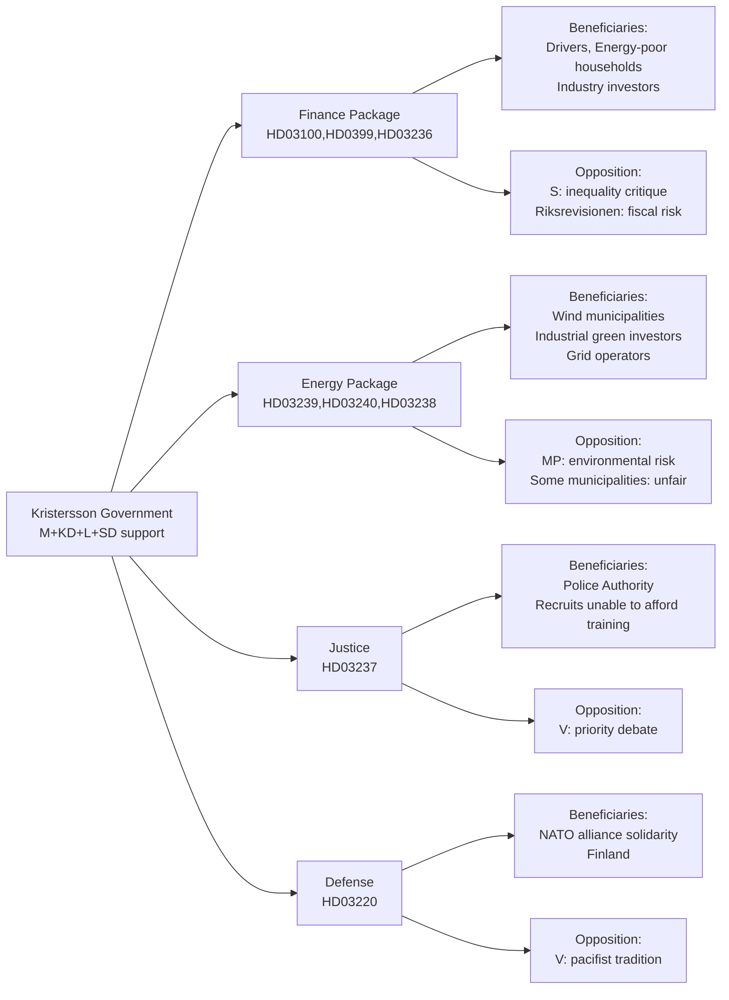

# Stakeholder Perspectives — Government Propositions — 2026-04-20

**Generated**: 2026-04-20 06:28 UTC  
**Analysis Depth**: Deep (7 stakeholder perspectives)  
**Confidence**: 🟩HIGH

## Stakeholder Landscape Map

## Detailed Stakeholder Analysis

### Stakeholder 1: Finance Minister Elisabeth Svantesson (M) — Spring Fiscal Package
**Political Position**: Architect of the Spring Economic Bill (HD03100) and amendment budgets  
**Primary Interests**: Demonstrating fiscal competence, growth narrative, deficit control  
**Impact Assessment**: 🟩HIGH positive for electoral positioning  
**Key Concerns**:
- The GDP growth of 0.82% in 2024 is below internal projections. Svantesson must project optimism without overpromising.
- Riksrevisionen (HD03241) scrutiny places fiscal framework compliance under public review.
- The extra amendment budget (HD03236) with fuel tax cuts will be criticised as election spending by fiscal watchdogs.

**Expected Actions**: Svantesson will present the Spring Bill as evidence of responsible management — lower inflation from peak levels, declining interest rates, and improving household purchasing power. She will defend fuel tax cuts as automatic stabilisers rather than electoral largesse.

**Quote Pattern**: "Sweden has a strong fiscal framework precisely because we have maintained discipline even when it was politically difficult."

---

### Stakeholder 2: Justice Minister Gunnar Strömmer (M) — Police Training
**Political Position**: Delivers on government's signature law-and-order mandate  
**Primary Interests**: Police workforce expansion, criminal gang enforcement, electoral credit  
**Impact Assessment**: 🟩HIGH positive — delivers SD coalition priority  
**Key Concerns**:
- Police Authority implementation capacity: converting to paid training requires budget allocation that may not be fully realised before 2026.
- Swedish police remain over 5,000 officers below the 2025 target of 27,000.

**Expected Actions**: Strömmer will announce full implementation timeline with application to paid training starting 2026/27. He will highlight case studies of qualified candidates previously deterred by unpaid training costs.

---

### Stakeholder 3: Sweden Democrats (Jimmie Åkesson/Richard Jomshof)
**Political Position**: Confidence-and-supply partner; primary beneficiary of HD03236 and HD03237  
**Primary Interests**: Rural voter cost-of-living; law-and-order credential maintenance  
**Impact Assessment**: 🟩HIGH positive — both core voter promises delivered  
**Key Concerns**:
- Must claim sufficient credit for fuel tax cuts without appearing as a passive support party.
- Energy support and police expansion play directly to rural and suburban SD voter base.
- SD will push for harder criminal sentencing alongside HD03237 to maintain its distinct identity.

**Expected Actions**: Åkesson will frame both measures as SD's achievement — "We made the government deliver." Internal messaging will emphasise SD's indispensability.

---

### Stakeholder 4: Social Democrats (Magdalena Andersson / Mikael Damberg)
**Political Position**: Main opposition; seeking alternative economic narrative  
**Primary Interests**: GDP weakness critique, inequality argument, healthcare/welfare investment  
**Impact Assessment**: 🟡MIXED — visible government delivery is a challenge, but economic data provides ammunition  
**Key Concerns**:
- Government tabling 9 propositions in 3 weeks makes opposition seem reactive.
- Spring Economic Bill GDP projections will be scrutinised against Denmark/Norway performance.
- Fuel tax cuts are regressive (benefit vehicle owners disproportionately) — classic S argument.

**Expected Actions**: Andersson will argue that fuel tax cuts primarily benefit higher-income car owners while public transport and healthcare face budget pressure. S will present alternative spending priorities focused on nurses, teachers, and welfare systems. The parliamentary debate will centre on distributional effects of the fiscal package.

---

### Stakeholder 5: Green Party (Romina Pourmokhtari / new leadership)
**Political Position**: Environmental oversight role; supports energy transition but critical of process  
**Primary Interests**: Environmental protection, climate ambition, municipal wind acceptance  
**Impact Assessment**: 🟡MIXED — wind power expansion positive; environmental agency reform negative  
**Key Concerns**:
- New environmental permitting agency (HD03238) may prioritise speed over thoroughness, weakening protections.
- Wind power revenue-sharing (HD03239) helps local acceptance but formula may not adequately compensate affected residents.
- Climate commitments must be maintained through energy transition legislation.

**Expected Actions**: MP will demand strengthening amendments on the environmental permitting framework. In committee (MJU), they will propose specific protections to prevent industry regulatory capture of the new agency.

---

### Stakeholder 6: Confederation of Swedish Enterprise (Svenskt Näringsliv) & Teknikföretagen
**Political Position**: Business advocacy; supportive of deregulation and energy reform  
**Primary Interests**: Environmental permitting speed, electricity market clarity, trade barrier removal  
**Impact Assessment**: 🟩HIGH positive — energy and environmental reforms broadly welcomed  
**Key Concerns**:
- New environmental agency (HD03238) must genuinely streamline permits, not create additional bureaucracy.
- Electricity market laws (HD03240) must not increase costs for energy-intensive industries.
- US tariff environment threatens export sector regardless of domestic policy improvements.

**Expected Actions**: Teknikföretagen will engage in the parliamentary consultation on HD03238 to ensure industrial interests are embedded in the agency's mandate. They will publish modelling showing how permit streamlining reduces investment timelines.

---

### Stakeholder 7: Municipal Association (SKR — Sveriges Kommuner och Regioner)
**Political Position**: Collective voice of 290 municipalities; primary stakeholder for HD03239  
**Primary Interests**: Revenue adequacy, fiscal autonomy, infrastructure investment capacity  
**Impact Assessment**: 🟧MEDIUM positive — wind power revenue helpful for energy municipalities, but inequitable  
**Key Concerns**:
- Revenue-sharing formula (HD03239) creates winners and losers among municipalities.
- Urban municipalities cannot host wind power and receive no share of the new revenue stream.
- New environmental permitting agency (HD03238) may transfer municipal review powers to central authority.

**Expected Actions**: SKR will demand a national solidarity mechanism to redistribute a portion of wind power revenues to non-hosting municipalities. They will lobby the Finance Committee for municipal general grants to compensate non-hosting communities.

