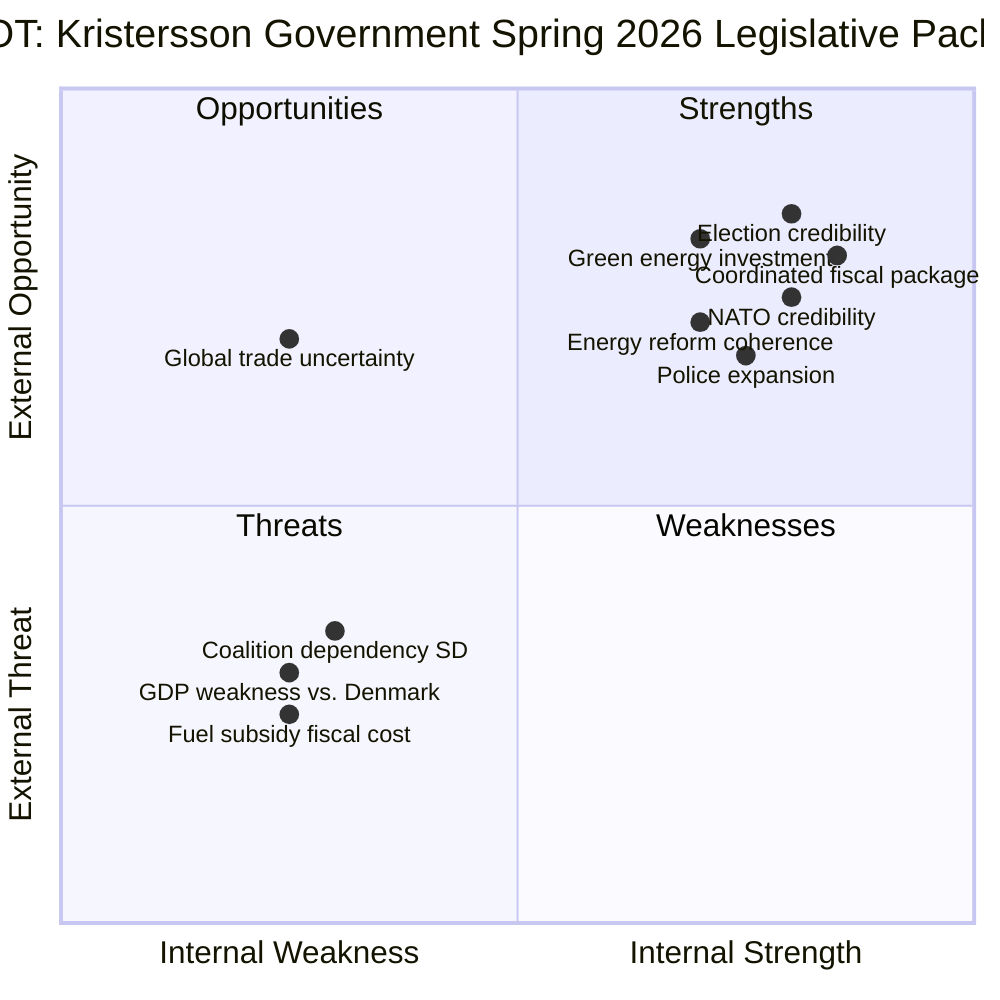

# SWOT Analysis — Government Propositions — 2026-04-20

**Generated**: 2026-04-20 06:25 UTC  
**Analysis Depth**: Deep (5+ stakeholder perspectives per quadrant)  
**Focus Propositions**: HD03100, HD0399, HD03236, HD03239, HD03240, HD03237  
**Confidence**: 🟩HIGH

## Overall SWOT Matrix

## Detailed SWOT Analysis

### 💪 STRENGTHS

**1. Pre-election Legislative Coherence**  
The government has tabled 9 significant propositions covering fiscal policy, energy, policing, defense, and digital security in a compressed 3-week window (April 9–16). This concentrated burst signals organized legislative capacity and allows the government to campaign on a complete delivery record. Finance Minister Svantesson's Spring Economic Bill and the accompanying amendment budgets present a unified fiscal narrative.

**2. Cost-of-Living Political Optics (HD03236)**  
The extra amendment budget cutting fuel taxes and providing energy bill support directly addresses Sweden's most potent voter concern since 2022. Households paying 15–25% more for energy and transport than in 2020 will feel the targeted relief. Niklas Wykman (KD, Financial Markets Minister) championed this measure with strong coalition backing.

**3. Law-and-Order Mandate Delivery (HD03237)**  
Justice Minister Gunnar Strömmer has delivered on the government's flagship commitment: police expansion. Converting police training to a paid model removes the financial deterrent that prevented thousands of qualified applicants. This follows raised starting salaries and expanded training academies — a coherent multi-year programme.

**4. NATO Integration Leadership (HD03220)**  
Sweden's contribution to Finland's Enhanced Forward Presence demonstrates that NATO accession has translated into concrete military commitments. PM Kristersson uses this to argue Sweden is a net security contributor, not merely a beneficiary of collective defense.

**5. Energy Transition Infrastructure (HD03239, HD03240)**  
The twin energy bills create the legal foundations for Sweden's decarbonization. Revenue-sharing for municipalities hosting wind turbines solves the long-standing NIMBY problem, while new electricity market laws address transmission pricing and grid access critical for industrial electrification. Minister Johan Britz has constructed a logically coherent reform package.

### ⚠️ WEAKNESSES

**1. GDP Growth Deficit vs. Nordic Peers**  
Sweden's 2024 GDP growth of +0.82% compares unfavourably with Denmark (+3.48%) and Norway (+2.10%). The Spring Economic Bill projections must address this structural underperformance while the Riksdag Finance Committee (FiU) scrutinises deficit projections. Opposition parties (S, MP, V) will challenge whether government economic policies have exacerbated Sweden's competitive position.

**2. SD Coalition Dependency**  
Every proposition in this package requires Sweden Democrats support for passage. SD holds the government hostage on immigration and criminal justice issues, constraining Kristersson's reform space. The paid police training (HD03237) directly feeds SD's core voter promise, but SD can withdraw support on fiscal measures if their cultural agenda is not advanced in parallel.

**3. Fiscal Credibility Risk**  
Cutting fuel taxes while simultaneously presenting a Spring Economic Bill projecting fiscal consolidation creates a contradiction. The Riksrevisionen (National Audit Office) is already scrutinising the fiscal policy framework (see HD03241), and the extra amendment budget (HD03236) will draw criticism from economists as election-motivated redistribution.

**4. Municipal Wind Compensation Political Complexity (HD03239)**  
Revenue-sharing for wind turbine municipalities is broadly popular but creates inter-municipal equity concerns. Urban municipalities that cannot host wind power will receive nothing. Left-wing municipalities may oppose the specific compensation formula while demanding more direct climate investment.

**5. Environmental Agency Fragmentation Risk (HD03238)**  
Creating a new standalone environmental permitting agency fragments an already complex regulatory landscape. Industry lobbies (Teknikföretagen, Skogsindustrierna) fear the new body may become an additional bottleneck rather than a streamlining mechanism, potentially delaying industrial permits critical for the energy transition.

### 🌟 OPPORTUNITIES

**1. Election Mandate on Economic Competence**  
If GDP growth accelerates toward the Spring Economic Bill's projections by September 2026, the government can legitimately claim that its fiscal management — lower taxes, energy support, business deregulation — has delivered recovery. The contrast with S's 2022 record (high inflation, surging energy prices) is a potent electoral argument.

**2. Green Industrial Investment Leverage (HD03239, HD03240)**  
New electricity market laws and wind power expansion create conditions for attracting major industrial investments — particularly green hydrogen, battery manufacturing, and data centres requiring stable electricity supplies. H2 Green Steel, SSAB, Northvolt recovery, and LKAB electrification all depend on the regulatory clarity these propositions provide.

**3. EU Digital Single Market Alignment (HD03233)**  
New anti-fraud rules for electronic communications align Sweden with EU's Digital Markets Act and ePrivacy frameworks, positioning Sweden as a frontrunner in digital consumer protection. This offers diplomatic credit with EU partners.

**4. NATO Burden-Sharing Credibility (HD03220)**  
Sweden's contribution to Finland's eFP demonstrates alliance burden-sharing ahead of the June 2026 NATO Summit. PM Kristersson can use this as diplomatic capital to argue for Swedish seats on key NATO command structures.

**5. Environmental Permitting Reform as Industrial Policy (HD03238)**  
A streamlined environmental review agency — if well-designed — could reduce permit backlogs from the current 18–24 months to 6–12 months. This is transformative for industrial green investment and addresses a chronic competitive disadvantage versus Denmark and Norway.

### ⚡ THREATS

**1. Global Trade Uncertainty — Trump Tariffs**  
The US tariff regime introduced in early 2026 threatens Swedish exports (machinery, vehicles, paper products). The Spring Economic Bill's growth projections may prove optimistic if US-EU trade tensions escalate. Swedish businesses accounted for approximately 7% of GDP in US-bound exports — tariff uncertainty directly erodes investment confidence.

**2. Social Democratic Electoral Mobilisation**  
Opposition leader Magdalena Andersson (S) has been building a counter-narrative around wage inequality, healthcare waiting times, and school results. The government's fiscal package may be portrayed as tax cuts for drivers while social services deteriorate — a potent frame for S's trade union coalition.

**3. Energy Price Volatility Undermines Support Claims**  
Energy bill support (HD03236) is calculated on current price levels. If global gas prices spike (Russia-Ukraine ceasefire breakdown, LNG market tightening), the budgeted support amounts may prove insufficient, and the government will face political pressure to increase payments at additional fiscal cost.

**4. Riksrevisionen Criticism (HD03241)**  
The government's own response to the Riksrevisionen report on the fiscal policy framework reveals vulnerabilities in deficit management. If the audit body issues critical findings about the government's adherence to fiscal rules, it undermines the economic competence narrative.

**5. Environmental Opposition to Agency Restructuring**  
Green Party (MP) and Left Party (V) will portray the new environmental permitting agency (HD03238) as a deregulation measure that weakens environmental protection under a pro-industry government. This frames the coalition as sacrificing climate commitments for short-term growth.

## Stakeholder SWOT Perspectives

### Perspective 1: Finance Ministry (Svantesson/Wykman)
- **S**: Coordinated fiscal package, control narrative  
- **W**: GDP weakness undermines credibility
- **O**: Election mandate if growth recovers
- **T**: Riksrevisionen criticism, global uncertainty

### Perspective 2: Sweden Democrats (Jimmie Åkesson)
- **S**: Criminal justice delivery (HD03237), fuel cuts (rural base)
- **W**: Fiscal exposure if cuts prove insufficient
- **O**: Pre-election voter activation on cost-of-living
- **T**: Losing law-and-order distinction if M claims credit

### Perspective 3: Social Democrats (Magdalena Andersson)
- **S**: Unified opposition narrative around inequity
- **W**: No counter-proposal on energy support
- **O**: Exploit GDP weakness vs. Nordic peers
- **T**: Government delivers visibly before election

### Perspective 4: Green Party (Romina Pourmokhtari-era leadership)
- **S**: Energy bills provide climate co-benefits
- **W**: Environmental agency reform potentially weakens protection
- **O**: Wind power expansion as coalition leverage
- **T**: Being outflanked by government green credentials

### Perspective 5: Business & Industry (Teknikföretagen, Confederation of Swedish Enterprise)
- **S**: Environmental permitting reform, electricity market clarity
- **W**: New bureaucracy risk with agency creation
- **O**: Legal framework for green investment
- **T**: US tariffs threaten export-dependent sector

### Perspective 6: Municipal Sweden (SKR — Sveriges Kommuner och Regioner)
- **S**: Wind turbine revenue sharing creates local income
- **W**: Unequal distribution (urban vs. rural)
- **O**: New revenue stream for energy transition investments
- **T**: Administrative burden of new electricity market rules

### Perspective 7: Defense Establishment (Försvarsmakten)
- **S**: NATO contribution demonstrates readiness
- **W**: Force generation strain from eFP rotation
- **O**: Alliance standing and structural cooperation
- **T**: Domestic budget competing with social spending

