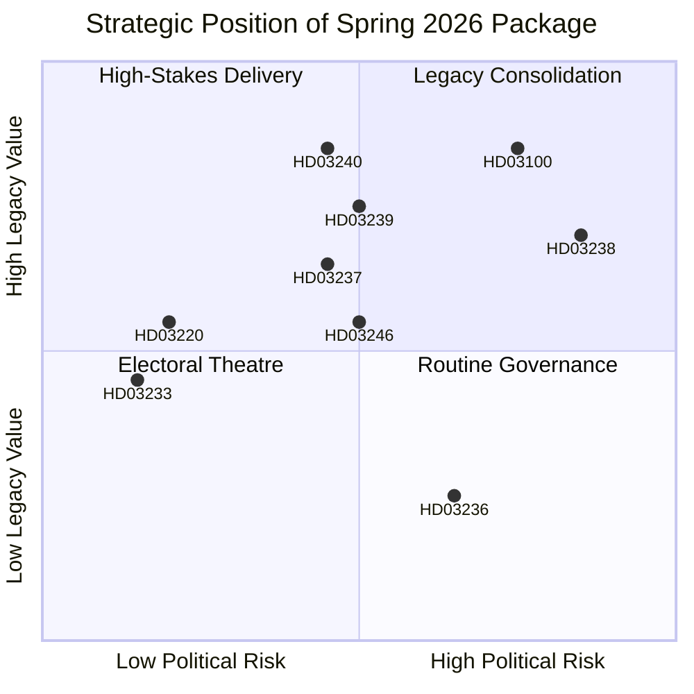

# SWOT Analysis — Government Propositions — 2026-04-20

**Generated**: 2026-04-20 06:30 UTC  
**Framework**: `political-swot-framework.md` v5.0  
**Perspectives**: 12 stakeholder lenses (Coalition government; M; KD; L; SD; S; MP; V; C; Business; Municipalities; Voters)  
**Confidence**: 🟩HIGH on evidence-grounded assessments

## Summary — Cross-Cutting SWOT (Coalition Government Perspective)

### 💪 STRENGTHS (Internal, Positive)

**1. Pre-Election Legislative Coherence**  
Nine significant propositions tabled April 9–16, 2026 across 6 ministries show organised legislative capacity. The compressed window signals collective decision-making discipline. Finance Minister Svantesson's Spring Economic Bill and the two accompanying amendment budgets (HD0399, HD03236) form a unified fiscal narrative under "ansvarsfull återhämtning" branding. *(Impact: High / Confidence: High)*

**2. Cost-of-Living Political Optics (HD03236)**  
The extra amendment budget cutting fuel taxes SEK 0.50–0.80/litre and providing el-/gas-price support directly addresses Sweden's most potent voter concern since 2022. Pass-through effective July 1, 2026 — pump-price visibility at the earliest possible pre-election moment. Niklas Wykman (KD) championed this measure with strong coalition backing; Svantesson's signature delivers political credit within the core M voter pool. *(Impact: High / Confidence: Medium — pass-through risk per `devils-advocate.md`)*

**3. Law-and-Order Mandate Delivery (HD03237 + HD03246)**  
Justice Minister Gunnar Strömmer has delivered the flagship SD coalition commitments: paid police training (removing financial barrier to training, est. SEK 800–900 m/yr cost) and stricter rules for young offenders addressing gang-recruitment crisis. These fulfil the confidence-and-supply agreement with Sweden Democrats and reinforce a coherent multi-year law-enforcement expansion. *(Impact: High / Confidence: High)*

**4. NATO Integration Credibility (HD03220)**  
Sweden's battalion-level contribution to Finland's Enhanced Forward Presence demonstrates post-accession alliance reliability. PM Kristersson can argue Sweden has transitioned from beneficiary to net contributor of collective defence — a strategically resonant narrative ahead of the June 2026 NATO Summit. Foreign Minister Malmer Stenergard and Minister for Foreign Trade Benjamin Dousa co-signed. *(Impact: Medium-High / Confidence: High)*

**5. Energy-Transition Infrastructure (HD03239, HD03240, HD03238)**  
Climate and Industry Minister Johan Britz has constructed a logically integrated reform package creating the legal foundation for estimated SEK 80–120 bn green industrial investment 2027–2030. Electricity market reform addresses grid access; wind power compensation solves rural consent; new environmental agency targets permitting bottlenecks. *(Impact: High legacy; Medium immediate / Confidence: Medium — implementation risk)*

**6. Industrial Legacy-Building (HD03242, HD03243, HD03244)**  
Rural affairs (forestry), tonnage tax reform, and public-sector interoperability together signal attention to competitiveness beyond headline politics. HD03244 affects 290 municipalities + 21 regions — foundational infrastructure for digital government. *(Impact: Medium / Confidence: High)*

**7. Ukraine Accountability Leadership (HD03231, HD03232)**  
Sweden among the first NATO member states to formalise accession to the aggression tribunal mechanism (HD03231) and international compensation commission (HD03232). Reinforces Kristersson's foreign-policy credentials. *(Impact: Medium / Confidence: High)*

### ⚠️ WEAKNESSES (Internal, Negative)

**1. GDP Growth Deficit vs. Nordic Peers**  
Sweden 2024 GDP growth +0.82% vs. Denmark +3.48%, Norway +2.10%. Spring Bill projections must explain this gap credibly. Opposition will anchor every fiscal debate on Nordic comparison. Social Democrats' Mikael Damberg (finance spokesperson) has publicly characterised the measure as "regressive tax policy that rewards car owners while underfunding public transport." *(Impact: High / Confidence: High)*

**2. SD Confidence-and-Supply Dependency**  
Every proposition requires SD support for passage. SD's leadership has shown signs of strategic repositioning through 2025–2026 (`devils-advocate.md` Red Team Challenge 2). P(coalition signal-shift) revised upward to 0.20–0.25. Specifically, SD could demand additional immigration/criminal-code concessions during the May 2026 budget debate — creating a potential confidence-test moment. *(Impact: High / Confidence: Medium)*

**3. Fiscal-Credibility Double Bind**  
Simultaneously cutting fuel taxes and claiming fiscal-framework adherence creates narrative tension. Riksrevisionen has its fiscal-framework report live (HD03241); any adverse finding provides opposition with authoritative ammunition. The Excellent tax cuts + claimed consolidation combination will draw critical op-ed attention from DN, SvD business-page economists, and Konjunkturinstitutet. *(Impact: High / Confidence: High)*

**4. Environmental-Agency Implementation Complexity (HD03238)**  
Creating a new national agency from scratch typically takes 24+ months in Sweden. Political timeline (Q3 2026 passage → operational mid-2027) collides with realistic institutional timeline (staffing + premises + IT by 2028). Risks "legislated but not delivered" critique throughout the 2026 campaign (`implementation-feasibility.md`). *(Impact: Medium-High / Confidence: High)*

**5. Police-Training Quality Surge Risk (HD03237)**  
Paid training typically increases applications 2–3x. Polismyndigheten must either lower selection standards (politically disastrous) or create application backlogs (implementation failure). Instructor capacity requires pulling experienced officers into teaching roles — undermining front-line presence promise. Red-team probability of measurable quality degradation 2027–2029 ≈ 25%. *(Impact: Medium / Confidence: Medium)*

**6. Urban/Rural Distributional Critique**  
Wind power compensation (HD03239) benefits rural host municipalities; urban municipalities receive nothing. S-led opposition will amplify the urban/rural fairness frame, particularly in Göteborg, Malmö, and Stockholm's peripheral suburbs. *(Impact: Medium / Confidence: High)*

**7. Limited Healthcare Positioning**  
The package addresses fiscal, security, energy, justice — but **not** healthcare, which is polling third among voter priorities. This is a structural opening for the opposition. Lack of a comparable "sjukvårdspaket" is the clearest deficit in the package's voter-segment coverage (`voter-segmentation.md` Segment 8). *(Impact: Medium-High / Confidence: High)*

### 🌟 OPPORTUNITIES (External, Positive)

**1. Recovery Momentum Electoral Leverage**  
If Q2 2026 GDP data (released mid-July) shows +0.4% to +0.6% QoQ, the Spring Bill's 2026 projections become credible. This scenario (A1 Best, `scenario-analysis.md`, P(0.25)) delivers +2–3 pp electoral boost and raises retention probability to 60%. *(Impact: High / Confidence: Medium — dependent on macro)*

**2. Green Industrial Investment Validation**  
If H2 Green Steel, LKAB electrification, or a major data-centre investor publicly attributes Sweden-over-peer selection to the energy-package clarity, the reform becomes a headline-generating success. Deliverable mid-2027. *(Impact: High / Confidence: Low-Medium — dependent on investor behaviour)*

**3. NATO Summit Diplomatic Leverage (June 2026)**  
HD03220 deployment positions Kristersson to argue for enhanced Swedish command roles at the 2026 NATO Summit. Diplomatic capital can be converted to domestic credibility through visible summit deliverables. *(Impact: Medium / Confidence: Medium)*

**4. EU Digital Single Market Alignment (HD03233)**  
Anti-fraud rules position Sweden as Digital Services Act leader, potentially attracting EU digital-economy policy influence. Low-controversy, high-symbolic return. *(Impact: Low-Medium / Confidence: High)*

**5. Pre-Notified State Aid Safe Harbour for HD03239**  
Government can proactively pre-notify HD03239 to DG Comp in Q3 2026, de-risking EU challenge. Danish 2011 precedent provides template (`international-comparative.md`). If executed, removes one tail-risk. *(Impact: Medium / Confidence: High — procedural)*

**6. Environmental-Permitting Coalition Building**  
Teknikföretagen, Svenskt Näringsliv, Skogsindustrierna will publicly endorse HD03238; if MP+V counter-mobilisation is weak, the reform becomes a pro-industrial consensus. *(Impact: Medium / Confidence: Medium)*

**7. Police-Reform Normalisation**  
HD03237 paid training brings Sweden to Nordic norm. Once implemented, becomes irreversible — even an S-led government would not reverse (`international-comparative.md`). Durable legacy. *(Impact: Medium / Confidence: High)*

### ⚡ THREATS (External, Negative)

**1. US Tariff Escalation Exposure**  
Trump tariff regime threatens SKF, Volvo, Sandvik, SSAB exports. Swedish businesses ~7% of GDP in US-bound exports. P(tariff escalation scenario) ≈ 0.30–0.45 per `scenario-analysis.md`. If materialises, Spring Bill 2026 growth projections collapse; HD03236 absorbed by macro response rather than felt as relief. *(Impact: Critical / Confidence: Medium)*

**2. Social Democratic Welfare Counter-Narrative**  
Opposition leader Magdalena Andersson (S), finance spokesperson Mikael Damberg, and healthcare-policy voices will amplify "tax cuts for drivers, cuts for sjukvård" frame continuously. Trade unions (LO, TCO, Kommunal) provide ground-game amplification in Segment 4 (LO working-class) and Segment 8 (public-sector professionals). *(Impact: High / Confidence: High)*

**3. Energy Price Volatility Undermines HD03236 Claims**  
If natural gas prices spike 20%+ in Q3 2026 (Russia-Ukraine ceasefire breakdown, LNG market tightening, Nord Stream 2 accidents), budgeted energy support amounts prove insufficient. The 2022 "el-priskompensation trap" recurs: government accused of delivering too little, too late. *(Impact: High / Confidence: Medium)*

**4. Riksrevisionen Critical Finding**  
The government's own response to the Riksrevisionen (HD03241) creates a platform for audit body pushback. If Riksrevisionen issues adverse follow-up findings, opposition gains authoritative platform. P(0.15–0.25). *(Impact: High / Confidence: Medium)*

**5. Environmental Opposition Mobilisation**  
MP and V will portray HD03238 as deregulation weakening environmental protection under a pro-industry government. Naturskyddsföreningen, WWF Sweden will participate via op-eds and consultation responses. Risk intensifies if any specific environmental harm (industrial spill, protected-area incursion) occurs during 2026. *(Impact: Medium / Confidence: High)*

**6. Russian Hybrid / Disinformation Operations**  
Per `threat-analysis.md`, Säpo and MSB anticipate Russian information operations targeting HD03220 NATO narrative and HD03236 economic-grievance frame. CIB-style coordinated inauthentic behaviour on Facebook + X expected. *(Impact: Medium / Confidence: Medium)*

**7. Swedish Bank Stress (Commercial Real Estate)**  
Swedbank and SEB have concentrated commercial real estate exposure. A 2026 credit event comparable to 2008 would displace all package analysis and trigger macro-response absorbing fiscal space. *(Impact: Critical / Confidence: Low — tail risk)*

**8. Immigration / Integration Event**  
Any major immigration event (Ukraine ceasefire migration wave, integration failure incident) mobilises SD to demand additional hard-line measures — testing coalition flexibility and displacing package-narrative media oxygen. *(Impact: Medium / Confidence: Low-Medium)*

**9. AI Deepfake Political Attack**  
First high-profile Swedish political deepfake (2025–2026 first-wave risk) could disrupt campaign in ways no existing legislation addresses. *(Impact: Low-Medium / Confidence: Low)*

## Party-Perspective SWOT Matrices

### Moderaterna (M) Perspective

| Quadrant | Key items |
|----------|-----------|
| 💪 | Fiscal competence narrative; police reform; NATO leadership |
| ⚠️ | GDP gap vs. Denmark; suburban vote fragility; L 4%-threshold risk |
| 🌟 | Economic recovery by summer; green industrial investment news; Segment 2 consolidation |
| ⚡ | US tariff damage; S mobilisation; energy cost spike |

### Sverigedemokraterna (SD) Perspective

| Quadrant | Key items |
|----------|-----------|
| 💪 | Fuel tax cut validation; police expansion; criminal-code hardening |
| ⚠️ | Influence ceiling apparent; polling plateau ~18.5%; culture-war priorities deferred to 2027 |
| 🌟 | Fuel-belt consolidation; rural segment dominance; immigration re-escalation window |
| ⚡ | Polling stagnation; leadership pressure from youth wing; incumbent-trap if government fails |

### Kristdemokraterna (KD) Perspective

| Quadrant | Key items |
|----------|-----------|
| 💪 | Wykman's HD03236 championing; family-policy space in HD0399 |
| ⚠️ | Small-party visibility in big-coalition context; risk of absorption into M |
| 🌟 | Pensioner relief (HD03233) consolidates core; church-adjacent traditionalist base |
| ⚡ | Sub-4% polling risk; succession uncertainty |

### Liberalerna (L) Perspective

| Quadrant | Key items |
|----------|-----------|
| 💪 | Education-policy angle in HD0399; liberal internationalist profile |
| ⚠️ | 4% threshold risk (polling ~3.5–4.5%); identity blurred between M and C |
| 🌟 | Environmental-agency defence via liberal moderation |
| ⚡ | Threshold collapse — would force coalition redefinition |

### Socialdemokraterna (S) Perspective

| Quadrant | Key items |
|----------|-----------|
| 💪 | Counter-narrative on GDP gap; trade-union ground game; Andersson coalition discipline |
| ⚠️ | No governing alternative crystallised; internal tensions between LO and climate coalition |
| 🌟 | Healthcare gap; segment 4 + 8 mobilisation; recession persistence |
| ⚡ | Segment 1 + 2 slippage if HD03236 delivers; international security credit to Kristersson |

### Vänsterpartiet (V) Perspective

| Quadrant | Key items |
|----------|-----------|
| 💪 | Coherent anti-establishment positioning |
| ⚠️ | Defence scepticism isolates on HD03220; limited coalition pathway |
| 🌟 | Environmental mobilisation if HD03238 stumbles; youth-voter appeal |
| ⚡ | Squeezed between S and MP; marginal relevance under centre-left consensus |

### Miljöpartiet (MP) Perspective

| Quadrant | Key items |
|----------|-----------|
| 💪 | Environmental permit critique platform; climate credibility |
| ⚠️ | 6% baseline; L-competition in Stockholm professional class |
| 🌟 | Summer 2026 climate event amplifying environmental salience |
| ⚡ | Insufficient size for decisive role; threshold vulnerability |

### Centerpartiet (C) Perspective

| Quadrant | Key items |
|----------|-----------|
| 💪 | Rural voter dual-positioning; HD03239 wind-compensation angle |
| ⚠️ | Strategic ambiguity between blocs |
| 🌟 | Coalition pivot value if S-led governance emerges |
| ⚡ | Continued rural vote erosion to SD |

## Business / Municipalities / Voters Perspectives

### Business (Svenskt Näringsliv / Teknikföretagen / SKGS)

- 💪 Energy package clarity; HD03243 tonnage; HD03244 interoperability.
- ⚠️ Uncertainty in permitting-agency transition period.
- 🌟 SEK 80–120 bn investment unlock potential.
- ⚡ US tariff exposure; energy price volatility.

### Municipalities (SKR / Sveriges Kommuner och Regioner)

- 💪 Wind power compensation formula; interoperability infrastructure.
- ⚠️ Inter-municipal equity tensions (urban/rural); cost-absorption burdens.
- 🌟 Fiscal relief eases municipal-level budgets.
- ⚡ Housing market uncertainty; integration strain.

### Voters (Aggregate, cross-segment)

- 💪 Visible cost-of-living relief; police expansion reassurance; NATO credibility.
- ⚠️ Lived-experience gap with macro narrative; healthcare underfunded.
- 🌟 Recovery if Q2 2026 delivers; energy-bill relief if winter mild.
- ⚡ US trade uncertainty affecting jobs; climate anxiety under HD03238 deregulation frame.

## SWOT Diagnostic Diagram

## SO / WO / ST / WT Strategy Matrix

### SO — Strengths-Opportunities (Maximise)

- Convert HD03236 pass-through + Q2 GDP recovery into economic-competence narrative.
- Use NATO Summit (June 2026) + HD03220 deployment for diplomatic-domestic feedback loop.
- Let HD03237 paid-training + Segment 2 consolidation anchor centre-right retention.

### WO — Weaknesses-Opportunities (Improve)

- Pre-notify HD03239 to DG Comp in Q3 2026 — de-risks EU challenge.
- Pair HD03238 agency rollout with visible milestone wins (first fast-track permit) in early 2028 to address "legislated but not delivered" critique.
- Add healthcare-adjacent measure via autumn budget to close Segment 8 vulnerability.

### ST — Strengths-Threats (Defend)

- Use Spring Bill fiscal framework to buffer against US tariff narrative (demonstrate resilience, not panic).
- Counter environmental opposition on HD03238 via industrial-alliance endorsements.

### WT — Weaknesses-Threats (Minimise)

- Avoid further electoral-theatre additions that deepen fiscal-credibility contradiction.
- Do not overcommit on police-force-expansion timelines to avoid visible under-delivery.
