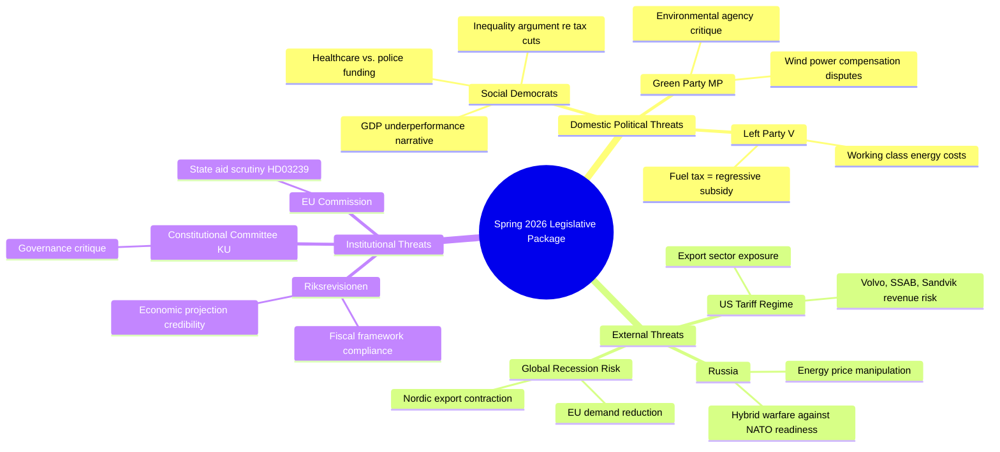

# Threat Analysis — Government Propositions — 2026-04-20

**Generated**: 2026-04-20 06:27 UTC  
**Method**: STRIDE-Political Threat Modelling  
**Overall Threat Level**: 🟧MEDIUM  
**Confidence**: 🟧MEDIUM  

## Threat Actor Mapping

## Specific Threat Assessments

### Threat 1: Social Democratic Electoral Offensive
**Threat Type**: Political  
**Actor**: Magdalena Andersson (S), Labor unions (LO, TCO, Saco)  
**Target**: Government economic credibility, inequality narrative  
**Severity**: 🟩HIGH  
**Confidence**: 🟩HIGH  

S will weaponise Sweden's GDP growth underperformance vs. Nordic peers. With Denmark at +3.48% and Norway at +2.10% in 2024 against Sweden's +0.82%, the argument that M-led government economic policies have produced structural underperformance is easy to frame for median voters. LO and TCO will campaign on wage inequality and public sector underfunding — framing the Spring Package as "tax cuts for drivers while teachers and nurses face wage freeze."

### Threat 2: Riksrevisionen Audit Challenge
**Threat Type**: Institutional Oversight  
**Actor**: Riksrevisionen (National Audit Office)  
**Target**: Spring Economic Bill (HD03100) fiscal projections  
**Severity**: 🟧MEDIUM  
**Confidence**: 🟩HIGH  

The government tabled its own response to Riksrevisionen's fiscal framework report (HD03241) alongside the Spring Bill. If Riksrevisionen subsequently issues a follow-up assessment critical of the Spring Bill's deficit projections or expenditure baseline assumptions, it creates credibility damage. Parliamentary fiscal hawks (Finance Committee) will cite audit findings.

### Threat 3: EU State Aid Investigation — Wind Power Compensation (HD03239)
**Threat Type**: Legal/Regulatory  
**Actor**: EU Commission DG Comp  
**Target**: Revenue-sharing scheme for municipal wind power hosts  
**Severity**: 🟡LOW-MEDIUM  
**Confidence**: 🟡LOW  

Revenue-sharing arrangements between wind energy producers and municipalities may constitute selective economic advantage that triggers EU state aid rules. Denmark faced similar scrutiny in 2021 for its offshore wind revenue scheme. The Swedish design (market-based revenue sharing) is structured to avoid aid characterisation, but legal challenge risk exists.

### Threat 4: US Tariff Regime Export Disruption
**Threat Type**: Geopolitical/Economic  
**Actor**: US Trade Representative, Trump Administration  
**Target**: Swedish export sector (machinery, vehicles, forest products)  
**Severity**: 🟠HIGH  
**Confidence**: 🟩HIGH  

The 2026 US tariff package represents the most material external threat to the Spring Economic Bill's growth assumptions. VOLVO, Sandvik, SKF, and SSAB collectively employ over 200,000 people in Sweden with significant US market exposure. Tariff-induced export contraction would directly reduce Swedish industrial output and employment — invalidating HD03100's growth projections by election day.

### Threat 5: Russian Hybrid Operations Against NATO Sweden
**Threat Type**: Security  
**Actor**: Russian Federation intelligence (SVR, GRU)  
**Target**: Swedish defense commitment credibility, HD03220 NATO contribution  
**Severity**: 🟧MEDIUM  
**Confidence**: 🟧MEDIUM  

Following Sweden's NATO accession, Russia has conducted information operations attempting to portray Swedish defense commitments as inadequate or public opposition as higher than polls reflect. Sweden's eFP contribution to Finland (HD03220) will be framed by Russian disinformation as destabilising — targeting swing voters who favor diplomatic resolution over military posturing. SÄPO has identified this as an active information environment risk.

## Legislative Vulnerability Assessment

| Proposition | Parliamentary Risk | Opposition Threat | Passage Probability |
|-------------|-------------------|------------------|---------------------|
| HD03100 (Spring Bill) | 🟡LOW — budget framework vote | S/MP/V united opposition | >95% — budget math favors government |
| HD0399 (Amendment Budget) | 🟡LOW | Opposition critique, not blocking | >95% |
| HD03236 (Fuel/Energy) | 🟡LOW | L internal concerns on fiscal responsibility | >90% |
| HD03239 (Wind Power) | 🟧MEDIUM — SD ambivalence | MP critique, SD lukewarm | >80% |
| HD03240 (Electricity) | 🟡LOW | Technical opposition only | >90% |
| HD03237 (Police Training) | 🟡LOW — SD/M/KD/L aligned | V/MP symbolic opposition | >95% |
| HD03238 (Env. Agency) | 🟧MEDIUM | MP/V sustained criticism | >85% |
| HD03220 (NATO Finland) | 🟡LOW — cross-party defense consensus | Marginal V/MP objection | >95% |

## Overall Threat Level: 🟧MEDIUM

The government's legislative package faces credible political threats primarily from Social Democratic electoral mobilisation and external economic shocks (US tariffs, global slowdown). However, the formal parliamentary threats are low — the coalition arithmetic is stable for all 9 propositions and bloc discipline is holding through the spring session. The most dangerous threats are indirect: economic performance data disappointing before September 2026.
