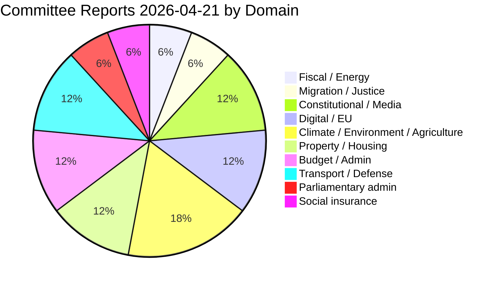

# Political Classification Results — Committee Reports 2026-04-21

**Date**: 2026-04-21 | **Riksmöte**: 2025/26 | **Analyst**: news-committee-reports workflow
**Analysis Timestamp**: 2026-04-21 15:10 UTC | **Data Depth**: SUMMARY + FULL TEXT for top 8

---

## 🗂️ Document Classification Overview

| # | Dok_id | Betänkande | Title (EN short) | Committee | Domain | Sensitivity | Urgency |
|---|--------|-----------|------------------|-----------|--------|-------------|---------|
| 1 | HD01FiU48 | 2025/26:FiU48 | Supplementary budget — fuel tax cut + energy relief (4.1B SEK) | FiU | Fiscal / Energy | 🟢 PUBLIC | 🔴 CRITICAL |
| 2 | HD01SfU22 | 2025/26:SfU22 | Inhibition of enforcement (migration) | SfU | Migration / Justice | 🟡 SENSITIVE | 🔴 CRITICAL |
| 3 | HD01KU32 | 2025/26:KU32 | Accessibility requirements — press-freedom media (*vilande*) | KU | Constitutional / Media | 🟢 PUBLIC | 🟠 URGENT |
| 4 | HD01KU33 | 2025/26:KU33 | Digital seizure transparency (*vilande*) | KU | Constitutional / Justice | 🟢 PUBLIC | 🟠 URGENT |
| 5 | HD01TU21 | 2025/26:TU21 | State e-identification (eIDAS2) | TU | Digital / EU | 🟢 PUBLIC | 🟠 URGENT |
| 6 | HD01MJU21 | 2025/26:MJU21 | Riksrevisionen — agriculture climate transition | MJU | Climate / Agriculture | 🟢 PUBLIC | 🟡 STANDARD |
| 7 | HD01MJU19 | 2025/26:MJU19 | Waste legislation reform | MJU | Environment / EU | 🟢 PUBLIC | 🟡 STANDARD |
| 8 | HD01MJU20 | 2025/26:MJU20 | Riksrevisionen — climate policy framework | MJU | Climate | 🟢 PUBLIC | 🟡 STANDARD |
| 9 | HD01CU28 | 2025/26:CU28 | National housing register (bostadsrätter) | CU | Housing / Property | 🟢 PUBLIC | 🟡 STANDARD |
| 10 | HD01CU27 | 2025/26:CU27 | Identity requirements — property registration (*lagfart*) | CU | Property / Anti-crime | 🟢 PUBLIC | 🟡 STANDARD |
| 11 | HD01SkU23 | 2025/26:SkU23 | Permanent tax exemption — EV charging electricity | SkU | Green taxation | 🟢 PUBLIC | 🟡 STANDARD |
| 12 | HD01KU42 | 2025/26:KU42 | Division into expenditure areas (*utgiftsområden*) | KU | Budget / Constitutional | 🟢 PUBLIC | 🟡 STANDARD |
| 13 | HD01SfU20 | 2025/26:SfU20 | Removed notification requirement — parental benefit | SfU | Social insurance | 🟢 PUBLIC | 🟡 STANDARD |
| 14 | HD01TU22 | 2025/26:TU22 | Tachograph enforcement (EU) | TU | Transport / EU | 🟢 PUBLIC | 🟡 STANDARD |
| 15 | HD01KU43 | 2025/26:KU43 | New law on the Riksdag medal | KU | Parliamentary admin | 🟢 PUBLIC | 🟢 ROUTINE |
| 16 | HD01TU16 | 2025/26:TU16 | Removed requirement for introductory driver-training | TU | Transport / Road safety | 🟢 PUBLIC | 🟡 STANDARD |
| 17 | HD01TU19 | 2025/26:TU19 | Municipal port security (NATO context) | TU | Defense / Ports | 🟡 SENSITIVE | 🟡 STANDARD |

---

## 📊 Classification by Policy Domain

## 📊 Classification by Committee

| Committee | Count | Most significant |
|-----------|:-----:|------------------|
| **FiU** (Finance) | 1 | HD01FiU48 ⭐ |
| **SfU** (Social Insurance / Migration) | 2 | HD01SfU22 ⭐ |
| **KU** (Constitution) | 4 | HD01KU32, HD01KU33 (dual *vilande*) |
| **TU** (Transport) | 4 | HD01TU21 |
| **MJU** (Environment / Agriculture) | 3 | HD01MJU21 |
| **CU** (Civil Affairs / Housing) | 2 | HD01CU28 |
| **SkU** (Taxation) | 1 | HD01SkU23 |

## 📊 Sensitivity & Urgency Distribution

| | 🔴 CRITICAL | 🟠 URGENT | 🟡 STANDARD | 🟢 ROUTINE |
|:-:|:-:|:-:|:-:|:-:|
| 🟢 PUBLIC | 1 (FiU48) | 3 (KU32, KU33, TU21) | 10 | 1 (KU43) |
| 🟡 SENSITIVE | 1 (SfU22) | 0 | 1 (TU19) | 0 |

---

## 🧭 Classification Rules Applied

- **CRITICAL urgency**: Implementation < 60 days OR >2B SEK fiscal impact OR ECHR exposure
- **URGENT**: Implementation < 12 months OR constitutional *vilande* status OR EU Commission deadline
- **STANDARD**: Implementation > 12 months, no active legal challenge
- **ROUTINE**: Procedural/administrative with no external constraint
- **SENSITIVE** sensitivity: Involves individual-rights restriction (SfU22) or national-security context (TU19)

---

## 🔗 Related Documents in This Dossier

- [`significance-scoring.md`](significance-scoring.md) — 5-dimension scoring (electoral/constitutional/EU/immediacy/controversy)
- [`cross-reference-map.md`](cross-reference-map.md) — inter-document + related motions/propositions
- [`executive-brief.md`](executive-brief.md) — newsroom summary

---

**Classification Confidence**: 🟩 HIGH — All 17 documents mapped from official *riksdagen.se* document metadata + committee handling cards.
