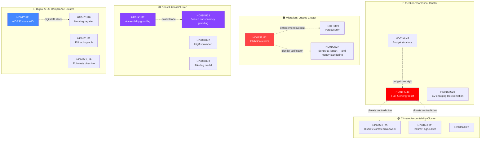

# Cross-Reference Map — Committee Reports 2026-04-21

**Date**: 2026-04-21 | **Analyst**: news-committee-reports workflow
**Purpose**: Trace legislative lineage (proposition → remiss → betänkande → motion → beslut) and identify thematic convergence across committees.

---

## 🧬 Proposition → Betänkande Chain (primary linkages)

| Betänkande | Upstream proposition / skrivelse | Parallel motions | Downstream vote |
|-----------|-----------------------------------|------------------|-----------------|
| **HD01FiU48** | Prop. 2025/26:220 (extra ändringsbudget för 2026) | HD024082 (S), HD024098 (MP) — *counter-motions* | Kammaren 2026-04-23 |
| **HD01SfU22** | Prop. 2025/26:214 (inhibition av verkställighet) | HD02... (V), HD02... (MP) *pending* | Kammaren 2026-04-29 |
| **HD01KU32** | Prop. 2025/26:109 (*vilande grundlagsändring*) | — | Post-election Riksdag (Sept 2026 +) |
| **HD01KU33** | Prop. 2025/26:110 (*vilande grundlagsändring*) | — | Post-election Riksdag (Sept 2026 +) |
| **HD01TU21** | Prop. 2025/26:181 (Statlig e-legitimation) | — | Kammaren 2026-04-24 |
| **HD01MJU21** | Skr. 2025/26:95 (Riksrevisionen) | — | Kammaren 2026-04-28 |
| **HD01MJU19** | Prop. 2025/26:165 (avfallslagstiftningen) | — | Kammaren 2026-04-28 |
| **HD01CU28** | Prop. 2025/26:137 (bostadsrättsregister) | — | Kammaren 2026-04-24 |
| **HD01CU27** | Prop. 2025/26:138 (identitetskrav lagfart) | — | Kammaren 2026-04-24 |
| **HD01SkU23** | Prop. 2025/26:155 (laddel) | — | Kammaren 2026-04-24 |
| **HD01TU16** | Prop. 2025/26:118 (introduktionsutbildning MC) | — | Kammaren 2026-04-22 |
| **HD01TU22** | Prop. 2025/26:172 (färdskrivare) | — | Kammaren 2026-04-22 |

---

## 🕸️ Thematic Cross-Linkages

---

## 🔗 Key Cross-References (Narrative)

### 1. **FiU48 ↔ MJU20/MJU21 — The Climate-Fiscal Contradiction**
FiU48 cuts fuel tax to the EU Energy Tax Directive **floor** (the lowest rate permitted). The SAME week, MJU20 (Riksrevisionen audit of the Climate Policy Framework) and MJU21 (agricultural emissions audit) are adopted. This produces an **internal contradiction visible in the journal-of-record**: the government formally accepts Riksrevisionen's findings on climate-framework shortfalls while simultaneously cutting the most carbon-relevant consumption tax. Expect this juxtaposition in Klimatpolitiska rådet's Q3 2026 memo and in Greens/Centre opposition framings.

### 2. **SfU22 ↔ TU19 ↔ CU27 — Enforcement-Identity-Border Triangle**
Three seemingly unrelated reports share an underlying enforcement-architecture logic:
- **SfU22** creates a geographic-restriction regime for inhibited aliens (internal enforcement)
- **TU19** strengthens municipal port security in the NATO context (external border)
- **CU27** requires tightened identity verification for property registration (financial enforcement)
Together they represent a **state-capacity build-out** in identity, mobility, and border control. This is the *operational* expression of the Tidöavtal's security chapter.

### 3. **KU32 ↔ KU33 — The Dual *Vilande* Trap**
Both amendments are *vilande* constitutional amendments under Regeringsformen 8:14 — they lapse unless the **next Riksdag** passes them again in **identical wording**. Adopted together, they function as a **two-sided handover brief**: the incoming government cannot reverse them as ordinary law, and failure to re-affirm is politically costly (forces explicit rejection of disability accessibility in the case of KU32, or press-freedom alignment in the case of KU33). See [`scenario-analysis.md`](scenario-analysis.md) for game-theoretic treatment.

### 4. **TU21 ↔ CU28 — The Digital-ID Stack**
State e-ID (TU21) + national housing register (CU28) together form a **digital-administrative stack** that will reshape how Swedes interact with public services 2026–2029. The digital housing register requires a trusted identity layer; state e-ID provides that layer without BankID's commercial contract. Together they displace €400M+ in annual private-sector workflow intermediation — a market that Swedish banks and proptech have controlled for a decade.

### 5. **FiU48 ↔ HD024082/HD024098 (Motions of 2026-04-17)**
The S (HD024082) and MP (HD024098) counter-motions on fuel tax were already filed during the prior motions cycle (14–17 April 2026, see [`../motions/documents/fuel-tax-cluster-analysis.md`](../motions/documents/fuel-tax-cluster-analysis.md)). FiU48's committee adoption on 2026-04-21 is the **government's procedural reply**: the committee majority rejected both counter-motions and advanced the government proposal. This compresses the motion-to-vote cycle to **4 parliamentary days** — the fastest cycle since the 2022 energy-crisis emergency budget.

---

## 🌍 External Legislative Linkages

| Betänkande | EU instrument / international | Status |
|-----------|-------------------------------|--------|
| HD01FiU48 | Energy Tax Directive 2003/96/EC | Compliance at floor |
| HD01SfU22 | ECHR Protocol 4 Art. 2, Art. 5 | Pending legal challenge |
| HD01TU21 | eIDAS2 Regulation (EU) 2024/1183 | Deadline 2026 |
| HD01TU22 | Tachograph Regulation (EU) 2020/1054 | In compliance, enforcement gap |
| HD01MJU19 | EU Waste Framework Directive 2008/98/EC | Aligns |
| HD01MJU21 | CAP Regulation (EU) 2021/2115 | Eco-scheme underperformance |
| HD01KU32 | CRPD (UN Convention Rights of Persons with Disabilities) | Strengthens Art. 9 compliance |

---

## 🧩 Related Cycles in the 2026 Dossier

| Cycle | Relation to 2026-04-21 committee reports |
|-------|-----------------------------------------|
| **2026-04-14 → 04-17 motions** | Counter-motions to FiU48 cluster; 4-party immigration opposition to SfU22 lineage |
| **2026-04-21 interpellations** | Ministerial accountability on SfU22 enforcement + FiU48 fiscal pathway |
| **2026-04-14 propositions** | Prop. 2025/26:220 → direct ancestor of HD01FiU48 |
| **2026-03-20 → 04-10 committee reports** | KU32/KU33 rapporteur drafts; FiU48 Lagrådet timeline |

See [`../motions/cross-reference-map.md`](../motions/cross-reference-map.md) for the reciprocal view.

---

## 🔎 Lineage Confidence

- **FiU48 → Prop. 220**: 🟩 HIGH (explicit in betänkande)
- **SfU22 → Prop. 214**: 🟩 HIGH (explicit)
- **KU32/33 → *vilande* prop.**: 🟩 HIGH (grundlagsordning)
- **TU21 → eIDAS2**: 🟩 HIGH (cited in motivskrivningen)
- **FiU48 → HD024082/098 counter-motions**: 🟩 HIGH (same subject, committee handled jointly)

---

**Next Review**: 2026-04-28 (after kammaren votes on FiU48 + SfU22)
