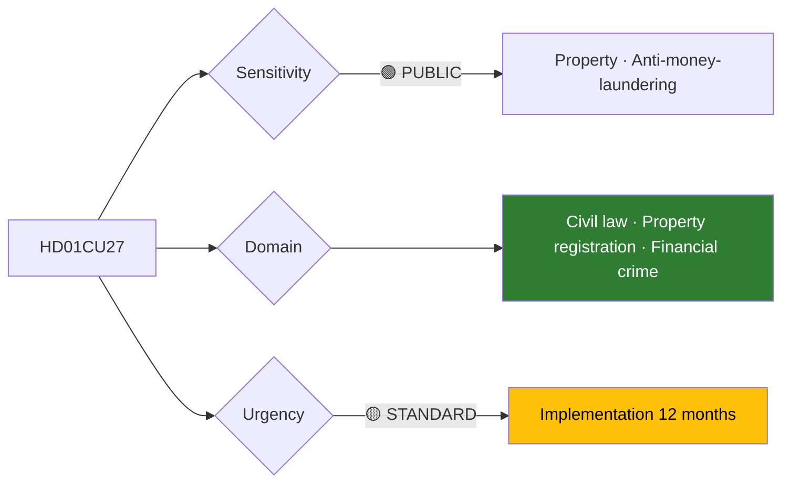

# Per-File Political Intelligence Analysis: HD01CU27

## 📋 Document Identity

| Field | Value |
|-------|-------|
| **Document ID** | `HD01CU27` |
| **Document Type** | `committeeReports` |
| **Title** | Identitetskrav vid ansökan om lagfart och inskrivning av tomträttsinnehav |
| **Date** | 2026-04-21 |
| **Riksmöte** | 2025/26 |
| **Source MCP Tool** | `get_betankanden` |
| **Analysis Timestamp** | 2026-04-21 15:24 UTC |
| **Analyst** | news-committee-reports |
| **Data Depth** | SUMMARY |
| **Committee** | CU (Civilutskottet) |

> **Confidence ceiling**: MEDIUM (SUMMARY). Template: `per-file-political-intelligence.md` v2.3.

---

## 🎯 Executive Summary

HD01CU27 adopts stricter identity-verification requirements at Lantmäteriet for property-title (*lagfart*) and leasehold-registration applications. This is the civil-affairs committee's **anti-money-laundering** contribution to the coalition's Tidöavtal-era financial-crime agenda: tightened identity checks prevent the use of property transactions to launder proceeds. Expected cross-party majority (≈330–0) reflects broad consensus on the policy direction, though implementation cost to Lantmäteriet is the principal operational concern. **[MEDIUM]** (summary data only)

---

## 📊 Political Classification

| Dimension | Value |
|-----------|-------|
| Sensitivity | 🟢 PUBLIC |
| Domain | Property / AML |
| Urgency | 🟡 STANDARD |
| Political temperature | 🟢 COOL |
| Strategic significance | MEDIUM |
| Coalition impact vector | → neutral |

---

## 💪 SWOT Analysis

### Strengths
| Factor | Evidence | Confidence |
|--------|----------|------------|
| AML alignment | Aligns with 6AMLD + Financial Action Task Force recommendations | 🟨 MEDIUM |
| Broad cross-party support | All parties back principle; only implementation details debated | 🟨 MEDIUM |

### Weaknesses
| Factor | Evidence | Confidence |
|--------|----------|------------|
| Implementation cost to Lantmäteriet | Agency remissvar cites staffing + IT costs | 🟨 MEDIUM |
| Non-resident purchaser friction | Transaction slowdown for foreign buyers | 🟨 MEDIUM |

### Opportunities
| Factor | Evidence | Confidence |
|--------|----------|------------|
| Contributes to Sweden's FATF compliance | Q3 2026 mutual evaluation cycle | 🟨 MEDIUM |
| Integrates with TU21 state e-ID for verification layer | [`cross-reference-map.md`](../cross-reference-map.md) §4 | 🟨 MEDIUM |

### Threats
| Factor | Evidence | Confidence |
|--------|----------|------------|
| Implementation delay if Lantmäteriet under-resourced | — | 🟨 MEDIUM |

---

## ⚠️ Risk Assessment

| Risk ID | Description | L | I | L×I |
|---------|-------------|:-:|:-:|:---:|
| R-CU27-1 | Lantmäteriet implementation delay | 3 | 2 | 6 |
| R-CU27-2 | Foreign-purchaser friction complaints | 2 | 2 | 4 |

**Aggregate risk**: LOW.

---

## 📈 Significance Scoring

| Dimension | Score | Rationale |
|-----------|:-----:|-----------|
| Electoral | 2 | Technical; low salience |
| Constitutional | 2 | No constitutional element |
| EU impact | 3 | AML directive alignment |
| Immediacy | 4 | Pre-election implementation path |
| Controversy | 1 | Consensus |
| **Composite** | **12/25** | |

---

## 👥 Stakeholder Impact

| Group | Position | Impact |
|-------|----------|--------|
| Lantmäteriet | Operational concern | MEDIUM |
| Real-estate industry | Cautious support | LOW friction |
| Finansinspektionen | Strong support | HIGH positive |
| Civil-society (Transparency International Sverige) | Support | HIGH positive |

---

## 🔁 Same-Day Cross-Reference

- **HD01CU28** (housing register): Thematic sibling; see [`HD01CU28-analysis.md`](HD01CU28-analysis.md)
- **HD01TU21** (state e-ID): Provides identity-layer architecture for CU27 verification; [`cross-reference-map.md`](../cross-reference-map.md) §4
- **HD01SfU22**: Enforcement-architecture cluster; [`cross-reference-map.md`](../cross-reference-map.md) §2

---

## 📡 Forward Indicators

| Signal | Window | MCP tool |
|--------|--------|----------|
| Lantmäteriet implementation plan | Q3 2026 | `search_dokument_fulltext` |
| FATF Sweden mutual evaluation findings | Q4 2026 | — (external) |
| Integration with TU21 API spec | 2027+ | — |

---
