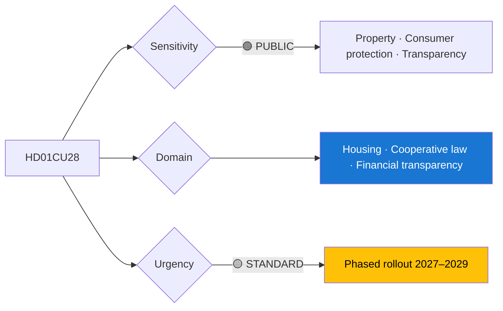

# Per-File Political Intelligence Analysis: HD01CU28

## 📋 Document Identity

| Field | Value |
|-------|-------|
| **Document ID** | `HD01CU28` |
| **Document Type** | `committeeReports` |
| **Title** | Nationellt register över bostadsrätter (housing cooperative register) |
| **Date** | 2026-04-21 |
| **Riksmöte** | 2025/26 |
| **Source MCP Tool** | `get_betankanden` |
| **Analysis Timestamp** | 2026-04-21 15:26 UTC |
| **Analyst** | news-committee-reports |
| **Data Depth** | SUMMARY |
| **Committee** | CU (Civilutskottet) |

> **Confidence ceiling**: MEDIUM (SUMMARY). Template: `per-file-political-intelligence.md` v2.3.

---

## 🎯 Executive Summary

HD01CU28 establishes a national register for bostadsrätter (cooperative apartments) — a long-awaited market-transparency reform correcting an information asymmetry peculiar to Sweden's housing market. Unlike single-family homes and condominiums in most European jurisdictions, Swedish cooperative apartments have historically had no centralised ownership register, creating opacity, financial-crime vulnerability, and difficulty with mortgage-security assessment. The register aligns cooperative apartments with EU transparency norms and integrates with TU21 state e-ID and HD01CU27 identity verification. Implementation timeline spans 2027–2029. **[MEDIUM]** (summary data only)

---

## 📊 Political Classification

| Dimension | Value |
|-----------|-------|
| Sensitivity | 🟢 PUBLIC |
| Domain | Housing / Property / Transparency |
| Urgency | 🟡 STANDARD |
| Political temperature | 🟢 COOL |
| Strategic significance | MEDIUM-HIGH |
| Coalition impact vector | → neutral |

---

## 💪 SWOT Analysis

### Strengths
| Factor | Evidence | Confidence |
|--------|----------|------------|
| Closes long-standing market-transparency gap | CU: Finansinspektionen 2023 report cited as basis | 🟨 MEDIUM |
| AML/transparency architecture | Enables systemic financial-crime monitoring | 🟨 MEDIUM |
| Mortgage-security valuation | Aligns cooperative apartments with condominium norms | 🟨 MEDIUM |

### Weaknesses
| Factor | Evidence | Confidence |
|--------|----------|------------|
| Privacy concern for individual owners | Register scope (full owner disclosure vs aggregated) debated | 🟨 MEDIUM |
| Bostadsrättsföreningar administrative burden | HSB + Riksbyggen remissvar cite small-association cost | 🟨 MEDIUM |

### Opportunities
| Factor | Evidence | Confidence |
|--------|----------|------------|
| Proptech innovation pipeline | Opens data for third-party mortgage/analytics products | 🟨 MEDIUM |
| EU transparency-directive alignment | — | 🟨 MEDIUM |

### Threats
| Factor | Evidence | Confidence |
|--------|----------|------------|
| GDPR compliance challenges on full-owner disclosure | — | 🟨 MEDIUM |

---

## ⚠️ Risk Assessment

| Risk ID | Description | L | I | L×I |
|---------|-------------|:-:|:-:|:---:|
| R-CU28-1 | Implementation delay 2027 | 2 | 3 | 6 |
| R-CU28-2 | GDPR compliance challenge on owner disclosure | 2 | 3 | 6 |
| R-CU28-3 | HSB/Riksbyggen small-association cost backlash | 2 | 2 | 4 |

**Aggregate risk**: LOW-MODERATE.

---

## 📈 Significance Scoring

| Dimension | Score | Rationale |
|-----------|:-----:|-----------|
| Electoral | 3 | Housing-market voters; moderate salience |
| Constitutional | 2 | No constitutional element |
| EU impact | 3 | Transparency-directive alignment |
| Immediacy | 3 | 2027–2029 rollout |
| Controversy | 3 | Owner-privacy debate |
| **Composite** | **14/25** | |

---

## 👥 Stakeholder Impact

| Group | Position | Impact |
|-------|----------|--------|
| HSB, Riksbyggen (housing cooperatives) | Cautious | MEDIUM administrative burden |
| Finansinspektionen | Strong support | HIGH positive |
| Mortgage industry | Strong support | HIGH positive |
| Proptech sector | Strong support | HIGH opportunity |
| Integritetsskyddsmyndigheten | Cautious on scope | — |

---

## 🔁 Same-Day Cross-Reference

- **HD01CU27** (identity at lagfart): Integrated verification pipeline; see [`HD01CU27-analysis.md`](HD01CU27-analysis.md)
- **HD01TU21** (state e-ID): Identity-layer dependency; [`cross-reference-map.md`](../cross-reference-map.md) §4

---

## 📡 Forward Indicators

| Signal | Window | MCP tool |
|--------|--------|----------|
| Förordning implementation guidance | Q4 2026 | `search_dokument_fulltext` |
| Integritetsskyddsmyndigheten yttrande | Q3 2026 | `search_dokument` |
| HSB + Riksbyggen transition plan | 2027 | — |

---
