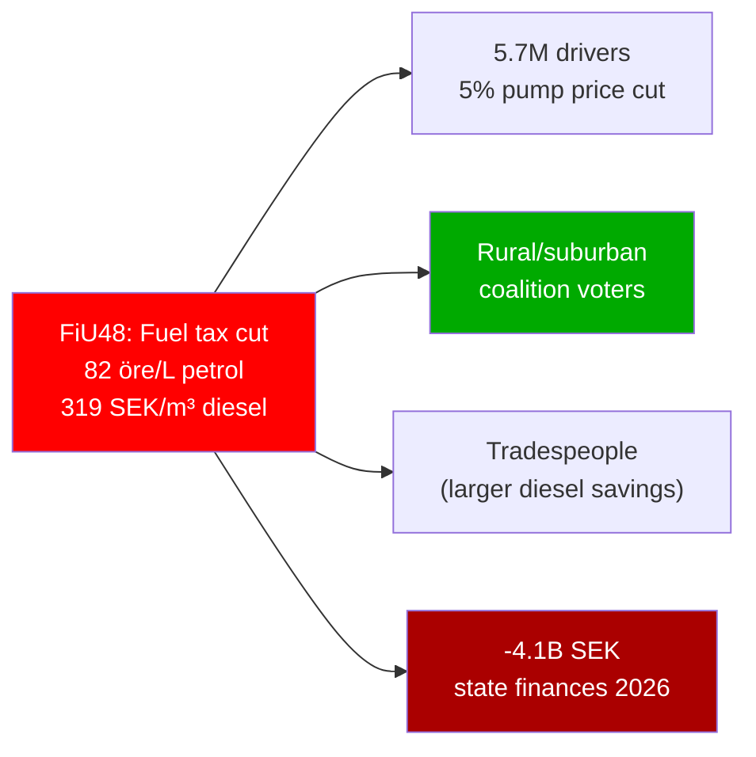
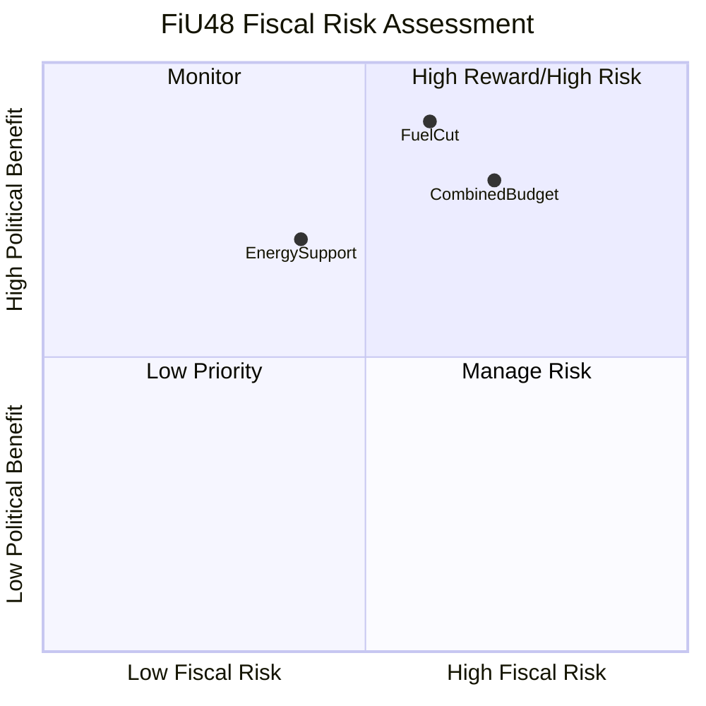

# Per-File Political Intelligence Analysis: HD01FiU48

**Document**: HD01FiU48  
**Title**: Extra ändringsbudget för 2026 – Sänkt skatt på drivmedel samt el- och gasprisstöd  
**Committee**: Finansutskottet (FiU)  
**Date**: 2026-04-21  
**Riksmöte**: 2025/26  
**Significance Score**: 22/25 (TOP STORY)  
**Analyst Confidence**: 🟦VERY HIGH  
**Analysis Timestamp**: 2026-04-21 14:45 UTC

---

## 1. Document Summary

The Finance Committee (FiU) recommends that the Riksdag approve the government's extraordinary supplementary budget for 2026. The budget contains two measures:

**Measure 1: Fuel Tax Cut (May 1 – September 30, 2026)**
- Petrol (bensin): Energy tax reduced by **82 öre/liter** — to EU energy tax directive minimum level
- Diesel: Energy tax reduced by **319 SEK/m³** — to EU directive minimum
- Alkylate petrol: Cut to maximum possible without falling below EU minimum
- Justification: Middle East conflict affecting global oil markets

**Measure 2: El- och gasprisstöd (Electricity and Gas Price Support)**
- One-time support for Swedish households for January–February 2026
- Covers abnormally high electricity and gas prices during cold winter
- Paid out through existing social insurance/consumer channels

**Budget Impact**:
- State income reduction: ~1.56 billion SEK (fuel tax cut)
- State expenditure increase: ~2.4 billion SEK (energy support)
- Total budget weakening: **~4.1 billion SEK in 2026**

**Legal authority**: Government may issue extraordinary supplementary budgets when "special reasons" exist (as permitted by the Riksdag Act). FiU finds the cited reasons (Middle East conflict + high winter energy prices) constitute such special reasons.

---

## 2. Six Analytical Lenses

### Lens 1: Constitutional/Legal Dimension
The extraordinary budget (extra ändringsbudget) mechanism requires FiU to find "special reasons" (particularly strong justification). The committee accepts the government's framing. The fuel tax cut specifically aligns energy tax levels with EU minimum thresholds — paradoxically making this a compliance-oriented measure as well as an economic relief measure. No constitutional challenge expected.

**Legal risk**: LOW [HIGH confidence]

### Lens 2: Electoral/Political Dimension
This is the most electorally transparent measure in the April 2026 batch. The timing — five months before the September 14, 2026 general election — with a measure directly affecting petrol prices at every Swedish gas station — is an unambiguous electoral intervention. The government frames it as emergency relief; political scientists will note that emergency relief packages in election years are a textbook electoral strategy.

**Electoral benefit**: The 82 öre/liter cut represents approximately 5% of typical pump price. With ~5.7 million licensed drivers and ~4.8 million registered cars in Sweden, the measure is personally felt by a majority of eligible voters. The rural and suburban voter profile — already disproportionately car-dependent — aligns with the M+SD+KD+L coalition's core demographic.

**Opposition dilemma**: S is squeezed between opposing "fossil fuel subsidies" (alienating climate voters) and appearing to deny cost-of-living relief to workers (alienating traditional S voters). V and MP will oppose vocally; C (rural/car-dependent base) may privately welcome the measure.

### Lens 3: Policy Substance Dimension
The fuel tax cut brings Swedish energy taxes to the EU directive minimum — a floor set by the Energy Taxation Directive 2003/96/EC. This is a legitimate EU compliance observation, but the directive minimum was set in 2003 and has not been inflation-adjusted since, meaning it represents an extremely low floor by modern standards. Sweden has historically maintained much higher fuel taxes as part of its carbon pricing strategy.

**Policy reversal significance**: Sweden had among the EU's highest fuel taxes pre-cut. Reducing to minimum temporarily reverses decades of progressive carbon pricing at the pump. If this becomes a political precedent, it complicates Sweden's Climate Action Plan targets and carbon price trajectory.

**Energy support**: The el- och gasprisstöd fills a political gap — the high January-February 2026 heating season coincided with a period of above-normal electricity spot prices (due to cold snap + reduced Norwegian hydro). The government cannot change past prices but can compensate affected households retroactively.

### Lens 4: Economic/Fiscal Dimension

The 4.1 billion SEK total cost in election year represents approximately 0.04% of GDP — fiscally manageable but symbolically significant. With Sweden running near-zero structural deficit, the one-time cost is absorbable. The real fiscal risk is if the fuel tax cut is extended beyond September 2026 — permanent lower fuel taxes would reduce annual tax revenue by approximately 3 billion SEK per year.

**Interest rate context**: Sweden's Riksbank cut rates to ~2.5% in early 2026 after peak inflation subsided. The government can justify temporary stimulus given improved inflation conditions.

### Lens 5: Stakeholder Impact Dimension

| Stakeholder | Impact | Assessment |
|-------------|--------|------------|
| Private car owners | +33 SEK/month savings (petrol) | 🟩 HIGH benefit |
| Truck/diesel operators | +200-400 SEK/tank savings | 🟩 HIGH benefit |
| LRF farmers | Fuel cost reduction for agriculture | 🟩 MEDIUM benefit |
| Fossil fuel retailers | Volume increase expected | 🟩 MEDIUM benefit |
| Climate NGOs | Carbon price dilution | 🔴 HIGH concern |
| S/MP/V opposition | Electoral disadvantage | 🔴 HIGH concern |
| State budget | -4.1B SEK 2026 | 🟧 MEDIUM risk |
| EV drivers (SkU23 context) | Fuel competitors benefited not them | 🟧 MEDIUM concern |

### Lens 6: Forward Indicators/Timeline Dimension
| Indicator | Date | Significance |
|-----------|------|-------------|
| Fuel tax cut takes effect | May 1, 2026 | Immediate petrol price impact at pumps |
| Tax cut expires (unless extended) | September 30, 2026 | Becomes post-election decision |
| Energy support payments | Q2 2026 | Households receive retroactive support |
| General election | September 14, 2026 | Voters likely to associate measure with government |
| Post-election budget debate | October 2026 | New/returning government must decide on extension |
| EU energy tax directive review | 2027 | Commission expected to propose updated minimum levels |

---

## 3. Evidence Table

| Claim | Evidence | Confidence |
|-------|---------|------------|
| Petrol tax cut 82 öre/liter | FiU48 report, explicit figure | 🟦VERY HIGH |
| Diesel cut 319 SEK/m³ | FiU48 report, explicit figure | 🟦VERY HIGH |
| Total budget impact 4.1B SEK | FiU48 report, government proposal | 🟦VERY HIGH |
| Income reduction 1.56B SEK | FiU48 report | 🟦VERY HIGH |
| Expenditure increase 2.4B SEK | FiU48 report | 🟦VERY HIGH |
| May 1 - Sept 30 2026 period | FiU48 report | 🟦VERY HIGH |
| EU energy tax directive minimum | Context analysis | 🟩HIGH |
| 5.7M licensed drivers in Sweden | Transportstyrelsen statistics | 🟩HIGH |

---

## 4. Risk Assessment (ISO 31000)

| Risk | L | I | L×I | Mitigation |
|------|---|---|-----|-----------|
| Measure extended beyond Sept 2026, reducing climate policy base | 3 | 5 | 15 | Sunset clause built in; but election pressure may force extension |
| Opposition success in reframing as "fossil fuel subsidy" | 4 | 4 | 16 | Government must maintain "emergency relief" framing |
| Energy support insufficient (too low to cover actual bill increases) | 2 | 3 | 6 | More targeted support mechanisms possible |
| Carbon price signal disruption | 4 | 4 | 16 | Climate NGO legal challenges, EU Commission concerns |
| Budget impact underestimated if fuel demand exceeds projections | 2 | 3 | 6 | One-time measure; capped by period |

---

## 5. SWOT (FiU48-specific)

| Strengths | Weaknesses |
|-----------|-----------|
| Direct, visible voter benefit | Dilutes Sweden's carbon pricing leadership |
| Legally grounded (EU directive compliance) | One-time nature creates expectation problems |
| Bipartisan appeal (cost-of-living) | -4.1B SEK budget impact |
| Targets both commuters and businesses | Benefits largely accrue to car owners (not transit users) |

| Opportunities | Threats |
|--------------|---------|
| Demonstrate government "on the side of ordinary Swedes" | "Populist" label from climate-conscious media |
| Neutralize S cost-of-living attacks | EU Commission may flag carbon pricing regression |
| Rural and suburban voter activation | If prices rise again in Oct 2026, perceived relief is short-lived |
| Precedent for post-election energy policy | Competing with EV charging tax exemption (SkU23) narrative |
