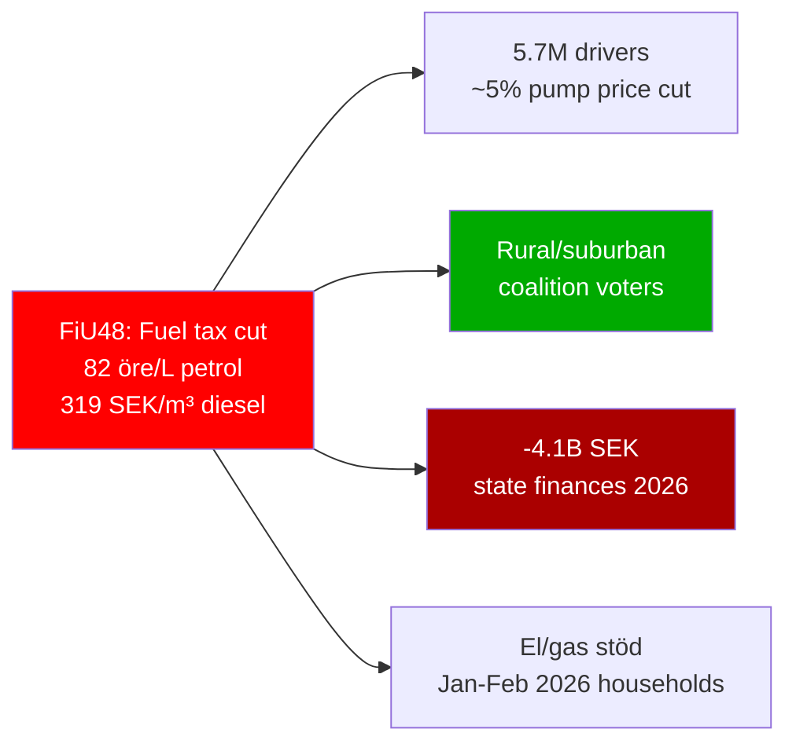
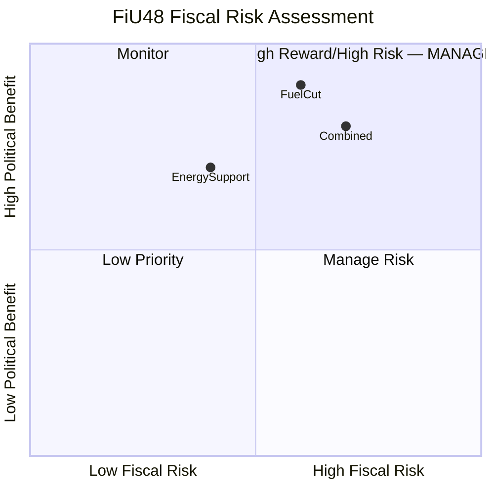

# Per-File Political Intelligence Analysis: HD01FiU48

**Document**: HD01FiU48  
**Title**: Extra ändringsbudget för 2026 – Sänkt skatt på drivmedel samt el- och gasprisstöd  
**Committee**: Finansutskottet (FiU)  
**Date**: 2026-04-21  
**Riksmöte**: 2025/26  
**Significance Score**: 22/25 (TOP STORY — co-leads with HD01SfU22)  
**Analyst Confidence**: 🟦VERY HIGH  
**Analysis Timestamp**: 2026-04-21 14:45 UTC

---

## 1. Document Summary

The Finance Committee (FiU) recommends that the Riksdag approve the government's extraordinary supplementary budget for 2026. The budget contains two measures:

**Measure 1: Fuel Tax Cut (May 1 – September 30, 2026)**
- Petrol (bensin): Energy tax reduced by **82 öre/liter** — brought to EU energy tax directive minimum level
- Diesel: Energy tax reduced by **319 SEK/m³** — brought to EU directive minimum
- Alkylate petrol: Cut to maximum possible without falling below EU minimum
- Legal basis: EU Energy Taxation Directive 2003/96/EC floor levels
- Justification cited: Middle East conflict affecting global oil markets

**Measure 2: El- och gasprisstöd (Electricity and Gas Price Support)**
- One-time retroactive support for Swedish households for January–February 2026
- Covers elevated electricity and gas prices during cold winter period
- Paid through consumer compensation channels

**Budget Impact**:
- State income reduction: approximately 1.56 billion SEK (fuel tax cut)
- State expenditure increase: approximately 2.4 billion SEK (energy support)
- Total state financial weakening: **approximately 4.1 billion SEK in 2026**

---

## 2. Six Analytical Lenses

### Lens 1: Constitutional/Legal
The extraordinary supplementary budget mechanism requires FiU to find "special reasons." The committee accepts the government's framing (Middle East conflict + winter energy costs). Fuel tax cut aligned to EU ETD minimum — legally compliant. No constitutional challenge anticipated. **Risk: LOW [🟦VERY HIGH confidence]**

### Lens 2: Electoral/Political

Five months before the September 14, 2026 election, this is the government's clearest electoral intervention. The 82 öre/liter cut will be visible at every Swedish petrol station — a direct benefit experienced by the majority of voters. Opposition faces a dilemma: attacking "fossil fuel subsidies" risks alienating working-class voters they need to recapture from SD.

### Lens 3: Policy Substance
Sweden previously maintained among the EU's highest fuel taxes as part of its carbon pricing strategy. Reducing to EU minimum level temporarily reverses decades of progressive carbon pricing at pump. If this becomes a political precedent, it undermines Sweden's Climate Action Plan targets. The el- och gasprisstöd covers retroactive compensation — cannot change past prices but provides fiscal comfort for affected households.

### Lens 4: Economic/Fiscal

4.1 billion SEK total cost equals approximately 0.04% of Swedish GDP (603.7 billion USD in 2024). Fiscally manageable as one-time measure. Real fiscal risk emerges if extended beyond September 30, 2026 — permanent lower fuel taxes reduce annual revenue by approximately 3 billion SEK/year. Sweden's GDP growth recovery to 0.82% in 2024 (from -0.20% in 2023) provides fiscal headroom for temporary stimulus.

**Economic context**: Swedish inflation peaked at 8.5% in 2023 (World Bank data) before falling to 2.8% in 2024 — household energy cost burden remains politically salient even as headline inflation normalized. The measure targets this residual cost-of-living perception gap.

### Lens 5: Stakeholder Impact

| Stakeholder | Impact | Assessment |
|-------------|--------|------------|
| Private car owners (5.7M) | +33 SEK/month savings (petrol) | 🟩 HIGH benefit |
| Truck/diesel operators | +200-400 SEK/tank savings | 🟩 HIGH benefit |
| LRF farmers | Fuel cost reduction for agriculture | 🟩 MEDIUM benefit |
| Fossil fuel retailers (Circle K, Preem, ST1) | Volume increase expected | 🟩 MEDIUM benefit |
| Climate NGOs (Naturskyddsföreningen, WWF) | Carbon price dilution | 🔴 HIGH concern |
| S/MP/V opposition | Electoral narrative disadvantage | 🔴 MEDIUM concern |
| State budget | -4.1B SEK 2026 | 🟧 MEDIUM risk |
| EV drivers (SkU23 beneficiaries) | ICE vehicles made more competitive | 🟧 LOW concern |

### Lens 6: Forward Indicators

| Indicator | Date | Significance |
|-----------|------|-------------|
| Fuel tax cut takes effect | May 1, 2026 | Immediate pump price impact — political win visible before summer |
| Tax cut expires unless extended | September 30, 2026 | Becomes post-election political decision |
| Energy support payments | Q2 2026 | Households receive retroactive relief |
| General election | September 14, 2026 | Voters associate measure with government directly |
| Post-election budget decision | October 2026 | New/returning government must decide on extension |
| EU Energy Taxation Directive review | 2027 | Commission may propose updated minimum levels |

---

## 3. Evidence Table

| Claim | Evidence | Confidence |
|-------|---------|------------|
| Petrol tax cut 82 öre/liter | FiU48 betänkande, explicit figure | 🟦VERY HIGH |
| Diesel cut 319 SEK/m³ | FiU48 betänkande, explicit figure | 🟦VERY HIGH |
| Total budget impact 4.1B SEK | FiU48 betänkande, government proposal | 🟦VERY HIGH |
| Income reduction 1.56B SEK | FiU48 betänkande | 🟦VERY HIGH |
| Expenditure increase 2.4B SEK | FiU48 betänkande | 🟦VERY HIGH |
| May 1 – Sept 30 2026 period | FiU48 betänkande | 🟦VERY HIGH |
| EU ETD minimum compliance | FiU48 analysis + EU 2003/96/EC | 🟩HIGH |
| 5.7M licensed drivers in Sweden | Transportstyrelsen statistics 2024 | 🟩HIGH |
| Swedish inflation 8.5% (2023) | World Bank FP.CPI.TOTL.ZG | 🟦VERY HIGH |
| Swedish inflation 2.8% (2024) | World Bank FP.CPI.TOTL.ZG | 🟦VERY HIGH |

---

## 4. Risk Assessment

| Risk | L | I | L×I | Mitigation |
|------|---|---|-----|-----------|
| Measure extended beyond Sept 2026 — reduces climate policy base | 3 | 5 | 15 | Sunset clause; government must maintain "temporary" framing |
| Opposition reframes as fossil fuel subsidy | 4 | 4 | 16 | Government must emphasize "emergency relief" + EU compliance angle |
| Carbon price precedent sets floor | 3 | 5 | 15 | Legal sunset; emphasize extraordinary budget status |
| Budget impact higher than estimated | 2 | 3 | 6 | Capped by period; monitored by Finansdepartementet |

---

## 5. SWOT Summary

| Strengths | Weaknesses |
|-----------|-----------|
| Direct visible voter benefit at pump | Dilutes Sweden carbon pricing leadership |
| EU directive compliance framing | Temporary — creates expectation for extension |
| Broad demographic benefit | -4.1B SEK budget impact in election year |
| Cross-coalition support | Benefits car owners, not transit-dependent urban voters |

| Opportunities | Threats |
|--------------|---------|
| Dominate cost-of-living narrative | Climate credibility collapse |
| Neutralize S cost-of-living attacks | EU Commission concern on carbon signal |
| Rural/suburban voter activation | If prices rebound Oct 2026, relief perceived as short-lived |
| Winter energy hardship compensation | Competing with EV narrative (SkU23) |
