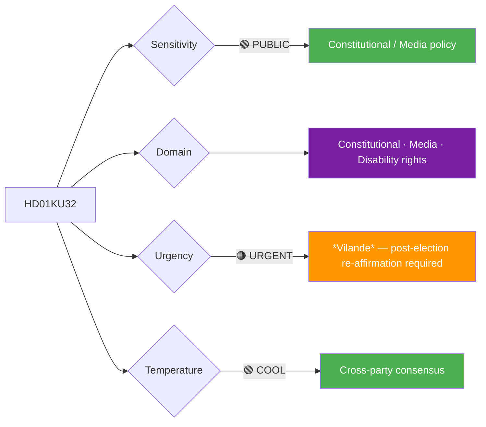
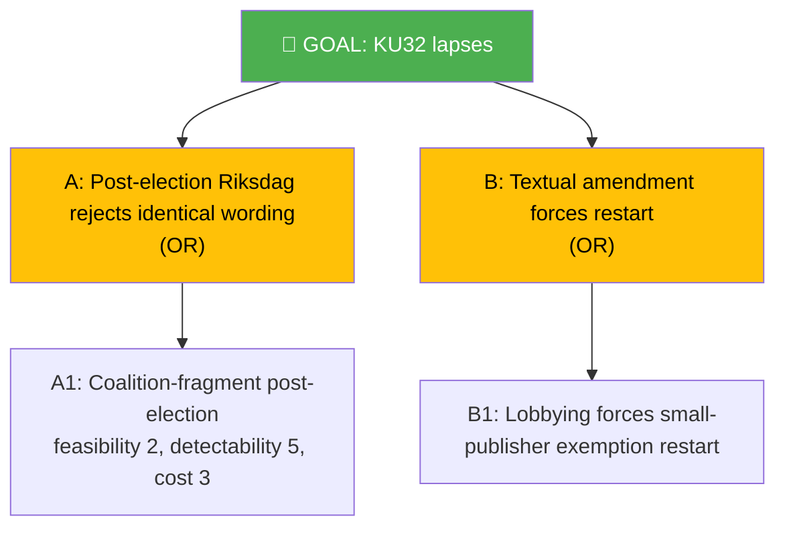

# Per-File Political Intelligence Analysis: HD01KU32

## 📋 Document Identity

| Field | Value |
|-------|-------|
| **Document ID** | `HD01KU32` |
| **Document Type** | `committeeReports` |
| **Title** | Tillgänglighetskrav för vissa medier — *vilande grundlagsändring* |
| **Date** | 2026-04-21 |
| **Riksmöte** | 2025/26 |
| **Source MCP Tool** | `get_betankanden`, `get_dokument_innehall` |
| **Analysis Timestamp** | 2026-04-21 15:20 UTC |
| **Analyst** | news-committee-reports |
| **Data Depth** | FULL-TEXT |
| **Committee** | KU (Konstitutionsutskottet) |

> **Confidence ceiling**: HIGH (FULL-TEXT). Template: `per-file-political-intelligence.md` v2.3.

---

## 🎯 Executive Summary

HD01KU32 adopts as *vilande* under Regeringsformen 2:15 a grundlagsändring extending digital-accessibility obligations to press-freedom-protected media (TF- and YGL-registered publications). Its consequence is that the next Riksdag — chosen 14 September 2026 — must pass **identical wording** for the amendment to take effect (expected 1 January 2028). Cross-party support is broad; disability-rights organisations and all four opposition parties endorse the policy direction. The threat surface is not political opposition but procedural continuity: if even minor textual amendments are required after the election, the three-year cooling-off period restarts. **[HIGH]**

---

## 📊 Political Classification

| Dimension | Value | Rationale |
|-----------|-------|-----------|
| Sensitivity | 🟢 PUBLIC | Standard grundlag process; no national-security element |
| Domain | Constitutional / Media / Disability | TF + YGL + CRPD intersection |
| Urgency | 🟠 URGENT | *Vilande* timeline |
| Political temperature | 🟢 COOL | Multi-party alignment |
| Strategic significance | MEDIUM-HIGH | Legacy constitutional commitment |
| Coalition impact vector | → neutral | Neither advances nor retards coalition cohesion |

---

## 💪 SWOT Analysis

### Strengths
| Factor | Evidence | Confidence |
|--------|----------|------------|
| CRPD Article 9 compliance strengthening | KU32 *motivering* cites UN Committee on the Rights of Persons with Disabilities 2022 observations | 🟩 HIGH |
| Aligns with EU Accessibility Act 2025 | KU32 cross-references Directive (EU) 2019/882 implementation | 🟩 HIGH |
| Disability-rights sector unified in support | Funka + Synskadades Riksförbund remissvar supportive | 🟩 HIGH |

### Weaknesses
| Factor | Evidence | Confidence |
|--------|----------|------------|
| Press-freedom concern from small publishers | TU: SVT Online + large publishers assert cost burden for small TF-registered publications | 🟨 MEDIUM |
| Enforcement ambiguity for user-generated content | KU32 §4 leaves implementation to förordning; scope unclear for comment sections | 🟨 MEDIUM |

### Opportunities
| Factor | Evidence | Confidence |
|--------|----------|------------|
| Aligns Sweden with Nordic accessibility leadership (Norway AT, Finland WCAG) | [`comparative-international.md`](../comparative-international.md) §disability | 🟩 HIGH |
| CRPD 2027 Sweden review reports | Strengthens narrative | 🟨 MEDIUM |

### Threats
| Factor | Evidence | Confidence |
|--------|----------|------------|
| Re-affirmation risk in fragmented post-election Riksdag | [`coalition-mathematics.md`](../coalition-mathematics.md) §*Vilande* Math: P=0.85–0.95 re-affirm | 🟨 MEDIUM |

---

## ⚠️ Risk Assessment

| Risk ID | Description | L | I | L×I | Mitigation |
|---------|-------------|:-:|:-:|:---:|-----------|
| R-KU32-1 | Post-election Riksdag fails to re-affirm identically | 1 | 4 | 4 | Cross-party briefing pre-election |
| R-KU32-2 | Small publishers challenge proportionality | 2 | 2 | 4 | Förordning-level exemption thresholds |

**Aggregate risk**: LOW (no critical or high exposure).

---

## 🌳 Attack Tree — "KU32 lapses without re-affirmation" (goal: lapse)

Low-probability threat scenario overall.

---

## 📈 Significance Scoring

| Dimension | Score (1–5) | Rationale |
|-----------|:-----------:|-----------|
| Electoral | 3 | Secondary story; disability-rights coverage |
| Constitutional | 5 | Grundlag amendment |
| EU impact | 4 | EU Accessibility Act alignment |
| Immediacy | 3 | Post-election dependency |
| Controversy | 4 | Multi-stakeholder debate on scope |
| **Composite** | **19/25** | |

---

## 👥 Stakeholder Impact

| Group | Position | Impact |
|-------|----------|--------|
| Disability orgs (Funka, SRF) | Support | HIGH positive |
| Small publishers (Sveriges Tidskrifter) | Cautious | MEDIUM negative (cost) |
| Public broadcasters (SVT/SR/UR) | Support | NEUTRAL (already compliant) |
| Coalition (M, SD, KD, L) | Mixed support | — |
| Opposition (S, V, MP, C) | Support | — |

---

## 🔁 Same-Day Cross-Reference

- **HD01KU33** (dual *vilande*): Shared RF 2:15 procedural vehicle and post-election timing; see [`cross-reference-map.md`](../cross-reference-map.md) §3
- **HD01KU42** (utgiftsområden): Constitutional-budget structure; same committee
- **HD01TU21** (state e-ID): Digital-inclusion horizontal linkage

---

## 📡 Forward Indicators

| Signal | Window | MCP tool |
|--------|--------|----------|
| Post-election Riksdag's first KU sitting agenda | Oct–Nov 2026 | `get_calendar_events` (org=KU) |
| Small-publisher position at remissinstanser round | Q2 2026 | `search_dokument_fulltext` |
| Myndigheten för tillgängliga medier implementation guidance | 2026–2027 | — (external) |

---

**Related**: [`HD01KU33-analysis.md`](HD01KU33-analysis.md) (sibling *vilande*)
