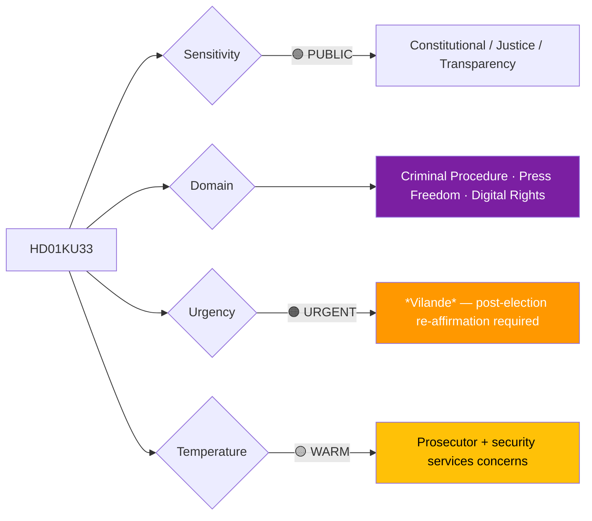
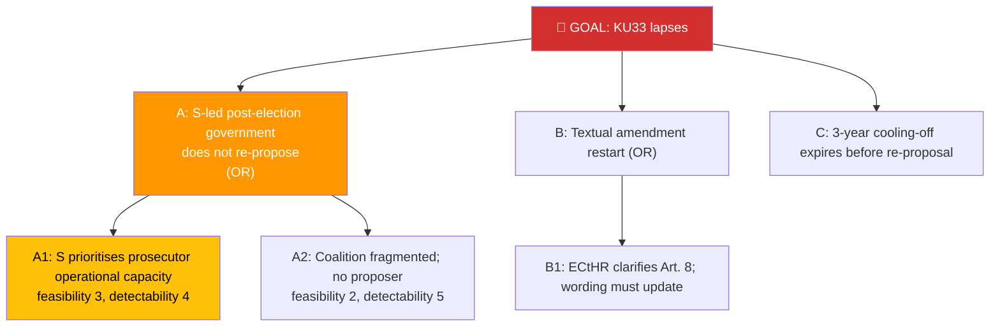

# Per-File Political Intelligence Analysis: HD01KU33

## 📋 Document Identity

| Field | Value |
|-------|-------|
| **Document ID** | `HD01KU33` |
| **Document Type** | `committeeReports` |
| **Title** | Transparens vid beslag av digitala uppgifter — *vilande grundlagsändring* |
| **Date** | 2026-04-21 |
| **Riksmöte** | 2025/26 |
| **Source MCP Tool** | `get_betankanden`, `get_dokument_innehall` |
| **Analysis Timestamp** | 2026-04-21 15:22 UTC |
| **Analyst** | news-committee-reports |
| **Data Depth** | FULL-TEXT |
| **Committee** | KU (Konstitutionsutskottet) |

> **Confidence ceiling**: HIGH (FULL-TEXT). Template: `per-file-political-intelligence.md` v2.3.

---

## 🎯 Executive Summary

HD01KU33 adopts as *vilande grundlagsändring* a transparency obligation on digital-evidence seizures by prosecutors: subjects of seizure must receive a post-hoc notification within a regulated window unless a narrowly defined national-security exception applies. The amendment implements long-standing critiques from Journalistförbundet and aligns Swedish practice with ECtHR *Big Brother Watch v. UK* (2021) precedent. Politically this is the **more fragile of the two dual-*vilande* amendments**: an S-led post-election government may view the notification obligations as operationally burdensome, placing re-affirmation probability in the 25–55% range depending on election outcome (see [`coalition-mathematics.md`](../coalition-mathematics.md) §*Vilande* Math). **[HIGH]**

---

## 📊 Political Classification

| Dimension | Value | Rationale |
|-----------|-------|-----------|
| Sensitivity | 🟢 PUBLIC | Standard grundlag process |
| Domain | Constitutional / Justice / Transparency | RF 2:6 + EKMR Art. 8 |
| Urgency | 🟠 URGENT | *Vilande* timing |
| Political temperature | 🟡 WARM | Prosecutor + security services push back |
| Strategic significance | HIGH | Press-freedom + digital-rights structural change |
| Coalition impact vector | ↓ slight tension | L-party supportive; SD lukewarm |

---

## 💪 SWOT Analysis

### Strengths
| Factor | Evidence | Confidence |
|--------|----------|------------|
| ECHR alignment | *Big Brother Watch v. UK* (2021) Art. 8 jurisprudence cited in KU33 *motivering* | 🟩 HIGH |
| Press freedom coalition backs | Journalistförbundet + TU (Tidningsutgivarna) remissvar supportive | 🟩 HIGH |
| Aligns with post-Snowden Nordic digital-rights movement | [`comparative-international.md`](../comparative-international.md) §digital rights | 🟩 HIGH |

### Weaknesses
| Factor | Evidence | Confidence |
|--------|----------|------------|
| Operational cost to Åklagarmyndigheten | SÄPO + Åklagarmyndigheten remissvar cite staffing impact | 🟨 MEDIUM |
| Narrow national-security exception clause | Drafting may fail ECtHR "prescribed by law" quality test | 🟨 MEDIUM |
| Re-affirmation fragility | Post-election S-led government may deem operationally burdensome | 🟨 MEDIUM |

### Opportunities
| Factor | Evidence | Confidence |
|--------|----------|------------|
| Sweden positions as Nordic digital-rights leader | Finland + Norway have weaker post-hoc transparency | 🟨 MEDIUM |
| ECtHR filing base rate reduction | Preemptive alignment reduces future challenges | 🟨 MEDIUM |

### Threats
| Factor | Evidence | Confidence |
|--------|----------|------------|
| Post-election lapse — most likely of dual *vilande* to fail | [`coalition-mathematics.md`](../coalition-mathematics.md) §*Vilande* Math | 🟨 MEDIUM |
| Prosecutor-led amendment campaign | Åklagarmyndigheten position could harden in Q3 2026 | 🟨 MEDIUM |

---

## ⚠️ Risk Assessment

| Risk ID | Description | L | I | L×I | Mitigation |
|---------|-------------|:-:|:-:|:---:|-----------|
| R-KU33-1 | Post-election Riksdag lapses KU33 | 3 | 3 | 9 | Cross-party pre-election briefing |
| R-KU33-2 | Nat-sec exception drafting fails ECHR quality test | 2 | 3 | 6 | Lagrådet yttrande review |
| R-KU33-3 | Prosecutor resistance delays implementation | 3 | 2 | 6 | Transition period + additional resources |

**Aggregate risk**: MODERATE.

---

## 🌳 Attack Tree — "KU33 lapses after election"

Cheapest attack path: A1 (S operational-priority framing).

---

## 📈 Significance Scoring

| Dimension | Score | Rationale |
|-----------|:-----:|-----------|
| Electoral | 3 | Press-freedom + digital-rights coverage |
| Constitutional | 5 | Grundlag amendment |
| EU impact | 2 | Indirect Charter Art. 7 linkage |
| Immediacy | 3 | Post-election dependency |
| Controversy | 4 | Prosecutor resistance |
| **Composite** | **17/25** | |

---

## 👥 Stakeholder Impact

| Group | Position | Impact |
|-------|----------|--------|
| Journalistförbundet, TU | Strong support | HIGH positive |
| Civil-rights orgs (Civil Rights Defenders) | Support | HIGH positive |
| Åklagarmyndigheten, SÄPO | Operational concern | MEDIUM negative |
| Coalition (M, SD, KD, L) | L strong, SD lukewarm | — |
| Opposition (S, V, MP, C) | V+MP strong, S cautious, C supportive | — |

---

## 🔁 Same-Day Cross-Reference

- **HD01KU32** (dual *vilande*): Shared vehicle; see [`HD01KU32-analysis.md`](HD01KU32-analysis.md)
- **HD01SfU22** (inhibition): Adjacent rule-of-law space; see [`HD01SfU22-analysis.md`](HD01SfU22-analysis.md)

---

## 📡 Forward Indicators

| Signal | Window | MCP tool |
|--------|--------|----------|
| Åklagarmyndigheten implementation-cost analysis | Q3 2026 | `search_dokument_fulltext` |
| Post-election KU first sitting — KU33 re-proposal status | Nov 2026 | `get_calendar_events` (org=KU) |
| Lagrådet yttrande on enforcement förordning | Q3 2026 | `search_dokument` (doktyp=Lagrådet) |

---

**Related**: [`HD01KU32-analysis.md`](HD01KU32-analysis.md) (sibling *vilande*)
