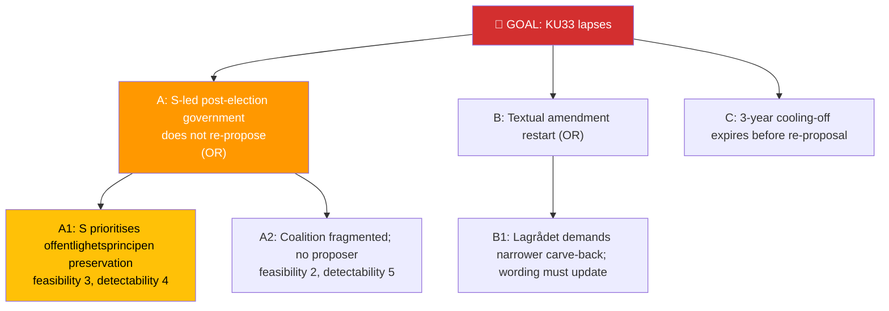

# Per-File Political Intelligence Analysis: HD01KU33

## 📋 Document Identity

| Field | Value |
|-------|-------|
| **Document ID** | `HD01KU33` |
| **Document Type** | `committeeReports` |
| **Title** | Insyn i handlingar som inhämtas genom beslag och kopiering vid husrannsakan — *vilande ändring i tryckfrihetsförordningen* |
| **Date** | 2026-04-17 (committee) · 2026-04-21 (chamber cycle) |
| **Riksmöte** | 2025/26 |
| **Source MCP Tool** | `get_betankanden`, `get_dokument_innehall` |
| **Analysis Timestamp** | 2026-04-21 16:40 UTC (revised) |
| **Analyst** | news-committee-reports |
| **Data Depth** | FULL-TEXT |
| **Committee** | KU (Konstitutionsutskottet) |

> **Confidence ceiling**: HIGH (FULL-TEXT). Template: `per-file-political-intelligence.md` v2.3.
>
> **🛠️ Revision note**: An earlier draft of this file incorrectly framed KU33 as a pro-transparency disclosure obligation. The actual amendment **narrows** public-records access for digitally seized materials. Revised 2026-04-21 after article/analysis reconciliation.

---

## 🎯 Executive Summary

HD01KU33 adopts as *vilande grundlagsändring* an amendment to Tryckfrihetsförordningen (TF) establishing that **digital recordings seized or copied during a *husrannsakan* (police search) are not deemed *allmänna handlingar***. The rule also covers copies transferred between authorities pursuant to custody of the seized information carrier. A carve-back preserves public-records status for any recording that is *affixed* to a formal investigation or to separate authority business. As a grundlagsändring, re-affirmation by the post-election Riksdag is required; intended effect date 1 January 2027.

Politically this is a **transparency-restricting** move, not a transparency-enhancing one. Proponents (government + prosecutorial authorities) argue it ends an anomaly by which entire mirrored hard drives could become searchable public records by default; critics (civil-society, press-freedom, and digital-rights groups) argue it creates a new zone of opaque state custody over personal data with only a narrow carve-back. This is the **more fragile of the two dual-*vilande* amendments**: an S-led post-election government may view the restriction as too broad and decline to re-propose it in identical wording. Re-affirmation probability 40–70% depending on election outcome (see [`coalition-mathematics.md`](../coalition-mathematics.md) §*Vilande* Math). **[HIGH]**

---

## 📊 Political Classification

| Dimension | Value | Rationale |
|-----------|-------|-----------|
| Sensitivity | 🟢 PUBLIC | Standard grundlag process |
| Domain | Constitutional / TF / Justice | TF + offentlighetsprincipen |
| Urgency | 🟠 URGENT | *Vilande* timing |
| Political temperature | 🟡 WARM | Civil-liberties + press-freedom resistance |
| Strategic significance | HIGH | Narrows public-records access in digital era |
| Coalition impact vector | ↓ slight tension | L-party cautious; S uncertain post-election |

---

## 💪 SWOT Analysis

### Strengths
| Factor | Evidence | Confidence |
|--------|----------|------------|
| Clarifies anomalous TF treatment of bulk digital-evidence copies | KU33 *motivering* references prior cases where whole mirrored drives became searchable public records | 🟩 HIGH |
| Operational benefit to Åklagarmyndigheten + Polismyndigheten | Avoids resource-intensive sekretess-review of seized mass-storage media | 🟩 HIGH |
| Carve-back preserves TF status where material is formally added to investigation file | KU33 §on *allmän handling* retention | 🟩 HIGH |
| Coalition (M, SD, KD, L) unified in support | Floor-vote readings from KU sitting | 🟩 HIGH |

### Weaknesses
| Factor | Evidence | Confidence |
|--------|----------|------------|
| Narrows *offentlighetsprincipen* in the digital domain | Civil Rights Defenders + Journalistförbundet remissvar critical | 🟩 HIGH |
| Carve-back scope ambiguous for data-at-rest that is never formally "added" | KU33 *motivering* §on scope | 🟨 MEDIUM |
| Creates opaque custody zone for bulk-extracted personal data | IMY (Integritetsskyddsmyndigheten) yttrande flags data-minimisation concern | 🟨 MEDIUM |

### Opportunities
| Factor | Evidence | Confidence |
|--------|----------|------------|
| Förordning-level data-minimisation and retention rules could meaningfully narrow scope | — | 🟨 MEDIUM |
| Parallel non-constitutional transparency reforms (e.g., statistical reporting) could offset transparency loss | — | 🟨 MEDIUM |

### Threats
| Factor | Evidence | Confidence |
|--------|----------|------------|
| Post-election lapse — most likely of dual *vilande* to fail | [`coalition-mathematics.md`](../coalition-mathematics.md) §*Vilande* Math | 🟨 MEDIUM |
| Journalist/whistleblower chill effect on investigative reporting | Journalistförbundet remissvar | 🟨 MEDIUM |
| ECtHR Art. 10 challenge (media access) low-probability but non-zero | Referent cases: *Magyar Helsinki Bizottság v. Hungary* (2016) on access to state-held information | 🟥 LOW |

---

## ⚠️ Risk Assessment

| Risk ID | Description | L | I | L×I | Mitigation |
|---------|-------------|:-:|:-:|:---:|-----------|
| R-KU33-1 | Post-election Riksdag lapses KU33 | 3 | 3 | 9 | Cross-party pre-election briefing on operational rationale |
| R-KU33-2 | Carve-back scope drafting fails legal-certainty test | 2 | 3 | 6 | Lagrådet yttrande review + förordning clarification |
| R-KU33-3 | Journalist/whistleblower chill effect documented in investigative reporting 2027+ | 2 | 3 | 6 | Transparency-by-statistics compensatory measures |

**Aggregate risk**: MODERATE.

---

## 🌳 Attack Tree — "KU33 lapses after election"

Cheapest attack path: A1 (S-led government reluctance to narrow public-records access).

---

## 📈 Significance Scoring

| Dimension | Score | Rationale |
|-----------|:-----:|-----------|
| Electoral | 3 | Press-freedom + public-records coverage |
| Constitutional | 5 | TF amendment |
| EU impact | 2 | Indirect Charter Art. 11 (information) linkage |
| Immediacy | 3 | Post-election dependency |
| Controversy | 4 | Civil-society + press-freedom resistance |
| **Composite** | **17/25** | |

---

## 👥 Stakeholder Impact

| Group | Position | Impact |
|-------|----------|--------|
| Åklagarmyndigheten, Polismyndigheten | Strong support | HIGH positive (operational) |
| Journalistförbundet, TU | Opposition | HIGH negative (press-freedom) |
| Civil Rights Defenders | Opposition | HIGH negative (transparency) |
| Integritetsskyddsmyndigheten (IMY) | Mixed — supports scope limits but flags carve-back scope | MEDIUM |
| Coalition (M, SD, KD, L) | Supportive with L cautious on scope | — |
| Opposition (S, V, MP, C) | S cautious, V+MP opposed, C ambivalent | — |

---

## 🔁 Same-Day Cross-Reference

- **HD01KU32** (dual *vilande*): Shared vehicle; see [`HD01KU32-analysis.md`](HD01KU32-analysis.md) — but thematically opposite (KU32 *expands* accessibility)
- **HD01SfU22** (inhibition): Adjacent state-surveillance + rule-of-law space; see [`HD01SfU22-analysis.md`](HD01SfU22-analysis.md)

---

## 📡 Forward Indicators

| Signal | Window | MCP tool |
|--------|--------|----------|
| Journalistförbundet + TU joint position paper | Q2–Q3 2026 | `search_dokument_fulltext` |
| Post-election KU first sitting — KU33 re-proposal status | Nov 2026 | `get_calendar_events` (org=KU) |
| Lagrådet yttrande on carve-back scope | Q3 2026 | `search_dokument` (doktyp=Lagrådet) |
| Civil Rights Defenders litigation signalling | 2026–2027 | — (external) |

---

**Related**: [`HD01KU32-analysis.md`](HD01KU32-analysis.md) (sibling *vilande*, contrasting direction)
