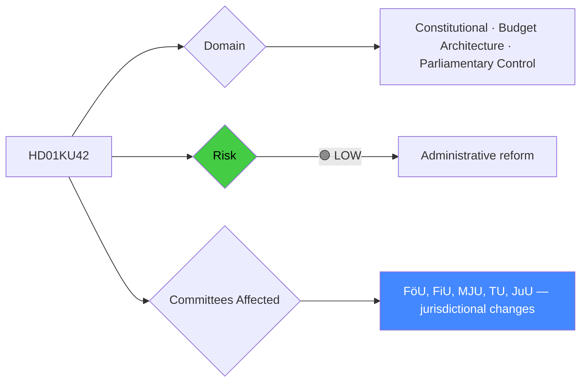

# Per-File Political Intelligence Analysis: HD01KU42

## 📋 Document Identity

| Field | Value |
|-------|-------|
| **Document ID** | `HD01KU42` |
| **Document Type** | `committeeReports` |
| **Title** | Indelning i utgiftsområden |
| **Date** | 2026-04-20 |
| **Riksmöte** | 2025/26 |
| **Source MCP Tool** | `get_betankanden` |
| **Analysis Timestamp** | 2026-04-21 04:42 UTC |
| **Analyst** | news-committee-reports |
| **Data Depth** | METADATA-ONLY |
| **Committee** | KU (Konstitutionsutskottet) |

---

## 🎯 Executive Summary

KU42 concerns the division of Sweden's state budget into expenditure areas (utgiftsområden) — the constitutional architecture that defines how Riksdag controls spending. This seemingly technical matter carries significant political weight: changes to expenditure area classification affect committee jurisdictions, budget flexibility, and governmental accountability. The Constitutional Committee handling this report indicates it has constitutional dimensions, not merely administrative ones. Coming at a time when Sweden's defense budget (utgiftsområde 6) has seen dramatic increases and climate/energy policies are reshaping infrastructure spending (UO21/22/23), the division question directly affects which committees control which funds. **[LOW]** (metadata-only)

---

## 📊 Political Classification

---

## 💪 SWOT Analysis

### Strengths
| Factor | Evidence | Confidence |
|--------|----------|------------|
| Parliamentary control | Clear expenditure areas improve accountability and audit trail | 🟩HIGH |
| Defense budget clarity | Separating defense infrastructure from general infrastructure UOs aids transparency | 🟧MEDIUM |
| Administrative modernization | Updated classifications reflect post-pandemic policy architecture | 🟧MEDIUM |

### Weaknesses
| Factor | Evidence | Confidence |
|--------|----------|------------|
| Inter-committee rivalry | Changes to UO classification shift power between committees | 🟧MEDIUM |
| Complexity | Complex cross-UO programs (climate + energy + transport) difficult to segregate cleanly | 🟧MEDIUM |

### Opportunities
| Factor | Evidence | Confidence |
|--------|----------|------------|
| Streamlined Riksdag oversight | Consolidated UOs reduce audit fragmentation | 🟧MEDIUM |

### Threats
| Factor | Evidence | Confidence |
|--------|----------|------------|
| Political manipulation of UO boundaries | Majority may draw UO lines to advantage coalition committees | 🟥LOW |

---

## 👥 Stakeholder Perspectives (Condensed)

| Stakeholder | Position |
|-------------|----------|
| **Citizens** | Low awareness; indirect impact through budget transparency |
| **Government Coalition** | Supportive of efficient budget architecture |
| **Opposition** | Alert to any UO changes that reduce oversight of defense spending |
| **Business/Industry** | Neutral; monitors UO changes affecting investment grants |
| **Civil Society** | Low interest |
| **International/EU** | No direct interest |
| **Judiciary/Constitutional** | KU mandate to ensure compliance with Riksdag Act §§ |
| **Media** | Limited interest unless linked to specific budget controversy |

---

## ⚠️ Risk Matrix

| Risk | L | I | L×I |
|------|---|---|-----|
| UO change reduces oversight of defense spending | 2 | 4 | 8 |
| Climate/energy UO fragmentation | 2 | 3 | 6 |

---

## 🗳️ Election 2026 Implications

**Electoral Impact** 🟥LOW — Highly technical; not salient to voters.

**Policy Legacy** — Establishes budget architecture for 2027+ electoral cycle governments.
