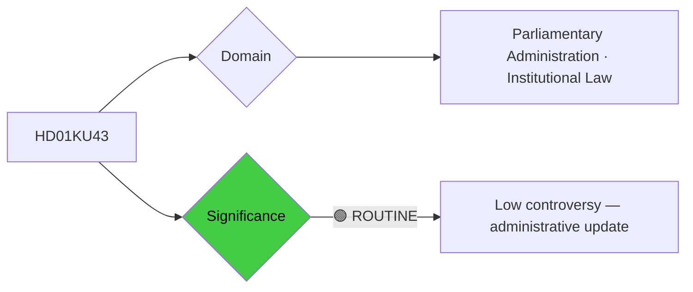

# Per-File Political Intelligence Analysis: HD01KU43

## 📋 Document Identity

| Field | Value |
|-------|-------|
| **Document ID** | `HD01KU43` |
| **Document Type** | `committeeReports` |
| **Title** | En ny lag om riksdagens medalj |
| **Date** | 2026-04-20 |
| **Riksmöte** | 2025/26 |
| **Source MCP Tool** | `get_betankanden` |
| **Analysis Timestamp** | 2026-04-21 04:42 UTC |
| **Analyst** | news-committee-reports |
| **Data Depth** | METADATA-ONLY |
| **Committee** | KU (Konstitutionsutskottet) |

---

## 🎯 Executive Summary

KU43 establishes a new law governing the Riksdag's medal — replacing outdated regulations with a modern legal framework for how parliament honors distinguished service. While ceremonially significant, this is administratively routine and politically non-contentious. The Constitutional Committee's involvement reflects Riksdag's self-governance prerogatives under Chapter 4 of the Instrument of Government. The primary political significance is in how the medal criteria are defined — who qualifies and what types of service are honored shapes Riksdag's institutional identity and its relationship with civil society partners. **[VERY LOW]**

---

## 📊 Political Classification

---

## 💪 SWOT Analysis (Condensed)

### Strengths
- Modernizes outdated medal statute; enhances institutional transparency
- Clear legal basis for Riksdag's self-governance

### Weaknesses
- Limited substantive policy impact
- Risk of criteria being perceived as politically partisan if awarded inconsistently

### Opportunities
- Signal parliamentary institutional health and non-partisan tradition

### Threats
- Minimal (administrative only)

---

## 🗳️ Election 2026 Implications

**Electoral Impact** 🟥VERY LOW — No direct electoral relevance.
