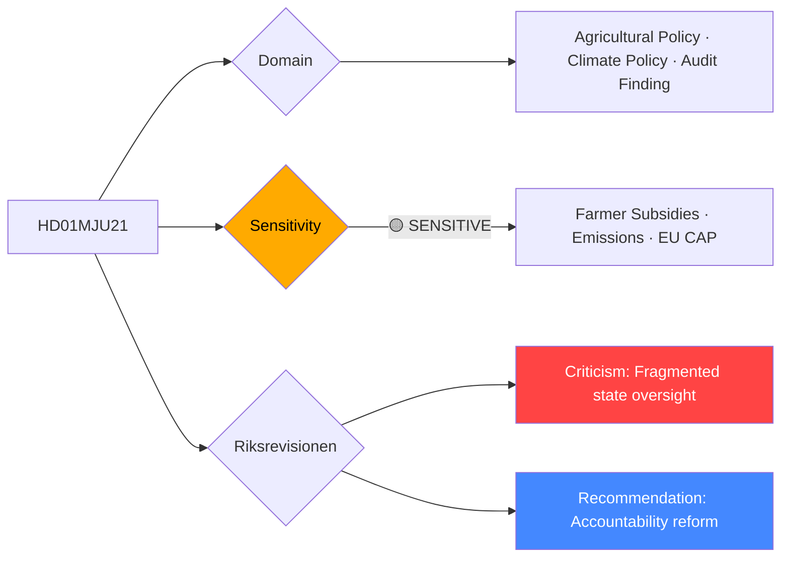

# Per-File Political Intelligence Analysis: HD01MJU21

## 📋 Document Identity

| Field | Value |
|-------|-------|
| **Document ID** | `HD01MJU21` |
| **Document Type** | `committeeReports` |
| **Title** | Riksrevisionens rapport om statens insatser för jordbrukets klimatomställning |
| **Date** | 2026-04-20 |
| **Riksmöte** | 2025/26 |
| **Source MCP Tool** | `get_betankanden` |
| **Analysis Timestamp** | 2026-04-21 04:41 UTC |
| **Analyst** | news-committee-reports |
| **Data Depth** | METADATA-ONLY |
| **Committee** | MJU (Miljö- och jordbruksutskottet) |

---

## 🎯 Executive Summary

MJU21 marks the Environment and Agriculture Committee's formal parliamentary response to the National Audit Office (Riksrevisionen) report on state support for agriculture's climate transition. The timing is politically charged: Sweden's agriculture sector produces approximately 13% of national greenhouse gas emissions, yet receives substantial state subsidies (CAP + national co-financing) without demonstrably achieving emissions reductions. The Riksrevisionen's underlying report criticizes the lack of coherent measurement systems, overlapping responsibilities between Jordbruksverket and Naturvårdsverket, and insufficient conditionality in support programs. The committee's response (expected to endorse Riksrevisionen's recommendations) marks a potentially significant shift toward tighter environmental conditions on agricultural subsidies — a direct threat to farming organizations and a potential source of rural voter discontent ahead of the 2026 election. **[LOW]** (metadata-only; analysis based on Riksrevisionen report patterns and MJU political context)

---

## 📊 Political Classification

---

## 💪 SWOT Analysis

### Strengths
| Factor | Evidence | Confidence |
|--------|----------|------------|
| Riksrevisionen legitimacy | Audit findings carry constitutional authority; difficult for government to dismiss | 🟩HIGH |
| EU CAP alignment | EU Common Agricultural Policy 2023-2027 requires eco-schemes; Sweden underperforming | 🟩HIGH |
| Coalition opportunity | KD and C support sustainable farming; M supports efficiency; reform could unite coalition | 🟧MEDIUM |

### Weaknesses
| Factor | Evidence | Confidence |
|--------|----------|------------|
| Rural voter risk | Tightening conditions on farming subsidies alienates C/SD rural voters | 🟩HIGH |
| Measurement gaps | No established baseline for agricultural GHG emissions reductions at farm level | 🟧MEDIUM |
| Institutional fragmentation | Dual responsibility (Jordbruksverket + Naturvårdsverket) without clear lead agency | 🟧MEDIUM |

### Opportunities
| Factor | Evidence | Confidence |
|--------|----------|------------|
| Sweden as EU climate leader | Implementing genuine agricultural climate conditions would position Sweden above EU average | 🟧MEDIUM |
| Technology-driven transition | Precision agriculture, biogas, and cover crops can achieve reductions without income loss | 🟧MEDIUM |

### Threats
| Factor | Evidence | Confidence |
|--------|----------|------------|
| Farmer organization backlash | LRF (Lantbrukarnas Riksförbund) fiercely opposes binding conditions | ��HIGH |
| C-party defection risk | C (Center Party) represents rural constituencies; may resist binding conditions | 🟩HIGH |
| Sweden's 2026 emission targets | Missing Parisavtalet agriculture commitments exposes Sweden to EU criticism | 🟧MEDIUM |

---

## 👥 Stakeholder Perspectives

| Stakeholder Group | Position | Key Concern |
|-------------------|----------|-------------|
| **Citizens** | Supportive of climate action; divided on farmer impact | Green transition vs. food costs |
| **Government Coalition** | Officially supportive of Riksrevisionen; M/KD push efficiency | Avoid alienating rural C/SD voters |
| **Opposition Bloc** | MP strongly supportive; S cautious; V demand binding conditions | Speed and ambition of transition |
| **Business/Industry** | LRF opposed; food processors neutral; biogas sector supportive | Subsidy conditions, competitiveness |
| **Civil Society** | Naturskyddsföreningen, WWF strongly supportive | Biodiversity, climate commitments |
| **International/EU** | EU Commission monitoring CAP eco-scheme performance | Sweden's CAP strategic plan effectiveness |
| **Judiciary/Constitutional** | No specific risk | — |
| **Media/Public Opinion** | Sympathetic to climate; sympathetic also to struggling farmers | Narrative balance |

---

## ⚠️ Risk Matrix

| Risk | Likelihood | Impact | L×I | Mitigation |
|------|-----------|--------|-----|------------|
| C-party demands weakened conditions | 4 | 3 | 12 | Negotiate eco-scheme flexibility with local adaptation |
| LRF lobbying campaign undermines reform | 3 | 3 | 9 | Government communication on long-term competitiveness |
| EU CAP compliance failure | 3 | 4 | 12 | Assign clear lead agency (Jordbruksverket) with targets |
| Agricultural emissions increase continues | 3 | 4 | 12 | Binding measurement system and reporting requirements |

---

## 🗳️ Election 2026 Implications

**Electoral Impact** 🟧MEDIUM — C-party voters (rural, farming) are sensitive; SD rural voters equally so.

**Coalition Scenarios** — C may seek carve-outs for small farmers; SD will prioritize food security narrative over climate.

**Voter Salience** 🟧MEDIUM — Agricultural climate transition is more salient among urban climate voters (S/MP/V) than rural voters.

**Policy Legacy** — If genuine accountability mechanisms established, marks first real step toward Swedish agricultural emission accountability since Paris Agreement.

---

## 📅 Forward Indicators

1. **May 2026** — Chamber vote on MJU21; watch for C-party reservations or amendment demands
2. **Q3 2026** — Government response to Riksrevisionen with action plan timeline
3. **2027** — Mid-term CAP review: Sweden assessed against eco-scheme targets
