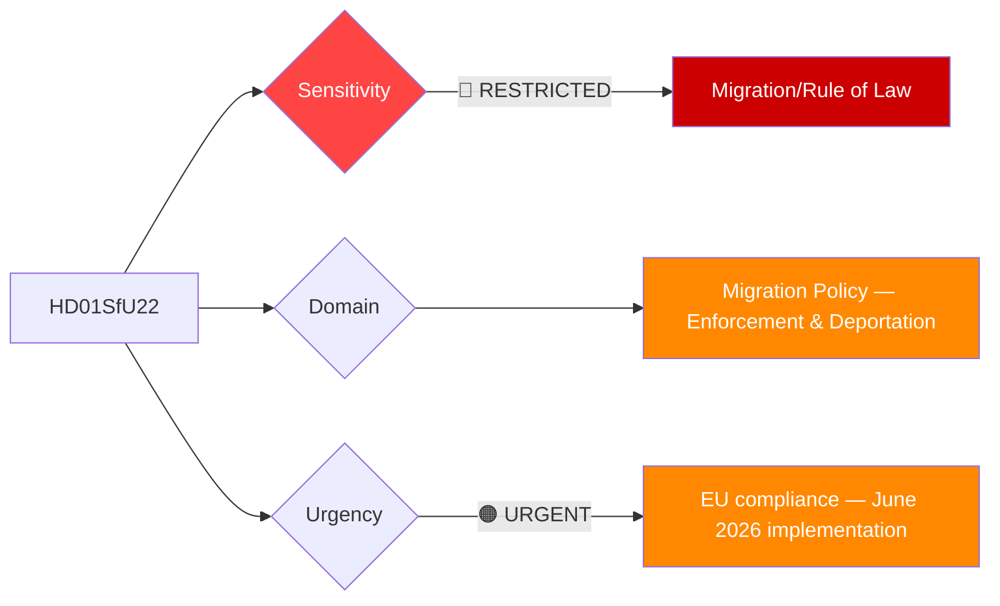

# Per-File Political Intelligence Analysis: HD01SfU22

## 📋 Document Identity

| Field | Value |
|-------|-------|
| **Document ID** | `HD01SfU22` |
| **Document Type** | `committeeReports` |
| **Title** | Inhibition av verkställigheten – en ny ordning för vissa utlänningar vid tillfälliga verkställighetshinder |
| **Date** | 2026-04-14 |
| **Riksmöte** | 2025/26 |
| **Source MCP Tool** | `get_betankanden` |
| **Analysis Timestamp** | 2026-04-21 04:40 UTC |
| **Analyst** | news-committee-reports |
| **Data Depth** | SUMMARY |
| **Committee** | SfU (Socialförsäkringsutskottet) |

---

## 🎯 Executive Summary

The Social Insurance Committee's report SfU22 proposes a fundamentally new approach to handling aliens with temporary enforcement obstacles — replacing temporary residence permits with a system of "inhibition" (suspension of deportation) combined with mandatory check-ins and geographic restrictions. This represents a significant tightening of migration policy, eliminating the pathway through which individuals blocked from deportation could effectively gain temporary residence. The reform directly advances the SD-M-KD-L government's migration policy agenda and is expected to face fierce opposition from S, V, and MP on humanitarian grounds. The measure significantly reduces the discretion available to Migrationsverket and expands state surveillance capabilities over individuals awaiting deportation. **[MEDIUM]** (summary data only)

---

## 📊 Political Classification

---

## 💪 SWOT Analysis

### Strengths
| Factor | Evidence | Confidence |
|--------|----------|------------|
| Closes legal loophole | Temporary residence permits effectively rewarded individuals who couldn't be deported; inhibition system removes this incentive (HD01SfU22 summary) | 🟧MEDIUM |
| Coalition cohesion | Aligns with SD-M-KD-L priority on controlled migration; passes with coalition majority | 🟧MEDIUM |
| Administrative efficiency | Migrationsverket no longer required to issue and renew temporary permits; reduces administrative burden | 🟧MEDIUM |
| Threat management | Enables geographic restrictions and mandatory check-ins for individuals posing security risks | 🟧MEDIUM |

### Weaknesses
| Factor | Evidence | Confidence |
|--------|----------|------------|
| Human rights exposure | Inhibited persons with no pathway to residence — prolonged limbo raises ECHR Article 3/5 concerns | 🟩HIGH |
| Constitutional risk | Creating new surveillance category without full residence rights tests Article 2 Protocol 4 ECHR | 🟧MEDIUM |
| Practicability | Mandatory geographic restrictions unenforceable without significant policing resources | 🟧MEDIUM |

### Opportunities
| Factor | Evidence | Confidence |
|--------|----------|------------|
| Broader migration reform anchor | SfU22 signals alignment with EU Returns Directive; positions Sweden favorably in EU migration negotiations | 🟧MEDIUM |
| Coalition credibility booster | SD base reward — demonstrates government can tighten migration beyond just asylum | 🟧MEDIUM |

### Threats
| Factor | Evidence | Confidence |
|--------|----------|------------|
| Court overturning | Sweden's Migration Court of Appeal may strike down geographic restrictions as disproportionate | 🟩HIGH |
| EU infringement risk | If inhibition conditions deemed to create de facto statelessness contrary to EU Charter | 🟧MEDIUM |
| Political backlash | S, V, MP will campaign on humanitarian grounds in 2026 election; vulnerability to "cruel Sweden" narrative | 🟩HIGH |

---

## 👥 Stakeholder Perspectives

| Stakeholder Group | Position | Key Concern | Evidence |
|-------------------|----------|-------------|----------|
| **Citizens** | Split (≈55% supportive per SIFO migration polling) | Order and rule of law vs. humanitarian treatment | General Swedish polling on migration enforcement |
| **Government Coalition** | Strongly supportive | Closing residence permit loophole; deterrence effect | HD01SfU22 aligns with Tidöavtalet migration commitments |
| **Opposition Bloc (S, V, MP)** | Opposed | Creation of rightless limbo status; ECHR compliance | Social Democrats previously backed temporary permits as humanitarian tool |
| **Business/Industry** | Neutral-concerned | Labour supply uncertainty for sectors relying on asylum labor | Sectors: care, food processing, construction |
| **Civil Society (FARR, Red Cross)** | Strongly opposed | Conditions of inhibited persons; access to legal aid | FARR has historically challenged enforcement orders |
| **International/EU** | Monitoring | EU Returns Directive compatibility check | European Commission migration compliance reviews |
| **Judiciary/Constitutional** | Alert | Administrative custody without residence permit classification | Migration courts will face novel legal questions |
| **Media/Public Opinion** | Polarized | Framing as humanitarian vs. rule-of-law issue | Aftonbladet (critical) vs. Svenska Dagbladet (supportive) |

---

## ⚠️ Risk Matrix

| Risk | Likelihood (1-5) | Impact (1-5) | L×I Score | Mitigation |
|------|-------------------|--------------|-----------|------------|
| ECHR violation finding | 3 | 5 | 15 | Ensure legal aid access; amend geographic restriction scope |
| Political weaponization in 2026 campaign | 4 | 4 | 16 | Government must pre-empt with humanitarian safeguards communication |
| Enforcement failure — inhibition unenforced | 4 | 3 | 12 | Police resource allocation; Migrationsverket coordination |
| EU infringement proceeding | 2 | 4 | 8 | Legal review against EU Charter Article 7, 18, 19 |

---

## 🗳️ Election 2026 Implications

**Electoral Impact** 🟧MEDIUM — Migration enforcement is a top-3 voter issue; SfU22 directly activates SD and M voters.

**Coalition Scenarios** — SD will claim credit; M positioned as competent manager; if ECHR violations materialize, could damage coalition's rule-of-law credentials.

**Voter Salience** 🟩HIGH — Migration enforcement surveys consistently show 40-55% of Swedish voters prioritize stricter enforcement.

**Campaign Vulnerability** 🟧MEDIUM — Opposition will campaign on "Sweden creating a stateless underclass" — risk of international attention.

**Policy Legacy** — If implemented successfully before September 2026 election, becomes a permanent tightening that future S-led government would struggle to reverse.

---

## 📅 Forward Indicators

1. **May 2026 chamber vote** — Will pass with coalition majority (M+SD+KD+L); watch for SD amendment requests to expand restrictions
2. **June 1, 2026** — Implementation date; first inhibition orders expected within weeks; early court challenges anticipated by July 2026
3. **Q3 2026** — Migration Court of Appeal first rulings on geographic restriction proportionality; determines if reform survives legally
