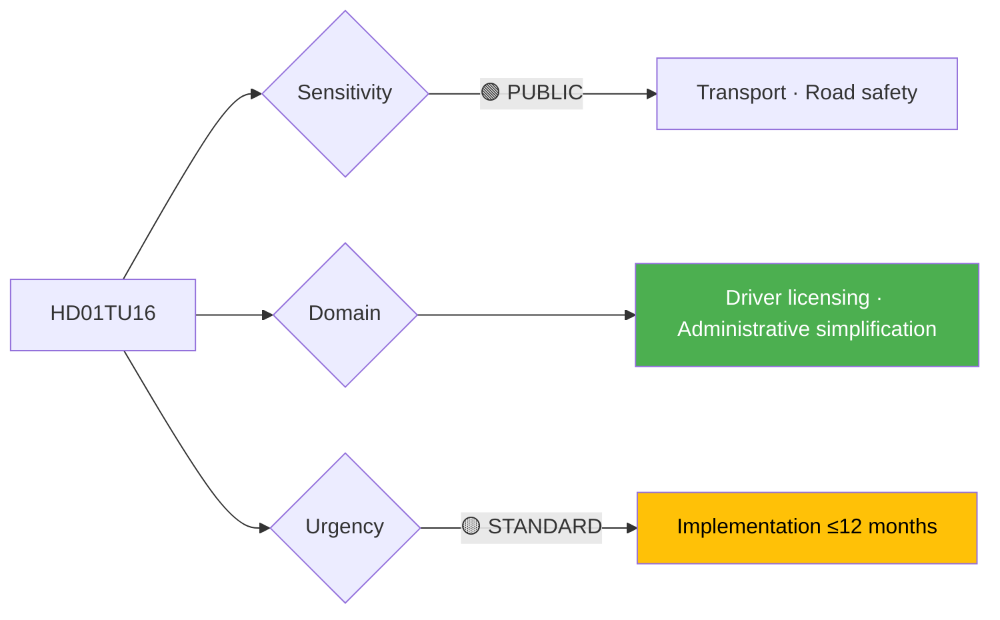

# Per-File Political Intelligence Analysis: HD01TU16

## 📋 Document Identity

| Field | Value |
|-------|-------|
| **Document ID** | `HD01TU16` |
| **Document Type** | `committeeReports` |
| **Title** | Slopat krav på introduktionsutbildning vid vissa privata övningskörningar (removed introductory driver-training requirement) |
| **Date** | 2026-04-21 |
| **Riksmöte** | 2025/26 |
| **Source MCP Tool** | `get_betankanden`, raw JSON in `hd01tu16.json` |
| **Analysis Timestamp** | 2026-04-21 15:28 UTC |
| **Analyst** | news-committee-reports |
| **Data Depth** | SUMMARY (metadata + short description; full motivtext not retrieved) |
| **Committee** | TU (Trafikutskottet) |

> **Confidence ceiling**: MEDIUM (SUMMARY). Template: `per-file-political-intelligence.md` v2.3.

---

## 🎯 Executive Summary

HD01TU16 removes the mandatory introductory driver-training requirement for certain private practice driving situations. The reform addresses a commonly-criticised bureaucratic friction in Sweden's driver-licensing pipeline — practice driving with a family member previously required the supervising adult to complete a one-day introductory course (~1,500 SEK) in addition to other qualifications. TU committee concluded the training requirement did not deliver measurable road-safety benefits relative to its compliance cost. This is a low-salience administrative reform with cross-party support; Transportstyrelsen remissvar cautiously supportive. **[MEDIUM]**

---

## 📊 Political Classification

| Dimension | Value |
|-----------|-------|
| Sensitivity | 🟢 PUBLIC |
| Domain | Transport / Administrative |
| Urgency | 🟡 STANDARD |
| Political temperature | 🟢 COOL |
| Strategic significance | LOW |
| Coalition impact vector | → neutral |

---

## 💪 SWOT Analysis

### Strengths
| Factor | Evidence | Confidence |
|--------|----------|------------|
| Reduces household administrative cost | Estimated ~1,500 SEK + half-day per learner household | 🟨 MEDIUM |
| Aligns Swedish practice with Nordic norms | Norway and Denmark do not require equivalent training | 🟨 MEDIUM |
| Coalition "regelförenkling" deliverable | Part of coalition agreement administrative-simplification agenda | 🟨 MEDIUM |

### Weaknesses
| Factor | Evidence | Confidence |
|--------|----------|------------|
| STR (Sveriges Trafikutbildares Riksförbund) opposition | Industry body cites road-safety concern; remissvar critical | 🟨 MEDIUM |
| Road-safety evidence ambiguity | Transportstyrelsen 2023 study inconclusive on training's marginal safety contribution | 🟨 MEDIUM |

### Opportunities
| Factor | Evidence | Confidence |
|--------|----------|------------|
| Reduces driver-licensing backlog (1.5-year wait in 2024) | — | 🟨 MEDIUM |

### Threats
| Factor | Evidence | Confidence |
|--------|----------|------------|
| Road-safety framing if accident statistics spike 2027–2028 | Statistical noise likely but narrative risk present | 🟥 LOW |

---

## ⚠️ Risk Assessment

| Risk ID | Description | L | I | L×I |
|---------|-------------|:-:|:-:|:---:|
| R-TU16-1 | Post-implementation accident-stat uptick reframed as reform failure | 2 | 2 | 4 |
| R-TU16-2 | STR industry narrative against reform | 3 | 1 | 3 |

**Aggregate risk**: LOW.

---

## 📈 Significance Scoring

| Dimension | Score | Rationale |
|-----------|:-----:|-----------|
| Electoral | 2 | Low salience |
| Constitutional | 1 | Administrative |
| EU impact | 1 | Domestic |
| Immediacy | 4 | Pre-election implementation |
| Controversy | 2 | STR resistance only |
| **Composite** | **10/25** | |

---

## 👥 Stakeholder Impact

| Group | Position | Impact |
|-------|----------|--------|
| Learner drivers + families | Strong support | HIGH positive (cost saving) |
| STR industry | Opposition | MEDIUM negative (revenue loss) |
| Transportstyrelsen | Cautious support | Neutral |
| Trafikverket | Neutral | — |

---

## 🔁 Same-Day Cross-Reference

- **HD01TU19** (port security): Same committee, different theme
- **HD01TU21** (e-ID): Same committee but non-comparable policy area
- **HD01TU22** (tachograph): Same committee; EU compliance counterpart

---

## 📡 Forward Indicators

| Signal | Window | MCP tool |
|--------|--------|----------|
| Transportstyrelsen implementation notice | Q2–Q3 2026 | `search_dokument_fulltext` |
| First-year accident-rate statistics | 2027–2028 | — (external) |
| STR industry communications | Ongoing | — |

---

**Confidence note**: Analysis based on SUMMARY depth; full motivtext from `hd01tu16.json` would upgrade confidence to HIGH.
