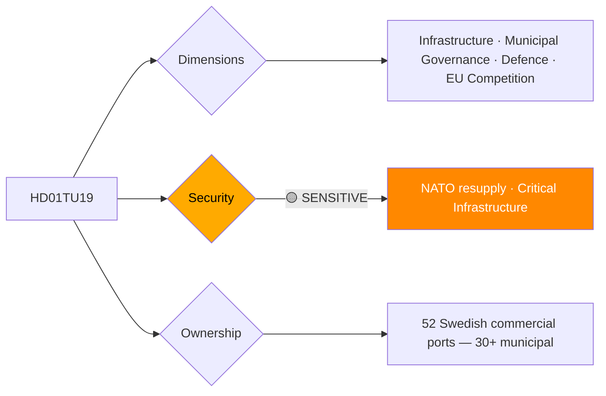

# Per-File Political Intelligence Analysis: HD01TU19

## 📋 Document Identity

| Field | Value |
|-------|-------|
| **Document ID** | `HD01TU19` |
| **Document Type** | `committeeReports` |
| **Title** | Ny lag om kommunal hamnverksamhet |
| **Date** | 2026-04-14 |
| **Riksmöte** | 2025/26 |
| **Source MCP Tool** | `get_betankanden` |
| **Analysis Timestamp** | 2026-04-21 04:43 UTC |
| **Analyst** | news-committee-reports |
| **Data Depth** | METADATA-ONLY |
| **Committee** | TU (Trafikutskottet) |

---

## 🎯 Executive Summary

TU19 introduces new legislation governing municipal port operations — a sector that intersects infrastructure ownership (kommunal self-governance), commercial port competition, EU state aid rules, and national security (civilian ports' dual-use military significance has grown since Russia's invasion of Ukraine in 2022). Sweden has 52 commercial ports; 30+ are municipally owned. The law likely addresses operational efficiency, competitive conditions relative to private ports, and potentially security classifications. Municipal port governance is directly relevant to Sweden's Total Defence (Totalförsvar) planning, as ports are critical infrastructure for NATO resupply logistics. **[LOW]** (metadata-only)

---

## 📊 Political Classification

---

## 💪 SWOT Analysis

### Strengths
- Modernizes port governance for competitive environment
- Addresses EU state aid compliance issues for municipal port subsidies
- Can codify security classification requirements for Total Defence

### Weaknesses
- Municipal autonomy constraints may limit operational efficiency reforms
- Ports vary enormously (Göteborg's massive private port vs. small municipal ferries)

### Opportunities
- NATO logistics planning requires clear port command structures
- Standardization can attract private investment partnerships

### Threats
- Municipal lobbying against commercial constraints (SKL/SKR)
- Security dimensions may create NATO-sensitive information sharing complications

---

## 🗳️ Election 2026 Implications

**Electoral Impact** 🟥LOW — Infrastructure and local governance; not a voter hot-button issue.

**Defence Dimension** 🟧MEDIUM — Parties competing on defence credibility should highlight port security improvements.
