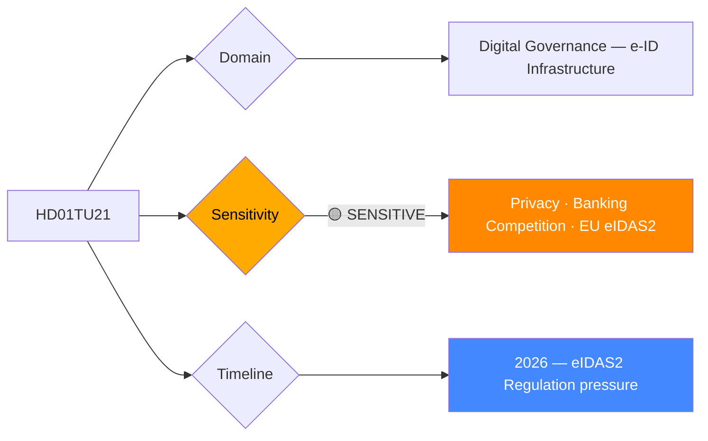

# Per-File Political Intelligence Analysis: HD01TU21

## 📋 Document Identity

| Field | Value |
|-------|-------|
| **Document ID** | `HD01TU21` |
| **Document Type** | `committeeReports` |
| **Title** | En statlig e-legitimation |
| **Date** | 2026-04-14 |
| **Riksmöte** | 2025/26 |
| **Source MCP Tool** | `get_betankanden` |
| **Analysis Timestamp** | 2026-04-21 04:41 UTC |
| **Analyst** | news-committee-reports |
| **Data Depth** | METADATA-ONLY |
| **Committee** | TU (Trafikutskottet) |

---

## 🎯 Executive Summary

TU21 proposes a state-issued electronic identity (e-legitimation) for Sweden — a policy debated for over a decade with profound implications for digital governance, private sector competition, and citizen rights. A state e-ID would reduce dependency on bank-issued BankID, which currently holds near-monopoly status among Sweden's 8.5 million digital users. The proposal places the Traffic Committee in an unusual lead role on a digital identity issue that crosses ICT, banking, and constitutional domain boundaries. The coalition government frames this as digital equity and security modernization; the opposition and banking sector have historically resisted due to competition and privacy concerns. **[LOW]** (metadata only — full assessment pending chamber debate)

---

## 📊 Political Classification

---

## 💪 SWOT Analysis

### Strengths
| Factor | Evidence | Confidence |
|--------|----------|------------|
| Digital equity | 15-20% of Swedish adults lack BankID access (elderly, migrants, unbanked) | 🟩HIGH |
| EU eIDAS2 compliance | EU eIDAS2 Regulation (effective 2024) requires member states to offer trusted digital identity wallets | 🟩HIGH |
| Security standardization | State e-ID enables higher assurance level (LoA3/4) than current commercial offerings | 🟧MEDIUM |

### Weaknesses
| Factor | Evidence | Confidence |
|--------|----------|------------|
| BankID entrenched | BankID used by 8.5M Swedes; state e-ID faces major adoption challenge | 🟩HIGH |
| Implementation cost | State infrastructure build-out estimated in hundreds of millions SEK | 🟥LOW |
| Privacy risk | Central state identity registry creates honeypot for cyberattacks and government surveillance | 🟧MEDIUM |

### Opportunities
| Factor | Evidence | Confidence |
|--------|----------|------------|
| Cross-border EU recognition | eIDAS2 enables Swedish state e-ID use across EU member states | 🟩HIGH |
| Public service modernization | Enables digital-first government services for all citizens including vulnerable groups | 🟧MEDIUM |

### Threats
| Factor | Evidence | Confidence |
|--------|----------|------------|
| Banking sector lobbying | Sweden's major banks (SEB, Handelsbanken, Swedbank, Nordea) will resist displacement of BankID revenue | 🟩HIGH |
| Implementation delay | Complex cross-ministry coordination (Finance, Justice, ICT, DIGG) risks timeline slippage | 🟧MEDIUM |

---

## 👥 Stakeholder Perspectives

| Stakeholder Group | Position | Key Concern |
|-------------------|----------|-------------|
| **Citizens** | Broadly supportive | Accessibility for excluded groups |
| **Government Coalition** | Supportive | Digital sovereignty, EU compliance |
| **Opposition Bloc** | Cautiously supportive | Privacy, implementation risks |
| **Business/Industry** | Split: banks (opposed), fintechs (opportunity) | BankID market disruption |
| **Civil Society** | Supportive | Digital inclusion for elderly, migrants |
| **International/EU** | Strongly supportive | eIDAS2 implementation deadline |
| **Judiciary/Constitutional** | Monitoring | Data protection, GDPR Article 9 |
| **Media/Public Opinion** | Positive-neutral | Long-overdue modernization |

---

## ⚠️ Risk Matrix

| Risk | Likelihood | Impact | L×I | Mitigation |
|------|-----------|--------|-----|------------|
| BankID lobbying delays implementation | 4 | 4 | 16 | Government must set firm eIDAS2 compliance deadline |
| Data breach of central e-ID registry | 2 | 5 | 10 | Defense-in-depth security architecture, distributed storage |
| Low adoption rate | 3 | 3 | 9 | Mandate for government services; interoperability with BankID |
| eIDAS2 non-compliance fine | 2 | 4 | 8 | Fast-track implementation with DIGG lead authority |

---

## 🗳️ Election 2026 Implications

**Electoral Impact** 🟧MEDIUM — Digitalization is a second-tier issue; salient for tech-savvy voters and elderly communities.

**Coalition Scenarios** — Cross-party support likely; rare area of political consensus. Government can claim digital modernization achievement.

**Voter Salience** 🟥LOW-MEDIUM — Most voters unaware of eIDAS2 pressure; framed as "making it easier to access public services."

**Policy Legacy** — If implemented, becomes a lasting digital infrastructure investment; similar to introduction of personnummer (social security number) in 1947 as foundational state identifier.

---

## 📅 Forward Indicators

1. **Q2 2026 chamber vote** — Expected to pass with broad cross-party support
2. **2026-2027** — DIGG (Agency for Digital Government) designated as implementation authority; pilot program with 50,000 users
3. **2027-2028** — Full rollout with eIDAS2 cross-border functionality
