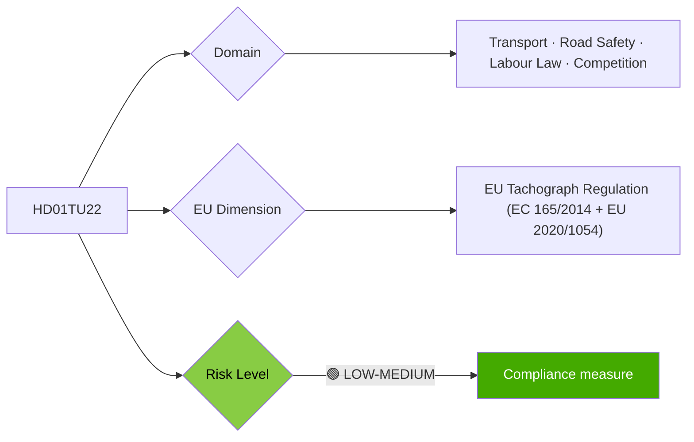

# Per-File Political Intelligence Analysis: HD01TU22

## 📋 Document Identity

| Field | Value |
|-------|-------|
| **Document ID** | `HD01TU22` |
| **Document Type** | `committeeReports` |
| **Title** | Åtgärder mot manipulation och missbruk av färdskrivare |
| **Date** | 2026-04-14 |
| **Riksmöte** | 2025/26 |
| **Source MCP Tool** | `get_betankanden` |
| **Analysis Timestamp** | 2026-04-21 04:43 UTC |
| **Analyst** | news-committee-reports |
| **Data Depth** | METADATA-ONLY |
| **Committee** | TU (Trafikutskottet) |

---

## 🎯 Executive Summary

TU22 addresses a serious problem in Sweden's road freight sector: systematic manipulation of digital tachographs (färdskrivare) — devices that record driving and rest times for trucks and buses. Tachograph manipulation enables carriers to circumvent EU working time rules, endangering road safety and creating unfair competition against compliant operators. This is an EU compliance measure with direct road safety and fair competition dimensions. The proposal likely introduces enhanced penalties, improved Transportstyrelsen inspection authority, and technical safeguards against tampering. **[LOW]** (metadata-only)

---

## 📊 Political Classification

---

## 💪 SWOT Analysis

### Strengths
- EU compliance maintains market access for Swedish transport sector
- Reduces road safety risk from fatigued drivers
- Levels competitive playing field between Swedish and Eastern European operators

### Weaknesses
- Enforcement capacity of Transportstyrelsen limited relative to traffic volume
- Swedish operators may lose competitive edge if Eastern European competitors non-compliant

### Opportunities
- Strengthen Sweden's reputation for compliance in EU transport market
- Digital tachograph blockchain verification emerging EU standard

### Threats
- Transport company lobbying against inspection costs
- Cross-border enforcement gaps (non-Swedish registered vehicles)

---

## ⚠️ Risk Matrix

| Risk | L | I | L×I |
|------|---|---|-----|
| Continued manipulation with inadequate enforcement | 3 | 3 | 9 |
| Cross-border enforcement gap | 4 | 3 | 12 |

---

## 🗳️ Election 2026 Implications

**Electoral Impact** 🟥LOW — Specialist transport sector issue; relevant to union (IF Metall, Transport) voters.
