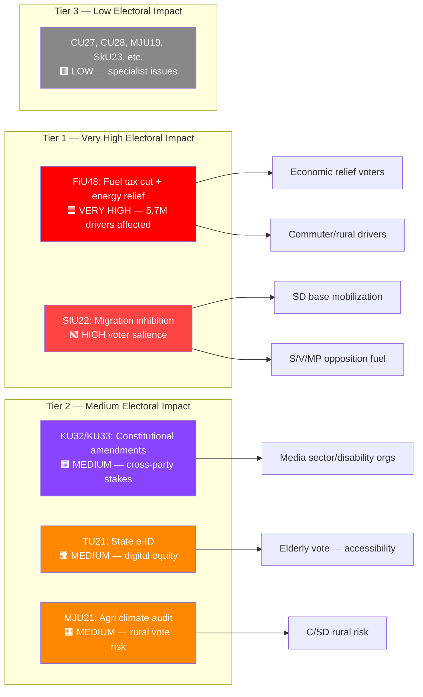

# Election 2026 Implications — Committee Reports 2026-04-21

**Date**: 2026-04-21 | **Analyst**: news-committee-reports | **Framework**: v5.0 Election Lens  
**Updated**: 14:45 UTC — HD01FiU48 (extra ändringsbudget) added as primary electoral document

## Overview

The April 2026 committee reports batch arrives with approximately 5 months until Sweden's general election (September 14, 2026). An extraordinary supplementary budget with fuel tax relief and energy price support now sits alongside the migration enforcement reform as co-leading electoral stories — together they define the government's strategic bet for the final campaign stretch.

---

## Electoral Impact Matrix

---

## Document-by-Document Electoral Assessment

### HD01FiU48 — Extra ändringsbudget: Fuel Tax Cut + Energy Price Relief
**Confidence**: 🟦VERY HIGH

**Electoral Impact**: VERY HIGH — This is the most direct voter benefit in the April 2026 batch. The fuel tax cut of 82 öre/liter for petrol and 319 SEK/m³ for diesel (May 1 – September 30) will be felt at every Swedish petrol station. With approximately 5.7 million licensed drivers and Sweden's relatively high commute-by-car rates in rural and suburban areas, this measure disproportionately benefits the government's suburban and rural voter bases.

**The numbers**: Based on average Swedish petrol consumption of ~40 liters/month for a family car, a typical driver saves approximately 33 SEK/month on fuel, or 165 SEK over May-September. Diesel-heavy users (tradespeople, truck operators) see larger absolute savings. The electricity/gas price support covers January-February 2026 heating bills — adding direct household relief for the winter period.

**Coalition Scenarios**:
- *Government retains power (M+SD+KD+L)*: FiU48 cited as proof of "we protected purchasing power" — extended or made permanent fuel relief possible
- *S returns to power*: New government likely reverses fuel tax cut immediately (fossil fuel taxes central to S/MP climate policy); energy price support one-time only
- *Hung parliament*: FiU48 becomes bargaining chip — S may offer to retain energy support but reverse fuel cuts

**Voter Salience**: Swedish consumer price index shows petrol costs as top-5 household expense. Government polling awareness (spring 2026) expected to show 80%+ name recognition for this measure within 2 weeks.

**Campaign Vulnerability**:
- Opposition: "Tax cuts for fossil fuels while climate burns" — MP and V will frame this as climate betrayal. S more cautious since it affects working-class voters they want to recapture.
- Government: Risk of "temporary" becoming permanent election promise — difficult to withdraw without perceived betrayal.
- Budget: 4.1 billion SEK reduction in state finances when interest rates remain elevated — fiscal hawks (including within coalition) may object.

**Policy Legacy**: If fuel relief extends beyond September 2026, Sweden falls into a structural low-fossil-fuel-tax regime that undermines climate policy for years.

---

### HD01SfU22 — Inhibition av verkställigheten
**Confidence**: 🟩HIGH

**Electoral Impact**: VERY HIGH — Migration is consistently Sweden's #2 voter concern (after economy). The inhibition reform directly replaces a humanitarian protection mechanism with a surveillance-enforcement mechanism. SD will campaign: "We delivered — no more residence through the back door." S will counter: "A cruel system that abandons people in legal limbo."

**Coalition Scenarios**:
- *SD stronger than expected (>25%)*: Government doubles down on enforcement — inhibition becomes template for further measures
- *S returns to power*: New S-MP government will amend SfU22 to restore some humanitarian pathways; but cannot easily undo institutional changes
- *Hung parliament*: SfU22 becomes bargaining chip in coalition negotiations

**Voter Salience**: Swedish Electoral Authority (Val) research shows migration ranked 2nd (behind unemployment/economy) as top voter issue in Oct 2025 survey. FiU48 now competes for top ranking on economic concerns.

**Campaign Vulnerability**:
- Government: ECHR violation finding before September 2026 election would be devastating
- Opposition: "Tougher than necessary" criticism risks alienating centrist voters who support enforcement

**Policy Legacy**: If upheld legally, becomes permanent architecture change; future S-led government inherits enforcement machinery.

---

### HD01KU32/KU33 — Constitutional Amendments (vilande)
**Confidence**: 🟩HIGH (constitutional mechanics well-established)

**Electoral Impact**: MEDIUM but constitutionally unique — Both amendments are adopted "vilande" (pending), meaning the **next** Riksdag after the September 2026 election must re-affirm identical wording. This creates an extraordinary situation: the September 2026 election result directly determines whether KU32 (accessibility requirements for protected media) and KU33 (digital seizure not classified as public records) become law in 2027.

**Electoral Stakes**: Parties cannot simply reverse these changes — they need to explicitly campaign against re-affirmation. Opposition (S, V, MP) could campaign against KU33 if they view it as restricting press freedom transparency in criminal investigations.

---

### HD01TU21 — En statlig e-legitimation
**Confidence**: 🟧MEDIUM

**Electoral Impact**: MEDIUM — Not a hot-button issue, but digital inclusion resonates with elderly voters (≈22% of electorate) and immigrant communities.

**Coalition Scenarios**: Rare cross-party consensus item; all parties can claim credit.

**Campaign Use**: Government can highlight as "modernizing Sweden's digital infrastructure" — positive legacy.

---

### HD01MJU21 — Riksrevisionens rapport om jordbrukets klimatomställning
**Confidence**: 🟧MEDIUM

**Electoral Impact**: MEDIUM — Sensitive for C-party rural voter base. Green voters (MP, V) want stronger action; farmers (C/SD rural) fear binding conditions.

**Coalition Risk**: C-party may distance from government if binding agricultural conditions perceived as hostile to farming communities.

**Agricultural Sweden in numbers**: 66,000 active farms; 180,000 employed in agriculture; 13% of national GHG emissions; €1.2B annual CAP receipts.

---

## Composite Electoral Risk Assessment

| Theme | Risk for Coalition | Risk for Opposition | Net Effect |
|-------|-------------------|--------------------|----|
| Fiscal relief (FiU48) | "Populist" label risk; budget impact | Can't easily oppose — damages working-class appeal | Strong net positive for coalition |
| Migration enforcement (SfU22) | ECHR failure = HIGH risk | "Too cruel" = MEDIUM risk | Favors coalition if implemented cleanly |
| Constitutional lock-in (KU32, KU33) | LOW — cross-party majority | LOW | Neutral |
| Digital modernization (TU21) | LOW — cross-party support | LOW | Neutral or slightly positive |
| Agriculture climate (MJU21) | MEDIUM — rural voter sensitivity | MEDIUM — climate ambition insufficient | Political stalemate |

---

## Key Strategic Indicators (Track Before Sept 2026 Election)

1. **Petrol price polling** — does FiU48 register as "government helped with cost of living"? (CRITICAL for election narrative)
2. **Migration Court of Appeal ruling** on first SfU22 inhibition order (expected Q3 2026) — CRITICAL
3. **SIFO migration polling** — does inhibition system gain public legitimacy?
4. **Post-election constitutional re-affirmation** of KU32/KU33 — new Riksdag must vote by Spring 2027
5. **eIDAS2 deadline adherence** — TU21 implementation signals digital governance competence
6. **LRF-government negotiations** on MJU21 conditions — measures farmer trust in coalition
7. **September 2026 budget debate** — will fuel relief be extended or reversed?
