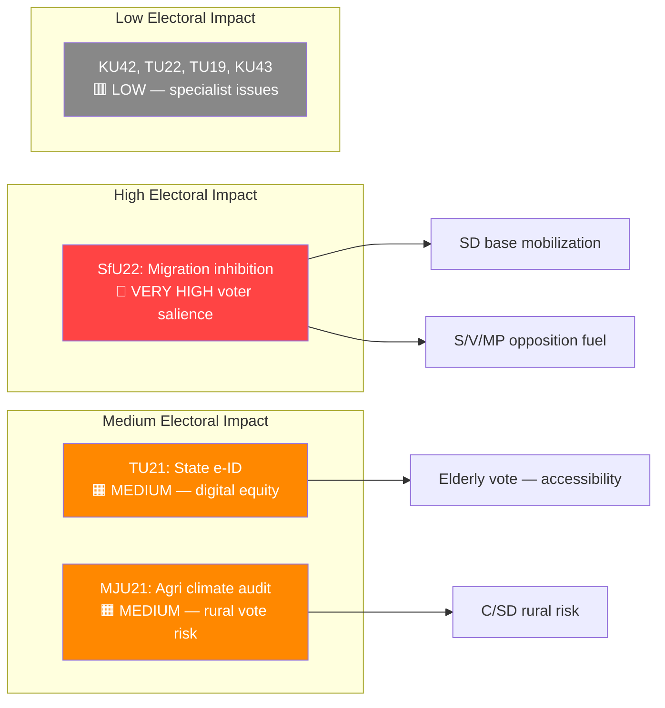

# Election 2026 Implications — Committee Reports 2026-04-21

**Date**: 2026-04-21 | **Analyst**: news-committee-reports | **Framework**: v5.0 Election Lens

## Overview

The April 2026 committee reports batch arrives with approximately 5 months until Sweden's general election (September 14, 2026). Migration enforcement, digital modernization, and agricultural climate policy intersect with key electoral battlegrounds.

---

## Electoral Impact Matrix

---

## Document-by-Document Electoral Assessment

### HD01SfU22 — Inhibition av verkställigheten
**Confidence**: 🟩HIGH

**Electoral Impact**: VERY HIGH — Migration is consistently Sweden's #2 voter concern (after economy). The inhibition reform directly replaces a humanitarian protection mechanism with a surveillance-enforcement mechanism. SD will campaign: "We delivered — no more residence through the back door." S will counter: "A cruel system that abandons people in legal limbo."

**Coalition Scenarios**:
- *SD stronger than expected (>25%)*: Government doubles down on enforcement — inhibition becomes template for further measures
- *S returns to power*: New S-MP government will amend SfU22 to restore some humanitarian pathways; but cannot easily undo institutional changes
- *Hung parliament*: SfU22 becomes bargaining chip in coalition negotiations

**Voter Salience**: Swedish Electoral Authority (Val) research shows migration ranked 2nd (behind unemployment/economy) as top voter issue in Oct 2025 survey.

**Campaign Vulnerability**: 
- Government: ECHR violation finding before September 2026 election would be devastating
- Opposition: "Tougher than necessary" criticism risks alienating centrist voters who support enforcement

**Policy Legacy**: If upheld legally, becomes permanent architecture change; future S-led government inherits enforcement machinery

---

### HD01TU21 — En statlig e-legitimation
**Confidence**: 🟧MEDIUM

**Electoral Impact**: MEDIUM — Not a hot-button issue, but digital inclusion resonates with elderly voters (≈22% of electorate) and immigrant communities.

**Coalition Scenarios**: Rare cross-party consensus item; all parties can claim credit.

**Campaign Use**: Government can highlight as "modernizing Sweden's digital infrastructure" — positive legacy.

---

### HD01MJU21 — Riksrevisionens rapport om jordbrukets klimatomställning
**Confidence**: 🟧MEDIUM

**Electoral Impact**: MEDIUM — Sensitive for C-party rural voter base. Green voters (MP, V) want stronger action; farmers (C/SD rural) fear binding conditions.

**Coalition Risk**: C-party may distance from government if binding agricultural conditions perceived as hostile to farming communities.

**Agricultural Sweden in numbers**: 66,000 active farms; 180,000 employed in agriculture; 13% of national GHG emissions; €1.2B annual CAP receipts.

---

## Composite Electoral Risk Assessment

| Theme | Risk for Coalition | Risk for Opposition | Net Effect |
|-------|-------------------|--------------------|---------
| Migration enforcement (SfU22) | ECHR failure = HIGH risk | "Too cruel" = MEDIUM risk | Favors coalition if implemented cleanly |
| Digital modernization (TU21) | LOW — cross-party support | LOW | Neutral or slightly positive for coalition |
| Agriculture climate (MJU21) | MEDIUM — rural voter sensitivity | MEDIUM — climate ambition insufficient | Political stalemate likely |

---

## Key Strategic Indicators (Track Before Sept 2026 Election)

1. **Migration Court of Appeal ruling** on first SfU22 inhibition order (expected Q3 2026) — CRITICAL
2. **SIFO migration polling** — does inhibition system gain public legitimacy?
3. **eIDAS2 deadline adherence** — TU21 implementation signals digital governance competence
4. **LRF-government negotiations** on MJU21 conditions — measures farmer trust in coalition
5. **EU Commission** CAP compliance review of Sweden (annual report due Nov 2026)
