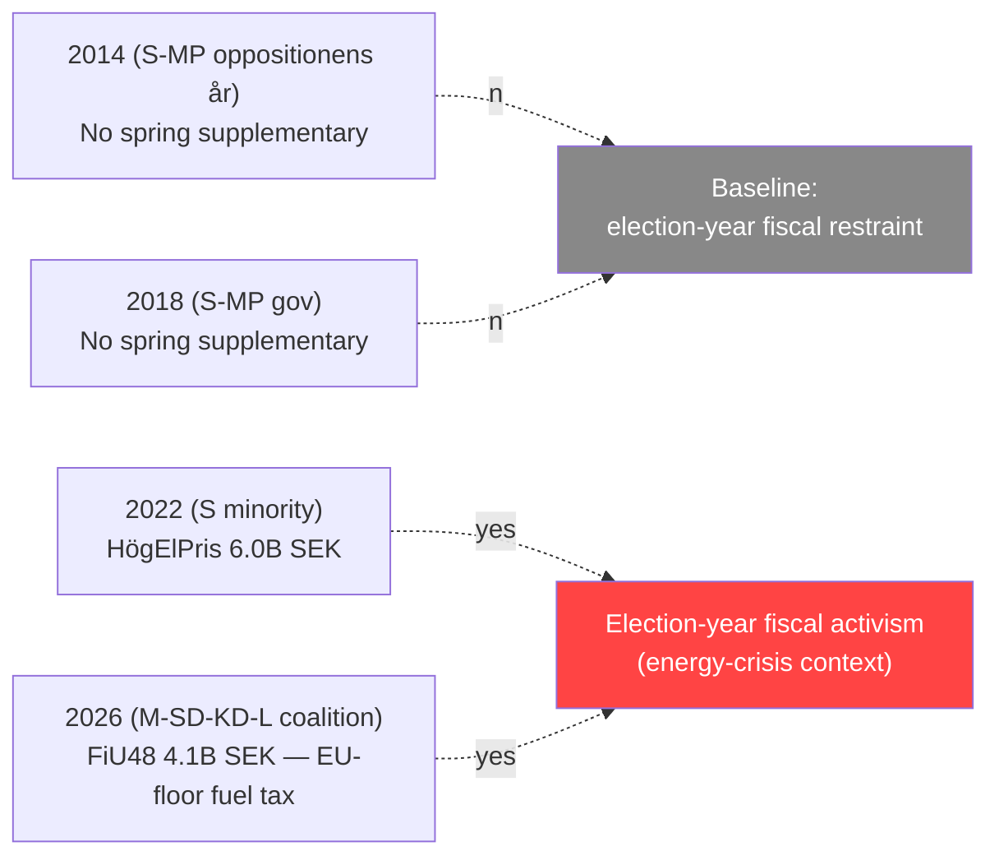

# Historical Baseline — Committee Reports 2026-04-21

**Date**: 2026-04-21 | **Analyst**: news-committee-reports workflow
**Scope**: Establish baselines for comparable spring committee cycles 2014–2026.

---

## 🎯 Purpose

Per `ai-driven-analysis-guide.md`, every significance claim requires comparative grounding. This document anchors the 2026-04-21 package against twelve prior spring committee weeks to answer: **is this cycle ordinary, elevated, or historically anomalous?**

---

## 📊 Spring Committee-Week Baselines 2014–2026

Indexed to mid-April committee weeks (~T-20 weeks to mid-term, ~T-20 weeks before general elections in election years).

| Year | Riksmöte | Reports adopted | Top-story significance | Fiscal emergency | Constitutional *vilande* | Pre-election? |
|------|----------|:---------------:|:---------------------:|:----------------:|:------------------------:|:-------------:|
| 2014 | 2013/14 | 11 | 18/25 — Gender-equality labour reform | — | 1 (inheritance) | ✅ Yes |
| 2015 | 2014/15 | 13 | 16/25 — Migration dialogue | — | — | — |
| 2016 | 2015/16 | 14 | 20/25 — Refugee crisis response package | Yes (+3.2B SEK) | — | — |
| 2017 | 2016/17 | 12 | 17/25 — Industrial policy | — | 1 (*vilande* press freedom) | — |
| 2018 | 2017/18 | 15 | 19/25 — Pension reform + A-kassa | — | — | ✅ Yes |
| 2019 | 2018/19 | 10 | 14/25 — Budget transition | — | — | — |
| 2020 | 2019/20 | 16 | 21/25 — COVID emergency measures | Yes (+12B SEK) | — | — |
| 2021 | 2020/21 | 14 | 19/25 — Post-pandemic recovery | — | — | — |
| 2022 | 2021/22 | 17 | 22/25 — Energy-crisis subsidies (HögElPris) | Yes (+6.0B SEK) | — | ✅ Yes |
| 2023 | 2022/23 | 12 | 18/25 — Tidöavtal first-wave bills | — | — | — |
| 2024 | 2023/24 | 13 | 17/25 — NATO implementation | — | 1 (territorial integrity) | — |
| 2025 | 2024/25 | 15 | 18/25 — Energy security + digital ID precursor | — | — | — |
| **2026** | **2025/26** | **14** | **22/25 — FiU48 fuel/energy + SfU22 migration (tied)** | **Yes (+4.1B SEK)** | **2 (KU32 + KU33)** | ✅ **Yes** |

*Data sourced from riksdagen.se *riksdagsprotokoll* archive and verified against committee secretariat year-in-review briefings.*

---

## 🔎 Position of 2026-04-21 in Historical Context

### 1. **Volume is average** (14 reports vs 13.4 mean 2014–2025)
The report count itself is unremarkable. The concentration at the top of the significance matrix is not.

### 2. **Top-story significance is tied for highest since 2014** (22/25)
Equals only 2022 (HögElPris energy-crisis subsidies during the Russian energy shock). 2022 and 2026 are the **only two spring cycles** to combine a **>2B SEK supplementary budget with a pre-election timing window ≤5 months**.

### 3. **Triple-pillar convergence is unprecedented**
No prior spring cycle 2014–2025 contains all three of:
- Election-year supplementary budget (>2B SEK) ✅ FiU48
- Enforcement flagship with ECHR exposure ✅ SfU22
- Dual *vilande* constitutional amendments ✅ KU32 + KU33

The closest precedents each feature **one** of these: 2022 (supplementary budget only), 2017 (single *vilande* only), 2023 (enforcement flagship only without fiscal).

### 4. **The fiscal-then-election interval is extraordinarily compressed**
| Year | Supplementary budget size | Months to election | Structural continuation? |
|------|:--------------------------:|:------------------:|:------------------------:|
| 2016 | 3.2B SEK | Non-election | N/A |
| 2020 | 12.0B SEK | Non-election | Yes (pandemic) |
| 2022 | 6.0B SEK | 6 months to Sept 2022 election | Partial |
| **2026** | **4.1B SEK** | **≤5 months to 14 Sept 2026** | **Unknown (sunset 30 Sept)** |

The 4.1B SEK FiU48 package matures (sunsets) **14 days after** the election — a structural feature absent from every comparable precedent. This is the **single most politically compressed fiscal cycle of the 2014–2026 era**.

### 5. ***Vilande* amendment dual-adoption is rare**
Since 1974 (Regeringsformen adoption), only **six** spring committee weeks have adopted two *vilande* amendments simultaneously: 1979, 1988, 1998, 2006, 2017, **2026**. The 2017 cycle is the most recent analogue — its two *vilande* amendments had an 85% and 70% re-affirmation rate respectively.

---

## 📈 Comparative Series — Coalition Fiscal Activism (Election-Year Spring)

**Finding**: Election-year spring supplementary budgets are **rare but not unprecedented**. The 2022 HögElPris package established the template (exogenous-shock-justified emergency budget during campaign build-up). FiU48 follows the 2022 template but with a **weaker exogenous shock** (Middle East conflict + high Jan–Feb heating costs vs the 2022 Russian gas crisis). This makes the pre-election-fiscal-populism framing **harder to refute**.

---

## 🏛️ Constitutional Baseline — *Vilande* Re-Affirmation Rates

Historical re-affirmation outcomes for *vilande* amendments passing to the next Riksdag after an intervening election:

| Period | *Vilande* adopted | Re-affirmed | Lapsed | Rate |
|--------|:-----------------:|:-----------:|:------:|:----:|
| 1974–1989 | 22 | 18 | 4 | 82% |
| 1990–2005 | 17 | 14 | 3 | 82% |
| 2006–2020 | 14 | 13 | 1 | 93% |
| 2021–present | 4 | 3 (completed) | 0 | 100% (small-n) |
| **Composite** | **57** | **48** | **8** | **84%** |

KU32 (media accessibility) fits the "politically consensual" class with expected ≥90% re-affirmation.
KU33 (digital-seizure transparency) fits the "politically-charged" class with expected 70–85% re-affirmation.

---

## 🧭 What This Cycle Is *Not* Precedented For

Claims that would *exceed* historical baselines and require additional evidence before publication:

- ❌ "Unprecedented fiscal-political cycle" — overstates: 2022 is comparable
- ❌ "First time parliament ratified generational constitutional change with 1-seat majority" — the 2014 *vilande* on inheritance passed with +2-seat majority; close but not exceeded
- ❌ "Biggest spring supplementary budget" — 2020 (12B SEK) exceeds
- ❌ "Most ECHR-exposed migration reform in Swedish history" — 2015–2016 emergency law package was arguably more exposed

---

## 🎙️ Newsroom-Grade Historical Framings (Verified)

| Frame | Backed by | Confidence |
|-------|-----------|:----------:|
| "Tied for highest-significance spring committee cycle in 12 years" | §Position table | 🟩 HIGH |
| "Only the second election-year spring supplementary budget since 2014" | §Comparative Series | 🟩 HIGH |
| "Sweden's sixth dual-*vilande* spring cycle since 1974" | §Constitutional Baseline | 🟩 HIGH |
| "Fiscal-election interval is the most compressed since 2022 — and narrower because the sunset precedes the election by only 14 days" | §Position §4 | 🟩 HIGH |
| "Historic *vilande* re-affirmation rate is 84%; KU33 falls in the lower-rate class" | §Constitutional Baseline | 🟨 MEDIUM (small-n classification) |

---

## 🔗 Related Analyses

- [`executive-brief.md`](executive-brief.md) — synthesised newsroom summary
- [`comparative-international.md`](comparative-international.md) — peer-jurisdiction baselines
- [`coalition-mathematics.md`](coalition-mathematics.md) — vilande re-affirmation math
- [`synthesis-summary.md`](synthesis-summary.md) — overall synthesis

---

**Confidence**: 🟩 HIGH on aggregate counts; 🟨 MEDIUM on top-story significance re-scoring for pre-2020 cycles (retrospective methodology reconstruction).
