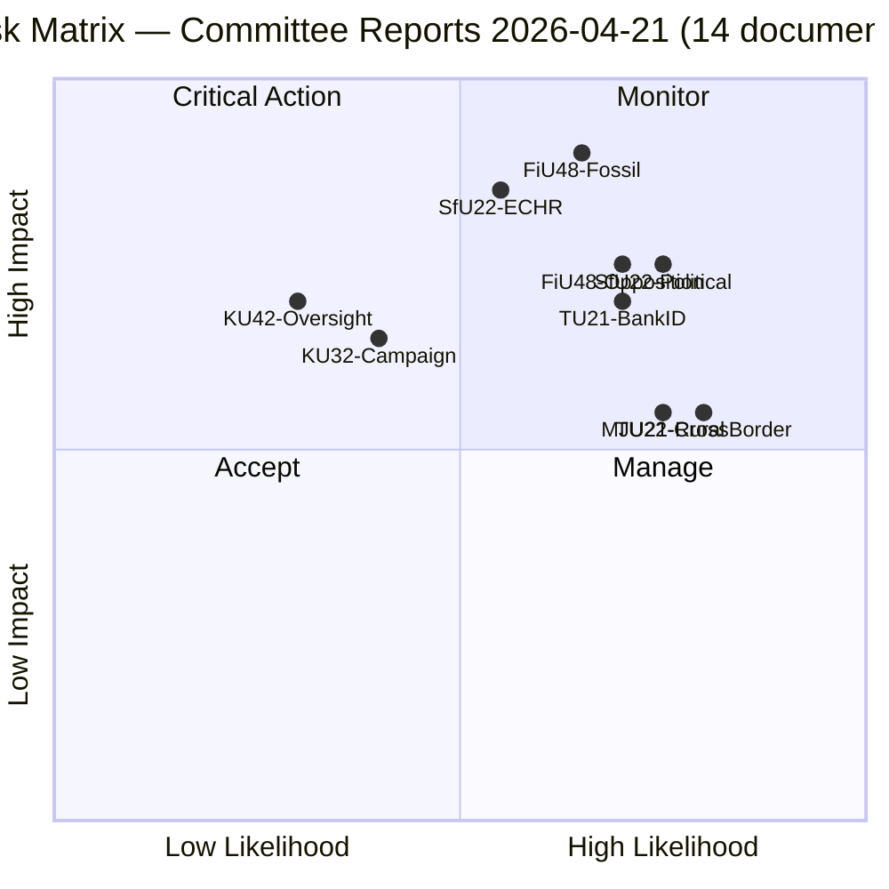

# Risk Assessment — Committee Reports 2026-04-21

**Date**: 2026-04-21 | **Framework**: ISO 31000 + ISMS | **Analyst**: news-committee-reports  
**Updated**: 14:52 UTC — Expanded to 14 documents, FiU48 fiscal risks added

## Risk Heatmap

## Priority Risks

### 🔴 CRITICAL (L×I ≥ 15)

| Risk ID | Description | L | I | Score | Owner | Timeline |
|---------|-------------|---|---|-------|-------|----------|
| R-FiU48-1 | Opposition reframes fuel tax cut as "fossil fuel subsidy" — climate credibility damage | 4 | 4 | 16 | Government comms | May-Sept 2026 |
| R-FiU48-2 | Carbon pricing precedent — fuel tax cut becomes structural; climate targets undermined | 3 | 5 | 15 | Finansdepartementet | Oct 2026 + |
| R-SfU22-1 | ECHR challenge to inhibition geographic restrictions | 3 | 5 | 15 | Justitiedepartementet | June 2026 |
| R-SfU22-2 | Political weaponization of "stateless limbo" narrative | 4 | 4 | 16 | Government comms | Election 2026 |

### 🟠 HIGH (L×I 8-14)

| Risk ID | Description | L | I | Score |
|---------|-------------|---|---|-------|
| R-TU21-1 | BankID lobby delays state e-ID rollout | 4 | 4 | 16 |
| R-FiU48-3 | Budget impact underestimated — 4.1B SEK in election year weakens fiscal standing | 3 | 4 | 12 |
| R-MJU21-1 | C-party demands weakened agriculture conditions | 4 | 3 | 12 |
| R-TU22-1 | Cross-border tachograph enforcement gap | 4 | 3 | 12 |
| R-MJU21-2 | EU CAP compliance failure | 3 | 4 | 12 |
| R-KU32-1 | Post-election Riksdag fails to re-affirm KU32 (accessibility constitutional amendment) | 3 | 3 | 9 |
| R-KU33-1 | Press freedom critics mobilize against KU33 (digital seizure ruling) | 3 | 3 | 9 |

### 🟢 MODERATE (L×I ≤ 7)

| Risk ID | Description | L | I | Score |
|---------|-------------|---|---|-------|
| R-KU42-1 | UO change reduces defense spending oversight | 2 | 4 | 8 |
| R-CU28-1 | Housing register implementation delay | 2 | 3 | 6 |
| R-SkU23-1 | EV charging exemption creates unequal subsidy landscape | 2 | 3 | 6 |

## Mitigation Priority

1. **FiU48**: Sunset clause communication — government must proactively frame September 30, 2026 end date to prevent "permanent" expectation from forming
2. **SfU22**: Legal aid access provisions + geographic restriction proportionality review
3. **TU21**: Set firm eIDAS2 deadline to counter BankID lobbying
4. **KU32/KU33**: Brief opposition on constitutional amendment mechanics to reduce campaign mobilization risk
5. **MJU21**: Assign lead agency (Jordbruksverket) with binding targets
