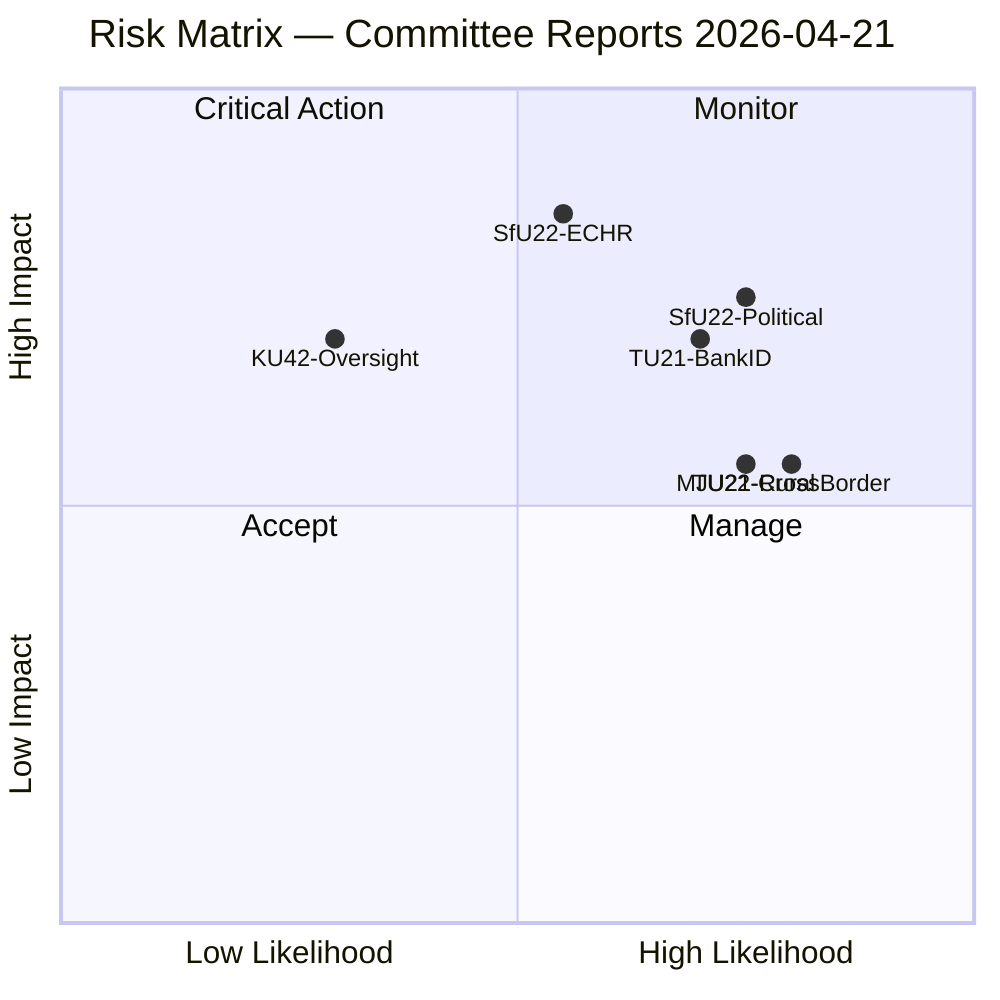

# Risk Assessment — Committee Reports 2026-04-21

**Date**: 2026-04-21 | **Framework**: ISO 31000 + ISMS | **Analyst**: news-committee-reports

## Risk Heatmap

## Priority Risks

### 🔴 CRITICAL (L×I ≥ 15)

| Risk ID | Description | L | I | Score | Owner | Timeline |
|---------|-------------|---|---|-------|-------|----------|
| R-SfU22-1 | ECHR challenge to inhibition geographic restrictions | 3 | 5 | 15 | Justitiedepartementet | June 2026 |
| R-SfU22-2 | Political weaponization of "stateless limbo" narrative | 4 | 4 | 16 | Government comms | Election 2026 |

### 🟠 HIGH (L×I 8-14)

| Risk ID | Description | L | I | Score |
|---------|-------------|---|---|-------|
| R-TU21-1 | BankID lobby delays state e-ID rollout | 4 | 4 | 16 |
| R-MJU21-1 | C-party demands weakened agriculture conditions | 4 | 3 | 12 |
| R-TU22-1 | Cross-border tachograph enforcement gap | 4 | 3 | 12 |
| R-MJU21-2 | EU CAP compliance failure | 3 | 4 | 12 |

### 🟢 MODERATE (L×I ≤ 7)

| Risk ID | Description | L | I | Score |
|---------|-------------|---|---|-------|
| R-KU42-1 | UO change reduces defense spending oversight | 2 | 4 | 8 |
| R-TU19-1 | Port security gaps in NATO context | 2 | 4 | 8 |

## Mitigation Priority

1. **SfU22**: Legal aid access provisions + geographic restriction proportionality review
2. **TU21**: Set firm eIDAS2 deadline to counter BankID lobbying
3. **MJU21**: Assign lead agency (Jordbruksverket) with binding targets
