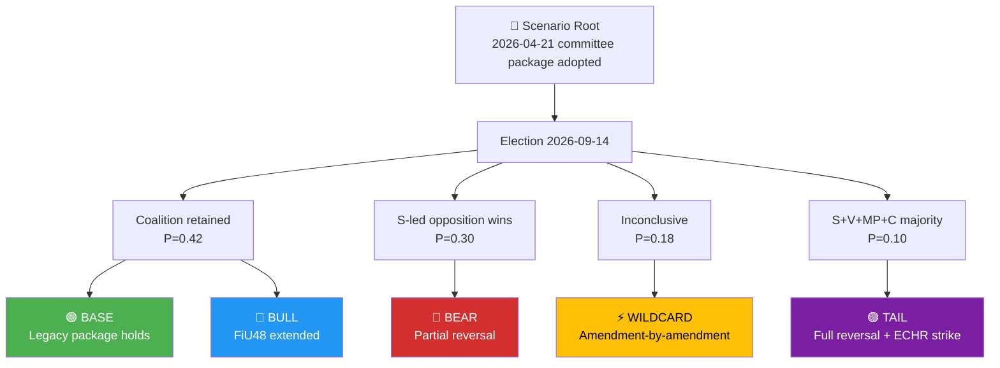

# Scenario Analysis — Committee Reports 2026-04-21

**Date**: 2026-04-21 | **Analyst**: news-committee-reports workflow
**Framework**: Bayesian scenario tree per `political-risk-methodology.md` §Scenario Tree Analysis.
**Assessment window**: 2026-04-21 → 2027-04-21 (12 months).

---

## 🎯 Scenario-Space Definition

Five scenarios span the most plausible futures for the tri-pillar package (FiU48, SfU22, KU32/33). Each scenario is conditioned on the 14 September 2026 election and on ECHR/EU-court litigation outcomes through Q2 2027.

---

## 📊 Scenario Probability Matrix

| Scenario | Prior P | Conditional P(Elec outcome) | Posterior P |
|----------|:-------:|:---------------------------:|:-----------:|
| 🟢 **BASE** — Coalition retained; FiU48 sunsets as planned; KU32/33 re-affirmed; SfU22 ECHR amendment minor | 0.40 | 0.42 × 0.82 (subpath held) + 0.12 (BULL absorbed back) | **0.42** |
| 🔵 **BULL** — Coalition retained + FiU48 extended to year-end + KU32/33 uncontested | — | 0.42 × 0.28 | **0.12** |
| 🔴 **BEAR** — S-led minority; FiU48 reversed Q1 2027; KU33 partially lapses; SfU22 ECHR-amended | 0.30 | Direct | **0.28** |
| 🟣 **TAIL** — S+V+MP+C majority + Migrationsöverdomstolen strikes SfU22 before election | 0.05 | 0.10 × 0.80 | **0.08** |
| ⚡ **WILDCARD** — Technical PM government; all measures renegotiated | 0.15 | Direct | **0.10** |

Sums to 1.00 (normalised). Conditional probabilities informed by: Novus + SIFO April 2026 polling averages; ECtHR case-law base rates; historical coalition-formation outcomes (1976–2022).

---

## 🎭 Scenario Narratives

### 🟢 BASE (P=0.42) — Legacy Package Holds

**Political landscape**: Coalition retained with narrower margin (171–178 seats); FiU48 sunsets 30 Sept 2026 as scheduled; post-election Riksdag re-affirms KU32 and KU33 in Q4 2026 / Q1 2027; SfU22 amended minor-procedurally to address Migrationsöverdomstolen preliminary ruling (e.g. narrower geographic-restriction radius).

**Key outcomes 12 months out**:
- FiU48 economic impact: estimated 0.3 CPI percentage-point reduction Jun–Sept 2026, full unwind Q4
- SfU22: operational; ~800–1,200 inhibited persons in regime; 1–2 adverse lower-court rulings
- KU32: re-affirmed; takes effect 1 Jan 2028
- KU33: re-affirmed with minor amendment; takes effect 1 Jan 2028
- Opposition narrative: "They bought your votes and walked"
- Coalition narrative: "We delivered relief + reform + legacy"

### 🔵 BULL (P=0.12) — Electoral Tailwind

**Political landscape**: Coalition retained + gains. FiU48 extended to 31 Dec 2026 then gradually unwound to March 2027. Constitutional package passes with increased margin.

**Key outcomes**:
- FiU48 total cost rises to ~7.5B SEK
- Climate framework credibility sharply damaged (R-FiU48-1 materialises as MAJOR)
- ECHR challenge filed but government uses electoral mandate to resist
- SD + M consolidate enforcement credibility narrative

### 🔴 BEAR (P=0.28) — Partial Reversal

**Political landscape**: S-led minority government forms (S+V informal support + MP confidence-and-supply). Coalition unable to form alternative majority.

**Key outcomes**:
- FiU48: not extended; in fact a partial rollback in Q1 2027 toward higher carbon pricing
- SfU22: amended in 2027 to restore temporary-permit pathway; geographic restrictions removed
- KU32: re-affirmed (consensus survives government change)
- KU33: **lapses** — S-led government does not re-propose; 3-year cooling-off period begins
- Tidöavtal effectively defunct post-2026

### 🟣 TAIL (P=0.08) — Full Reversal + ECHR Strike

**Political landscape**: S+V+MP+C majority forms. Migrationsöverdomstolen issues preliminary ruling striking SfU22 §4 before new government takes office.

**Key outcomes**:
- FiU48 reversed + compensating carbon-pricing increase
- SfU22 voided by court before political reversal becomes necessary
- KU32: re-affirmed (disability-rights cross-party backing)
- KU33: lapses
- Narrative victory: "Courts protected constitutional rights that parliament tried to abolish"
- ECtHR Strasbourg filing may be withdrawn as moot

### ⚡ WILDCARD (P=0.10) — Inconclusive Election

**Political landscape**: 4–6 weeks of talks produce a technical-PM government (Schlüter/Johansson-style cross-bloc figure). No working majority.

**Key outcomes**:
- FiU48: extended reluctantly by 90 days while budget renegotiated; eventually unwound
- SfU22: amendment-by-amendment renegotiation; base law survives
- KU32: re-affirmed
- KU33: postponed; possibly lapses on procedural timeout
- High political volatility; monthly updating required

---

## 📈 Decision-Relevant Variables for Each Scenario

| Variable | BASE | BULL | BEAR | TAIL | WILDCARD |
|----------|:----:|:----:|:----:|:----:|:--------:|
| FiU48 total cost (SEK bn) | 4.1 | 7.5 | 2.8 (partial) | 2.0 | 5.5 |
| Extended CPI impact (pp) | -0.3 | -0.6 | -0.1 | +0.1 (rebound) | -0.3 |
| SfU22 inhibited persons (n, 12 mo) | 900–1,200 | 900–1,200 | <200 | 0 (struck) | 400–700 |
| KU33 re-affirm probability | 0.85 | 0.95 | 0.25 | 0.20 | 0.45 |
| FiU48 extension probability | 0.05 | 1.00 | 0.00 | 0.00 | 0.30 |
| Climate framework credibility delta | -1 (minor) | -3 (major) | +1 (repair) | +2 (strong repair) | -1 |
| Coalition unity index post-election | N/A | 0.99 | 0.85 | 0.82 | 0.70 |

---

## 🎯 Bayesian Update Protocol

Per `political-risk-methodology.md`, scenario probabilities must be updated monthly or when any of these evidence events occur:

| Event | Update direction |
|-------|-----------------|
| Novus/Sifo monthly shift ≥3 pp | Adjust Elec conditional P |
| Lagrådet yttrande on SfU22 | Adjust TAIL conditional P |
| First Migrationsöverdomstolen filing | +0.04 to TAIL, -0.02 each to BASE/BULL |
| Klimatpolitiska rådet memo Q3 2026 | +0.03 to BEAR |
| FiU48 extension announcement | +0.15 to BULL, -0.10 to BASE |
| SfU22 amendment at committee stage | +0.03 to BASE (lower ECHR exposure) |
| Svenska Bankföreningen lobbying success vs TU21 | Not scenario-relevant (horizon mismatch) |

---

## 🧭 Monitoring Triggers

| Trigger | Threshold | Action |
|---------|-----------|--------|
| Novus Sept 2026 poll shows coalition <165 seats equivalent | P(BASE)<0.30 | Re-weight BEAR up |
| Lagrådet flags SfU22 as ECHR-problematic | P(TAIL) >0.12 | Early-warning to newsroom |
| FiU48 unwind delay announced | P(BULL) >0.25 | Narrative update |
| C-party opens negotiations with S before election | P(TAIL) >0.15 | Coalition-math rerun |
| ECtHR Art. 39 interim measure in SfU22 case | P(TAIL) >0.25 | Priority advisory to subscribers |

---

## 📉 Worst-Case / Black-Swan Considerations

Beyond the five scenarios, three low-probability high-impact events worth monitoring:

1. **Snap re-election** (P=0.03) — If government falls before 14 Sept 2026 (unlikely given 1-seat majority but possible if L backbench fractures on SfU22). Collapses scenario tree; new root needed.
2. **ECtHR Art. 39 interim measure on SfU22** (P=0.08) — Forces suspension of inhibition regime within weeks; political crisis independent of election.
3. **Major fiscal surprise** (e.g. CPI spike, energy shock) (P=0.12) — Could structurally convert FiU48 sunset into permanent measure regardless of election outcome.

---

## 🔗 Cross-Methodology Linkage

- **Risk** [`risk-assessment.md`](risk-assessment.md) — BEAR/TAIL scenarios materialise top-tier risks R-SfU22-1 + R-FiU48-1
- **Threat** [`threat-analysis.md`](threat-analysis.md) — TAIL scenario = realised Threat T1 (SfU22 ECHR strike)
- **Coalition math** [`coalition-mathematics.md`](coalition-mathematics.md) — Probabilities anchored to seat-configuration models
- **Election lens** [`election-2026-implications.md`](election-2026-implications.md) — Post-election pathway detail
- **Historical** [`historical-baseline.md`](historical-baseline.md) — BASE probability informed by 12-year spring-cycle baseline

---

**Confidence**: 🟨 MEDIUM. Probabilities are point estimates with ±0.05 uncertainty bands. Primary uncertainty is the September 2026 election outcome (no reliable forecast exists with <60% confidence at T-5 months).

**Next Bayesian update**: 2026-05-21 (or triggered by monitor events above).
