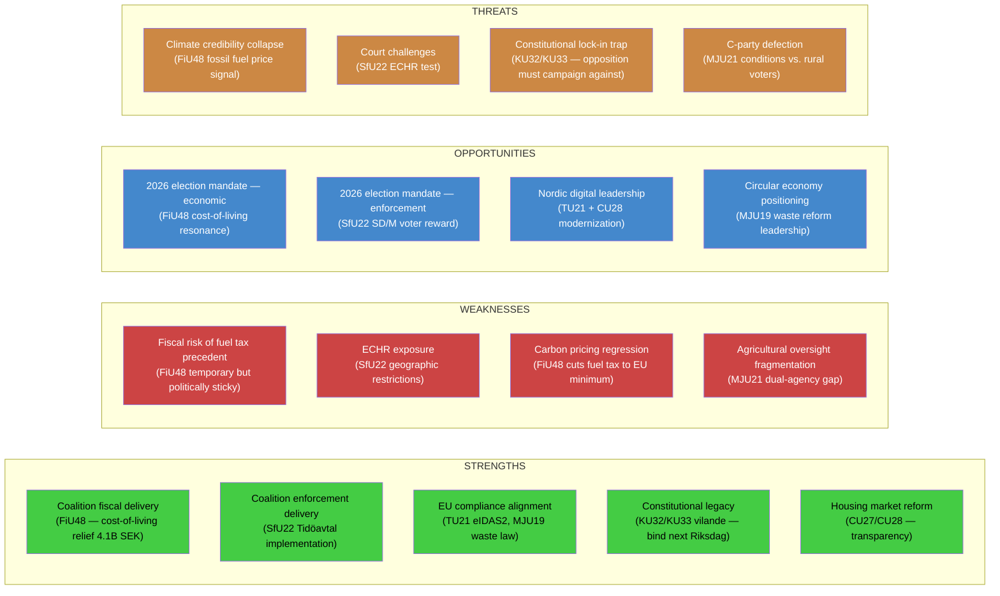

# SWOT Analysis — Committee Reports 2026-04-21

**Date**: 2026-04-21 | **Analyst**: news-committee-reports | **Scope**: All 14 committee reports  
**Updated**: 14:50 UTC — Expanded to 14 documents including HD01FiU48 (extra ändringsbudget)

## Overall Legislative Batch Assessment

## Dimension Details

### STRENGTHS
| Strength | Evidence | Docs | Confidence |
|---------|---------|------|------------|
| Fiscal relief to voters | Fuel tax cut 82 öre/liter + el/gas support; 5.7M drivers benefit | HD01FiU48 | 🟦VERY HIGH |
| Coalition enforcement delivery | SfU22 implements Tidöavtal migration commitment | HD01SfU22 | 🟩HIGH |
| EU compliance leadership | TU21 (eIDAS2), MJU19 (waste directive), FiU48 (ETD minimum) | HD01TU21, HD01MJU19, HD01FiU48 | 🟩HIGH |
| Digital equity advance | 1.5M Swedes without BankID access gain identity option | HD01TU21 | 🟩HIGH |
| Housing market transparency | National bostadsrätts register improves mortgage clarity; anti-money-laundering property ID rules | HD01CU27, HD01CU28 | 🟩HIGH |
| Constitutional legacy | KU32/KU33 vilande bind next government to accessibility and seizure rules | HD01KU32, HD01KU33 | 🟩HIGH |
| Circular economy progress | Waste legislation clarifies responsibility, enables circular economy | HD01MJU19 | 🟧MEDIUM |

### WEAKNESSES
| Weakness | Evidence | Docs | Confidence |
|---------|---------|------|------------|
| Fossil fuel price signal regression | Fuel tax to EU minimum undercuts Sweden's carbon leadership | HD01FiU48 | 🟩HIGH |
| ECHR exposure | Geographic restriction + mandatory check-in = liberty risk | HD01SfU22 | 🟩HIGH |
| Budgetary fragility | -4.1B SEK in election year; if extended = structural weakness | HD01FiU48 | 🟩HIGH |
| Agricultural oversight fragmentation | Riksrevisionen identified dual-agency responsibility gap | HD01MJU21 | 🟩HIGH |
| Technical displacement challenge | BankID monopoly entrenched; state e-ID faces adoption battle | HD01TU21 | 🟩HIGH |
| Climate audit non-response | MJU20 climate framework audit shows policy fragmentation | HD01MJU20 | 🟧MEDIUM |

### OPPORTUNITIES
| Opportunity | Evidence | Docs | Confidence |
|------------|---------|------|------------|
| Economic narrative dominance | FiU48 gives government "on your side" economic story | HD01FiU48 | 🟦VERY HIGH |
| Election mandate activation | SfU22 rewards SD/M base; demonstrates delivery | HD01SfU22 | 🟩HIGH |
| Nordic e-ID leadership | Sweden can model state e-ID for Denmark, Norway, Finland | HD01TU21 | 🟧MEDIUM |
| Housing market reform credit | Two CU reforms improve consumer protection | HD01CU27, HD01CU28 | 🟧MEDIUM |
| Environmental compliance | MJU19 positions Sweden as circular economy leader | HD01MJU19 | 🟧MEDIUM |

### THREATS
| Threat | L×I | Docs | Confidence |
|-------|-----|------|------------|
| Opposition reframes FiU48 as fossil fuel subsidy | 16 | HD01FiU48 | 🟩HIGH |
| Carbon price precedent locks in lower fossil fuel taxes | 15 | HD01FiU48 | 🟩HIGH |
| ECHR challenge to SfU22 geographic restrictions | 15 | HD01SfU22 | 🟩HIGH |
| Political "cruel Sweden" narrative (SfU22) | 16 | HD01SfU22 | 🟩HIGH |
| Banking lobby delays TU21 implementation | 16 | HD01TU21 | 🟩HIGH |
| C-party defection on MJU21 conditions | 12 | HD01MJU21 | 🟧MEDIUM |
| KU32/KU33 campaign mobilization against constitutional amendments | 10 | HD01KU32, HD01KU33 | 🟧MEDIUM |
