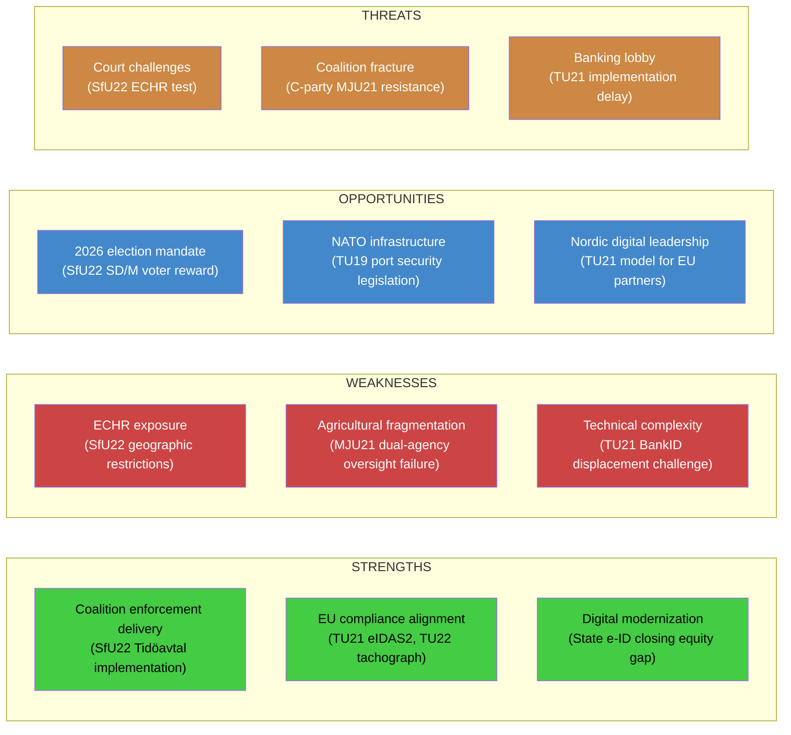

# SWOT Analysis — Committee Reports 2026-04-21

**Date**: 2026-04-21 | **Analyst**: news-committee-reports | **Scope**: All 7 new committee reports

## Overall Legislative Batch Assessment

## Dimension Details

### STRENGTHS
| Strength | Evidence | Docs | Confidence |
|---------|---------|------|------------|
| Coalition enforcement delivery | SfU22 implements Tidöavtal migration commitment | HD01SfU22 | 🟩HIGH |
| EU compliance leadership | TU21 (eIDAS2), TU22 (tachograph regulation) advance EU alignment | HD01TU21, HD01TU22 | 🟩HIGH |
| Digital equity advance | 1.5M Swedes without BankID access gain identity option | HD01TU21 | 🟩HIGH |
| Parliamentary self-governance | KU43 modernizes Riksdag's institutional law | HD01KU43 | 🟧MEDIUM |
| Circular economy alignment | MJU19 waste legislation (prior covered period) + MJU21 | HD01MJU21 | 🟧MEDIUM |

### WEAKNESSES
| Weakness | Evidence | Docs | Confidence |
|---------|---------|------|------------|
| ECHR exposure | Geographic restriction + mandatory check-in = liberty risk | HD01SfU22 | 🟩HIGH |
| Agricultural oversight fragmentation | Riksrevisionen identified dual-agency responsibility gap | HD01MJU21 | 🟩HIGH |
| Technical displacement challenge | BankID monopoly entrenched; state e-ID faces adoption battle | HD01TU21 | 🟩HIGH |
| Enforcement resource gap | Tachograph inspection and port security underfunded | HD01TU22, HD01TU19 | 🟧MEDIUM |

### OPPORTUNITIES
| Opportunity | Evidence | Docs | Confidence |
|------------|---------|------|------------|
| Election mandate activation | SfU22 rewards SD/M base; demonstrates delivery | HD01SfU22 | 🟩HIGH |
| Nordic e-ID leadership | Sweden can model state e-ID for Denmark, Norway, Finland | HD01TU21 | 🟧MEDIUM |
| NATO security codification | TU19 can establish port security standards for Allied logistics | HD01TU19 | 🟧MEDIUM |
| Agricultural transformation | MJU21 opens door to technology-driven emission reduction | HD01MJU21 | 🟧MEDIUM |

### THREATS
| Threat | L×I | Docs | Confidence |
|-------|-----|------|------------|
| ECHR challenge to SfU22 geographic restrictions | 15 | HD01SfU22 | 🟩HIGH |
| Political "cruel Sweden" narrative | 16 | HD01SfU22 | 🟩HIGH |
| Banking lobby delays TU21 implementation | 16 | HD01TU21 | 🟩HIGH |
| C-party defection on MJU21 conditions | 12 | HD01MJU21 | 🟧MEDIUM |
| Cross-border tachograph enforcement gap | 12 | HD01TU22 | 🟧MEDIUM |
