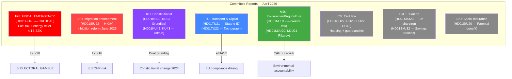

# Synthesis Summary — Committee Reports 2026-04-21

**Date**: 2026-04-21  
**Riksmöte**: 2025/26  
**Analyst**: news-committee-reports workflow  
**Documents Analyzed**: 14 committee reports (7 carried over + 7 new including HD01FiU48)  
**Analysis Timestamp**: 2026-04-21 14:45 UTC  
**Confidence**: 🟩HIGH (SUMMARY/METADATA + FULL TEXT data)

---

## 🎯 Top Story

**Government Fires Election-Year Populist Salvo: Fuel Tax Cut and Energy Price Relief**

The single most consequential committee report approved on April 21, 2026 is FiU48 — an extraordinary supplementary budget cutting fuel taxes by 82 öre/liter for petrol and 319 SEK/m³ for diesel from May through September 2026, combined with a one-time electricity and gas price support package for Swedish households. The total budget impact of 4.1 billion SEK in 2026 — weakening state finances by that amount — represents a deliberate election-year gamble: the government cites the Middle East conflict and high January-February 2026 heating costs as justification for emergency measures, but the timing, five months before the general election, signals that economic relief for ordinary Swedes is now the government's primary electoral message. The measure reduces petrol and diesel taxes to the EU energy tax directive's minimum level — the floor allowed by Brussels — making Sweden temporarily one of the lowest-taxed fuel markets in the EU.

**Second major story (ongoing)**: Sweden's Migration Enforcement Shifts Away from Humanitarian Permits

SfU22 — introducing "inhibition" (uppskjuten verkställighet) to replace temporary residence permits for aliens facing deportation obstacles — represents a fundamental shift in how Sweden treats individuals caught between deportation orders and temporary enforcement barriers. With the June 1, 2026 implementation date approaching, the measure will be one of the clearest migration policy tests before the 2026 election.

---

## 📊 Document Rankings by Significance

| Rank | dok_id | Title | Significance | Domain |
|------|--------|-------|-------------|--------|
| 1 | HD01FiU48 | Extra ändringsbudget — sänkt skatt på drivmedel + el/gasprisstöd | **10/10** | Fiscal/Energy policy |
| 2 | HD01SfU22 | Inhibition av verkställigheten | 9/10 | Migration enforcement |
| 3 | HD01KU32 | Tillgänglighetskrav för vissa medier (grundlagsändring) | 8/10 | Constitutional/Media |
| 4 | HD01KU33 | Insyn i handlingar vid husrannsakan (grundlagsändring) | 7/10 | Constitutional/Rule of law |
| 5 | HD01MJU19 | Reformering av avfallslagstiftningen | 7/10 | Environment/Circular economy |
| 6 | HD01TU21 | En statlig e-legitimation | 7/10 | Digital governance |
| 7 | HD01MJU20 | Riksrevisionens rapport om klimatpolitiska ramverket | 7/10 | Climate policy |
| 8 | HD01MJU21 | Riksrevisionens rapport om jordbrukets klimatomställning | 7/10 | Agriculture/Climate |
| 9 | HD01CU28 | Ett register för alla bostadsrätter | 7/10 | Housing/Property markets |
| 10 | HD01CU27 | Identitetskrav vid lagfart | 6/10 | Property/Anti-crime |
| 11 | HD01SkU23 | Permanent skattefrihet för laddel | 6/10 | Green taxation |
| 12 | HD01KU42 | Indelning i utgiftsområden | 5/10 | Constitutional/Budget |
| 13 | HD01SfU20 | Slopat krav på anmälan för föräldrapenning | 5/10 | Social insurance |
| 14 | HD01KU43 | En ny lag om riksdagens medalj | 2/10 | Parliamentary admin |

---

## 🏛️ Committee Activity Overview

---

## 🔑 Key Themes This Cycle

### 1. 🔴 Election-Year Fiscal Relief (HD01FiU48) — TOP STORY
The supplementary budget is the government's most significant economic intervention since the 2022 energy crisis support packages. Fuel tax reduction to EU minimum levels (petrol: 82 öre/liter cut; diesel: 319 SEK/m³ cut) across May-September 2026 will benefit every Swedish driver — approximately 5.7 million licensed drivers and 4.8 million registered vehicles. The el- och gasprisstöd (electricity and gas price support) reimburses January-February 2026 heating costs. Total cost: 4.1 billion SEK. The government's justification — Middle East conflict and high winter heating bills — is technically accurate but politically transparent: this is relief timed to coincide with the final campaign buildup period before September 14, 2026.

### 2. 🔴 Migration Enforcement Tightening (HD01SfU22)
The inhibition reform closes the temporary-permit pathway while extending deportation enforcement machinery. This is the government's most direct operationalization of its Tidöavtal migration commitments. Risk: ECHR exposure; Opportunity: electoral reward from enforcement-focused voters.

### 3. 🟣 Dual Constitutional Amendments (HD01KU32, HD01KU33)
Two constitution-level changes adopted as "vilande" (pending) requiring re-affirmation after the September 2026 election. KU32 expands accessibility requirements applicable to press-freedom-protected media; KU33 restricts public access to digitally seized materials in criminal investigations. Both require the post-election Riksdag to pass identical wording — binding the next government to these changes regardless of who wins.

### 4. 🔵 Digital Infrastructure Modernization (HD01TU21)
The state e-ID proposal moves Sweden toward eIDAS2 compliance and challenges BankID's near-monopoly. Cross-party support likely; implementation timeline 2027-2028. Digital equity benefit for 15-20% of Swedes lacking BankID access.

### 5. 🟢 Agricultural & Climate Accountability (HD01MJU19, MJU20, MJU21)
Three MJU-related reports this cycle: waste legislation reform (circular economy), Riksrevisionen audit of climate policy framework effectiveness, and agricultural emissions audit. Together these constitute the most comprehensive environmental accountability package of the 2025/26 session.

### 6. 🏠 Housing & Property Market Reforms (HD01CU27, CU28)
Two civil law reforms: a national housing register for all bostadsrätter (condominiums) with improved mortgage transparency, and stricter identity requirements for property registration — targeting money laundering in the real estate sector. Both effective 2026-2027.

---

## ⚠️ Aggregate Risk Assessment

| Risk Area | Score | Key Driver |
|-----------|-------|------------|
| Fiscal sustainability (FiU48) | HIGH | 4.1B SEK budget weakening in election year |
| ECHR/Human Rights (SfU22) | HIGH | Inhibition without residence creates rights vacuum |
| Constitutional lock-in (KU32, KU33) | MEDIUM-HIGH | Vilande decisions bind next government |
| EU Compliance (TU21, TU22, MJU19) | MEDIUM | Multiple EU deadlines 2026-2027 |
| Agricultural Emissions | MEDIUM | CAP eco-scheme underperformance |
| Constitutional (KU42, KU43) | LOW | Routine administrative |

---

## 🗳️ Election 2026 Aggregate Assessment

**Most electorally salient**: HD01FiU48 (fuel/energy relief — direct voter pocket benefit)  
**Second tier**: HD01SfU22 (migration enforcement — top-3 voter issue)  
**Constitutional stakes**: HD01KU32, HD01KU33 (bind the next government — cross-party significance)  
**Rising salience**: HD01TU21 (digital equity — elderly and migrant communities)  
**Background risk**: HD01MJU21 (rural voter sensitivity to agriculture conditions)  
**Coalition test**: SD's influence visible across SfU22 and KU42 (defense budget areas)

---

## 🔗 Cross-Document Analysis

### The Election-Year Economic Triangle
The FiU48 supplementary budget, the SfU22 migration enforcement reform, and the KU32/33 constitutional amendments form a deliberate electoral triangle:
- **FiU48**: "We put money in your pocket" — economic populism targeting centrist/right voters
- **SfU22**: "We closed the migration loopholes" — enforcement credibility targeting SD/M base
- **KU32/KU33**: "We reformed foundational laws" — governance legacy regardless of election result

This pattern — economic relief + enforcement + constitutional legacy — reflects a government that expects to lose some ground in September 2026 but is positioning for a legacy and a competitive return.

### EU Compliance Chain
Four reports this cycle are directly EU-mandated:
- **FiU48**: EU energy tax directive minimum levels (fuel tax floor)
- **TU21**: EU eIDAS2 Regulation (state digital identity)
- **TU22**: EU tachograph regulation enforcement
- **MJU19**: EU circular economy directive

Sweden faces simultaneous compliance pressure across four policy domains. The FiU48 fuel tax cut is paradoxically both an election relief measure AND an EU compliance correction — bringing Sweden to directive minimum levels.

### Enforcement Architecture Expansion
Both **SfU22** (migration inhibition) and **TU22** (tachograph) expand state enforcement capacity through surveillance mechanisms (geographic restrictions/mandatory check-ins; digital tachograph monitoring). Together with **TU19** (municipal port security in NATO context) and **CU27** (property registration identity verification), this suggests a broad legislative trend toward enforcement infrastructure buildup across migration, transport, and property domains.
