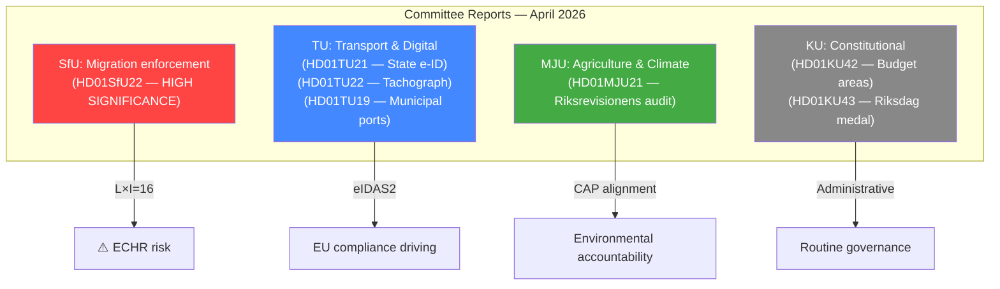

# Synthesis Summary — Committee Reports 2026-04-21

**Date**: 2026-04-21  
**Riksmöte**: 2025/26  
**Analyst**: news-committee-reports workflow  
**Documents Analyzed**: 7 new committee reports  
**Analysis Timestamp**: 2026-04-21 04:45 UTC  
**Confidence**: 🟧MEDIUM (SUMMARY/METADATA data)

---

## 🎯 Top Story

**Sweden's Migration Enforcement Shifts Away from Humanitarian Permits**

The most politically charged committee report this cycle is SfU22 — introducing "inhibition" (uppskjuten verkställighet) to replace temporary residence permits for aliens facing deportation obstacles. This represents a fundamental shift in how Sweden treats individuals caught between deportation orders and temporary enforcement barriers — eliminating a pathway that critics saw as a backdoor to residence, and that supporters viewed as basic humanitarian protection. With the June 1, 2026 implementation date approaching, the measure will be one of the clearest migration policy tests before the 2026 election.

---

## 📊 Document Rankings by Significance

| Rank | dok_id | Title | Significance | Domain |
|------|--------|-------|-------------|--------|
| 1 | HD01SfU22 | Inhibition av verkställigheten | 9/10 | Migration enforcement |
| 2 | HD01TU21 | En statlig e-legitimation | 7/10 | Digital governance |
| 3 | HD01MJU21 | Riksrevisionens rapport om jordbrukets klimatomställning | 7/10 | Agriculture/Climate |
| 4 | HD01KU42 | Indelning i utgiftsområden | 5/10 | Constitutional/Budget |
| 5 | HD01TU22 | Åtgärder mot manipulation av färdskrivare | 4/10 | Transport/EU compliance |
| 6 | HD01TU19 | Ny lag om kommunal hamnverksamhet | 4/10 | Infrastructure/Defence |
| 7 | HD01KU43 | En ny lag om riksdagens medalj | 2/10 | Parliamentary admin |

---

## 🏛️ Committee Activity Overview

---

## 🔑 Key Themes This Cycle

### 1. Migration Enforcement Tightening (HD01SfU22)
The inhibition reform closes the temporary-permit pathway while extending deportation enforcement machinery. This is the government's most direct operationalization of its Tidöavtal migration commitments. Risk: ECHR exposure; Opportunity: electoral reward from enforcement-focused voters.

### 2. Digital Infrastructure Modernization (HD01TU21)
The state e-ID proposal moves Sweden toward eIDAS2 compliance and challenges BankID's near-monopoly. Cross-party support likely; implementation timeline 2027-2028. Digital equity benefit for 15-20% of Swedes lacking BankID access.

### 3. Agricultural Climate Accountability (HD01MJU21)
Riksrevisionen's audit forces parliamentary acknowledgment that Sweden's agricultural emissions policies are fragmented and under-measured. Political sensitivity: rural voters (C/SD base) versus climate commitments.

### 4. Transport Sector Modernization (HD01TU22, HD01TU19)
Two transport bills address EU compliance (tachograph rules) and municipal port governance — the latter carrying growing national security significance given Sweden's NATO membership.

---

## ⚠️ Aggregate Risk Assessment

| Risk Area | Score | Key Driver |
|-----------|-------|------------|
| ECHR/Human Rights (SfU22) | HIGH | Inhibition without residence creates rights vacuum |
| EU Compliance (TU21, TU22) | MEDIUM | eIDAS2 and tachograph EU deadlines |
| Agricultural Emissions | MEDIUM | CAP eco-scheme underperformance |
| Constitutional (KU42, KU43) | LOW | Routine administrative |

---

## 🗳️ Election 2026 Aggregate Assessment

**Most electorally salient**: HD01SfU22 (migration enforcement — top-3 voter issue)  
**Rising salience**: HD01TU21 (digital equity — elderly and migrant communities)  
**Background risk**: HD01MJU21 (rural voter sensitivity to agriculture conditions)  
**Coalition test**: SD's influence visible across SfU22 and KU42 (defense budget areas)

---

## 🔗 Cross-Document Analysis

### Legislative Pipeline Convergence
Three reports this cycle reflect a common pattern of **EU compliance driving domestic reform**:
- **TU21** (state e-ID): EU eIDAS2 Regulation drives Sweden's first state digital identity
- **TU22** (tachograph): EU Regulation EC 165/2014 + EU 2020/1054 enforcement gap
- **MJU21** (agriculture): EU CAP 2023-2027 eco-scheme performance shortfall

This convergence suggests the government is under significant EU compliance pressure across transport, digital, and agricultural domains simultaneously — with potential for cascading infringement proceedings if implementation falters.

### Enforcement Architecture Expansion
Both **SfU22** (migration inhibition) and **TU22** (tachograph) expand state enforcement capacity through surveillance mechanisms (geographic restrictions/mandatory check-ins; digital tachograph monitoring). Together with **TU19** (municipal port security in NATO context), this suggests a broad legislative trend toward enforcement infrastructure buildup.

### Economic Context
Sweden's GDP growth of 0.82% in 2024 (recovering from -0.20% in 2023) provides the fiscal backdrop: limited budget capacity incentivizes migration enforcement efficiency (SfU22) while constraining investment in new state IT infrastructure (TU21). The contrast between enforcement-driven reforms (low-cost, high-political-reward) and infrastructure-driven reforms (high-cost, longer-horizon) reflects Sweden's fiscal-political trade-offs.
