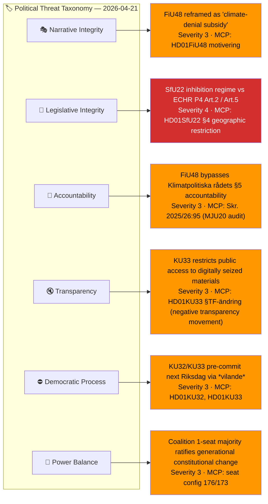
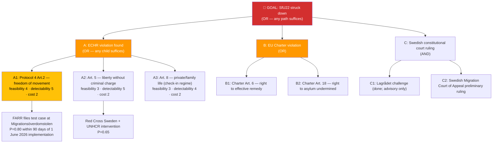
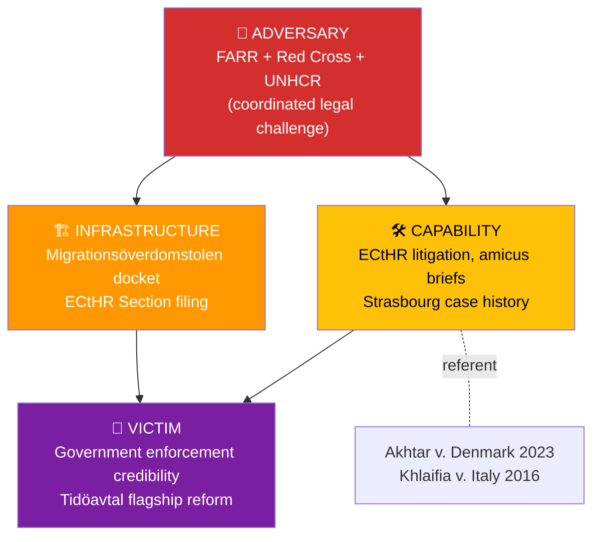
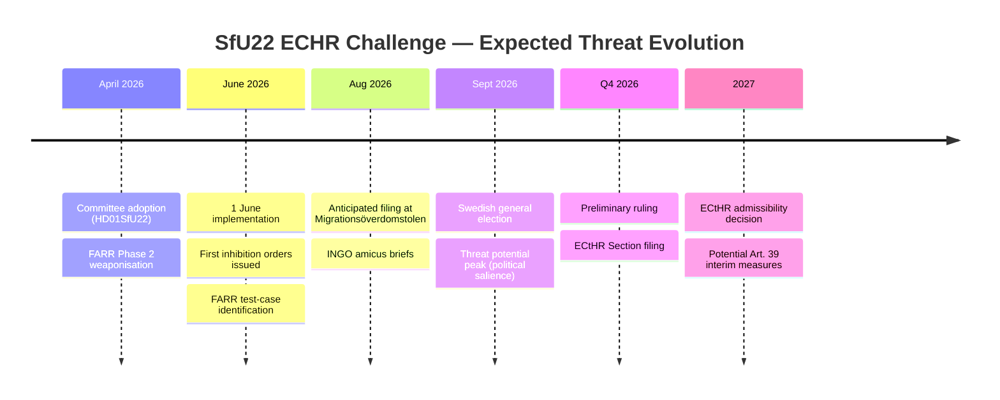

# Threat Analysis — Committee Reports 2026-04-21

| Field | Value |
|-------|-------|
| **Threat Analysis ID** | THR-2026-04-21-001 |
| **Analysis Date** | 2026-04-21 15:40 UTC |
| **Analysis Period** | Committee week 2026-04-14 → 2026-04-21 (14 adopted reports) |
| **Produced By** | news-committee-reports workflow (AI-driven per `ai-driven-analysis-guide.md`) |
| **Political Context** | 5 months before the 14 Sept 2026 general election; sitting M+SD+KD+L coalition (176/349 seats) advances a tri-pillar spring package: FiU48 fuel/energy relief (4.1B SEK), SfU22 migration inhibition, KU32/33 *vilande* grundlagsändringar. |
| **Overall Threat Level** | **HIGH** (driven by FiU48 democratic-accountability exposure + SfU22 ECHR exposure + dual *vilande* lock-in) |
| **Framework** | Per `analysis/methodologies/political-threat-framework.md` — Political Threat Taxonomy + Attack Trees + Kill Chain + Diamond Model + ICO Actor Profiling. STRIDE is explicitly rejected and is NOT used. |

> **Confidence:** 🟩 HIGH — Based on FULL-TEXT for HD01FiU48, HD01SfU22, HD01KU32, HD01KU33; SUMMARY for remaining 10 documents.

---

## 🏷️ Section 1: Political Threat Taxonomy Assessment

### Dimension Scores (0–5)

| Dimension | Score | Primary evidence | Direction |
|-----------|:-----:|------------------|-----------|
| 🎭 **Narrative Integrity** | 3/5 | FiU48 pre-election framing as "cost-of-living relief" vs analyst reading as "pre-election fiscal populism" | ↑ rising |
| 📝 **Legislative Integrity** | 4/5 | SfU22 creates no-status cohort with geographic restrictions — contra German *Duldung* ECtHR precedent, Danish *udrejsecenter* (Akhtar v. Denmark 2023) | ↑ rising |
| 🚫 **Accountability** | 3/5 | FiU48 enacted without Klimatpolitiska rådet ex-ante assessment; FiU48 cuts precede MJU20 audit conclusions | → steady |
| 🔇 **Transparency** | 3/5 | KU33 *restricts* transparency — digitally seized materials (e.g., mirror-imaged hard drives from police searches) no longer automatically constitute *allmänna handlingar* under TF. Narrows public-records access; targets a prior ambiguity exploited in high-profile investigations. | ↑ rising |
| ⛔ **Democratic Process** | 3/5 | Dual *vilande* grundlagsändringar pre-commit post-election Riksdag under RF 8:14 | ↑ rising |
| 👑 **Power Balance** | 3/5 | 1-seat coalition majority (176/349) advances generational changes (grundlag + SfU22 structural) | → steady |

**Aggregate**: 19/30 = **HIGH** threat level. The principal pressure points are **legislative integrity** (SfU22 ECHR exposure), **democratic process** (*vilande* lock-in), and **transparency** (KU33 narrows public-records access).

---

## 🌳 Section 2: Attack Tree — Top Threat "SfU22 struck down by court"

The `political-threat-framework.md` mandates Attack Trees for the top threat.

### Leaf-Node Attributes (per framework §Attack Tree Construction Protocol)

| Leaf | Feasibility | Detectability | Cost to actor | Evidence |
|------|:-----------:|:-------------:|:-------------:|----------|
| A1 (Protocol 4 Art. 2) | 4 | 5 | 2 | HD01SfU22 §4; Akhtar v. Denmark (2023) peer precedent |
| A2 (Art. 5 liberty) | 3 | 5 | 2 | HD01SfU22 §6 check-in regime; German *Duldung* ECHR case law |
| A3 (Art. 8 private life) | 3 | 4 | 2 | HD01SfU22 §7 family-unity handling |
| B2 (Charter Art. 18) | 2 | 4 | 2 | Qualification Directive 2011/95/EU Art. 15 |

**Cheapest attack path**: A1 (Protocol 4 Art. 2) — high feasibility, high detectability, moderate cost.
**Early-warning MCP signal**: FARR press release on first inhibition order issued (~June 2026) + `search_dokument` for Migrationsöverdomstolen preliminary ruling docket.

---

## ⛓️ Section 3: Political Kill Chain — SfU22 ECHR Challenge Progression

```mermaid
flowchart LR
    R["1️⃣ Reconnaissance<br/>FARR monitors HD01SfU22<br/>committee drafts (March 2026)"]
    W["2️⃣ Weaponisation<br/>Coalition building: FARR + Red Cross + UNHCR<br/>(April 2026, in progress)"]
    D["3️⃣ Delivery<br/>Test-case selection among first inhibited individuals<br/>(June 2026, anticipated)"]
    X["4️⃣ Exploitation<br/>Media coverage of inhibited persons' conditions<br/>(Q3 2026, expected)"]
    I["5️⃣ Installation<br/>Filing at Migrationsöverdomstolen<br/>(≤Aug 2026, P=0.80)"]
    C["6️⃣ Command & Control<br/>Joint amicus briefs from INGOs + UNHCR"]
    Ach["7️⃣ Actions on Objective<br/>Preliminary ruling → ECHR Strasbourg filing<br/>(Q4 2026–2027)"]
    R --> W --> D --> X --> I --> C --> Ach
    style R fill:#4CAF50,color:#FFF
    style W fill:#FFC107,color:#000
    style D fill:#FF9800,color:#FFF
    style I fill:#D32F2F,color:#FFF
    style Ach fill:#7B1FA2,color:#FFF
```

### Kill-Chain Disruption Assessment

| Stage | Current status | Disruption opportunity (for government) |
|-------|----------------|----------------------------------------|
| Reconnaissance | ✅ Completed — FARR tracking | Negligible — public procedure |
| Weaponisation | 🟠 In progress | **Window**: amend geographic-restriction proportionality before 1 June implementation |
| Delivery | 🔲 Pending (awaits implementation) | Legal aid access provisions + individual-case proportionality review |
| Exploitation | 🔲 Future | Proactive government transparency on enforcement numbers |
| Installation | 🔲 Expected ≤Aug 2026 | Structurally unavoidable once Stage 4 reached |
| Command & Control | 🔲 Future | Negligible |
| Actions on Objective | 🔲 Q4 2026–2027 | Primary defence: amendment at coalition stage |

---

## 💎 Section 4: Diamond Model — SfU22 Primary Threat Actor

**Adversary**: FARR (Flyktinggruppernas riksråd) coordinated with Red Cross Sweden and UNHCR country office — established civil-society actors with demonstrated legal capacity.
**Victim**: Government enforcement credibility (in particular SD + M backbench cohesion) and Tidöavtal deliverable narrative for September 2026 campaign.
**Capability**: Established ECtHR litigation channels; 12+ adverse rulings against German *Duldung* regime as precedent bank; Akhtar v. Denmark (2023) on concentrated-residence directly analogous.
**Infrastructure**: Migrationsöverdomstolen admissibility doctrine requires exhausted remedies; ECtHR Section filing window opens after that. INGO amicus pathways active.

---

## 👤 Section 5: Threat Actor ICO Profile — FARR-led Coalition

| Dimension | Assessment |
|-----------|-----------|
| **Intent** | HIGH — Public commitments to challenge Tidöavtal migration measures; 2023–2025 filing pattern shows systematic litigation strategy |
| **Capability** | HIGH — In-house legal team; UNHCR amicus precedent; established access to Migrationsöverdomstolen and ECtHR |
| **Opportunity** | HIGH — 1 June 2026 implementation creates immediate fact-pattern; geographic-restriction §4 is textually similar to Danish *udrejsecenter* struck in Akhtar v. Denmark |

**ICO composite**: **HIGH × HIGH × HIGH = HIGH**. The challenge is not speculative; it is an expected feature of SfU22's implementation.

---

## 🎯 Section 6: Secondary Threats

### T2 — FiU48 Climate-Framework Accountability Bypass (Severity 3)

**Taxonomy**: Accountability + Narrative Integrity.
**Mechanism**: Klimatlagen (2017:720) §5 mandates climate-impact assessment of fiscal measures with emission significance. FiU48 was expedited as emergency supplementary budget, compressing that review. Klimatpolitiska rådet's Q3 2026 memo is expected to flag the bypass.
**Disruption**: Government proactively publishes retrospective climate-impact note before Q3 2026.
**Evidence**: HD01FiU48 motivering §3 (emergency justification); Skr. 2025/26:95 (MJU20 Riksrevisionen audit of Climate Policy Framework).

### T3 — Dual *Vilande* Post-Election Failure (Severity 3)

**Taxonomy**: Democratic Process.
**Mechanism**: RF 8:14 *vilande* mechanism requires identical wording in next Riksdag. KU33 (digital-seizure *access restriction* via TF-amendment) has ≤50% re-affirmation probability in BEAR scenarios (see [`coalition-mathematics.md`](coalition-mathematics.md) §*Vilande* Math) — an S-led government could view the restriction as an undue narrowing of public-records access and decline to re-propose. Failure to re-affirm triggers three-year waiting period before re-proposal.
**Disruption**: None during this parliament; probability depends on 14 Sept election outcome.
**Evidence**: HD01KU32, HD01KU33 *vilande* status confirmed in betänkandetexts.

### T4 — Banking Sector Lobbying vs TU21 (Severity 2–3)

**Taxonomy**: Power Balance + Legislative Integrity.
**Mechanism**: Svenska Bankföreningen + BankID consortium have demonstrated 2018–2024 pattern of delaying legislation via regulatory capture of utredning references. eIDAS2 deadline 2026 narrows the window.
**Disruption**: Hard legislative deadline anchored to eIDAS2; Commission infringement risk pressures compliance.
**Evidence**: HD01TU21 motivering; Svenska Bankföreningen remissvar on SOU 2024:XX.

---

## 🔁 Section 7: Cross-Methodology Linkage

- **Threat T1 (SfU22 ECHR)** → Risk [`risk-assessment.md`](risk-assessment.md) R-SfU22-1 (L=3, I=5, Score=15) + SWOT [`swot-analysis.md`](swot-analysis.md) W2 "ECHR exposure" + Stakeholder [`stakeholder-perspectives.md`](stakeholder-perspectives.md) §3 opposition framing.
- **Threat T2 (FiU48 accountability)** → Risk R-FiU48-1 (L=4, I=4, Score=16) + SWOT W1 "fiscal precedent stickiness" + Election lens [`election-2026-implications.md`](election-2026-implications.md) §Tier 1.
- **Threat T3 (*vilande* failure)** → Coalition math [`coalition-mathematics.md`](coalition-mathematics.md) §*Vilande* Math + Scenario tree [`scenario-analysis.md`](scenario-analysis.md) BEAR branch.

---

## 📡 Section 8: Forward MCP-Detectable Indicators

| Indicator | MCP tool | Expected window | Meaning |
|-----------|----------|-----------------|---------|
| First FARR press release re SfU22 implementation | — (external) + `search_dokument_fulltext` | ≤1 week of 1 June 2026 | Kill Chain stage 3 (Delivery) |
| Migrationsöverdomstolen docket entry | `search_dokument` (type=dom) | ≤Aug 2026 | Kill Chain stage 5 (Installation) |
| Klimatpolitiska rådet FiU48 memo | `search_dokument_fulltext` | Q3 2026 | T2 realisation |
| L-party backbench statement on SfU22 | `search_anforanden` (parti=L) | April–May 2026 | Coalition unity risk signal |
| Svenska Bankföreningen TU21 position | — (external) + `search_dokument_fulltext` | Q2 2026 | T4 escalation signal |
| Lagrådet yttrande on KU33 enforcement regulations | `search_dokument` (doktyp=Lagrådet) | Q3 2026 | *Vilande* re-affirmation risk signal |

---

## 📅 Section 9: Threat Evolution Timeline (v2.3 template requirement)

---

## 📉 Section 10: Threat Level Change

| Period | Overall level | Drivers |
|--------|---------------|---------|
| 2026-03 (motions cycle) | MODERATE | Opposition motions stage only |
| 2026-04-17 (motions adopted) | MODERATE-HIGH | Cross-document coordination visible |
| **2026-04-21 (this analysis)** | **HIGH** | SfU22 adoption → implementation countdown + *vilande* lock-in + FiU48 accountability tension |
| 2026-06-01 (SfU22 implementation) | HIGH→SEVERE (expected) | Litigation fact-patterns materialise |

---

**Confidence**: 🟩 HIGH. Primary evidence is the full text of HD01FiU48, HD01SfU22, HD01KU32, HD01KU33 plus peer-jurisdiction ECtHR case law. See [`methodology-reflection.md`](methodology-reflection.md) for known gaps.
