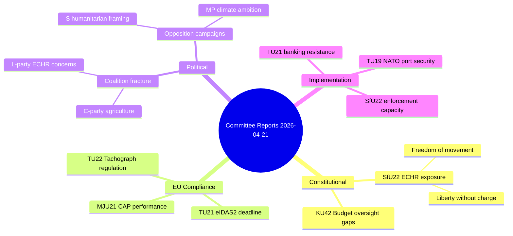
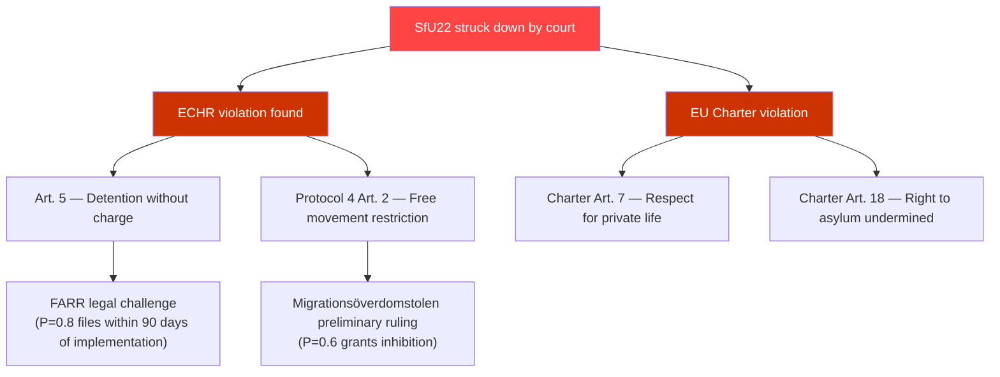

# Threat Analysis — Committee Reports 2026-04-21

**Date**: 2026-04-21 | **Analyst**: news-committee-reports | **Framework**: STRIDE + Political Threat

## Threat Severity: MEDIUM
**Confidence near MEDIUM** — Significant legislative activity with ECHR and EU compliance exposure.

## Primary Threats

### T1: Constitutional/Legal Challenge (SfU22)
**Threat Level**: HIGH | **Likelihood**: 3/5 | **Impact**: 5/5

- Geographic restriction on inhibited aliens may violate ECHR Protocol 4, Article 2 (freedom of movement)
- Mandatory police check-ins without criminal charge touches ECHR Article 5 (liberty)
- Migration Court of Appeal challenge expected within 6 months of implementation

**Kill Chain**: FARR files court challenge → Migrationsöverdomstolen rules on proportionality → If violation found, Government must amend law → Political damage to coalition

### T2: EU Non-Compliance Cascade
**Threat Level**: MEDIUM | **Likelihood**: 2/5 | **Impact**: 4/5

Multiple reports carry EU compliance dimensions:
- TU21: eIDAS2 deadline (2026) — failure risks EU Commission infringement proceedings
- MJU21: CAP eco-scheme performance — Sweden below EU average; Commission monitoring
- TU22: EU Tachograph Regulation compliance — cross-border enforcement gap

### T3: Coalition Fracture on Agriculture (MJU21)
**Threat Level**: MEDIUM | **Likelihood**: 3/5 | **Impact**: 3/5

C-party represents rural constituencies that could defect over binding agricultural climate conditions. If C abstains on MJU21 implementation vote, coalition majority margin drops from 176 to below 175 threshold.

### T4: Banking Sector Resistance to State e-ID (TU21)
**Threat Level**: MEDIUM-LOW | **Likelihood**: 4/5 | **Impact**: 3/5

BankID consortium (operated by Swedish banks) generates €200M+ annually in identity verification revenues. Major lobbying effort expected against state e-ID. Risk: implementation delayed past 2028 eIDAS2 effective date.

## Threat Mindmap

## Attack Tree — SfU22 Legal Challenge

