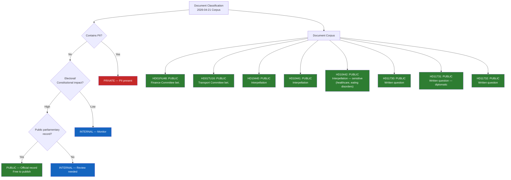

# Classification Results — Evening Analysis 2026-04-21

**CLS-ID**: CLS-2026-04-21-EVE001
**Classification Date**: 2026-04-21
**Riksmöte**: 2025/26

---

## Sensitivity Decision Tree

---

## Per-Document Classification Table

| dok_id | Title (abbreviated) | Sensitivity | Policy Domain | Urgency | Significance |
|--------|--------------------|-----------|----|---------|-------------|
| **HD01FiU48** | Extra ändringsbudget — fuel tax + energy | 🟢 PUBLIC | Fiscal/Energy | 🔴 CRITICAL | 10/10 |
| **HD01TU16** | Slopat krav introduktionsutbildning | 🟢 PUBLIC | Transport/Regulatory | 🟡 NORMAL | 4/10 |
| **HD10440** | Utbildningen för företagsläkare | 🟢 PUBLIC | Labour/Health | 🟡 NORMAL | 6/10 |
| **HD10441** | Rättssäkerheten inom rättsväsendet | 🟢 PUBLIC | Justice/Constitutional | 🟡 NORMAL | 6/10 |
| **HD10442** | Ätstörningsvård Region Stockholm | 🟢 PUBLIC | Healthcare/Welfare | 🟠 ELEVATED | 7/10 |
| **HD11730** | Utbetalningar till vindkraftskommuner | 🟢 PUBLIC | Energy/Finance | 🟡 NORMAL | 5/10 |
| **HD11731** | Gaza flotilla — Swedish citizens | 🟢 PUBLIC | Foreign Policy | 🔴 CRITICAL (potential) | 6/10 |
| **HD11732** | Skatteverket Vetlanda closure | 🟢 PUBLIC | Public Services | 🟡 NORMAL | 4/10 |
| **Gov/vindkraft** | Vindkraft revenue sharing | 🟢 PUBLIC | Energy Policy | 🟠 ELEVATED | 8/10 |
| **KU G16** | Svantesson hearing | 🟢 PUBLIC | Constitutional | 🔴 CRITICAL | 8/10 |
| **KU G34** | Wallström hearing | 🟢 PUBLIC | Constitutional | 🟡 NORMAL | 7/10 |

---

## Domain Classification

| Policy Domain | Documents | Combined Significance |
|---------------|----------|----------------------|
| Fiscal/Economic | HD01FiU48, HD11732 | **CRITICAL** (10/10 lead) |
| Energy/Climate | HD01FiU48, HD11730, gov/vindkraft | **HIGH** (9/10 cluster) |
| Constitutional/Legal | HD10441, KU G16, KU G34 | **HIGH** (8/10) |
| Healthcare/Welfare | HD10440, HD10442 | **MEDIUM** (7/10) |
| Transport | HD01TU16 | **LOW** (4/10) |
| Foreign Policy | HD11731 | **MEDIUM** (6/10) |

---

## Publication Decision

| Article | Status | Classification | Labels |
|---------|--------|---------------|--------|
| news/2026-04-21-evening-analysis-en.html | ✅ PUBLISH | PUBLIC | automated-news, evening-analysis |
| news/2026-04-21-evening-analysis-sv.html | ✅ PUBLISH | PUBLIC | automated-news, evening-analysis |

*Produced by Riksdagsmonitor Evening Analysis — Classification: PUBLIC*
