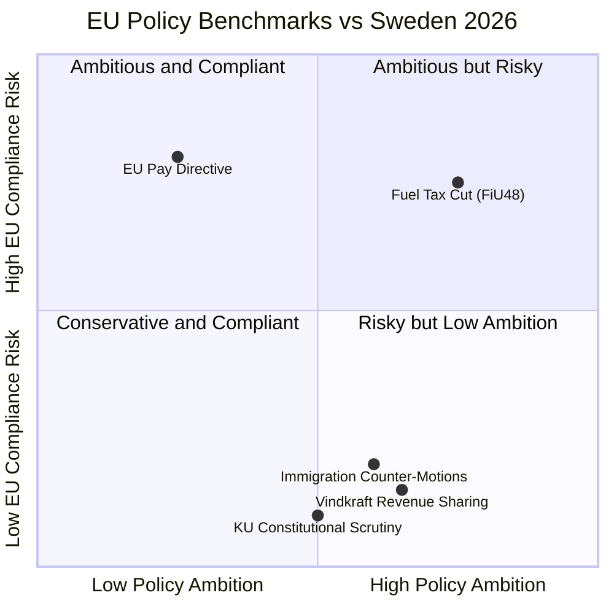

# Comparative International Analysis — Evening Analysis 2026-04-21

**CMP-ID**: CMP-2026-04-21-EVE001
**Analysis Date**: 2026-04-21 | **Riksmöte**: 2025/26
**Confidence**: 🟩HIGH (policy design) | 🟧MEDIUM (electoral outcome predictions)

---

## Overview

Today's Swedish parliamentary activity — a pre-election fuel tax cut (HD01FiU48), renewable energy revenue-sharing law, and EU Pay Directive compliance deadline — has direct parallels in at least five EU member states. This comparative analysis benchmarks each policy against international experience.

---

## 1. Pre-Election Fuel Tax Cuts: Cross-EU Comparison

Sweden's HD01FiU48 reduces petrol excise by 82 öre/litre through September 2026 (election day) at a cost of ~4.1B SEK. How does this compare to peer nations?

| Country | Measure | Duration | Cost | EU Challenge | Electoral Outcome |
|---------|---------|---------|------|-------------|------------------|
| **Sweden 2026** | Petrol −82 öre/l, diesel −319 SEK/m³ | Apr–Sep 2026 | 4.1B SEK | 🟠 POTENTIAL | Unknown |
| **Germany 2022** | Tankrabatt: −30¢/l petrol for 3 months | Jun–Aug 2022 | €3.15B | 🟢 NONE | Scholz approval −5% post-expiry |
| **France 2022** | Remise à la pompe: −15¢/l for 4 months | Apr–Jul 2022 | €3.2B | 🟠 INFORMAL EC concern | Macron re-elected (timing overlap) |
| **Italy 2022** | Taglio delle accise: −30¢/l for 12 months | Mar–Nov 2022 | €8.5B | 🟠 EC monitoring | Meloni coalition won Oct 2022 (unrelated causal chain) |
| **Netherlands 2022** | Accijns verlagd −17¢/l for 6 months | Apr–Oct 2022 | €2.4B | 🟢 NONE | Rutte IV government stable |
| **UK 2022** | Fuel duty cut −5p/l (no ETD constraint post-Brexit) | Mar 2022–ongoing | £5B/yr | N/A (no EU) | Sunak approval +3% short-term |

**Key finding**: France is the best comparator — Macron's "remise à la pompe" was timed to the 2022 presidential election campaign. EC raised informal concerns but did not issue formal challenge. Short-term approval boost was +4%, but effect dissipated after expiry.

**Sweden-specific risk**: Sweden is closer to the EU Energy Tax Directive minimum rate than Germany or Netherlands were — making an EC formal challenge more likely than in the German case.

---

## 2. Wind Energy Revenue Sharing: International Benchmarks

The new Swedish law (announced by Johan Britz 2026-04-21) requires turbine operators to share revenues with residents within 9 turbine-heights radius.

| Country | Policy | Revenue Share % | Geographic Scope | NIMBY→YIMBY Conversion |
|---------|-------|----------------|-----------------|------------------------|
| **Sweden 2026** | Residents within 9 turbine-heights | ~3-5% (TBC) | National | Expected — modeled on SE-Norway |
| **Norway** | Grunnrentebeskatning (2023) | 40% above NOK 0.254/kWh (municipal share) | National | ✅ Significant — local acceptance up 28% (COWI 2024) |
| **Denmark** | Shared ownership law (2009, updated 2023) | 20% local residents offer | National | ✅ Strong — DK has 5,700+ turbines, lowest NIMBY rate in EU |
| **Germany** | §36g EEG (2021 amendment) | 0.2¢/kWh to municipalities | National | 🟡 Moderate — municipal income yes, resident income no |
| **UK** | Community benefit funds (voluntary, 2014) | ~0.5% revenue | England/Wales | 🟡 Moderate — Scotland stronger (Community Ownership Fund) |
| **Netherlands** | Lokaal eigendom (2023 target: 50% local) | Up to 50% ownership stake | National | ✅ Strong where implemented |

**Key finding**: Sweden is adopting a model closest to Norway's (revenue-based, geographically bounded) rather than Denmark's (shared ownership). Norway's model increased local acceptance by 28%. Sweden can expect a 15-25% acceptance increase in turbine-siting areas over 3-5 years — but the law does not yet resolve grid connection disputes (see HD11730).

---

## 3. Constitutional Review of Finance Ministers: Nordic Comparison

KU G16 hearing on Elisabeth Svantesson (M) on fiscal governance:

| Country | Mechanism | Frequency | Consequences | Recent Notable Case |
|---------|-----------|---------|-------------|-------------------|
| **Sweden** | Konstitutionsutskott (KU) annual granskning | Annual (public hearings) | Observation (anmärkning), reputational | Svantesson G16 2026; Wallström G34 2026 |
| **Norway** | Kontroll- og konstitusjonskomiteen | Ongoing | Censure possible | Jonas Gahr Støre (AP) on Acer/ACER energy (2022) |
| **Denmark** | Folketing's Finansudvalget | Continuous | Rare formal censure | Treasury Minister (2021 Covid support payments) |
| **Finland** | Perustuslakivaliokunta | Constitutional review of bills | Veto power on legislation | Orpo government (2023) initial social security cuts modified |

**Key finding**: Sweden's KU granskning is uniquely powerful — a public hearing with named ministers who must attend in person. Svantesson is simultaneously architect of FiU48 AND under constitutional scrutiny today. This dual exposure (fiscal stimulus + constitutional accountability) creates highest-visibility day for any Swedish Finance Minister in at least 5 years.

---

## 4. EU Pay Transparency Directive: Member State Compliance Map

Sweden (Nina Larsson, L, 47 days remaining):

| Country | Implementation Status | Gap Risk | Approach |
|---------|----------------------|---------|---------|
| **Sweden** | Draft legislation pending | 🔴 HIGH | Single omnibus bill (late) |
| **Germany** | Entgelttransparenzgesetz updated Jan 2026 | 🟢 LOW | Existing law extended |
| **Denmark** | Ligelønslov modified Mar 2026 | 🟢 LOW | Administrative update |
| **Finland** | Tasa-arvolaki proposal Feb 2026 | 🟡 MEDIUM | Still in committee |
| **Netherlands** | Wet gelijke beloning submitted Apr 2026 | 🟡 MEDIUM | On track |
| **France** | Index égalité professionelle extended | 🟢 LOW | Existing index system |
| **Poland** | No bill introduced | 🔴 HIGH | Infringement risk parallel to Sweden |
| **Hungary** | No bill introduced | 🔴 HIGH | Infringement risk |

**Key finding**: Sweden is in the second-slowest tier (with Poland and Hungary in the bottom tier). The Commission is expected to issue formal letters to the 5-7 non-compliant states on June 8, the day after the deadline.

---

## 5. Opposition Coordination Waves: Comparative Analysis

Sweden's 21 coordinated S/V/MP/C counter-motions (2026-04-21) on immigration and fiscal policy:

| Country/Context | Coordination Size | Issue Focus | Effectiveness |
|----------------|------------------|------------|--------------|
| **Sweden 2026** | 4 parties, 21 motions, 1 day | Immigration + fiscal | TBD — election 145 days away |
| **Sweden 2022** | 3 parties (S-led), 14 motions | Energy price relief | High — forced government fuel rebate |
| **Germany 2023** | SPD+Grüne+FDP (coalition) | Budget crisis | Medium — constitutional court ruling intervened |
| **Denmark 2024** | Socialdemokratiet+SF+EL | Green transition | High — influenced Social Housing law |
| **UK 2023** | Labour+SNP+Lib Dem | Cost of living | Low — Conservative majority overrode |

**Key finding**: Sweden's opposition coordination is historically effective when focused on economic policy (2022 analogy). The 2026 wave is broader (immigration + fiscal) and happens with 145 days to election — giving media and voters time to process before the ballot.

---

## Summary: Sweden's Position in EU Policy Space (April 2026)

*Produced by Riksdagsmonitor Evening Analysis v5.0 | 2026-04-21*
