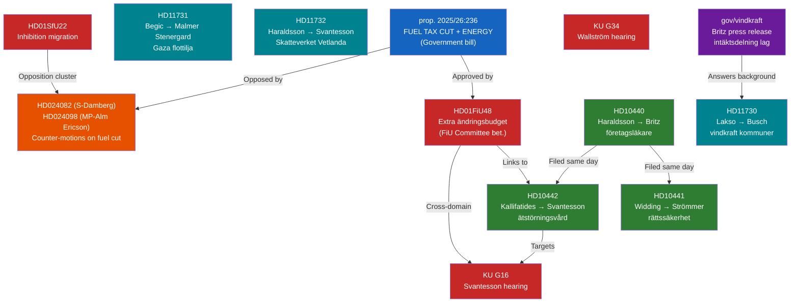

# Cross-Reference Map — Evening Analysis 2026-04-21

**XRF-ID**: XRF-2026-04-21-EVE001
**Analysis Date**: 2026-04-21
**Riksmöte**: 2025/26

---

## Document Relationship Graph

---

## Cross-Reference Table

| Primary dok_id | Linked dok_id(s) | Relationship Type | Significance |
|---------------|-----------------|------------------|-------------|
| **HD01FiU48** | prop. 2025/26:236 | Bet. approves prop. | Direct |
| **HD01FiU48** | HD024082, HD024098 | Opposition counter-motions | Adversarial |
| **HD01FiU48** | KU G16 (Svantesson) | Finance Minister under dual scrutiny | Parallel |
| **gov/vindkraft** | HD11730 (Lakso → Busch) | Question about wind power municipal payments | Background |
| **HD10440** | HD10441, HD10442 | Three interpellations filed same day | Coordinated |
| **HD10442** | KU G16 | Svantesson targeted from multiple directions | Convergent |
| **HD01SfU22** | HD024090 (V), HD024095 (C), HD024097 (MP) | Opposition counter-motions to migration reform | Adversarial |
| **HD11731** (Gaza) | Prior Bernadotte interpellation (HD10435) | Foreign policy accountability chain | Sequential |
| **HD01TU16** | Previous driver training framework | Regulatory simplification sequence | Policy evolution |

---

## Upstream Watchpoint Reconciliation (Last 3 Days)

| Watchpoint | Source | Status |
|-----------|--------|--------|
| Government response to Bernadotte interpellation (deadline 2026-04-30) | 2026-04-20 Evening Analysis | ⚠️ PENDING — HD11731 new question adds pressure |
| Media framing of Spring Economic Bill HD03100 vs Nordic GDP gap | 2026-04-20 Evening Analysis | 🔄 ACTIVE — FiU48 now framing economic relief |
| SD positioning on 21 coordinated immigration counter-motions | 2026-04-20 Evening Analysis | 🔄 ACTIVE — SD supporting fuel cut, not engaging immigration motions |
| KU33/KU32 second reading fate post-September election | 2026-04-20 Evening Analysis | ⚠️ PENDING — KU hearings today add context |
| EU Pay Transparency Directive infringement proceedings | 2026-04-20 Evening Analysis | 🔴 ESCALATING — 47 days remain |
| Stockholm police density declining (BRÅ March 2026) | RT-1353 (2026-04-21) | 🔄 ACTIVE — HD10439 filed as interpellation |

---

## Government Activity — Cross-Ministry Coherence

| Ministry | Activity Type | Coherence Assessment |
|---------|--------------|---------------------|
| Finance (Svantesson) | FiU48 lead + KU hearing + HD10442 + HD11732 | CONTRADICTORY — fiscal relief vs. fiscal responsibility + healthcare scrutiny |
| Climate/Labour (Britz) | Vindkraft law + HD10440 (occupational physicians) | COMPLEMENTARY — green transition + labour training |
| Justice (Strömmer) | HD10441 (rättssäkerhet) + SiS visit | PARALLEL — different dimensions of justice |
| Foreign Affairs (Malmer Stenergard) | HD11731 (Gaza) + KU G34 (Wallström scrutiny) | PARALLEL — current crisis + historical scrutiny |

*Produced by Riksdagsmonitor Evening Analysis v5.0*
