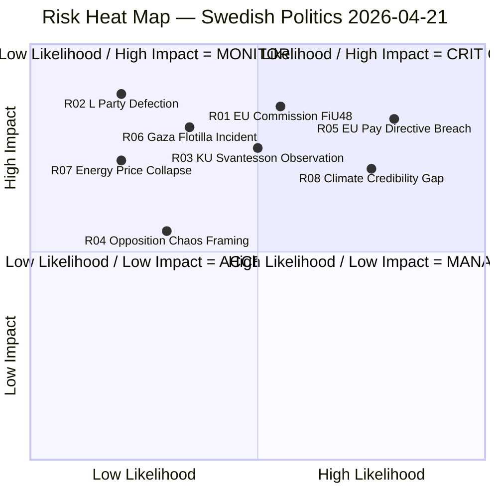
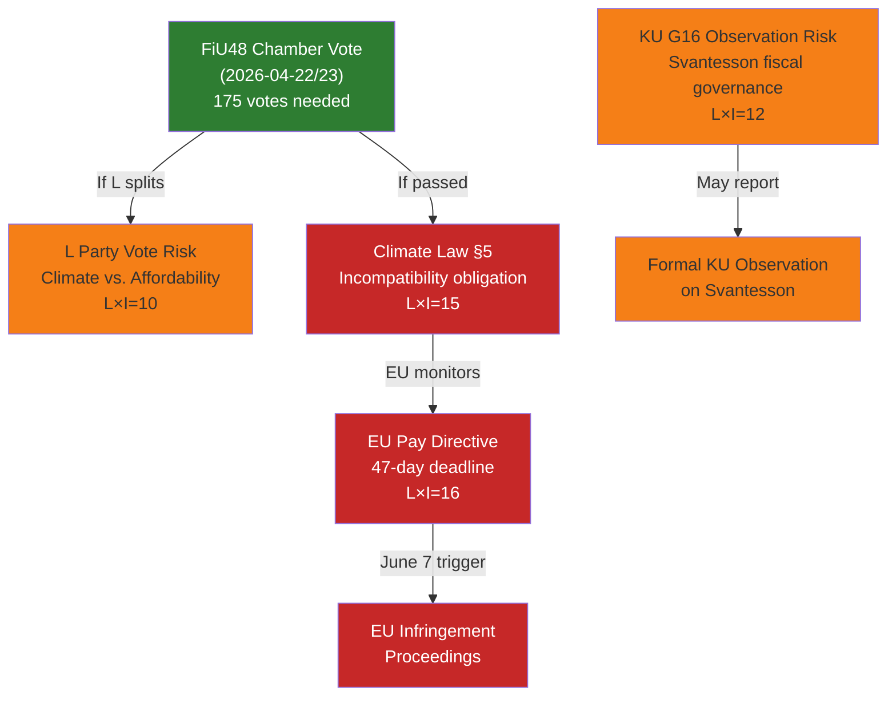

# Risk Assessment — Evening Analysis 2026-04-21

**RSK-ID**: RSK-2026-04-21-EVE001
**Analysis Date**: 2026-04-21
**Riksmöte**: 2025/26
**Confidence**: 🟩HIGH

---

## Risk Heat Map

---

## Detailed Risk Register

| Risk ID | Risk Title | Likelihood (1-5) | Impact (1-5) | L×I Score | Owner | Timeline | Mitigation |
|---------|-----------|-----------------|-------------|-----------|-------|----------|-----------|
| **R01** | EU Commission queries Sweden's fuel tax cut under fossil subsidy monitoring | 3 (MEDIUM) | 5 (CRITICAL) | **15** | Svantesson/Government | 2-4 weeks | Pre-draft EU response noting economic emergency justification |
| **R02** | L party abstention or defection on FiU48 fuel tax clause | 2 (LOW-MEDIUM) | 5 (CRITICAL) | **10** | L party leadership | 2026-04-22/23 | L already announced support; Britz + vindkraft law as counterweight |
| **R03** | KU G16 produces formal observation on Svantesson fiscal governance | 3 (MEDIUM) | 4 (HIGH) | **12** | Elisabeth Svantesson | 2026-05-05 est. | Transparent documentation preparation for KU submission |
| **R04** | Government's "chaos coalition" framing succeeds against 4-party coordination | 2 (LOW) | 3 (MEDIUM) | **6** | Opposition (S/V/MP/C) | Campaign 2026 | Opposition maintains strategic messaging discipline (not shared press conference) |
| **R05** | EU Pay Transparency Directive infringement (non-transposition by June 7) | 4 (HIGH) | 4 (HIGH) | **16** | Nina Larsson (L) | 47 days | Fast-track transposition legislation; may require extraordinary committee session |
| **R06** | Gaza flotilla incident involving Swedish citizens | 2 (LOW) | 4 (HIGH) | **8** | Malmer Stenergard | 0-30 days | Diplomatic monitoring; consular preparedness |
| **R07** | Energy prices fall sharply before FiU48 chamber vote | 2 (LOW) | 4 (HIGH) | **8** | External/market | 0-3 days | Unlikely given market fundamentals; monitor Nordpool prices |
| **R08** | Climate credibility gap becomes dominant campaign narrative | 4 (HIGH) | 3 (MEDIUM) | **12** | Coalition collective | Campaign 2026 | Vindkraft law + three-step green package as counternarrative |

---

## Coalition Stability Risk Analysis

---

## Risk Trends from Previous Analysis

| Risk | Yesterday (2026-04-20) | Today (2026-04-21) | Change |
|------|----------------------|-------------------|--------|
| R05 EU Pay Directive | HIGH (48 days) | HIGH (47 days) | ⚠️ Countdown continues |
| R01 EU Commission | NOT TRACKED | HIGH (new) | 🔴 New risk (FiU48 triggered) |
| Constitutional scrutiny | LOW | MEDIUM (KU hearings today) | ↑ Elevated |
| Opposition coordination | MEDIUM | HIGH (21 motions confirmed) | ↑ Elevated |

---

## Summary Risk Assessment

**Top 3 Risks requiring immediate monitoring:**

1. **R05 (EU Pay Directive)** — L×I=16, CRITICAL — Nina Larsson has 47 days to transpose or face EU infringement proceedings. Government appears unprepared. HIGH electoral damage potential.

2. **R01 (EU Commission FiU48)** — L×I=15, CRITICAL — Fuel tax cut to EU minimum creates formal obligation under Klimatlagen §5 and may trigger EU fossil subsidy monitoring inquiry. Reputational damage in progress.

3. **R03 (KU G16 Observation)** — L×I=12, HIGH — Finance Minister Svantesson's constitutional hearing today could produce formal observations in the KU annual report affecting campaign credibility.

*Confidence: 🟩HIGH | Produced by Riksdagsmonitor Evening Analysis v5.0*
