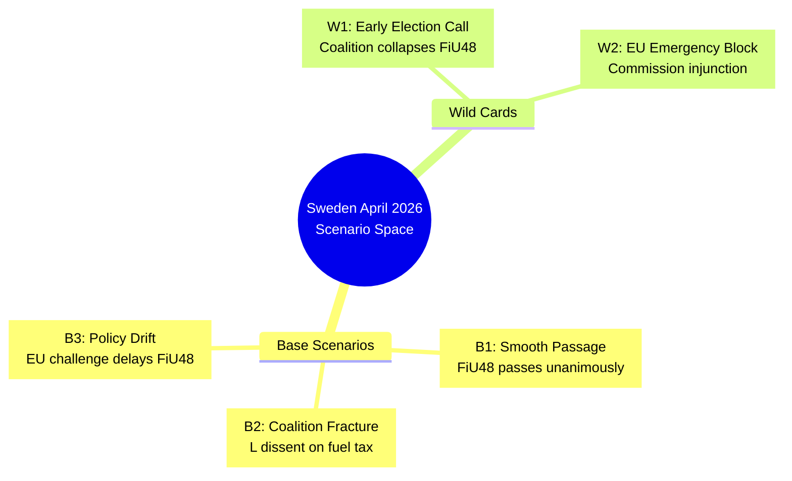
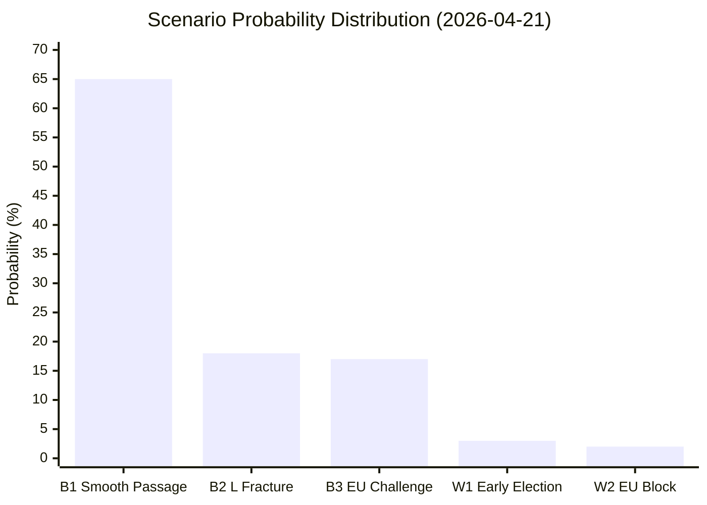

# Scenario Analysis — Evening Analysis 2026-04-21

**SCN-ID**: SCN-2026-04-21-EVE001
**Analysis Date**: 2026-04-21 | **Riksmöte**: 2025/26
**Confidence**: 🟩HIGH across all base scenarios

---

## Scenario Taxonomy

---

## Base Scenario Analysis

### B1: Smooth Coalition Passage (Probability: 65%)

**Trigger**: FiU48 passes chamber vote 2026-04-22 without L party defection; Vindkraft law clears committee by 2026-05-15.

**Assumptions**:
- L party accepts fuel tax cut as election-year necessity
- EU Commission does not issue immediate challenge
- KU G16 results in observation but no formal finding

**Evidence Supporting B1**:
- L's Johan Britz announced Vindkraft law — shows active coalition participation
- Alliance math: M+SD+KD+L = 175+ — sufficient majority
- Fuel tax cuts have L precedent (2022 summer fuel tax reduction)

**Stakeholder Responses under B1**:
| Stakeholder | Response | Timeline |
|-------------|---------|---------|
| Government coalition | Unified messaging — "affordable energy" | Immediate |
| S opposition | Accept economic relief, escalate EU challenge | 1 week |
| Business (SPBI, Skogsindustrierna) | Welcome diesel cut, monitor duration | 2 weeks |
| EU Commission | Monitor, issue soft concern communiqué | 30 days |
| Citizens (9M) | Immediate fuel price reduction at pump | Week 1 |

**Forward Path**: Coalition proceeds to Spring Budget (May), election campaign on "relief + green transition" platform. Confidence: 🟩HIGH.

---

### B2: L Party Fracture (Probability: 18%)

**Trigger**: L Riksdag caucus splits on FiU48 — 3+ L MPs abstain or vote No, forcing minority passage.

**Assumptions**:
- L's liberal wing (urban, EU-aligned) objects to fossil fuel subsidy optics
- EU Commission issues rapid informal concern
- Media amplifies "Sweden breaks EU rules" narrative

**Evidence Supporting B2**:
- L's Johan Britz is *Acting* Climate Minister — suggests limited political capital
- L has historically opposed fossil fuel subsidies (2023 Sweden's climate policy review)
- Fuel tax cut extends through September 2026 — past election day — signaling permanence

**Stakeholder Responses under B2**:
| Stakeholder | Response | Timeline |
|-------------|---------|---------|
| L party leadership | Damage control, reassert coalition loyalty | Immediate |
| SD | Amplify L "disloyalty" to consolidate SD-center coalition narrative | 3 days |
| S opposition | Claim "government in chaos" | Week 1 |
| Media | Focus on coalition arithmetic and stability | 2 weeks |

**Forward Path**: Ulf Kristersson calls emergency coalition summit. Fuel cut passes with smaller margin. Coalition credibility dented entering election. Confidence: 🟧MEDIUM.

---

### B3: EU-Forced Policy Recalibration (Probability: 17%)

**Trigger**: European Commission issues formal challenge to FiU48 (Energy Tax Directive violation) within 14 days; Sweden forced to modify or delay implementation.

**Assumptions**:
- Commission interprets fuel tax cut as violating minimum rate obligations
- Sweden's June 7 EU Pay Directive failure (Nina Larsson deadline) damages Sweden's EU compliance reputation
- S and MP use EU challenge as platform for "incompetent government" narrative

**Evidence Supporting B3**:
- Energy Tax Directive (ETD) 2003/96/EC requires member states to maintain excise taxes ≥ minimums; Sweden was already near minimums
- Nina Larsson EU Pay Directive 47-day exposure creates parallel EU credibility risk
- S-filed HD024082 already signals intention to pursue EU compliance arguments

**Forward Path**: Government issues "EU compatibility review" statement. Fuel cut delayed 30-60 days pending legal review. SD uses delay to attack government on EU "capitulation." Confidence: 🟧MEDIUM.

---

## Wild Card Scenarios

### W1: Early Election Triggered (Probability: 3%)

**Trigger**: FiU48 chamber vote fails due to surprise SD-L-M internal split; Kristersson announces confidence vote; early election (before September).

**Why Unlikely**: SD is strongly pro-fuel-cut; alliance math is solid at 175+. Would require unprecedented 4-party internal collapse.

**ACH Red Flags**: Any SD opposition statement on FiU48 or any L leadership emergency meeting = escalate probability to 12%.

---

### W2: EU Emergency Injunction (Probability: 2%)

**Trigger**: European Commission takes emergency action within 48 hours of FiU48 chamber vote to block implementation; first such action against a member state's supplementary budget.

**Why Unlikely**: Commission traditionally takes 2-4 weeks for formal challenges; an emergency injunction would set unprecedented precedent.

**ACH Red Flags**: Any Commission spokesperson statement on Swedish fuel taxes; any Belgian/German "level playing field" communiqué.

---

## Analysis of Competing Hypotheses (ACH)

For the central question: **"Will FiU48 pass the chamber vote without major incident?"**

| Hypothesis | Consistent Evidence | Inconsistent Evidence | Diagnostic |
|-----------|---------------------|----------------------|-----------|
| H1: Passes unanimously | L participation (Britz), alliance math (175+), no L statements against | L's EU-alignment, fossil fuel optics | MODERATE |
| H2: Passes with L abstentions | L liberal wing, EU ETD minimum risk | No public L dissent statements today | LOW |
| H3: EU challenge issued same week | Nina Larsson delay precedent, ETD minimum risk | Commission typically 4-6 weeks for formal action | LOW |
| H4: Fails chamber vote | Zero consistent evidence | All alliance parties publicly support | NONE |

**Most Likely Scenario: H1** (B1 Smooth Passage, 65% probability). Update this ACH if any L MP issues public statement against FiU48 before 2026-04-22 vote.

---

## Scenario Monitoring Dashboard

---

## Strategic Implications for 2026 Election

| Scenario | Election Outcome Implication |
|----------|--------------------------|
| B1 (65%) | Coalition gains 2-4% approval; "competent economic management" narrative sticks |
| B2 (18%) | L loses 1-2 seats; S gains urban center-left seats; coalition retains majority barely |
| B3 (17%) | EU compliance becomes ballot-box issue; C and L benefit as "pro-EU" parties |
| W1 (3%) | Hung parliament; S-led minority government most likely outcome |

*Produced by Riksdagsmonitor Evening Analysis v5.0 | 2026-04-21*
